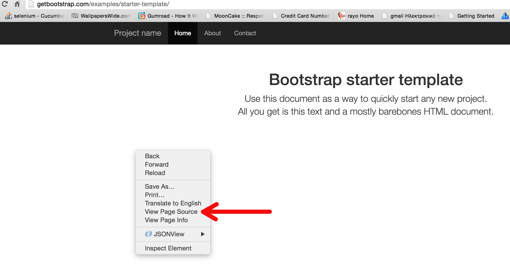

## Welcome to HTML CSS Section

I would like to welcome you to the HTML and CSS Section of the course Full Stack Web Developer. This is the first section of the course. 
I will teach you how to write HTML pages and style them using CSS.

### What is HTML

HTML stands for **HyperText Markup Language**. It is the language that we use to describe the contents of an HTML document. 
The HTML document is a text document, i.e. you can open it and edit it with a simple text editor. It contains HTML code that 
can be understood by your Internet browser. Your browser reads the HTML document and draws, on your screen, in its window, 
the content that the HTML document defines, using some specific HTML rules. The final result is the HTML page that you look 
at every time you visit a Web page.

As a language, HTML follows some rules. You cannot just write anything you like. You need to learn the language and 
write content that is well structured and syntactically correct, according to the HTML language specification. 

This section, **HTML & CSS**, will teach you HTML, how to write correct HTML content.

#### HTML sample

Do you want to see a simple HTML document? Here it is:

``` html
<!DOCTYPE html>
<html>
  <head>
    <title>Simple HTML Document</title>
  </head>
  <body>
    <h1>This is a simple HTML document.</h1>
  </body>
</html>
```

Do you want to see a more complex HTML document? Here it is how:

Visit the sample <a href="http://getbootstrap.com/examples/starter-template/" target="_blank">Twitter Bootstrap page</a> with your browser.
Then, right click on a blank area on the page and select *View Source*. Like I am doing that using my Chrome browser here:



What you will see is the actual HTML code for this particular page. You may not be able to understand all the bits and pieces of this HTML
document. Don't get overwhelmed. You will learn a lot during this course.

### What is CSS

CSS stands for Cascading Style Sheets and it is the language that we use to style our HTML page, with nice colors and fonts.
Hence, whereas HTML defines the structure of the document, CSS defines the look and feel of the page.

Like HTML documents, CSS documents are stored in pure text document format, which means that you can edit them with a simple
text editor. But, again it is a language and the author of a CSS document needs to "speak" the same language in order to write a well
behaving CSS document.

In this section we are going to learn how to write CSS to style our HTML pages.

#### CSS sample

Do you want to see a simple CSS fragment? Here it is:

``` css
h1 {
  color: green;
  font-weight: bold;
  font-size: 32px;
}
```


