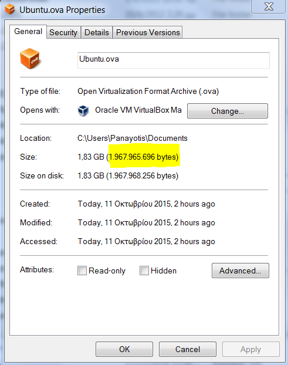

## Setup your development environment

In order to study and implement the exercises and tasks of this section, you need to setup your
development environment to be able to write HTML and CSS code.

This chapter here is trying to help you setup your development environment.

### We are using Linux

A big portion of the course uses *Ruby* and *Ruby on Rails*. These programming tools have problems
when installed on Windows machines. In general, this course favors the usage of machines that are running
Linux. Any decent variation of it (Debian or Ubuntu or Mac OS X or other similar).

However, if you do have Windows machine, this is not a problem as long as you follow the instructions 
to install a Linux OS alongside Windows, or as a virtual machine inside your Windows instance.

Go to the section that applies to you:

* [Linux Users & Debian or Ubuntu or Mac or similar](#linux_users)
* [Windows Users](#windows_users)

#### Linux Users - Ideal Environment

> Note: Skip this section if you are not running a Linux distribution operating system (or a Linux-like one).
For example, if you are not running Ubuntu, neither Debian, neither Mac OS X, neither similar, then you need to skip.

You have the ideal machine for development. Go to next paragraph to read what editor we recommend in order to 
carry out the exercises on this section.

#### Windows Users - Let's get a Linux

> Note: Skip this section if you do not have a Windows machine

If you have Windows you need to find a way to have access to a Linux machine. There are several ways you can do
that. These are the two that we recommend.

1. Install Ubuntu alongside your Windows installation and create a dual boot system. This will allow you to have
both systems installed on the same machine. When the machine starts, you have to choose which operating system to
log into, OR 
2. Install a virtual machine with Linux operating system.

##### Option 1 - Install Ubuntu alongside your Windows installation

This is our preferred way to gain access to a very popular Linux distribution. The Ubuntu one.
It will install Linux alongside your existing Windows installation (as long as there is enough disk space on your hard disk).

[This is the official Ubuntu page](http://www.ubuntu.com/download/desktop) if you want to download Ubuntu and install it
on your desktop machine. 

1. Download the Ubuntu version that corresponds to your machine architecture (64-bit vs 32-bit).
2. Then follow [the instructions here](http://www.ubuntu.com/download/desktop/burn-a-dvd-on-windows) in order to burn a DVD with Ubuntu.
3. Then follow [the installation instructions here](http://www.ubuntu.com/download/desktop/install-ubuntu-desktop) in order to install Ubuntu alongside your Windows installation.
Watch out on the **Allocate drive space** step on which instructions explain to you how you can install Ubuntu alongside Windows.

##### Option 2 - Create a Linux virtual machine inside your Windows instance

If you do not want to install Ubuntu as dual boot alongside Windows, you can install it *inside* Windows.
You may have heard about virtual machines. They are pieces of software that simulate an operating system, the guest, but they run inside another, the host.
They are not real machines. That's why we call them virtual machines. 

One program that can help you run virtual machines is Oracle Virtual box. So, the plan here is:

1. Download and Install Oracle VM Virtual Box
2. Download and Install Oracle Virtual Box Extension Pack
3. Download the Ubuntu virtual machine that we prepared for you
4. Start Oracle VM
5. Import the appliance that you have downloaded from step 3
 
and you are ready to go with a Linux inside your Windows.

Let's see in a little bit more detail the above steps:

###### 1. Download and Install Oracle VM Virtual Box

Download the Oracle VM Virtual Box from the official site: [Oracle VM Virtual Box](http://www.oracle.com/technetwork/server-storage/virtualbox/downloads/index.html).

> **Important**
> Since you are a Windows user, you need to download the *Windows Installer (Windows 32/64 bit)*. The fact that we are later on running an
> Ubuntu virtual appliance inside the Virtual Box is irrelevant. The point here is to download the Oracle VM Virtual Box that will work as 
> a host of your virtual appliance and need to be compatible with your host operating system, which is Windows.

After the download completes successfully, start the Windows Installer and follow the steps to install Oracle VM Virtual Box.

Here is a short video that shows how one can install Oracle VM Virtual Box on a Windows machine.

  <a href="http://www.youtube.com/watch?v=7_GNS5c5JEA">
    </img>
  </a>    

###### 2. Download and Install Oracle Virtual Box Extension Pack

On the same page [here](http://www.oracle.com/technetwork/server-storage/virtualbox/downloads/index.html#extpack), there is a link to download and install Oracle VM Virtual Box Extension Pack. This is the same download irrespective
of your operating system. Find the link and execute the download. Download the latest one that corresponds to the Oracle VM Virtual Box that 
you have downloaded on the previous step.

After you download, double click the file to install it.

Here is a short video that shows how one can install Oracle VM Virtual Box Extension Pack on a Windows machine.

  <a href="http://www.youtube.com/watch?v=nG76Apuu8j0">
    </img>
  </a> 

###### 3. Download the Ubuntu Virtual Machine

In order to make your life easier, we have prepared an Ubuntu virtual machine that you can 
download. If you already have another Ubuntu VM, you can use your own, but ours 
is ready to jump in and take your course.

Here is the download link: [Ubuntu Virtual Machine](https://s3.amazonaws.com/tech-career-booster-courses/01-full-stack-web-developer/Ubuntu.ova)

Note that the final downloaded file needs to be exactly *1,967,965,696* bytes long. Here is how you can check that:

* Right click on the file (after you locate it on your file browser)
* Select "Properties"
* See the number that is displayed for the file size:

If the file does not have exactly this number of bytes, then it has not been downloaded correctly, which means it might be
corrupted and step 7, below, will fail to import it into Oracle VM Virtual Box Manager.

> *Note:*
> The `Ubuntu.ova` file, which is the file of the Ubuntu virtual machine that we are asking you to download is a very big file (1.83 GBytes).
So, under slow internet connections this will take too long to be downloaded.

###### 6. Start Oracle VM Virtual Box

Ok. This is easy. Start the Oracle VM Virtual Box manager that you have downloaded and installed on step 1.
(Of course, you do it only if it is not already started)

###### 7. Import the Ubuntu Virtual Machine

Here are the instructions that you should follow to import the Ubuntu VM that you have downloaded on step 5.

1. Go to File > Import Appliance...
2. On the dialog box that opens, click the folder with the green arrow pointing up and select the `Ubuntu.ova` file 
that you have just downloaded.
3. Click Next to move to "Appliance Settings" dialog box.
4. Select re-initialize the MAC address of all network cards.
5. Click the "Import" button.

Here is a short video that demonstrates the import process:

  <a href="http://www.youtube.com/watch?v=hwPaKjwOuVw">
    </img>
  </a>   

Import will start and it will take some time. 

As soon as it finishes, continue as follows:

3. Start appliance. Now that you have imported the appliance, you need to start it. Select the appliance in the
list of appliances and click on the button `Start` on the toolbar of Oracle VM Virtual Box Manager.
4. The virtual appliance will start and it is asking you to log in. You need to log in with username `lionel` and 
password `lionel`.

Then you are good to go! You now have a brand new Linux machine inside your own Windows host.

From now on and till the end of the course you will be working inside your virtual machine, i.e. Ubuntu. 

### HTML & CSS Editor

This section of the course requires you to have an editor that will allow you to write
HTML and CSS. So, you need a simple Web developer editor that supports, at least, some kind of syntax highlighting.

Here is a list of our favourite:

* Mac OS X: CotEditor. Get it from [here](https://coteditor.com).
* Debian, Ubuntu and other Linux: Geany. Get it by giving the command `sudo apt-get install geany`, on a terminal. The official page is [here](http://www.geany.org).

> *Note:*
>
> 1. Users of our Ubuntu virtual appliance already have Geany installed. They can find its icon on the launch toolbar on the left.
> 2. If you want, send us your operating system and preferred HTML & CSS editor. We will include it in the above list.
> Thanks!

