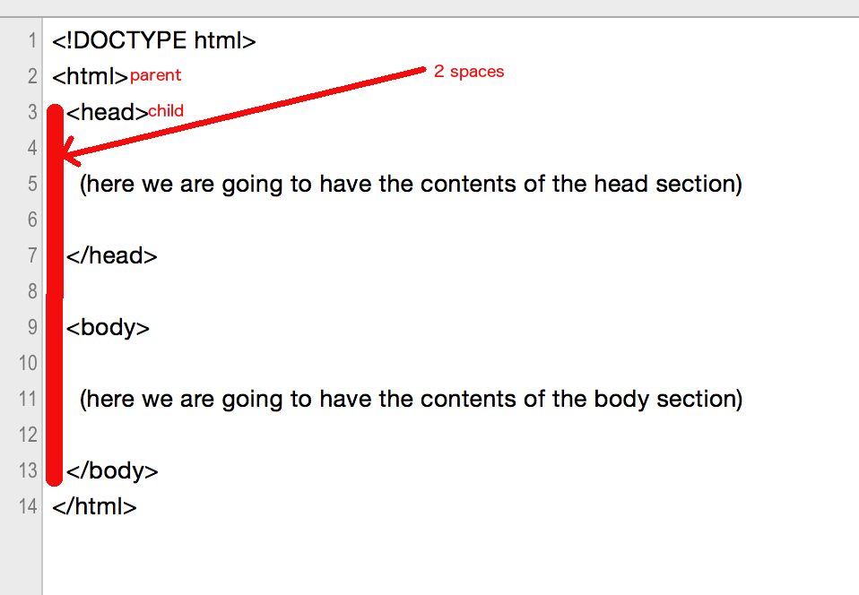
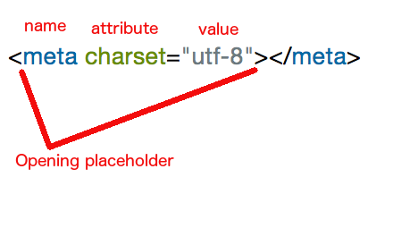
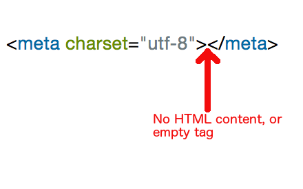

## Minimum HTML Document

An HTML Document is composed of a list of **tags** that have special meaning and
need to be put on specific positions in the document so that the whole content is
finally interpreted correctly by the browser.

You do not have to know all the available tags in order to be able to write HTML pages.
An HTML page can be constructed with the minimum available tags as given in the next
example, which is an HTML page that only has a title and a phrase in its body.

``` html
<!DOCTYPE html>
<html>
  <head>
    <meta charset="utf-8">
    <title>Hello World Page</title>
  </head>

  <body>
    <h1>Hello World</h1>
  </body>
</html>
```

We start an HTML page with the fragment:

``` html
<!DOCTYPE html>
```

Ok, actually, this is not real `HTML` code, according to the `HTML` specification. We, the developers,
put that there, in order to tell the browser that it has to render the page using the standard `HTML` 
specification rules. If we do not do that, the browser might consider that this is an *old* document
page and might try to interpret it, render it, using *quirks* old-pages rendering logic. And, in that 
case, our brand new web page might not be displayed properly. 

> **Important**
> Let's make sure that all of our web pages start with `<!DOCTYPE html>`.

### One `html` tag

Our `HTML` page, with real `HTML` code, actually starts with the opening tag: `<html>`
This is the start and parent tag of all the other tags that we will put inside our `HTML` page.
There is 1 and only 1 `<html>` element inside every HTML page. Also, it is the container of all the other
elements that comprise the HTML page. 

And since every opening tag needs to have a corresponding closing tag, whenever you create the 
opening tag, don't forget to immediately type in the closing one, and then leave some space
in between to insert the rest of the tags that will comprise your document.

Here it is:

``` html
<!DOCTYPE html>
<html>


</html>
```

Is that clear?

> **Note**
> The opening tags encloses the tag name within &lt; and &gt; symbols. The closing tag
> encloses the tag name within &lt;/ and &gt; symbols. See the image below:


### One `head` and one `body` like humans

All `HTML` pages have one `head` section and one `body` section. Like the humans (or at least most of them).

> * `head` needs to appear before the `body` section.
> * `body` needs to appear after the `head` section.
> * There can only be **one** `head` section.
> * There can only be **one** `body` section.
> * Sections start with the *opening* tag and end with the *closing* tag.

How do we *open* a `head` section? With `<head>`.

How do we *close* a `head` section? With `</head>`.

How do we *open* a `body` section? With `<body>`.

How do we *close* a `body` section? With `</body>`.

There it is:

``` html
<!DOCTYPE html>
<html>
<head>
</head>
<body>
</body>
</html>
```

Oooooops!!! Who can read such an ugly document?

Nobody!


**./images/Don't write documents without indentation**

You should be using indentation in order to make your document/code look clean and easy to read. The indentation needs
to be there in order to show the parent - child (or container - contained) tags relationship. The contained (or child)
opening tag needs to be 2 spaces to the right of its parent opening tag. Same goes for the closing tags.

So, the correct way to write the above ugly document is this nice one:

``` html
<!DOCTYPE html>
<html>
  <head>
  
    (here we are going to have the contents of the head section)
    
  </head>
  
  <body>
  
    (here we are going to have the contents of the body section)
    
  </body>
</html>
```

You can see that `<head>` and `</head>` are 2 spaces to the right of the column of corresponding `<html>` and `</html>`.
You do know that `<head>` section is child of the `<html>` section, i.e. it is first-level contained element of the `<html>` 
section. Hence, nesting, or indentation needs to be 2 spaces.

Same goes for `<body>` and `</body>`.

And `<head>` and `<body>` are on the same column-starting level, because they are both same-level (1st) children of the `<html>`
tag. 

> **Important**
> * Make sure that you use 2 spaces for indentation
> * Closing tags need to exist on the same column depth / level like their corresponding opening one.

Does this picture make it more clear?



### Let's fill in the `<head>`

Specifying the `<head>` start and the `<head>` end is not enough. We need to give the content of the `<head>` section.
But you need to know that whatever we put inside the `<head>` section is not displayed by the browser. It is used by
the browser to make sure it has enough information in order to display the actual content of the page, which is in the
`<body>` section.

So, what do we put inside `<head>`? We are going to see the most important ones.
 
#### Meta info about the encoding

We are using the following tag in order to say that the actual character set used in the document is `utf-8`.

``` html
<meta charset="utf-8"></meta>
```

> Don't you know about character encoding? You can read these resources here:
> * [ASCII](https://en.wikipedia.org/wiki/ASCII)
> * [Extended ASCII](https://en.wikipedia.org/wiki/Extended_ASCII)
> * [UTF-8](https://en.wikipedia.org/wiki/UTF-8)
> * Basically, character encoding is the way a character is internally represented so that it can be understood by
the computer.

S T O P!

This tag, has the name `meta` but its opening version is not `<meta>` but it has something next to the meta word.
What is that?

#### HTML tag attributes

An HTML tag may have an *attribute*. 

* An attribute has a name and a value.
* The name is separated from the value using the `=` (equals sign) character.
* The value is enclosed in double quotes (`"`) characters.
* The attribute accompanies the name of the tag and it is placed inside the opening placeholder.
* A tag may have more than one attribute.

So, in the preceding example (`<meta charset="utf-8"></meta>`) the `meta` tag has one attribute
that has the name `charset` and the value `utf-8`. The attribute and its value are placed next to the
name of the tag, inside the opening placeholder.



> **Reminder**
> * We have learned about HTML tags that have content, like `html` and `head` tags
> * We have learned how to open/start them and how to close/end them: `<html>`....`</html>`.
> * We have learned that some HTML tags may have attributes, like the `<meta>` tag, which may have the `charset` attribute.

But we are still on the how we can fill in the `<head>` section. And we saw that the first tag that we should be
using is the `<meta>` with attribute `charset`. There is another thing that you might have noticed here:

#### HTML tags without HTML content

The example of the `<meta>` tag, is an example of an HTML tag that does not have HTML content. It only has attributes.



You will learn, soon, that there are many HTML tags that do not have actual content. In that case...

> **Hint**
> You can omit the closing tag for HTML tags that they do not expect to have content. But only for the tags that they
do not have content by their definition. Not HTML tags that they may have content but you just leave them empty. In that
case you cannot omit the closing tag.

Hence, the better way to write the above `<meta>` is:

``` html
<meta charset="utf-8">
```

Perfect! Those were the details behind the first HTML tag that we can put inside the `<head>` section. 

This is how our HTML code should look like until now:

``` html
<!DOCTYPE html>
<html>
  <head>
  
    <meta charset="utf-8">
    
  </head>
  
  <body>
  
    (here we are going to have the contents of the body section)
    
  </body>
</html>
```

Let's go to the next tag that can be put inside the `<head>` section.

### The title of our page

We are using the HTML tag with name `title` in order to give a title on our page. This title will be displayed on the 
browser tab. I will show you how. But first let's give a `title` to our page:

``` html
<title>Personal Web Site</title>
```

This seems to be more like the normal HTML tags. It has the opening and closing tag, and there is a **content**, HTML content
inside it. Actually, it is a phrase that plays the role of the title of our HTML page.

Does that tag have any attribute? **No**, it doesn't.

Does that tag have content? **Yes**, it does.

Hence, our HTML code has as follows, until now:

``` html
<!DOCTYPE html>
<html>
  <head>
  
    <meta charset="utf-8">
    <title>Personal Web Site</title>
    
  </head>
  
  <body>
  
    (here we are going to have the contents of the body section)
    
  </body>
</html>
```

> **Indentation again** Hey! Did you notice that `<meta>` and `<title>` are indented 2 spaces with regards to the column
where `<head>` starts? Yes you did! This is because these two tags are now children of the `<head>` tag. So, they need to
be nested, indented, by 2 spaces.

Ok. Nice! We added a `<title>` inside the `<head>` section. What does this affect? Does it have any visual impact?
Yes it does. When you open your HTML page, you will see that the browser uses this title as the title of the tab used
to display your page.

Here is how:

<div id="media-title-Video showing how title tag affects the name of the tab of the page">Video showing how title tag affects the name of the tab of the page</div>
<a href="https://player.vimeo.com/video/193944861"></a>

And that was the minimum that we could add to the `<head>` section of our page. Let's move on now to the `<body>`

### Let's fill in the `<body>`

The list of HTML tags that one can use inside the `<body>` section is very long. And whatever we put inside this
section it is displayed by the browser, as part of the final HTML page that it displays. Or, at least, the majority
of the tags work like that. 

Today, we are only going to use the `<h1>` tag that is used to display text using large bold font style. It is the
bigger header style text that we can use (at least according to the defaults that come with the browser out of the box).

You can see the `<h1>` example used in our page:

``` html
<!DOCTYPE html>
<html>
  <head>
  
    <meta charset="utf-8">
    <title>Personal Web Site</title>
    
  </head>
  
  <body>
  
    <h1>Rock Stars</h1>
    
  </body>
</html>
```

As you can see, we have put the `<h1>` inside the `<body>` section. And nested with 2 spaces, since it is a child of `<body>`.
Also, the `<h1>` has HTML content and it ends with the corresponding closing tag `</h1>`.

Let's see the final result. Open this document in your browser:


That's it. We have finished our first HTML page analysis. Next chapters will teach you more HTML tags.


