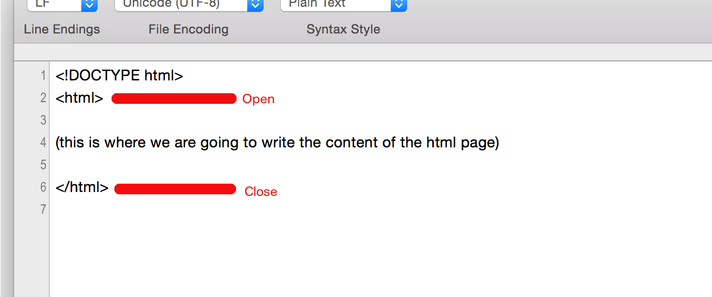
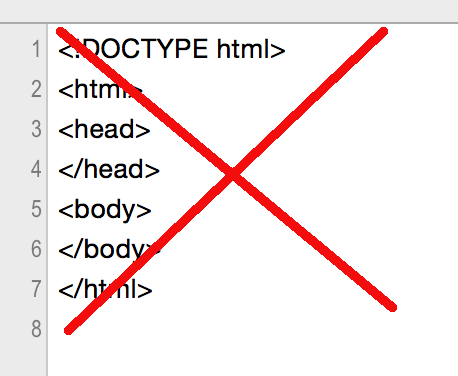

In this chapter we are going to analyze the content of the minimum HTML document. Also, we are going to talk about the `html` element,
and how we open and close HTML tags.

We are going to talk about the `body` element.

We are going to talk about correct styling of HTML documents and how we should avoid writing code like this:

We are also going to talk about character encoding, ASCII, Extended ASCII and UTF-8.
Specifying the character encoding will make sure that the browser is interpreting and displaying special characters correctly.

  
Characters Encoding

   

We are also going to talk about the `meta` tag and the `title` tag.

Finally, we are going to build another simple web page like this:

