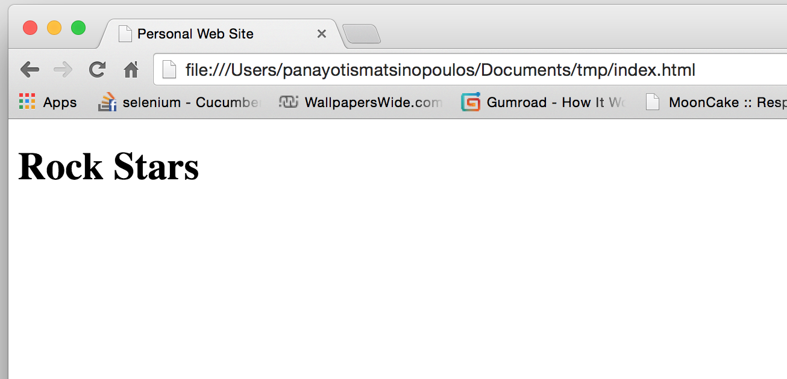

## Heading Tags

We have already learned about the heading tag `<h1>`. It makes text look very big and bold,
like here:



However, you can use smaller heading tags. The one a little bit smaller is `<h2>`, the next smaller one is `<h3>` and you can go
up to `<h6>`.

In order to see the different sizes, you can create the following page:

``` html
<!DOCTYPE html>
<html>
  <head>
  
    <meta charset="utf-8">
    <title>Personal Web Site</title>
    
  </head>
  
  <body>
  
    <h1>Rock Stars (h1)</h1>
    <h2>Rock Stars (h2)</h2>
    <h3>Rock Stars (h3)</h3>
    <h4>Rock Stars (h4)</h4>
    <h5>Rock Stars (h5)</h5>
    <h6>Rock Stars (h6)</h6>
    
  </body>
</html>
```

So, create the above HTML page and save it with the name that has extension `.html`. Then open that in your browser.
You will see something like that:


We use the headings to write a heading of a section or paragraph content in our HTML page. We could have created the same visual effect
with other tools from the HTML tool set, but this is very handy. Only one HTML tag to type in and then the content that will be styled
according to the heading tag.
