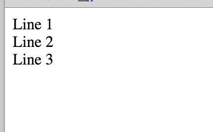
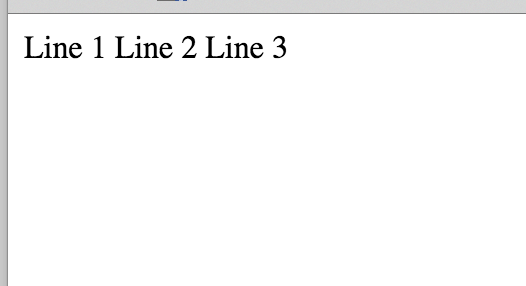
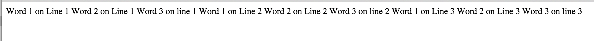
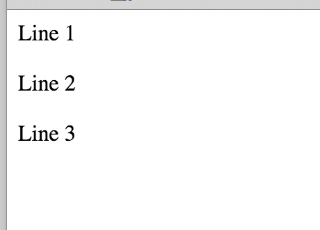
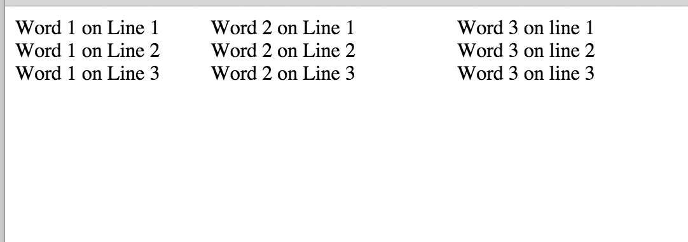

## About White Space

This chapter will teach you how browsers understand the white space that you have inside your HTML documents.
It is very important to understand that browsers interpret your big white spaces or new line breaks to a single blank/white space character.

It will be made easier for you if we could do an example. Create a new HTML document with the following content:

``` html
<!DOCTYPE html>
<html>
  <head>
  
    <meta charset="utf-8">
    <title>Personal Web Site</title>
    
  </head>
  
  <body>
  
    Line 1
    Line 2
    Line 3
    
  </body>
</html>    
```

Nice. Now, you believe that you have created a Web page that will display 3 lines like this:



but the reality will not be with you. The actual content will be displayed like this:



This is because browser does not understand about the traditional white spaces and new line breaks that we are used to insert when typing
a normal document, like in MS Word. Browsers separates printable chunks of text, words, by only 1 space, even if you have plenty of them in between.

Try another example:

``` html
<!DOCTYPE html>
<html>
  <head>
  
    <meta charset="utf-8">
    <title>Personal Web Site</title>
    
  </head>
  
  <body>
  
    Word 1 on Line 1           Word 2 on Line 1                         Word 3 on line 1
    Word 1 on Line 2           Word 2 on Line 2                         Word 3 on line 2
    Word 1 on Line 3           Word 2 on Line 3                         Word 3 on line 3
    
  </body>
</html>    
```

The actual result will be:



So, how do we actually create the content the way we want? We will start with the basics, and this is the non-breaking white space and the break HTML tag.

### Line break HTML tag `<br>`

So, you want to create 3 lines, one below the other. Like this:


In order to do that you need to explicitly tell the browser to change line at the end of the lines. For this purpose, we are using the `<br>` tag.
So, your HTML document should be like that:

``` html
<!DOCTYPE html>
<html>
  <head>
  
    <meta charset="utf-8">
    <title>Personal Web Site</title>
    
  </head>
  
  <body>
  
    Line 1<br>
    Line 2<br>
    Line 3
    
  </body>
</html> 
```

> *Note*: `<br>` tag is a tag that does not have content. Hence, there isn't corresponding closing tag `</br>`. The tags that do not have
closing counterpart, may alternatively be written with their closing angle bracket following the `/` symbol. For example: `<br/>`. In other words, 
`<br>` and `<br/>` can be used alternatively.

And what if you wanted to leave one empty line in between the lines? Then you just need to give `<br>` alone. Try in your editor the following document
and save it as an HTML page. Then open it with your browser.

``` html
<!DOCTYPE html>
<html>
  <head>
  
    <meta charset="utf-8">
    <title>Personal Web Site</title>
    
  </head>
  
  <body>
  
    Line 1<br>
    <br>
    Line 2<br>
    <br>
    Line 3
    
  </body>
</html> 
```
This will be the result:




### White spaces between words

And now, you want to add extra white spaces between words. How can you do that? The answer is that you should use the special sequence of characters:
`&nbsp;`. For each one extra space, you should write one `&nbsp;`. It is the `n`on `b`reaking `sp`ace character. Note that the sequence starts with the symbol `&` and
ends with the semi-colon `;`. Again, you will need that only if you need more than one blank space. The first one can be the normal blank space character,
but the rest, need to be `&nbsp;`.

``` html
<!DOCTYPE html>
<html>
  <head>

    <meta charset="utf-8">
    <title>Personal Web Site</title>

  </head>

  <body>

    Word 1 on Line 1 &nbsp;&nbsp;&nbsp;&nbsp;&nbsp;&nbsp;&nbsp;&nbsp;&nbsp;Word 2 on Line 1 &nbsp;&nbsp;&nbsp;&nbsp;&nbsp;&nbsp;&nbsp;&nbsp;&nbsp;&nbsp;&nbsp;&nbsp;&nbsp;&nbsp;&nbsp;&nbsp;&nbsp;&nbsp;&nbsp;Word 3 on line 1<br>
    Word 1 on Line 2 &nbsp;&nbsp;&nbsp;&nbsp;&nbsp;&nbsp;&nbsp;&nbsp;&nbsp;Word 2 on Line 2 &nbsp;&nbsp;&nbsp;&nbsp;&nbsp;&nbsp;&nbsp;&nbsp;&nbsp;&nbsp;&nbsp;&nbsp;&nbsp;&nbsp;&nbsp;&nbsp;&nbsp;&nbsp;&nbsp;Word 3 on line 2<br>
    Word 1 on Line 3 &nbsp;&nbsp;&nbsp;&nbsp;&nbsp;&nbsp;&nbsp;&nbsp;&nbsp;Word 2 on Line 3 &nbsp;&nbsp;&nbsp;&nbsp;&nbsp;&nbsp;&nbsp;&nbsp;&nbsp;&nbsp;&nbsp;&nbsp;&nbsp;&nbsp;&nbsp;&nbsp;&nbsp;&nbsp;&nbsp;Word 3 on line 3

  </body>
</html>
```

Create the above document and save it to a file. Then open the file using your browser. The final result will be:



You can see how the lines are one on top of the other due to the `<br>` tags. And you can see that there is enough white space in between the words, exactly like
we wanted it, thanks to the `&nbsp;`


