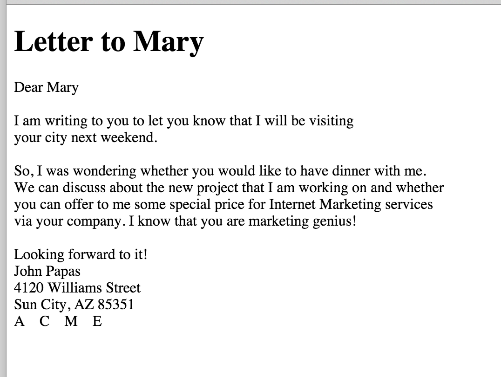

1. Create an HTML document that, when displayed using the browser, would look like that:

 

   
Letter to Mary

   </img>
 

Note that this needs to be displayed exactly as depicted. In other words, the text should be broken into multiple lines
as on the picture.
 
2. Send the HTML document to your mentor for review.
