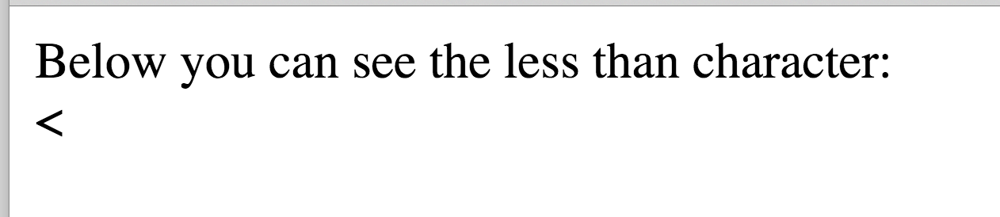
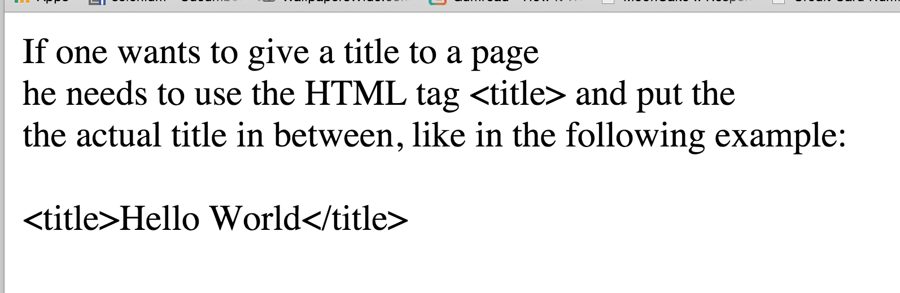
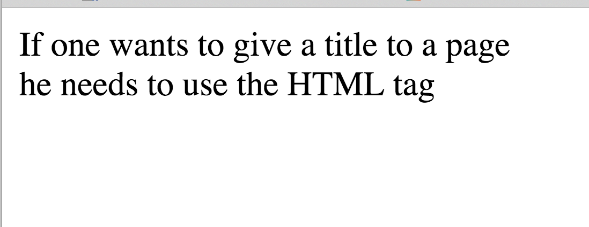
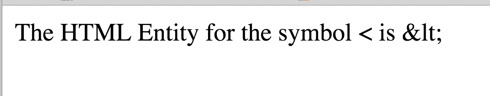

## HTML Entities

In the previous chapter you had to introduce the character sequence `&nbsp;` in order to be able
to add extra blank spaces in your text. Actually, this sequence forms an HTML Entity. HTML Entities are
sequences of characters that are used when we want to print inside our text characters that are otherwise
reserved by the HTML language, or that have special use, or that cannot be directly typed from the keyboard.

### Some Common Ones

### HTML reserved characters

Suppose that you want to print the character `<` as part of your text, like in the following image:



If you try the following code...:
``` html
<!DOCTYPE html>
<html>
  <head>
    <meta charset="utf-8">
    <title>Printing the less than character</title>
  </head>
  <body>
    Below you can see the less than character:<br/>
    <
  </body>
</html>
```
...it will work. However, you need to know that the character `<` is an HTML reserved character and it shouldn't be actually used in the
text of your page for other reason than to start an HTML tag. And it may work in this simple example above, but, in more complex documents,
if you start using this character literally, you might experience errors on your page and it might be difficult for you to find out
where the bug is.

Hence, you need to start getting used to it: Whenever you want to use the character `<` as part of your text, in the payload of your page, then
you need to actually use the corresponding HTML entity: `&lt;` (from `l`ess `t`han).

> **Important**
> * All HTML entities start with the symbol `&`
> * All HTML entities end with the symbol `;`

So, the correct content of the above HTML page should be:
``` html
<!DOCTYPE html>
<html>
  <head>
    <meta charset="utf-8">
    <title>Printing the less than character</title>
  </head>
  <body>
    Below you can see the less than character:<br/>
    &lt;
  </body>
</html>
```

Same goes for the reserved character `>`. You need to use the `&gt;` instead.

Here is a small exercise for you. With the knowledge that you have acquired so far, how would you produce the following?



> **Prompt**: Spend sometime trying to do it alone, before reading the solution below

If you try to do it like that:

``` html
<!DOCTYPE html>
<html>
  <head>
    <meta charset="utf-8">
    <title>Printing the less than character</title>
  </head>
  <body>
    If one wants to give a title to a page<br/>
    he needs to use the HTML tag <title> and put the<br/>
    the actual title in between, like in the following example:<br/>
    <br/>
    <title>Hello World</title>
  </body>
</html>
```

the result will be this:


It will not be the one you want. That bad result will be, if you don't use HTML entities for the reserved characters `<` and `>`.

Go ahead and change the reserved HTML characters that exist inside your actual page payload. Make them be the corresponding HTML entities.
Here is the correct HTML code:

``` html
<!DOCTYPE html>
<html>
  <head>
    <meta charset="utf-8">
    <title>Printing the less than character</title>
  </head>
  <body>
    If one wants to give a title to a page<br/>
    he needs to use the HTML tag &lt;title&gt; and put the<br/>
    the actual title in between, like in the following example:<br/>
    <br/>
    &lt;title&gt;Hello World&lt;/title&gt;
  </body>
</html>
```

#### Common HTML Entities for HTML reserved characters

Here is a table with the common HTML reserved characters and their corresponding HTML Entities:

<table>
  <thead>
    <tr><th>Character</th><th>Entity</th></tr>
  </thead>
  
  <tbody>
    <tr><td style="text-align: center;">&nbsp;</td><td style="text-align: center;">&amp;nbsp;</td></tr>
    <tr><td style="text-align: center;">&lt;</td><td style="text-align: center;">&amp;lt;</td></tr>
    <tr><td style="text-align: center;">&gt;</td><td style="text-align: center;">&amp;gt;</td></tr>
    <tr><td style="text-align: center;">&amp;</td><td style="text-align: center;">&amp;amp;</td></tr>
  </tbody>
</table>

#### How can you literally print the HTML Entity* **without** *being translated to its corresponding symbol?*

Suppose that you want to produce the following outcome:



In order to achieve that, you first need to understand how many and which HTML reserved characters this page has. Can you think about it?

It has 2: the `<` and the `&`. Hence, these are the 2 characters that need to be replaced with their corresponding HTML Entity equivalent,
in order to be able to produce the required result.

Hence, here is the actual HTML code for this page:

``` html
<!DOCTYPE html>
<html lang="en">
  <head>
    <meta charset="utf-8">
    <title>Literally Print HTML Entity</title>
  </head>
  <body>
    The HTML Entity for the symbol &lt; is &amp;lt;
  </body>
</html>
```

Try to write this on your HTML editor, save it and open it. Does it produce the desired result?

As we said before, except from the HTML reserved characters, you may need to use HTML Entities for special characters and symbols.
Here are some of them:

### Currencies

<table>
  <thead>
    <tr><th>Character</th><th>Entity</th></tr>
  </thead>
  
  <tbody>
    <tr><td style="text-align: center;">&cent;</td><td style="text-align: center;">&amp;cent;</td></tr>
    <tr><td style="text-align: center;">&pound;</td><td style="text-align: center;">&amp;pound;</td></tr>
    <tr><td style="text-align: center;">&yen;</td><td style="text-align: center;">&amp;yen;</td></tr>
    <tr><td style="text-align: center;">&euro;</td><td style="text-align: center;">&amp;euro;</td></tr>
  </tbody>
</table>

### Special Alphabet Characters

*Note*: Some of the HTML Entities below are used to accent a character. And instead of a name (like: `&nbsp;` which has 
the name `nbsp`) we use numbers. Example: `&#768;` All the HTML Entities can be expressed with numbers, but it
is easier for us to remember the name rather than the number, especially for the ones that we use more frequently. 
However, there are some HTML Entities that only have a number and not a name. In that case we cannot avoid
using the number. And if we do, we need to prefix the number with the characters sequence: `&#`.

Also, you can see that the `&#768;` means accent on the character that it follows. So, if this one follows the
character `a`, then it will print a&#768;. If it follows the character `A` it will print A&#768;

<table>
  <thead>
    <tr><th>Character</th><th>Entity</th></tr>
  </thead>
  
  <tbody>
    <tr><td style="text-align: center;">a&#768;</td><td style="text-align: center;">a&amp;#768;</td></tr>
    <tr><td style="text-align: center;">a&#769;</td><td style="text-align: center;">a&amp;#769;</td></tr>
    <tr><td style="text-align: center;">a&#770;</td><td style="text-align: center;">a&amp;#770;</td></tr>
    <tr><td style="text-align: center;">a&#771;</td><td style="text-align: center;">a&amp;#771;</td></tr>
    <tr><td style="text-align: center;">O&#768;</td><td style="text-align: center;">O&amp;#768;</td></tr>
    <tr><td style="text-align: center;">O&#769;</td><td style="text-align: center;">O&amp;#769;</td></tr>
    <tr><td style="text-align: center;">O&#770;</td><td style="text-align: center;">O&amp;#770;</td></tr>
    <tr><td style="text-align: center;">O&#771;</td><td style="text-align: center;">O&amp;#771;</td></tr>
    <tr><td style="text-align: center;">&Alpha;</td><td style="text-align: center;">&amp;Alpha;</td></tr>
    <tr><td style="text-align: center;">&Beta;</td><td style="text-align: center;">&amp;Beta;</td></tr>
    <tr><td style="text-align: center;">&Gamma;</td><td style="text-align: center;">&amp;Gamma;</td></tr>
  </tbody>
</table>

### Other Symbols

<table>
  <thead>
    <tr><th>Character</th><th>Entity</th></tr>
  </thead>
  
  <tbody>
    <tr><td style="text-align: center;">&trade;</td><td style="text-align: center;">&amp;trade;</td></tr>
    <tr><td style="text-align: center;">&copy;</td><td style="text-align: center;">&amp;copy;</td></tr>
    <tr><td style="text-align: center;">&reg;</td><td style="text-align: center;">&amp;reg;</td></tr>
    <tr><td style="text-align: center;">&forall;</td><td style="text-align: center;">&amp;forall;</td></tr>
    <tr><td style="text-align: center;">&part;</td><td style="text-align: center;">&amp;part;</td></tr>
  </tbody>
</table>

## Full References

The above tables are only indicative. If you want to have access to the full HTML Entities, you only have to
google for that.


