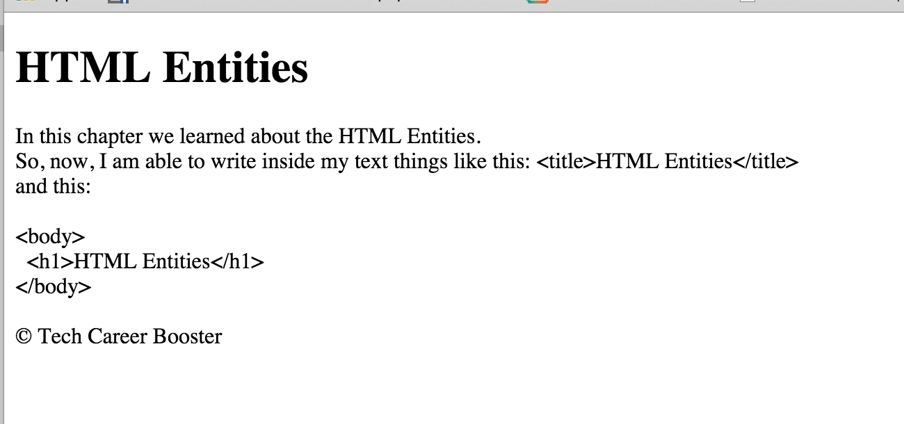



# Task B

1. Write an HTML page that, when displayed on browser, will be looking like the following:

 

   
Task for HTML Entities

   </img>
 

 
2. Make sure that you have the correct <code>head</code> with a title included.
3. Send the HTML document of this page to your mentor for review.
