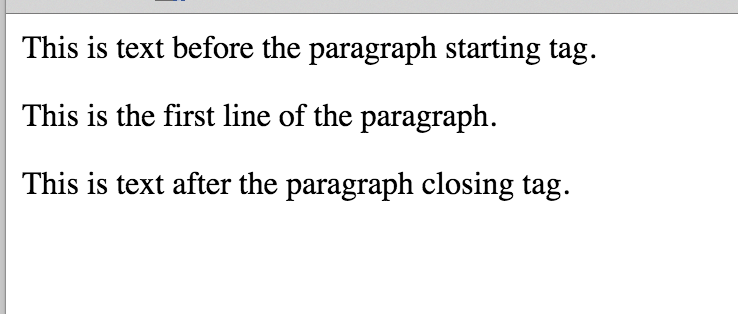
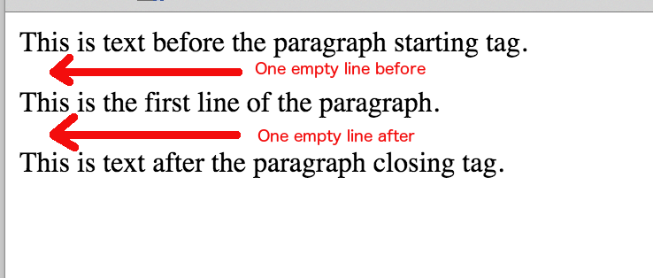
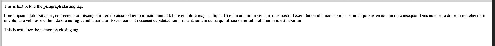
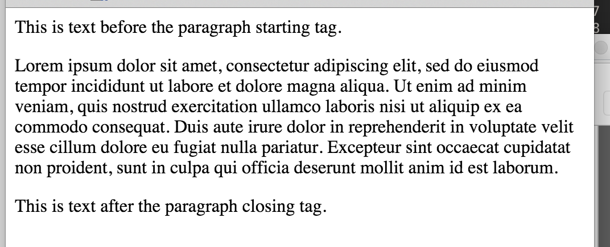
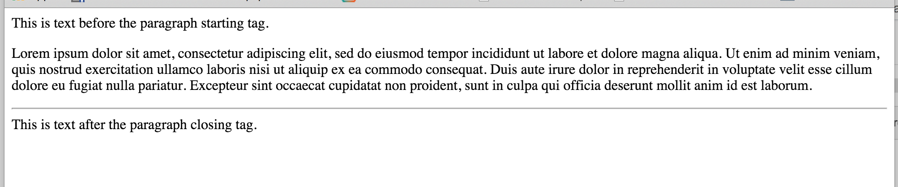
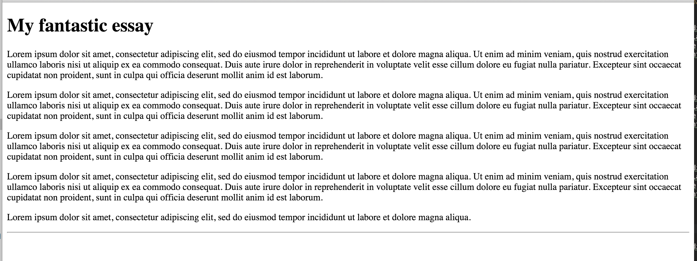

## Paragraphs, Horizontal Lines and Comments

### Paragraphs

We have learned how we break a line and we start a new one. Do you remember how?
It is the tag `<br/>` or `<br>`. However, usually, we let browser create lines 
automatically, based on the width of the browser window. And we only care about
separating one paragraph from the other.

So, basically, when we write the text of a page, we divide it into paragraphs using the
paragraph `<p>` tag. We start a paragraph with `<p>` and we end it with `</p>`.

Browser, at the end of each paragraph, changes line to start printing the content that follows.

Try the following document:

``` html
<!DOCTYPE html>
<html>
  <head>
    <meta charset="utf-8">
    <title>A Simple Paragraph Document</title>
  </head>
  <body>

    This is text before the paragraph starting tag.<p>This is the first line of the paragraph.</p>This is text after the paragraph closing tag.

  </body>

</html>
```

How do you think this page will appear on the browser? Do you see that the `<p>` and `</p>` are on the same line as the rest of the text
inside the `<body>` content? Will that appear as we have written that above? No. It will appear like this:



As you can see, browser creates an empty line before the start of the paragraph and another empty line exactly after the end of it:



The whole width of the browser window is occupied by the paragraph text. Text is automatically wrapped to the next line if cannot fit
the width of the window. Try the following document:

> *Hint*: If you want a dummy text generator to copy &amp; paste in your HTML pages
> you can try searching Google for `lorem ipsum text generator`. You will find plenty of them.
> This is how we got the text for the paragraph below.

``` html
<!DOCTYPE html>
<html>
  <head>
    <meta charset="utf-8">
    <title>Paragraph with long text</title>
  </head>
  <body>

    This is text before the paragraph starting tag.

    <p>
      Lorem ipsum dolor sit amet, consectetur adipiscing elit, sed do eiusmod tempor incididunt ut labore
      et dolore magna aliqua. Ut enim ad minim veniam, quis nostrud exercitation ullamco laboris nisi ut
      aliquip ex ea commodo consequat. Duis aute irure dolor in reprehenderit in voluptate velit esse cillum
      dolore eu fugiat nulla pariatur. Excepteur sint occaecat cupidatat non proident, sunt in culpa qui officia
      deserunt mollit anim id est laborum.
    </p>

    This is text after the paragraph closing tag.

  </body>

</html>
```
Open this page on your browser and see how the text of the paragraph flows from the left to the right side of the browser window.
The text wraps automatically to the next line when there is not enough space for the text to appear on the same line. Try to resize
the width of your browser and make it more narrow. See how browser wraps and creates more lines for your text to appear 
properly.

Like this, which is the text on wide window:




And like this, which is the same text on narrow window:


Note how the text is wrapped irrespectively of how you have broken the lines in your HTML text. If you really want to break the lines at 
specific points, and still be on the same paragraph, you need to use `<br/>` at the points you want the breaks to appear. Here is the same example as above
but with a line break on the first sentence after `Lorem ipsum dolor sit amet,`

``` html
<!DOCTYPE html>
<html>
  <head>
    <meta charset="utf-8">
    <title>Paragraph with long text</title>
  </head>
  <body>

    This is text before the paragraph starting tag.

    <p>
      Lorem ipsum dolor sit amet,<br/> 
      consectetur adipiscing elit, sed do eiusmod tempor incididunt ut labore
      et dolore magna aliqua. Ut enim ad minim veniam, quis nostrud exercitation ullamco laboris nisi ut
      aliquip ex ea commodo consequat. Duis aute irure dolor in reprehenderit in voluptate velit esse cillum
      dolore eu fugiat nulla pariatur. Excepteur sint occaecat cupidatat non proident, sunt in culpa qui officia
      deserunt mollit anim id est laborum.
    </p>

    This is text after the paragraph closing tag.

  </body>

</html>
```
Save this document and load it on your browser. Do you see that browser changes line on `amet,` point?

### Horizontal Lines

This is nice and easy. The tag `<hr/>` creates a horizontal line (rule) that extends from left to right, for the
whole width of the browser. This is useful to separate your text in sections.

Let's assume that we want a horizontal line below the `Lorem ipsum` paragraph on the page above. It needs to be done
like this:

``` html
<!DOCTYPE html>
<html>
  <head>
    <meta charset="utf-8">
    <title>Paragraph with long text</title>
  </head>
  <body>

    This is text before the paragraph starting tag.

    <p>
      Lorem ipsum dolor sit amet, consectetur adipiscing elit, sed do eiusmod tempor incididunt ut labore
      et dolore magna aliqua. Ut enim ad minim veniam, quis nostrud exercitation ullamco laboris nisi ut
      aliquip ex ea commodo consequat. Duis aute irure dolor in reprehenderit in voluptate velit esse cillum
      dolore eu fugiat nulla pariatur. Excepteur sint occaecat cupidatat non proident, sunt in culpa qui officia
      deserunt mollit anim id est laborum.
    </p>
    
    <hr/>

    This is text after the paragraph closing tag.

  </body>

</html>
```
This will be displayed like this:



Do you see the horizontal gray line below the paragraph text and before the last sentence?

### Comments

We will finish this chapter by describing how we can write text inside the body of our page and make sure that it
is not parsed as HTML code. It will only be there to work as an explanation text to the reader of the HTML code rather than
to the reader of the web page itself. The construct is called `comments` and the actual tool that we use to create them is the following:

``` html
<!-- these are the comments -->
```
We start with the character sequence `<!--` and we put our comments next to that. Then we finish our comments with the character sequence `-->`.
We can put whatever we like inside this block. And as long text as we like. It will not be interpreted as HTML code and the browser will essentially
ignore it.

We use comments when we want to give some explanations to the HTML source code reader, to another developer that might read our HTML source code.
Or as a reminder to ourselves, if we happen to open the HTML source of the page and read quite some time after we initially wrote it.

Hence, comments work like documentation of our work and it is very helpful when we want to keep notes of things that will make easier for us
or other person to understand what we have done.

Here is an example HTML page with comments used.

``` html
<!DOCTYPE html>
<html>
  <head>
    <meta charset="utf-8">
    <title>Paragraph with long text</title>
  </head>
  <body>

    <h1>My fantastic essay</h1>

    <!-- In the first paragraph I will give the introduction to my essay
         It will be a short paragraph, no more than 3-4 sentences -->
    <p>
      Lorem ipsum dolor sit amet, consectetur adipiscing elit, sed do eiusmod tempor incididunt ut labore
      et dolore magna aliqua. Ut enim ad minim veniam, quis nostrud exercitation ullamco laboris nisi ut
      aliquip ex ea commodo consequat. Duis aute irure dolor in reprehenderit in voluptate velit esse cillum
      dolore eu fugiat nulla pariatur. Excepteur sint occaecat cupidatat non proident, sunt in culpa qui officia
      deserunt mollit anim id est laborum.
    </p>

    <!-- Then I will write the main body of my essay. it will be a series of paragraphs that will
         explain my subject in many details. -->
    <p>
      Lorem ipsum dolor sit amet, consectetur adipiscing elit, sed do eiusmod tempor incididunt ut labore
      et dolore magna aliqua. Ut enim ad minim veniam, quis nostrud exercitation ullamco laboris nisi ut
      aliquip ex ea commodo consequat. Duis aute irure dolor in reprehenderit in voluptate velit esse cillum
      dolore eu fugiat nulla pariatur. Excepteur sint occaecat cupidatat non proident, sunt in culpa qui officia
      deserunt mollit anim id est laborum.
    </p>

    <p>
      Lorem ipsum dolor sit amet, consectetur adipiscing elit, sed do eiusmod tempor incididunt ut labore
      et dolore magna aliqua. Ut enim ad minim veniam, quis nostrud exercitation ullamco laboris nisi ut
      aliquip ex ea commodo consequat. Duis aute irure dolor in reprehenderit in voluptate velit esse cillum
      dolore eu fugiat nulla pariatur. Excepteur sint occaecat cupidatat non proident, sunt in culpa qui officia
      deserunt mollit anim id est laborum.
    </p>

    <p>
      Lorem ipsum dolor sit amet, consectetur adipiscing elit, sed do eiusmod tempor incididunt ut labore
      et dolore magna aliqua. Ut enim ad minim veniam, quis nostrud exercitation ullamco laboris nisi ut
      aliquip ex ea commodo consequat. Duis aute irure dolor in reprehenderit in voluptate velit esse cillum
      dolore eu fugiat nulla pariatur. Excepteur sint occaecat cupidatat non proident, sunt in culpa qui officia
      deserunt mollit anim id est laborum.
    </p>

    <!-- I will close my essay with a short closing message -->
    <p>
      Lorem ipsum dolor sit amet, consectetur adipiscing elit, sed do eiusmod tempor incididunt ut labore
      et dolore magna aliqua.
    </p>

    <hr/>

  </body>

</html>
```
And if you see this page on the browser, you will see something like this:



As you can experience yourself, the comments are not visible.

> **Important** Comments may not be visible. This does not mean that the reader cannot see them. He can see them if he chooses to
view the source of your page. See this video below on how one can do that.

<div id="media-title-Video showing how one can see the source code of the HTML page and read the HTML comments">Video showing how one can see the source code of the HTML page and read the HTML comments</div>
<a href="https://player.vimeo.com/video/193996781"></a>


