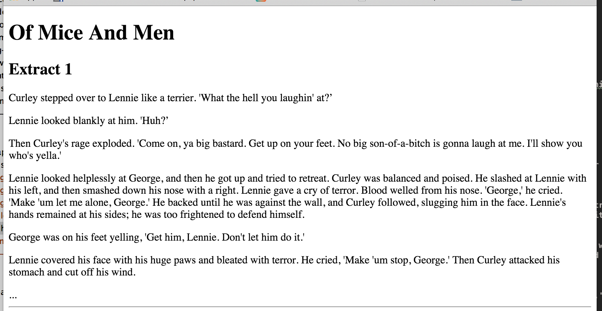

In this chapter we are going to learn about

* paragraphs (`
`)
* horizontal lines (`
`) and
* HTML comments (`<!-- ... -->`)

You will be able to organize your text into paragraphs and use horizontal lines like this:

