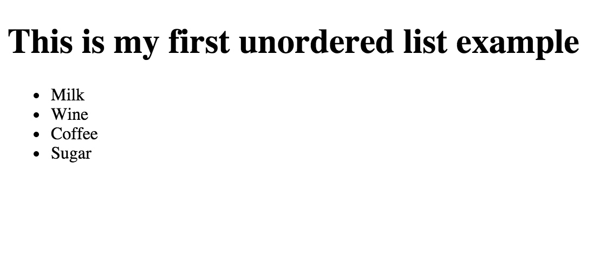
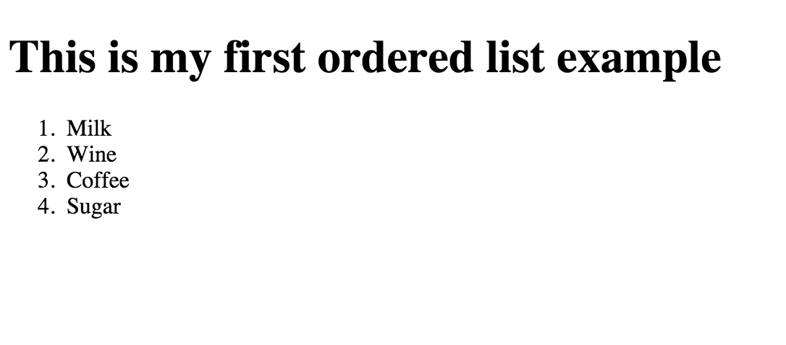

## Lists

Those that are aware of word processing applications, like MS Word or Pages, they know to create
lists, either bullet lists or number lists.

For example, this is a bullet list:

* Milk
* Wine
* Coffee
* Sugar

And this one is a number list:

1. Milk
2. Wine
3. Coffee
4. Sugar

The first list type, in HTML parlance, is called *unordered list* or *ul*. The second list type is
called *ordered list* or *ol*. And the items within the lists are called *list items* or *li*.

### Unordered Lists

Having said that, in order to create an unordered list in HTML, you need to use the HTML tag `<ul>`.
This has an opening `<ul>` tag and a closing `</ul>` tag and in between we put the list items using
the HTML tag `<li>`. List items have opening `<li>` and closing tags, `</li>`. In between we write the
content of the corresponding list item.

Here is our first HTML page unordered list example:

``` html
<!DOCTYPE html>
<html>
  <head>
      <meta charset="utf-8">
      <title>./images/Unordered List Example</title>
  </head>

  <body>
    <h1>This is my first unordered list example</h1>
    
    <ul>
      <li>Milk</li>
      <li>Wine</li>
      <li>Coffee</li>
      <li>Sugar</li>
    </ul>
  </body>

</html>
```
Type the above into an HTML document, save it and open it on your browser. You should see an HTML page like this:



### Ordered Lists

In order to created an ordered list, you just use the `<ol>` tag instead of the `<ul>`. Hence the previous list, if turned to ordered list 
would have been:

``` html
<!DOCTYPE html>
<html>
  <head>
      <meta charset="utf-8">
      <title>./images/Ordered List Example</title>
  </head>

  <body>
    <h1>This is my first ordered list example</h1>

    <ol>
      <li>Milk</li>
      <li>Wine</li>
      <li>Coffee</li>
      <li>Sugar</li>
    </ol>
  </body>

</html>
```

and the result of displaying this HTML page on the browser would have been something like this:



### Nested Lists

I guess that this was pretty straightforward until this point. But, what happens is you want to do something more advanced like this:

)
As you can inspect on the picture, the last item of the list includes an extra, another list of items. This is possible, because, you can
almost write any valid HTML content inside each list item. But when you write another list, this is drawn using a different bullet than
the nesting / parent list. So, the nesting parent list uses a black-filled circle, whereas the nested list is drawn with a white-filled
circle bullet.

Here is the HTML code that creates the above result:

``` html
<!DOCTYPE html>
<html>
  <head>
    <meta charset="utf-8">
    <title>./images/Unordered List Example</title>
  </head>

  <body>
    <h1>This is my first unordered list example</h1>

    <ul>
      <li>Milk</li>
      <li>Wine</li>
      <li>Coffee</li>
      <li>Sugar</li>
      <li>
        Some Optional:
        <ul>
          <li>Cheese</li>
          <li>Pizza</li>
          <li>Butter</li>
          <li>Chips</li>
        </ul>
      </li>
    </ul>
  </body>

</html>
```

Same works for ordered lists and nesting. An, on top of that, you can mix unordered with ordered lists.
Why don't you experiment?
