## Tables

A table is another tool that we can use to organize the text inside our HTML page. 
It is used to present tabular data. 

> **Important**: Tables are used to present tabular data. Not to divide your HTML page
to columns and rows. Dividing your HTML page to columns and rows is done with the `<div>` 
tag and it is presented in later chapters.

This is an example of an HTML table:

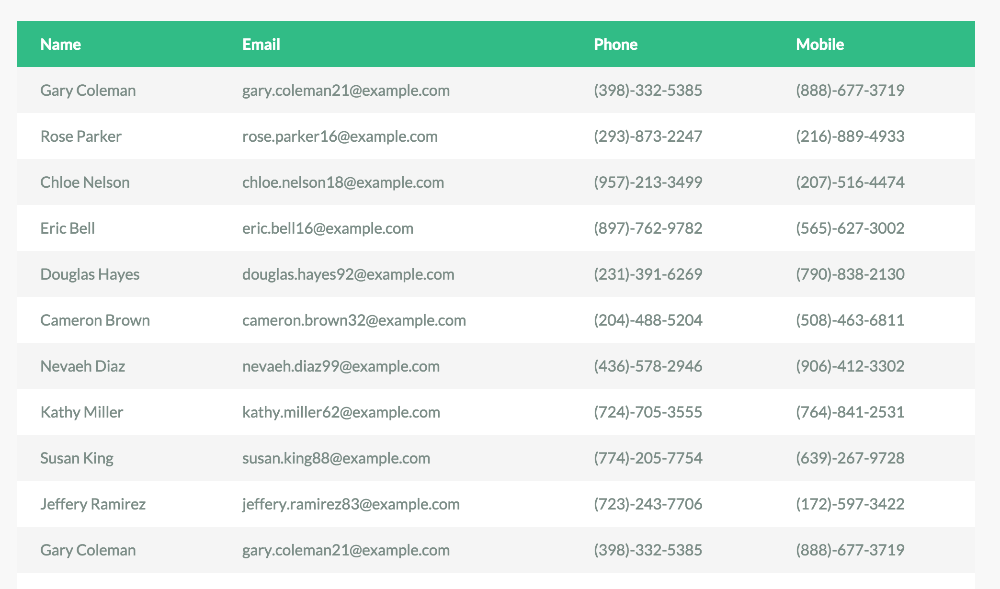

But let's start from the basics:

### Starting and closing tags

We start a table with the starting tag `<table>` and we close it with the tag `</table>`. Pretty standard I guess.

``` html
<table>

</table>
```

Inside that, we put the columns and the rows of the table.

### Rows of the table

Each table is composed of rows. The rows are the `<tr>` (`t`able `r`ow) tags. They have content and they close with `</tr>`.
Note that the only descendant elements of a table row are table columns. You should not put anything else 
inside the content of a `<tr>`.

Here we are. A table with 5 rows.

``` html
<table>
  <tr>   </tr>
  <tr>   </tr>
  <tr>   </tr>
  <tr>   </tr>
  <tr>   </tr>
</table>
```

### Columns of the table

Each row of a table is composed of a series of columns (or cells). The columns can contain almost any valid HTML content that
is useful to present the content of the cell/column. The contents of a cell are enclosed within the starting `<td>` (`t` table `d`ata)
and closing `</td>` tags.

And here we are. We now have all the information necessary to build our table (but not enough for styling it).

``` html
<!DOCTYPE html>
<html>
  <head>
    <meta charset="utf-8">
    <title>Demo Table</title>
  </head>
  <body>
    <table>
      <tr><td>Name</td><td>Email</td><td>Phone</td><td>Mobile</td></tr>
      <tr><td>Gary Coleman</td><td>gary.coleman21@example.com</td><td>(398)-332-5385</td><td>(888)-677-3719</td></tr>
      <tr><td>Rose Parker</td><td>rose.parker16@example.com</td><td>(293)-873-2247</td><td>(216)-889-4933</td></tr>
      <tr><td>Chloe Nelson</td><td>chloe.nelson18@example.com</td><td>(957)-213-3499</td><td>(207)-516-4474</td></tr>
      <tr><td>Eric Bell</td><td>eric.bell16@example.com</td><td>(897)-762-9782</td><td>(565)-627-3002</td></tr>
    </table>
  </body>
</html>    
```

Type the above into an HTML document, save it and open it in your browser. The result will be something like this:

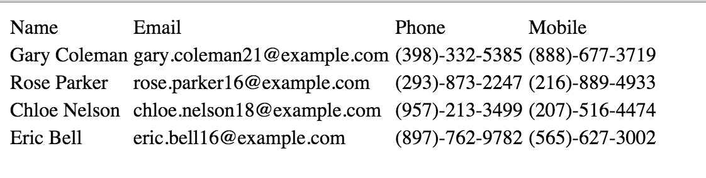

This is a good start. We are not at the final result, but this is a good start.

Let's make some small improvements

### Table Head and Table Body

Usually, we want to tell the browser which part of the table is the head and which part of the table is the body of it.
We do that by using the tags `<thead>` and `<tbody>`. So, in order to specify the table head, we enclose the corresponding
rows inside `<thead>`...`</thead>` section, and in order to specify the body, we enclose the corresponding rows inside `<tbody>`...`</tbody>`
section. Let's do this improvement in our table example and see how things change.

``` html
<!DOCTYPE html>
<html>
  <head>
    <meta charset="utf-8">
    <title>Demo Table With Head and Body</title>
  </head>
  <body>
    <table>
      <thead>
        <tr><td>Name</td><td>Email</td><td>Phone</td><td>Mobile</td></tr>
      </thead>

      <tbody>
        <tr><td>Gary Coleman</td><td>gary.coleman21@example.com</td><td>(398)-332-5385</td><td>(888)-677-3719</td></tr>
        <tr><td>Rose Parker</td><td>rose.parker16@example.com</td><td>(293)-873-2247</td><td>(216)-889-4933</td></tr>
        <tr><td>Chloe Nelson</td><td>chloe.nelson18@example.com</td><td>(957)-213-3499</td><td>(207)-516-4474</td></tr>
        <tr><td>Eric Bell</td><td>eric.bell16@example.com</td><td>(897)-762-9782</td><td>(565)-627-3002</td></tr>
      </tbody>
    </table>
  </body>
</html>
```

If you view this page on your browser, you will see that browsers do not treat head differently from body, and the 
result will be exactly the same as before. However, I would like you to keep that in mind, that when you separate
the head from the body you have a way to easier style the whole table, with the head using a style different from the body.
This will be taught when we start learning how to style our HTML page, later on in this section.

### Head Cells

One improvement that does have a visual effect on the table is the use of the tag `<th>` instead of `<td>`. This 
tag, `<th>` is to be used for cells that hold data that we need to be treated as headers of column. 

Let's do this small improvement on our example table.

``` html
<!DOCTYPE html>
<html>
  <head>
    <meta charset="utf-8">
    <title>Demo Table With Head and Body</title>
  </head>
  <body>
    <table>
      <thead>
        <tr><th>Name</th><th>Email</th><th>Phone</th><th>Mobile</th></tr>
      </thead>

      <tbody>
        <tr><td>Gary Coleman</td><td>gary.coleman21@example.com</td><td>(398)-332-5385</td><td>(888)-677-3719</td></tr>
        <tr><td>Rose Parker</td><td>rose.parker16@example.com</td><td>(293)-873-2247</td><td>(216)-889-4933</td></tr>
        <tr><td>Chloe Nelson</td><td>chloe.nelson18@example.com</td><td>(957)-213-3499</td><td>(207)-516-4474</td></tr>
        <tr><td>Eric Bell</td><td>eric.bell16@example.com</td><td>(897)-762-9782</td><td>(565)-627-3002</td></tr>
      </tbody>
    </table>
  </body>
</html>
```

What we did, was to change the `Name`, `Email`, `Phone` and `Mobile` column headers to be inside a `<th>` tag, instead
of a `<td>` tag. See the visual result here:

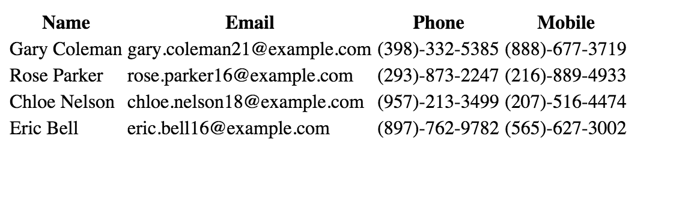

As you can see, the `<th>` tags are specially treated by the browser. It makes the content bold and centered. Nice.

Let's do one more improvement.

``` html
<!DOCTYPE html>
<html>
  <head>
    <meta charset="utf-8">
    <title>Demo Table With Head and Body</title>
  </head>
  <body>
    <table border="1">
      <thead>
        <tr><th>Name</th><th>Email</th><th>Phone</th><th>Mobile</th></tr>
      </thead>

      <tbody>
        <tr><td>Gary Coleman</td><td>gary.coleman21@example.com</td><td>(398)-332-5385</td><td>(888)-677-3719</td></tr>
        <tr><td>Rose Parker</td><td>rose.parker16@example.com</td><td>(293)-873-2247</td><td>(216)-889-4933</td></tr>
        <tr><td>Chloe Nelson</td><td>chloe.nelson18@example.com</td><td>(957)-213-3499</td><td>(207)-516-4474</td></tr>
        <tr><td>Eric Bell</td><td>eric.bell16@example.com</td><td>(897)-762-9782</td><td>(565)-627-3002</td></tr>
      </tbody>
    </table>
  </body>
</html>
```

We only changed the line #8 in the code above by adding the attribute `border` with value `1`. This does the following: It
creates a border around the table and around each one of the cells of the table. Here it is:

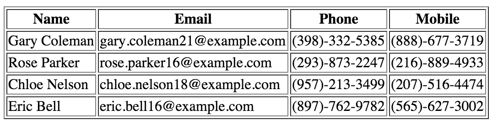

Note that if you increase the border value from `1` to `3` for example, you will increase the thickness of the border that 
surrounds the table but not the thickness of the borders of the cells. You can try that out and see.

But let's do one more improvement.

### Cell spacing

As you can see, there is some free / blank space between the border of cells. This is because there is default cell spacing
applied when a table is drawn by the browser. You can remove that by applying the attribute `cellspacing` with value `0`.

Hence, the new code will be:

``` html
<!DOCTYPE html>
<html>
  <head>
    <meta charset="utf-8">
    <title>Demo Table With Head and Body</title>
  </head>
  <body>
    <table border="1" cellspacing="0">
      <thead>
        <tr><th>Name</th><th>Email</th><th>Phone</th><th>Mobile</th></tr>
      </thead>

      <tbody>
        <tr><td>Gary Coleman</td><td>gary.coleman21@example.com</td><td>(398)-332-5385</td><td>(888)-677-3719</td></tr>
        <tr><td>Rose Parker</td><td>rose.parker16@example.com</td><td>(293)-873-2247</td><td>(216)-889-4933</td></tr>
        <tr><td>Chloe Nelson</td><td>chloe.nelson18@example.com</td><td>(957)-213-3499</td><td>(207)-516-4474</td></tr>
        <tr><td>Eric Bell</td><td>eric.bell16@example.com</td><td>(897)-762-9782</td><td>(565)-627-3002</td></tr>
      </tbody>
    </table>
  </body>
</html>
```

The final result of displaying this page will be:

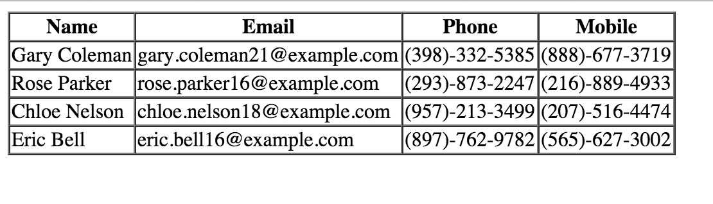

Do you see how cell spacing has disappeared? This makes the border look nicer too, because the border of one cell is drawn exactly next to the
border of the neighbouring cell.

Let's do one more improvement.

### Cell padding

As you can see, our current table example has one styling flaw. The content of the cells are very tight, and very close to the
borders of the cells. There is no room for the content to breath. We usually want to have some free space around the 
text of the cells. This can be achieved using the attribute `cellpadding`. Let's give it a try:

``` html
<!DOCTYPE html>
<html>
  <head>
    <meta charset="utf-8">
    <title>Demo Table With Cell Padding</title>
  </head>
  <body>
    <table border="1" cellspacing="0" cellpadding="5">
      <thead>
        <tr><th>Name</th><th>Email</th><th>Phone</th><th>Mobile</th></tr>
      </thead>

      <tbody>
        <tr><td>Gary Coleman</td><td>gary.coleman21@example.com</td><td>(398)-332-5385</td><td>(888)-677-3719</td></tr>
        <tr><td>Rose Parker</td><td>rose.parker16@example.com</td><td>(293)-873-2247</td><td>(216)-889-4933</td></tr>
        <tr><td>Chloe Nelson</td><td>chloe.nelson18@example.com</td><td>(957)-213-3499</td><td>(207)-516-4474</td></tr>
        <tr><td>Eric Bell</td><td>eric.bell16@example.com</td><td>(897)-762-9782</td><td>(565)-627-3002</td></tr>
      </tbody>
    </table>
  </body>
</html>
```

We have added the `cellpadding="5"` attribute value pair on the `<table>` tag. If we see this page on our browser, it will
be something like this:

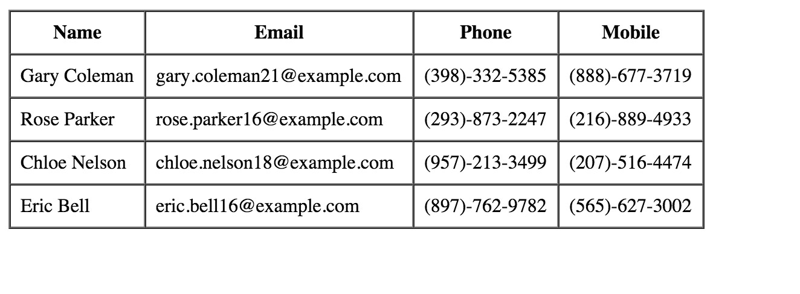

As you can see, there is some breathing space between the text inside the cells and the cells borders. You can increase this space
if you increase the value of the `cellpadding` attribute.

### Column Span

There are cases in which some rows of the table do not have the same number of columns like all the others. Let's say for example
that we want to have a row, at the top of the table, that has the value "Customers".

One might think that adding a row with only 1 cell would do the trick:

``` html
<!DOCTYPE html>
<html>
  <head>
    <meta charset="utf-8">
    <title>Demo Table With Cell Padding</title>
  </head>
  <body>
    <table border="1" cellspacing="0" cellpadding="8">
      <thead>
        <tr><th>Customers</th></tr>
        <tr><th>Name</th><th>Email</th><th>Phone</th><th>Mobile</th></tr>
      </thead>

      <tbody>
        <tr><td>Gary Coleman</td><td>gary.coleman21@example.com</td><td>(398)-332-5385</td><td>(888)-677-3719</td></tr>
        <tr><td>Rose Parker</td><td>rose.parker16@example.com</td><td>(293)-873-2247</td><td>(216)-889-4933</td></tr>
        <tr><td>Chloe Nelson</td><td>chloe.nelson18@example.com</td><td>(957)-213-3499</td><td>(207)-516-4474</td></tr>
        <tr><td>Eric Bell</td><td>eric.bell16@example.com</td><td>(897)-762-9782</td><td>(565)-627-3002</td></tr>
      </tbody>
    </table>
  </body>
</html>
```

We have added the line: `<tr><th>Customers</th></tr>` as the first row inside the `<thead>` of our table. Let's see the visual result:

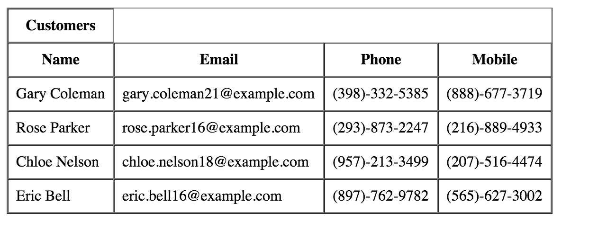

The problem is the border of the first top cell. The right side of it. It shouldn't be there. One quick solution to that is to tell
table that the particular cell does not occupy only 1 column, but occupies all the columns of the table. In our case 4 columns. 
This is done with the attribute `colspan`. So, we need to give the attribute `colspan` with value `4` on the "Customers" cell:

``` html
<!DOCTYPE html>
<html>
  <head>
    <meta charset="utf-8">
    <title>Demo Table With Colspan</title>
  </head>
  <body>
    <table border="1" cellspacing="0" cellpadding="8">
      <thead>
        <tr><th colspan="4">Customers</th></tr>
        <tr><th>Name</th><th>Email</th><th>Phone</th><th>Mobile</th></tr>
      </thead>

      <tbody>
        <tr><td>Gary Coleman</td><td>gary.coleman21@example.com</td><td>(398)-332-5385</td><td>(888)-677-3719</td></tr>
        <tr><td>Rose Parker</td><td>rose.parker16@example.com</td><td>(293)-873-2247</td><td>(216)-889-4933</td></tr>
        <tr><td>Chloe Nelson</td><td>chloe.nelson18@example.com</td><td>(957)-213-3499</td><td>(207)-516-4474</td></tr>
        <tr><td>Eric Bell</td><td>eric.bell16@example.com</td><td>(897)-762-9782</td><td>(565)-627-3002</td></tr>
      </tbody>
    </table>
  </body>
</html>
```

And the visual result of that will be:

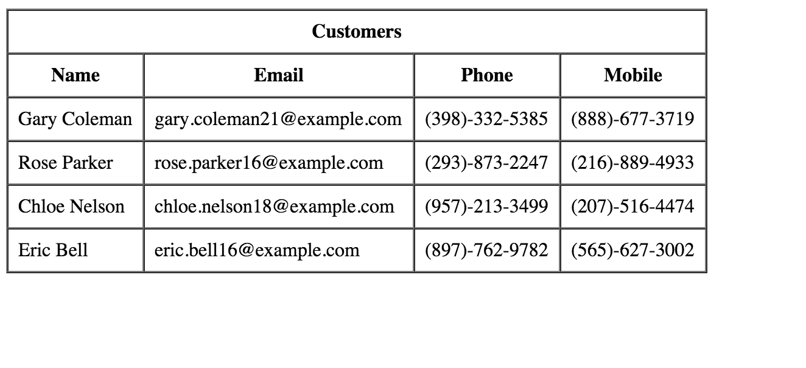

Things have become much better. Haven't they? As you can see the "Customers" cell is treated as one. Also, being a `<th>` cell makes sure that is centered and
bold. 
 
### Aligning
 
Now let's suppose that we want to print the number of customers as the last row of our table. Probably we would do something like that:

``` html
<!DOCTYPE html>
<html>
  <head>
    <meta charset="utf-8">
    <title>Demo Table With Number of Customers</title>
  </head>
  <body>
    <table border="1" cellspacing="0" cellpadding="8">
      <thead>
        <tr><th colspan="4">Customers</th></tr>
        <tr><th>Name</th><th>Email</th><th>Phone</th><th>Mobile</th></tr>
      </thead>

      <tbody>
        <tr><td>Gary Coleman</td><td>gary.coleman21@example.com</td><td>(398)-332-5385</td><td>(888)-677-3719</td></tr>
        <tr><td>Rose Parker</td><td>rose.parker16@example.com</td><td>(293)-873-2247</td><td>(216)-889-4933</td></tr>
        <tr><td>Chloe Nelson</td><td>chloe.nelson18@example.com</td><td>(957)-213-3499</td><td>(207)-516-4474</td></tr>
        <tr><td>Eric Bell</td><td>eric.bell16@example.com</td><td>(897)-762-9782</td><td>(565)-627-3002</td></tr>
        <tr><td colspan="4">Number of Customers: 4</td></tr>
      </tbody>
    </table>
  </body>
</html>
```

What we did, actually, was to add one more row in the `<tbody>` section of our table. The row we added was:

    <tr><td colspan="4">Number of Customers: 4</td></tr>
    
and create a cell that spans 4 columns. The visual result is the following:

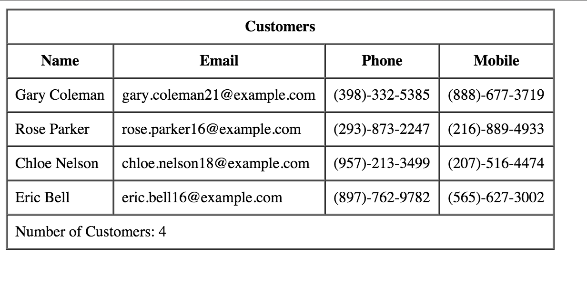
    
We will improve that by making the "Number of Customers" to be bold. How can we do that according to what we have learned so far? `<th>`.
Yes. We can use this type of cell, even if we are not on the `<thead>`. We are going to change the row for "Number of Customers" to be:

    <tr><th colspan="3">Number of Customers:</th><td>4</td></tr>
    
**Watch out**. We do not only change the `<td>` to `<th>` but we also make sure that we put in two different cells the heading "Number of Customers:" and
the actual value. Also, we change the `colspan` now to be `3` instead of `4`, since the 4th column is now occupied by the new cell for the actual
value of the number of customers.
    
So, the actual code now becomes:
    
``` html
<!DOCTYPE html>
<html>
  <head>
    <meta charset="utf-8">
    <title>Demo Table With Number of Customers and Th</title>
  </head>
  <body>
    <table border="1" cellspacing="0" cellpadding="8">
      <thead>
        <tr><th colspan="4">Customers</th></tr>
        <tr><th>Name</th><th>Email</th><th>Phone</th><th>Mobile</th></tr>
      </thead>

      <tbody>
        <tr><td>Gary Coleman</td><td>gary.coleman21@example.com</td><td>(398)-332-5385</td><td>(888)-677-3719</td></tr>
        <tr><td>Rose Parker</td><td>rose.parker16@example.com</td><td>(293)-873-2247</td><td>(216)-889-4933</td></tr>
        <tr><td>Chloe Nelson</td><td>chloe.nelson18@example.com</td><td>(957)-213-3499</td><td>(207)-516-4474</td></tr>
        <tr><td>Eric Bell</td><td>eric.bell16@example.com</td><td>(897)-762-9782</td><td>(565)-627-3002</td></tr>
        <tr><th colspan="3">Number of Customers:</th><td>4</td></tr>
      </tbody>
    </table>
  </body>
</html>
```
    
And the visual result is this:

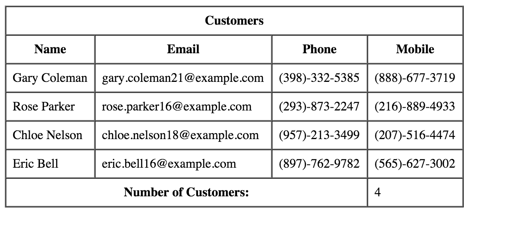    
    
So far so good. But, what we want here is to change the alignment of these two new cells. We want the content "Number of Customers:" to be aligned to the right,
and the content "4", the actual number of customers, to be aligned in the center of their cells. You can do that using the `align` attribute with the
values `right` and `center` respectively.

So, the line with the number of customers changes to:

    <tr><th colspan="3" align="right">Number of Customers:</th><td align="center">4</td></tr>
    
and the whole HTML document becomes:
    
``` html
<!DOCTYPE html>
<html>
  <head>
    <meta charset="utf-8">
    <title>Demo Table With Number of Customers Aligned</title>
  </head>
  <body>
    <table border="1" cellspacing="0" cellpadding="8">
      <thead>
        <tr><th colspan="4">Customers</th></tr>
        <tr><th>Name</th><th>Email</th><th>Phone</th><th>Mobile</th></tr>
      </thead>

      <tbody>
        <tr><td>Gary Coleman</td><td>gary.coleman21@example.com</td><td>(398)-332-5385</td><td>(888)-677-3719</td></tr>
        <tr><td>Rose Parker</td><td>rose.parker16@example.com</td><td>(293)-873-2247</td><td>(216)-889-4933</td></tr>
        <tr><td>Chloe Nelson</td><td>chloe.nelson18@example.com</td><td>(957)-213-3499</td><td>(207)-516-4474</td></tr>
        <tr><td>Eric Bell</td><td>eric.bell16@example.com</td><td>(897)-762-9782</td><td>(565)-627-3002</td></tr>
        <tr><th colspan="3" align="right">Number of Customers:</th><td align="center">4</td></tr>
      </tbody>
    </table>
  </body>
</html>
```

The visual result of which is:

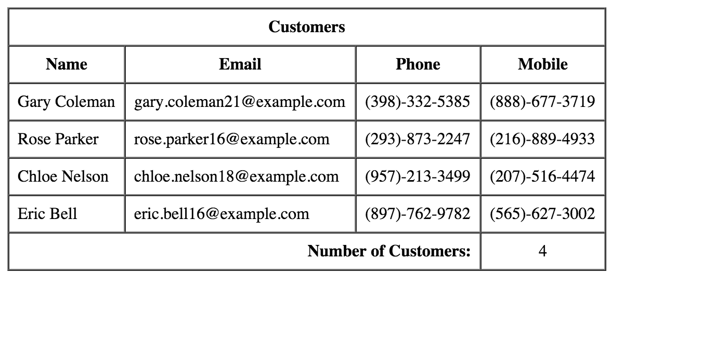

We have managed to bring the table content to a level that we want, using simple HTML tags and attributes.

### Row span

Let's do one more improvement to our table. Suppose that we want to achieve the following result:

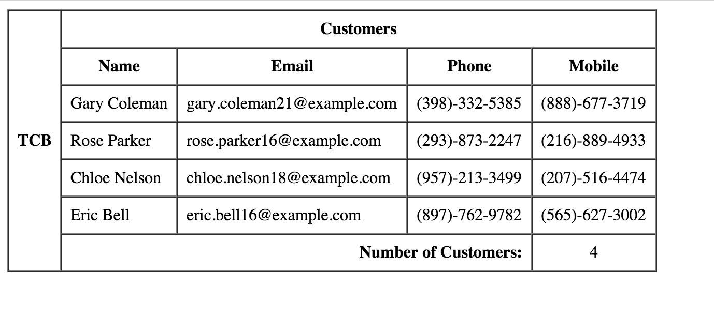

We want to add the name of our company as the left most column. In order to be able to design tables like these you need to answer first
the following questions:

1. Does my table have table head and table body? Clearly separated?
2. How many rows does my table have?
3. How many columns does my tale have?

Let's answer these questions for this table that we want to design.

1. Does my table have table head and table body, **clearly defined and separated**? The answer here is **NO**. There are not rows that can be put
in either of the sections, head or body. We cannot say, for example, that the first 2 rows go to head and the next 5 go to body. This is because
there is the column with the "TCB" content, on the left that does not allow me to make this distinction. Is this a problem? No. It is not. We will
not separate the rows to head and body. However, I can definitely use `<th>` for cells that work as column or data headers/names. All the bold ones
in the example table that I am trying to build here. 
2. How many rows does my table have? Count the maximum number of rows that you see scanning the table from top to bottom. On our example this is 7.
3. How many columns does my table have? Count the maximum number of columns that you see scanning the table from left to right. 
This is 5 in our example. The columns with contents "TCB", "Name", "Email", "Phone", "Mobile".

You now know how to start laying out your table:

``` html
<!DOCTYPE html>
<html>
  <head>
    <meta charset="utf-8">
    <title>Demo Table With Row Span</title>
  </head>
  <body>
    <table border="1" cellspacing="0" cellpadding="8">
      <tr><td></td><td></td><td></td><td></td><td></td></tr>
      <tr><td></td><td></td><td></td><td></td><td></td></tr>
      <tr><td></td><td></td><td></td><td></td><td></td></tr>
      <tr><td></td><td></td><td></td><td></td><td></td></tr>
      <tr><td></td><td></td><td></td><td></td><td></td></tr>
      <tr><td></td><td></td><td></td><td></td><td></td></tr>
      <tr><td></td><td></td><td></td><td></td><td></td></tr>
    </table>
  </body>
</html>
```

As you can see above, I have a table without head, neither body, with 7 rows, 5 columns each.

Now, I am looking at the rows, from top to bottom and I change my design accordingly.

The first row has 2 columns:
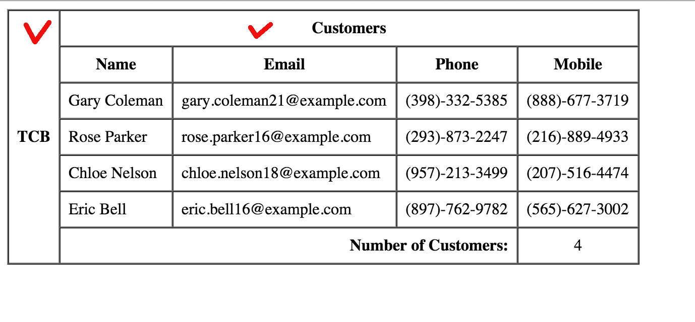

As you can see, the 1st of the 2 columns occupies 1 column size, but the 2nd occupies the rest of the table width. Hence,
we need to set the `colspan` for the 2nd column to be `4`. (Maximum number of columns 5 - 1 for the first, equals 4). I also use `<th>`
to make the content bold.

Let's put that in the code:

``` html
<!DOCTYPE html>
<html>
  <head>
    <meta charset="utf-8">
    <title>Demo Table With Row Span</title>
  </head>
  <body>
    <table border="1" cellspacing="0" cellpadding="8">
      <tr><th>TCB</th><th colspan="4">Customers</th></tr>
      <tr><td></td><td></td><td></td><td></td><td></td></tr>
      <tr><td></td><td></td><td></td><td></td><td></td></tr>
      <tr><td></td><td></td><td></td><td></td><td></td></tr>
      <tr><td></td><td></td><td></td><td></td><td></td></tr>
      <tr><td></td><td></td><td></td><td></td><td></td></tr>
      <tr><td></td><td></td><td></td><td></td><td></td></tr>
    </table>
  </body>
</html>
```

The second row has 5 columns:

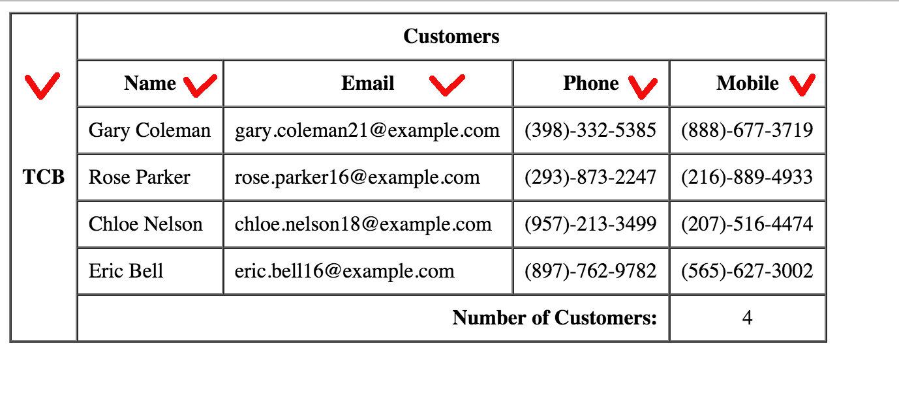

Since the maximum number of columns in the table is 5, then we do not need any `colspan` attribute to any of the cells.  We will also write
`<th>` to make the content bold. Let's write the 2nd row:

``` html
<!DOCTYPE html>
<html>
  <head>
    <meta charset="utf-8">
    <title>Demo Table With Row Span</title>
  </head>
  <body>
    <table border="1" cellspacing="0" cellpadding="8">
      <tr><th>TCB</th><th colspan="4">Customers</th></tr>
      <tr><th>TCB</th><th>Name</th><th>Email</th><th>Phone</th><th>Mobile</th></tr>
      <tr><td></td><td></td><td></td><td></td><td></td></tr>
      <tr><td></td><td></td><td></td><td></td><td></td></tr>
      <tr><td></td><td></td><td></td><td></td><td></td></tr>
      <tr><td></td><td></td><td></td><td></td><td></td></tr>
      <tr><td></td><td></td><td></td><td></td><td></td></tr>
    </table>
  </body>
</html>
```

We proceed similarly for the 3rd, 4th, 5th and 6th rows of the table. We do not use `<th>` but we use `<td>` instead.
Here is how we add these rows:

``` html
<!DOCTYPE html>
<html>
  <head>
    <meta charset="utf-8">
    <title>Demo Table With Row Span</title>
  </head>
  <body>
    <table border="1" cellspacing="0" cellpadding="8">
      <tr><th>TCB</th><th colspan="4">Customers</th></tr>
      <tr><th>TCB</th><th>Name</th><th>Email</th><th>Phone</th><th>Mobile</th></tr>
      <tr><th>TCB</th><td>Gary Coleman</td><td>gary.coleman21@example.com</td><td>(398)-332-5385</td><td>(888)-677-3719</td></tr>
      <tr><th>TCB</th><td>Rose Parker</td><td>rose.parker16@example.com</td><td>(293)-873-2247</td><td>(216)-889-4933</td></tr>
      <tr><th>TCB</th><td>Chloe Nelson</td><td>chloe.nelson18@example.com</td><td>(957)-213-3499</td><td>(207)-516-4474</td></tr>
      <tr><th>TCB</th><td>Eric Bell</td><td>eric.bell16@example.com</td><td>(897)-762-9782</td><td>(565)-627-3002</td></tr>
      <tr><td></td><td></td><td></td><td></td><td></td></tr>
    </table>
  </body>
</html>
```

The last, 7th, row has 3 cells:
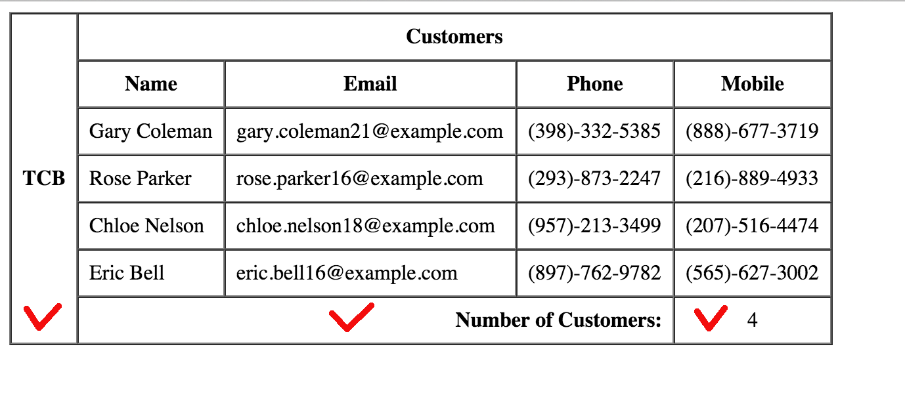

As you can see, the 2nd column (Number of Customers:) occupies 3 columns width. This means that we will need `colspan` with value `3` for this column.

The code now becomes:

``` html
<!DOCTYPE html>
<html>
  <head>
    <meta charset="utf-8">
    <title>Demo Table With Row Span</title>
  </head>
  <body>
    <table border="1" cellspacing="0" cellpadding="8">
      <tr><th>TCB</th><th colspan="4">Customers</th></tr>
      <tr><th>TCB</th><th>Name</th><th>Email</th><th>Phone</th><th>Mobile</th></tr>
      <tr><th>TCB></th><td>Gary Coleman</td><td>gary.coleman21@example.com</td><td>(398)-332-5385</td><td>(888)-677-3719</td></tr>
      <tr><th>TCB</th><td>Rose Parker</td><td>rose.parker16@example.com</td><td>(293)-873-2247</td><td>(216)-889-4933</td></tr>
      <tr><th>TCB</th><td>Chloe Nelson</td><td>chloe.nelson18@example.com</td><td>(957)-213-3499</td><td>(207)-516-4474</td></tr>
      <tr><th>TCB</th><td>Eric Bell</td><td>eric.bell16@example.com</td><td>(897)-762-9782</td><td>(565)-627-3002</td></tr>
      <tr><th>TCB</th><th colspan="3" align="right">Number of Customers:</th><td align="center">4</td></tr>
    </table>
  </body>
</html>
```

Are we finished? Let's see the visual result of that. Save this document into a file and open it on your browser. You will see this:

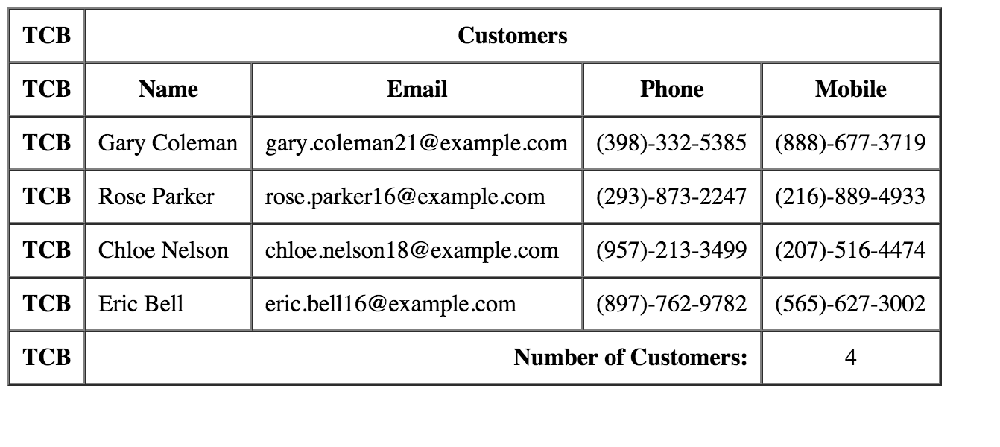

The problem is obvious. We repeated the TCB column but we do not really need it. We only need it for the first row although it occupies the 1st column
on the other rows too. This is achieved with the `rowspan` attribute which needs to have the value equal to the number of rows that a column occupies.
In our particular case, "TCB" column starts from top and goes to bottom, hence `rowspan` needs to be with value `7`. 

So, let's remove the `<th>TCB</th>` from all the rows except the first one, and let's add the attribute `rowspan` on the `<th>TCB</th>` of the first row.

The document becomes:

``` html
<!DOCTYPE html>
<html>
  <head>
    <meta charset="utf-8">
    <title>Demo Table With Row Span</title>
  </head>
  <body>
    <table border="1" cellspacing="0" cellpadding="8">
      <tr><th rowspan="7">TCB</th><th colspan="4">Customers</th></tr>
      <tr><th>Name</th><th>Email</th><th>Phone</th><th>Mobile</th></tr>

      <tr><td>Gary Coleman</td><td>gary.coleman21@example.com</td><td>(398)-332-5385</td><td>(888)-677-3719</td></tr>
      <tr><td>Rose Parker</td><td>rose.parker16@example.com</td><td>(293)-873-2247</td><td>(216)-889-4933</td></tr>
      <tr><td>Chloe Nelson</td><td>chloe.nelson18@example.com</td><td>(957)-213-3499</td><td>(207)-516-4474</td></tr>
      <tr><td>Eric Bell</td><td>eric.bell16@example.com</td><td>(897)-762-9782</td><td>(565)-627-3002</td></tr>
      <tr><th colspan="3" align="right">Number of Customers:</th><td align="center">4</td></tr>
    </table>
  </body>
</html>
```

This one, if you save it and load on a browser, you will have the result that you really want:


Finally, you may have noticed that the HTML code is not easy to read. In that case, when the tables start to become more complex,
we decide to use nesting and indentation as follows:

``` html
<!DOCTYPE html>
<html>
  <head>
    <meta charset="utf-8">
    <title>Demo Table With Row Span</title>
  </head>
  <body>
    <table border="1" cellspacing="0" cellpadding="8">
      <tr>
        <th rowspan="7">TCB</th>
        <th colspan="4">Customers</th>
      </tr>

      <tr>
        <th>Name</th>
        <th>Email</th>
        <th>Phone</th>
        <th>Mobile</th>
      </tr>

      <tr>
        <td>Gary Coleman</td>
        <td>gary.coleman21@example.com</td>
        <td>(398)-332-5385</td>
        <td>(888)-677-3719</td>
      </tr>

      <tr>
        <td>Rose Parker</td>
        <td>rose.parker16@example.com</td>
        <td>(293)-873-2247</td>
        <td>(216)-889-4933</td>
      </tr>

      <tr>
        <td>Chloe Nelson</td>
        <td>chloe.nelson18@example.com</td>
        <td>(957)-213-3499</td>
        <td>(207)-516-4474</td>
      </tr>

      <tr>
        <td>Eric Bell</td>
        <td>eric.bell16@example.com</td>
        <td>(897)-762-9782</td>
        <td>(565)-627-3002</td>
      </tr>

      <tr>
        <th colspan="3" align="right">Number of Customers:</th>
        <td align="center">4</td>
      </tr>
      
    </table>
  </body>
</html>
```

### Styling tables

It is good to know how you can do basic styling of a table using the above techniques. However, when you will start learning CSS,
you will prefer to use CSS rules in order to do that. 

### Tables and Emails

Note that tables, as we said at the beginning, are not to be used to divide the document in sections. It is the existence of the `<div>` tag
that serves this need. However, there is an exception to this rule. HTML Emails. HTML emails, are emails that have rich content and they
look like a normal HTML page. The problem is that email clients do not treat well HTML emails that are using `<div>` tags but they treat
very well HTML emails that are using `<tables>`. Have that in mind when you start designing HTML email templates. We will see that later
in another chapter.


