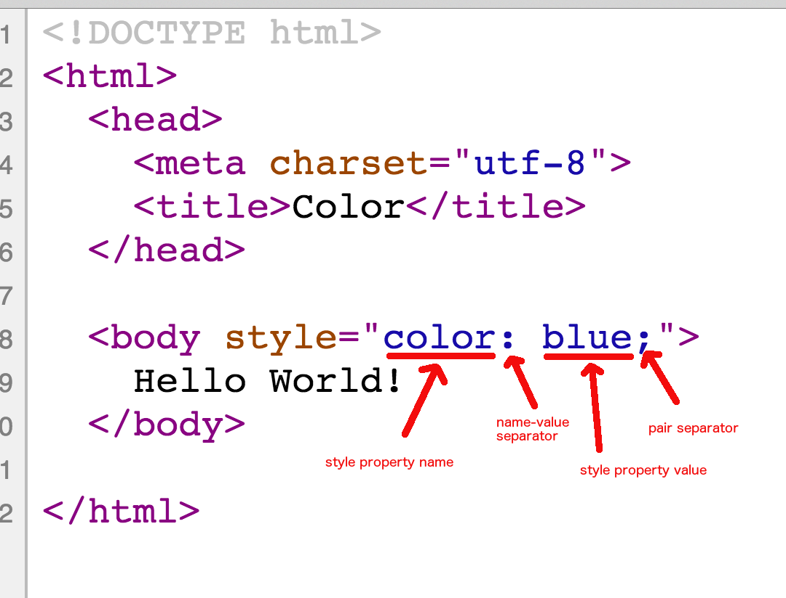

## First Simple CSS Rules

Before we continue with HTML code and more advanced HTML tags, I will ask you to have a break on core HTML
and deal with little CSS. We will start styling our documents with various fonts and with colors.

## Style Rules and CSS Language

How do we specify the styling rules of a document? The HTML elements of a page have some properties that
deal with the style and the way an HTML element is drawn on the page. These properties are not the ones that
we write as part of the HTML tag, but exist as accompanying properties and serve the purpose to change the
way the element is displayed.

So, in simple terms, to change the value of a styling property of an element, you need to specify the name of the
property and the new value that you want this property to have. Finally you need to tell which elements
should use this new property with the new value.

When you want to set the style of an element you can think about being able to change things like:

* The color
   * The background color
   * The foreground color
   * The border color
* The font
   * Family
   * Size
   * Style
   * Weight
* The size
   * width
   * height
* Text properties
   * alignment
   * letter spacing

and many-many more. 

Let's see some examples:

### Default style values

When you do not specify any style property value, browsers are using default values. This is called, the "user agent stylesheet".

For example, if you write just a simple word inside the body, then:

* The font family used is `Times`
* Font size is `16px`
* Font style is `Normal`
* Font weight is `Normal`
* Text color is `Black`

### Set the color of the text - `color`

Let's start our short journey on CSS by setting the color of the text. The color of the text is specified by the property with name `color`.

Write the following HTML document and open it on your browser:

``` html
<!DOCTYPE html>
<html>
  <head>
      <meta charset="utf-8">
      <title>Color</title>
  </head>

  <body>
    Hello World!
  </body>

</html>
```
As you can see, the color of the phrase "Hello World!" is black, the default used by the browser.

We can apply a new style on the HTML tag element that contains that text, in order to change its color to blue.

Which HTML tag element contains the text "Hello World!" ? It is the `<body>`. In that case, we need to apply the
new style to this particular element. Let's do it:

``` html
<!DOCTYPE html>
<html>
  <head>
    <meta charset="utf-8">
    <title>Color</title>
  </head>

  <body style="color: blue;">
    Hello World!
  </body>

</html>
```

As you can see above in order to apply a new style on an element, we use the attribute with name `style`. The value of this
attribute needs to be a series of style property value pairs. The style property name is separated from its value using the
symbol `:`. Note that each pair ends with the symbol `;`. 



If you open the above document on a browser you will see the following:


So, the `color` is used to set the text color. You can use any standard color values. You can also use numbers to specify the color.
I will give you more details about that in later chapters. Until then, you can use color names like: `black`, `yellow`, `blue`, `green`,
`red`, `orange` e.t.c.

### Set the text size - `font-size`

Now, we will change the text size. In order to do that we use the style property `font-size`. `font-size` is calculated in pixels (which is the measure of display
analysis). As we said, most of the browsers use `16px` size font as default. Let's try the double one.

``` html
<!DOCTYPE html>
<html>
  <head>
    <meta charset="utf-8">
    <title>Color</title>
  </head>

  <body style="color: blue; font-size: 32px;">
    Hello World!
  </body>

</html>
```

As you can see we have added the `font-size` property next to the `color` property. Let's see the visual result of this change:


As you can see, the text size is double the size of the original version. 

### Set border - `border`

If we want to create a border around the content of an element we use the `border` property. This is actually a triple value property.
You need to give value about the width of the border, the style of the border and the color of the border.

In the next example, we set the border of the body to be of 2px width, solid style and red color:


``` html
<!DOCTYPE html>
<html>
  <head>
    <meta charset="utf-8">
    <title>Color</title>
  </head>

  <body style="color: blue; font-size: 32px; border: 2px solid red;">
    Hello World!
  </body>

</html>
```

The visual result is the following:


### Set background / fill color - `background-color`

Our final change on this page will be to change the background color of the body, or otherwise, the fill color. This is done by changing the value of the property `background-color`.
Let's set that to the value `yellow` and see how this will affect our page content:

``` html
<!DOCTYPE html>
<html>
  <head>
    <meta charset="utf-8">
    <title>Color</title>
  </head>

  <body style="color: blue; font-size: 32px; border: 2px solid red; background-color: yellow;">
    Hello World!
  </body>

</html>
```

If we load this page on our browser, the result will be:


There are many style properties that can be changed for an HTML element and we learn more about styling in later chapters.

### The `<style>` tag

The fact that I can set the style properties as values of the `style` attribute seems to be easy and handy, but it is not a good practice. 
Firstly, let's think about the case in which we want to change / set 30 different style properties on a particular element. That `style` attribute is
going to be very long. In such cases we prefer to use the `<style>` tag and include the rules for styling inside its content. 

So, the previous style rules for `body` should be written inside the `<style>` tag:

``` html
<style>
  color: blue;
  font-size: 32px;
  border: 2px solid red;
  background-color: yellow;
</style>
```

Ok. But hold on. Where is the fact that we want to apply these style rules to the `body` element? Good point! And this is the main difference here.
If you put your style rules inside the `<style>` tags, you need to tell which element the rules apply to. We do that by enclosing the rules inside 
curly braces and specifying the element / tag name before that:

``` html
<style>
  body {
    color: blue;
    font-size: 32px;
    border: 2px solid red;
    background-color: yellow;
  }
</style>
```

So, if you put this inside our HTML document and remove the `style` attribute from the `body` element it will work like before. Note that we
can put the `<style>` tag anywhere in the HTML document. In the `<head>`, in the `<body>` or even below closing `</body>`. But we usually prefer
to have it in the `<head>` section. Also, you need to know that you can have as many `<style>` tags inside your document as you like.

> **Important** Later, you will learn that we do not like neither having multiple `<style>` tags nor even having any such tag inside our
HTML document.

``` html
<!DOCTYPE html>
<html>
  <head>
    <meta charset="utf-8">
    <title>Color</title>
    <style>
      body {
        color: blue;
        font-size: 32px;
        border: 2px solid red;
        background-color: yellow;
      }
    </style>
  </head>    
  <body>
    Hello World!
  </body>

</html>
```

Load this document on your browser. The result will be the one we had before.

### The reference to the CSS file

Again, we like to keep things neat, clean and separate. We do not like to mix the CSS rules, styling code, with HTML document
structure code. Having the style interspersed with HTML tags and code is something that is a bad practice. It is not easily
maintainable and does not allow easy reading of either the HTML or the CSS rules. There are other disadvantages too that
you will learn later on as you become more experienced developer.

So, what do we do with that? We save our styling rules inside a separate text file, the CSS file. This file has filename extension `.css` and
it is separately stored, usually inside a folder named `stylesheets`.

When we put style rules inside a CSS file, we do not enclose them inside `<style>` HTML tags because this file is not an HTML file. 

Hence, create the folder `stylesheets` and save the following CSS rules inside a file named `main.css`. The folder and file should be like:

```
-[stylesheets]
     |- main.css
```

The `main.css` file should have the content:

``` css
body {
  color: blue;
  font-size: 32px;
  border: 2px solid red;
  background-color: yellow;
}
```     

The question now is how do we use this file in order to apply its rules to our HTML page. We use it by creating a special reference
inside the `<head>` section of our HTML file. Like this:

``` html
<!DOCTYPE html>
<html>
  <head>
    <meta charset="utf-8">
    <link href="stylesheets/main.css" rel="stylesheet" type="text/css">
    <title>Color</title>
  </head>

  <body>
    Hello World!
  </body>

</html>
```

Save this file with the name `index.html`. Save it on the same folder where the `stylesheets` folder is. Like this:

```
-[stylesheets]
     |- main.css
- index.html
```

Then if you open the `index.html` file using your browser, you will see the same result as before.

The trick is done by the `<link>` tag that is used inside the `<head>` section.

``` html
<link href="stylesheets/main.css" rel="stylesheet" type="text/css">
```

This tells the browser that has to load a referenced resource. The relationship to the current HTML document is a `stylesheet` relationship
and is defined by the `rel` attribute. The actual path to the resource that needs to be loaded is defined by the attribute `href`, which 
has the value `stylesheets/main.css`, specifying, essentially, the path to the CSS file with the style rules that should be used.

When the browser parses the HTML document and encounters such a `<link>`, loads the corresponding rules in its memory and then proceeds
with parsing the rest of the HTML document.
