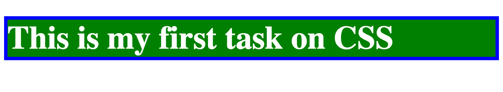

In this chapter we start using CSS, Cascading Style Sheets. CSS is the tool that will allow
us to style our HTML pages and make them looking nice to the visitor.

We will start by implementing something very simple like this:

In later chapters, you will learn a lot of techniques to make your pages looking really good.
