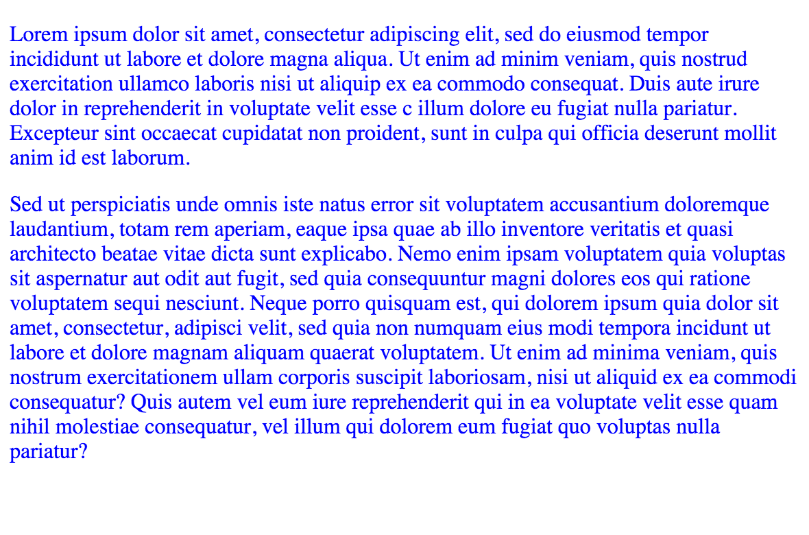
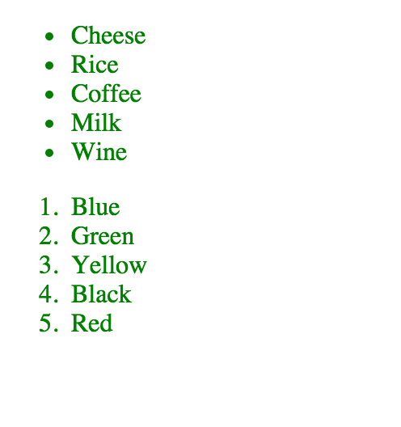
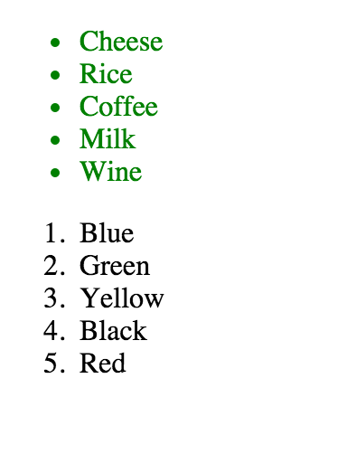
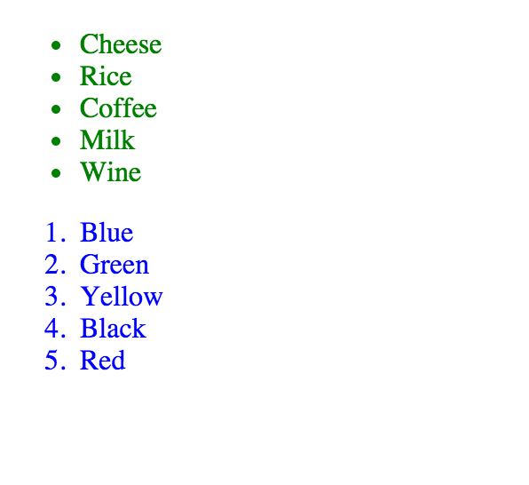
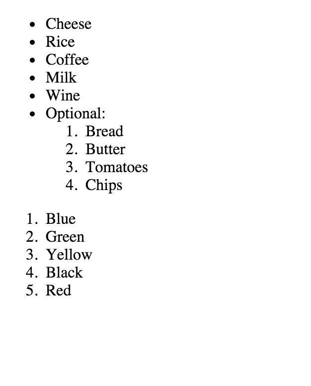
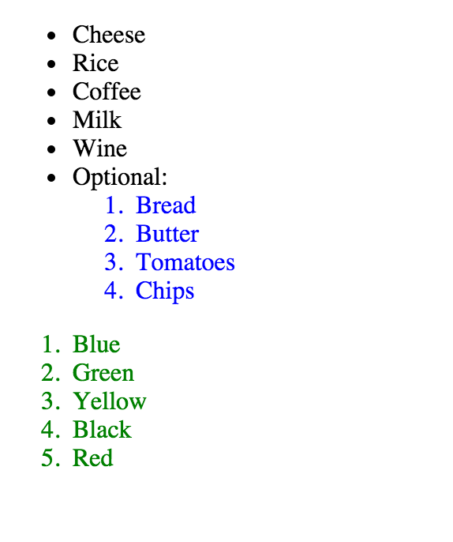
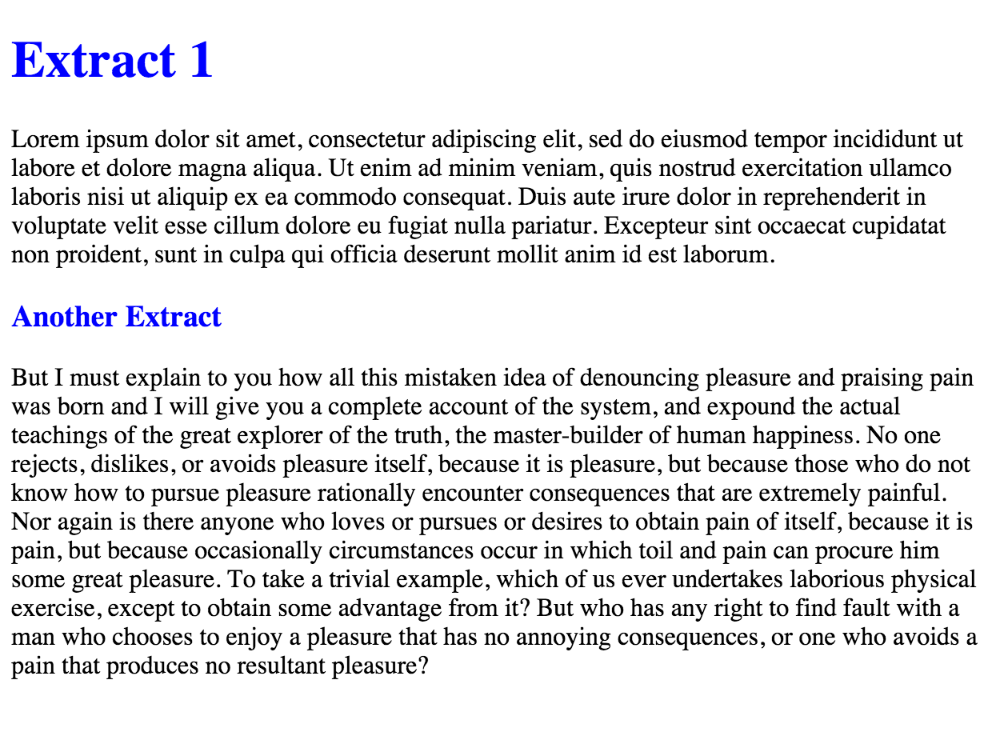

## First Encounter with CSS Selectors

### Selecting by the HTML tag name

In the previous chapter we used the following CSS rule to change the styling of the `body` element:

``` css
body {
    color: blue;
    font-size: 32px;
    border: 2px solid red;
    background-color: yellow;
}
```

The `body` word, before the starting `{` works as a CSS selector. It essentially selects, or specifies, which
HTML tags will have the styling properties that are enclosed inside the following curly braces. And in this particular
case, the specification, the selection rule, uses an HTML tag, the `body`, to specify the HTML tags that will have
the styling properties that follow. 

It is true that inside an HTML document there is only 1 `body` tag and hence, the `body` CSS selector actually matches
only 1 tag. But this is not the general case. We might specify an HTML tag that appears many times inside the HTML
document. In that case, the styling properties will be applied to all matching tags.

Let's see the following example. Create the following HTML content and save it inside the file `index.html`.


``` html
<!DOCTYPE html>
<html>
  <head>
    <meta charset="utf-8">
    <link href="stylesheets/main.css" rel="stylesheet" type="text/css">
    <title>Color</title>
  </head>

  <body>
    <p>Lorem ipsum dolor sit amet, consectetur adipiscing elit, sed do eiusmod tempor incididunt ut labore et
      dolore magna aliqua. Ut enim ad minim veniam, quis nostrud exercitation ullamco laboris nisi ut aliquip
      ex ea commodo consequat. Duis aute irure dolor in reprehenderit in voluptate velit esse c
      illum dolore eu fugiat nulla pariatur. Excepteur sint occaecat cupidatat non proident, sunt in culpa qui
      officia deserunt mollit anim id est laborum.
    </p>

    <p>
      Sed ut perspiciatis unde omnis iste natus error sit voluptatem accusantium doloremque laudantium, totam
      rem aperiam, eaque ipsa quae ab illo inventore veritatis et quasi architecto beatae vitae dicta sunt explicabo.
      Nemo enim ipsam voluptatem quia voluptas sit aspernatur aut odit aut fugit, sed quia consequuntur magni dolores
      eos qui ratione voluptatem sequi nesciunt. Neque porro quisquam est, qui dolorem ipsum quia dolor sit amet,
      consectetur, adipisci velit, sed quia non numquam eius modi tempora incidunt ut labore et dolore magnam aliquam
      quaerat voluptatem. Ut enim ad minima veniam, quis nostrum exercitationem ullam corporis suscipit laboriosam,
      nisi ut aliquid ex ea commodi consequatur? Quis autem vel eum iure reprehenderit qui in ea voluptate velit
      esse quam nihil molestiae consequatur, vel illum qui dolorem eum fugiat quo voluptas nulla pariatur?
    </p>
  </body>

</html>
```

As you can see, this page references the `stylesheets/main.css` file. Hence, you need to create this file
and make sure it has the following content:

``` css
p {
  color: blue;
}
```

Our HTML page above has 2 `<p>` tag elements. 2 paragraphs. And the CSS rules inside the `main.css` file have
a rule that says that the `p` tags need to have color blue. 

If you load that page on your browser, you will see that both paragraphs are affected and they have text color blue.



### Specificity - Containing-Contained Relationships

Let's see a more complicated example. Here is the HTML code (write it and save inside your `index.html` file):

``` html
<!DOCTYPE html>
<html>
  <head>
    <meta charset="utf-8">
    <link href="stylesheets/main.css" rel="stylesheet" type="text/css">
    <title>Li Selection</title>
  </head>

  <body>
    <ul>
      <li>Cheese</li>
      <li>Rice</li>
      <li>Coffee</li>
      <li>Milk</li>
      <li>Wine</li>
    </ul>

    <ol>
      <li>Blue</li>
      <li>Green</li>
      <li>Yellow</li>
      <li>Black</li>
      <li>Red</li>
    </ol>
  </body>

</html>
```

Change the content of your `stylesheets/main.css` file as follows:

``` css
li {
  color: green;
}
```

If you load this page on your browser you should see this:



Easy stuff. We have specified that all list items (`<li>`) tags should have content that is colored with green color. So, the result is
what we expected. But how can we say that only the unordered list, for example, needs to be colored with green color? We need to find a
way to differentiate the `li` tag elements of the unordered list from the `li` tag elements of the second, ordered list.

I guess that it is easy to understand that the first `li` elements are **contained** inside `ul` and the second `li` elements are **contained** inside an `ol`.
Hence, we can use the property of relationship, containing-contained relationship, to pick up in our CSS selector only the first `li` elements, those that 
are contained inside the `ul` element. This is how we should write our CSS rule:

``` css
ul li {
  color: green;
}
```

The above rule says, "select all the `li` elements that are contained inside a `ul` element".

Let's try that. Save your new rule inside your `stylesheets/main.css` file (and make sure that you do not have the previous `li` rule anymore),
and load your HTML page again. The result should be this:



Well done. We have managed to **be more specific**. This is how CSS rules work. They can be generic, but they can be more specific. And the specific
rules take precedence over the more generic ones. Let's see another example here that demonstrates this specificity:

Change your `stylesheets/main.css` to have the following content (and only this):

``` css
li {
  color: blue;
}
ul li {
  color: green;
}
```

If you load your `index.html` page again, you will get the following result:



The above rules say "set color blue to all list items, but for those that are inside a `ul` set the color to green".

The containing-contained relationship can be specified in any depth level, although we do not like to go very deep. Let's see another example.

Change the content of your `index.html` file to be:

``` html
<!DOCTYPE html>
<html>
  <head>
    <meta charset="utf-8">
    <link href="stylesheets/main.css" rel="stylesheet" type="text/css">
    <title>Deep level</title>
  </head>

  <body>
    <ul>
      <li>Cheese</li>
      <li>Rice</li>
      <li>Coffee</li>
      <li>Milk</li>
      <li>Wine</li>
      <li>Optional:
        <ol>
          <li>Bread</li>
          <li>Butter</li>
          <li>Tomatoes</li>
          <li>Chips</li>
        </ol>
      </li>
    </ul>

    <ol>
      <li>Blue</li>
      <li>Green</li>
      <li>Yellow</li>
      <li>Black</li>
      <li>Red</li>
    </ol>
  </body>

</html>
```

If you do not apply any styling on this page, it will be drawn like this:
> *Hint*: If you want to disable, temporarily, the application of any CSS style, you only have to 
either remove the `<link>` line that references and loads the CSS file, or you can put this line into comments like this:

    <!-- link href="stylesheets/main.css" rel="stylesheet" type="text/css" -->

> Later, when you want that back, just remove the comment delimiters and bring back the normal opening and closing symbols, like this:

    <link href="stylesheets/main.css" rel="stylesheet" type="text/css">



The question that we pose here is how can we specify that the "Optional:" ordered list has color blue, but the last ordered list
has color green? This is the result that we want to achieve:
 
 

We need to be specific enough so that the rules apply only to the elements we want.

Change your `stylesheets/main.css` file to have the following content (and only that):

``` css
ol li {
  color: green;
}
li ol li {
  color: blue;
}
```
Reload your `index.html` page (make sure that the `<link>` references the file `stylesheets/main.css`) and see the result. It should be the expected one.

The first rule:

``` css
ol li {
  color: green;
}
```

makes sure that all ordered list items have green color, but the second rule:

``` css
li ol li {
  color: blue;
}
```

overrides the first one, for the cases in which the ordered list is part of another list item (which is the case for the "Optional:" ordered list in our page).

Now, change your `stylesheets/main.css` file and make sure it has the following content and only this:

``` css
ol li {
    color: green;
}
ul ol li {
    color: blue;
} 
```
Save it and reload your `index.html` page. Did anything change? No, This is because the rule:

``` css
ul ol li {
    color: blue;
} 
```

matches any `li` that is contained inside an `ol` item that is contained inside a `ul` item. The containment relationship defined by this rule does not
imply **direct** containment. The containing part can be any ancestor, in any level, of the contained part. In our case `ul` element is a not a direct
parent of the `ol` element, but the rule still applies, because it doesn't have to be.

### Multiple selectors

We will finish our first encounter with CSS selectors, by using multiple selectors to apply the same style properties.

Change your `index.html` file to have the following content:

``` html
<!DOCTYPE html>
<html>
  <head>
    <meta charset="utf-8">
    <link href="stylesheets/main.css" rel="stylesheet" type="text/css">
    <title>Multiple Selectors</title>
  </head>

  <body>
    <h1>Extract 1</h1>

    <p>
      Lorem ipsum dolor sit amet, consectetur adipiscing elit, sed do eiusmod tempor incididunt ut labore et dolore magna
      aliqua. Ut enim ad minim veniam, quis nostrud exercitation ullamco laboris nisi ut aliquip ex ea commodo consequat.
      Duis aute irure dolor in reprehenderit in voluptate velit esse cillum dolore eu fugiat nulla pariatur. Excepteur sint
      occaecat cupidatat non proident, sunt in culpa qui officia deserunt mollit anim id est laborum.
    </p>

    <h3>Another Extract</h3>

    <p>
      But I must explain to you how all this mistaken idea of denouncing pleasure and praising pain was born and I will give you
      a complete account of the system, and expound the actual teachings of the great explorer of the truth, the master-builder of
      human happiness. No one rejects, dislikes, or avoids pleasure itself, because it is pleasure, but because those who do not
      know how to pursue pleasure rationally encounter consequences that are extremely painful. Nor again is there anyone who loves
      or pursues or desires to obtain pain of itself, because it is pain, but because occasionally circumstances occur in which toil
      and pain can procure him some great pleasure. To take a trivial example, which of us ever undertakes laborious physical exercise,
      except to obtain some advantage from it? But who has any right to find fault with a man who chooses to enjoy a pleasure that has no
      annoying consequences, or one who avoids a pain that produces no resultant pleasure?
    </p>

  </body>

</html>
```

The question here is how can we apply the color blue to the content of `<h1>` and `<h3>` tags? One can definitely do this:

``` css
h1 {
  color: blue;
}
h3 {
  color: blue;
}
```

But this becomes unmaintainable, since any decision to change the color from blue to red, for example, would have to be done to
multiple places in your CSS code. There is a better way: 

Change the content of your `stylesheets/main.css` as follows:

``` css
h1, h3 {
  color: blue;
}
```

and reload your page. You will see that you have the desired result:



As you can see, we can separate with `,` one CSS selector from the other and still apply the same style properties. 
 


