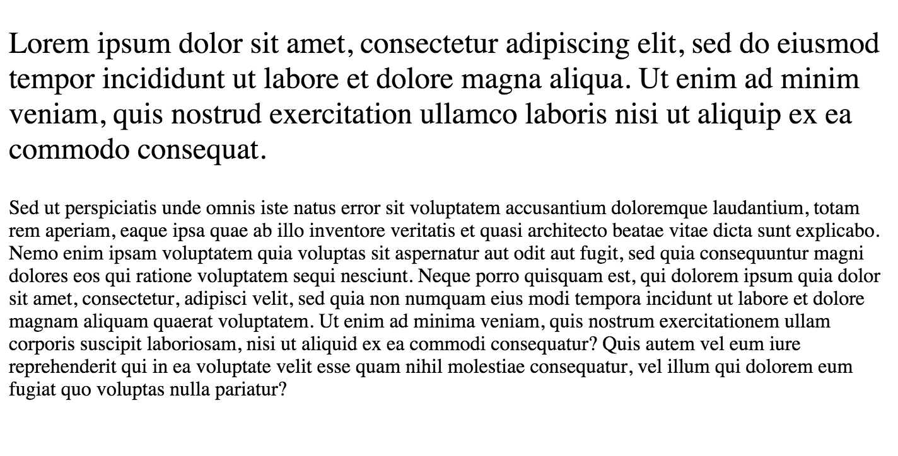
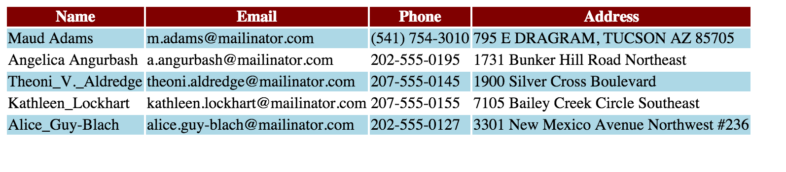
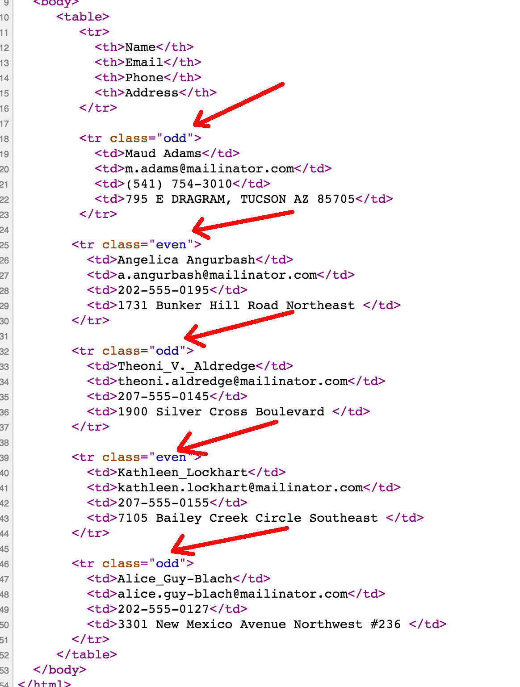
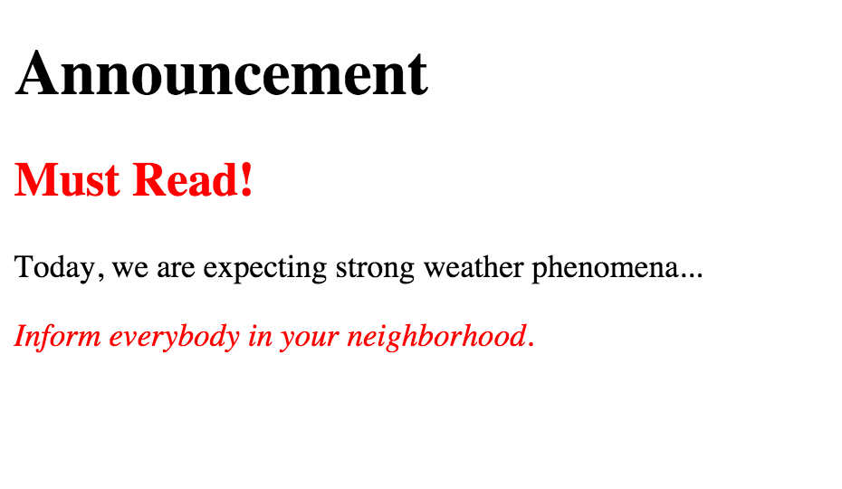

## More Advanced CSS Selectors

We have learned in the previous chapters about how we can CSS select various elements of our HTML document:

* Using the HTML tag name to select one or more HTML elements with the particular tag name. For example:
``` css
p {
    font-size: 16px;
}
```
which selects all `p`aragraphs in our HTML page and applies the same font size.
* Using the HTML tag name to select one or more HTML elements with different tag names in order to apply
same rules. For example:
``` css
p, h3 {
    font-size: 16px;
}
```
which selects all `p`s and `h3`s HTML elements and applies the same font size.
* Using containing-contained relationship to be more specific about which elements to select. For example:
``` css
li {
    font-size: 16px;
}
ul li {
    color: blue;
}
ol li {
    color: green;
}
```
which may be selecting the font size 16px for all the `li` elements, but make sure that `li`s that are contained
inside `ul` have text color blue, whereas `li`s that are contained inside `ol` have text color green

### `id` attribute

In HTML documents I can use a special attribute which has the name `id`. It is special because when used, it should have a 
unique value through out the whole HTML elements in your document. In other words, no 2 or more elements in your document
should have the same `id` value.

Here is an HTML extract of a `p` element that has an `id` attribute:

``` html
<p id="main-paragraph">
  Lorem ipsum...
</p>
```

The `id` has the value `main-paragraph`. Pretty straightforward. 
  
> *Note:* The values of the id should be following a specific style:
> * Lower case letters
> * If multiple words, then we separate the one word from the other using the dash `-` character. Occasionally, you may see 
the character underscore `_` to be used, but my suggestion here is that you get used to the dash `-` character.
 
> **Important:** You should be very good with your HTML and CSS code styling. It is important to make your code easy to read and 
maintainable. We are suggesting that you start reading, little-by-little, the document: [Google HTML and CSS Style Guide](https://google.github.io/styleguide/htmlcssguide.xml).
> * If you want to read about why styling matters, you can read this: [Why Coding Style Matters](http://www.smashingmagazine.com/2012/10/why-coding-style-matters/).

Here is an HTML extract that has 2 `p` elements with different ids.
``` html
<p id="introduction">
  We are going to talk about....
</p>
<p id="main-subject-text">
  The number of people...
</p>
```

The **very important** point that you need to understand here is that you should not reuse the same `id` inside the same HTML document. So, this is not allowed:
``` html
<p id="a-paragraph">
  We are going to talk about....
</p>
<p id="a-paragraph">
  The number of people...
</p>
```
When saying *it is not allowed*, this does not mean that your browser will not display the HTML page. But a lot of tools, like CSS and JavaScript, rely on the fact
that `id`s are unique and if they are not, you will not have the expected results. Your document might not be styled correctly. Your JavaScript code might not be 
functioning as expected.

### CSS Selecting elements by id

Having learned about `id`s, we can now say that you can use them to select elements in your CSS rules.

Assuming that we have the following HTML document (create it and save it with the name `index.html`):
``` html
<!DOCTYPE html>
<html>
  <head>
    <meta charset="utf-8">
    <title>2 paragraphs styled</title>
  </head>
  <body>

    <p id="introduction">
      Lorem ipsum dolor sit amet, consectetur adipiscing elit, sed do eiusmod tempor incididunt ut labore et dolore
      magna aliqua. Ut enim ad minim veniam, quis nostrud exercitation ullamco laboris nisi ut aliquip ex ea commodo
      consequat.
    </p>

    <p id="main-text">
      Sed ut perspiciatis unde omnis iste natus error sit voluptatem accusantium doloremque laudantium, totam rem aperiam,
      eaque ipsa quae ab illo inventore veritatis et quasi architecto beatae vitae dicta sunt explicabo. Nemo enim ipsam 
      voluptatem quia voluptas sit aspernatur aut odit aut fugit, sed quia consequuntur magni dolores eos qui ratione voluptatem 
      sequi nesciunt. Neque porro quisquam est, qui dolorem ipsum quia dolor sit amet, consectetur, adipisci velit, sed quia non 
      numquam eius modi tempora incidunt ut labore et dolore magnam aliquam quaerat voluptatem. Ut enim ad minima veniam, 
      quis nostrum exercitationem ullam corporis suscipit laboriosam, nisi ut aliquid ex ea commodi consequatur? Quis autem 
      vel eum iure reprehenderit qui in ea voluptate velit esse quam nihil molestiae consequatur, vel illum qui dolorem eum 
      fugiat quo voluptas nulla pariatur?
    </p>
  </body>
</html>
```

we can now apply the following CSS rules in order to style the paragraphs differently:

(Save these rules inside a file with name `main.css`. And reference the file from within the `index.html`)

``` css
#introduction {
  font-size: 24px;
}

#main-text {
  font-size: 16px;
}
```

The `#` symbol together with the actual `id` value that we want to target, is used to CSS select HTML elements by their
id. 

The result of applying the above rules to our HTML document will be the following:



### The `class` attribute

Another tool in our tool belt when CSS selecting, is the `class` attribute. We assign this attribute to our elements and then we 
can select elements in our CSS rules by using the name of class preceded by the `.` symbol. A class name can be reused in many
HTML elements, and, in fact, that's its real power. Because we can set a particular class to many different elements and 
change their style all at once by specifying CSS rules for the particular class. 

Here is an example of using classes inside our HTML document:

**Note:** Make sure that you create the css file that is referenced inside the HTML document

``` html
<!DOCTYPE html>
<html>
  <head>
    <meta charset="utf-8">
    <title>Table styled with classes</title>
    <link rel="stylesheet" href="stylesheets/table-with-classes.css" type="text/css">
  </head>

  <body>
     <table>
        <tr>
          <th>Name</th>
          <th>Email</th>
          <th>Phone</th>
          <th>Address</th>
        </tr>

        <tr class="odd">
          <td>Maud Adams</td>
          <td>m.adams@mailinator.com</td>
          <td>(541) 754-3010</td>
          <td>795 E DRAGRAM, TUCSON AZ 85705</td>
        </tr>

       <tr class="even">
         <td>Angelica Angurbash</td>
         <td>a.angurbash@mailinator.com</td>
         <td>202-555-0195</td>
         <td>1731 Bunker Hill Road Northeast </td>
       </tr>

       <tr class="odd">
         <td>Theoni_V._Aldredge</td>
         <td>theoni.aldredge@mailinator.com</td>
         <td>207-555-0145</td>
         <td>1900 Silver Cross Boulevard </td>
       </tr>

       <tr class="even">
         <td>Kathleen_Lockhart</td>
         <td>kathleen.lockhart@mailinator.com</td>
         <td>207-555-0155</td>
         <td>7105 Bailey Creek Circle Southeast </td>
       </tr>

       <tr class="odd">
         <td>Alice_Guy-Blach</td>
         <td>alice.guy-blach@mailinator.com</td>
         <td>202-555-0127</td>
         <td>3301 New Mexico Avenue Northwest #236 </td>
       </tr>
     </table>
  </body>
</html>
```

The CSS file that can be used to style the document should contain the following content:

``` css
th {
    background-color: maroon;
    color: white;
    font-size: 16px;
}

.odd {
    background-color: lightblue;
    color: black;
}  
```

And the final result will be:



What did you actually do? 

1. We flagged the odd rows of the table with the class `odd` and the even rows of the table with the class `even`.

  
2. We then decided to style the odd rows with a particular background color and text color, with the rule:

  ``` css
  .odd {
      background-color: lightblue;
      color: black;
  }
  ```

### Combining class selection with tag name selection

Sometimes there are cases that you can be more specific in your CSS selection with the help of both the class and the tag name.

Let's see an example:

Suppose that we have the following HTML document:

``` html
<!DOCTYPE html>
<html>
  <head>
    <meta charset="utf-8">
    <title>Class and Tag Name Selection Together</title>
    <link rel="stylesheet" href="stylesheets/class-and-tag-name.css" type="text/css">
  </head>

  <body>

    <h1>Announcement</h1>

    <h2 class="text-danger">Must Read!</h2>

    <p>
      Today, we are expecting strong weather phenomena...
    </p>

    <p class="text-danger">
      Inform everybody in your neighborhood.
    </p>

  </body>
</html>
```
As you can see above, we are using the class `text-danger`. We want to make sure that the elements that have this
class have text color red. In order to do that, we have the following class rule inside the accompanying CSS file:

``` css
.text-danger {
    color: red;
}
```
But, on top of that, we want to be more specific for the last paragraph. We want this paragraph to have italic font style.
If we just do:
``` css
p {
  font-style: italic;
}
```
this will affect also the first paragraph. We have to be more specific. If we just use the following rule:
``` css
.text-danger {
    font-style: italic;
}
```
then again, we are going to affect the `h2` header too.
In order to specify the last paragraph we can use the following rule:
``` css
p.text-danger {
    font-style: italic;
}
```
As you can see, we are saying "the paragraph `p` that has the class `.text-danger`", by concatenating the class selector
next to the tag name selector.

The final page should look like this:



### Multiple classes on same element

Another property of the class attribute is that can have multiple values. Hence, the HTML element can have multiple classes. The class values
are separated by blank spaces. For example:

``` html
<p class="text-danger small">
  Yesterday, we visited the Natural History Museum....
</p>
```
  
In the above example, the paragraph has 2 classes: `text-danger` and `small`. This means that it inherits, automatically, the CSS rules that 
apply to both classes.
  
Let's see an example of that. Suppose that we have the following HTML document:
``` html
<!DOCTYPE html>
<html>
  <head>
    <meta charset="utf-8">
    <title>Two Classes on Same Element</title>
    <link rel="stylesheet" href="stylesheets/two-classes-on-same-element.css" type="text/css">
  </head>

  <body>

    <h1>Announcement</h1>

    <p class="text-danger">
      We are expecting...
    </p>

    <p class="text-danger small">
      Inform your neighbours.
    </p>

  </body>
</html>
```
As you can see, we are using 2 classes here. The `text-danger` and the `small`. Whereas the first paragraph has the class `text-danger` only, the
second one has both classes applied. We want the `text-danger` class to have text color red and we want the `small` class to have font size quite small, like 9px.

Let's see how the CSS file should look like:
``` css
.text-danger {
    color: red;
}

.small {
    font-size: 9px;
}
```
Pretty simple according to what we have learned so far. The `text-danger` class elements are ruled to have the color property equal to red. The `small` class elements
are ruled to have the font-size property equal to 9px. If one applies both classes to an element, then all properties apply together.

The final result of applying this to our HTML page will be:


Finally, we will close this chapter by saying that when some elements have multiple classes applied, then we can specify CSS rules that require both classes to be
present. For example, if we enhance the previous CSS rules by adding this:

``` css
.text-danger.small {
    font-weight: bold;
}
```
then we are essentially say that all the HTML elements that have both `.text-danger` and `.small` classes, should be printed bold. Take the following example:
``` html
<!DOCTYPE html>
<html>
  <head>
    <meta charset="utf-8">
    <title>Two Classes on Same Element 2</title>
    <link rel="stylesheet" href="stylesheets/two-classes-on-same-element.css" type="text/css">
  </head>

  <body>

    <h1>Announcement</h1>

    <p class="text-danger">
      We are expecting...
    </p>

    <p class="text-danger small">
      Inform your neighbours.
    </p>

    <p class="small">
      Lore ipsum...
    </p>

  </body>
</html>
```
With the `stylesheets/two-classes-on-same-element.css` file holding the rules:
``` css
.text-danger {
    color: red;
}

.small {
    font-size: 9px;
}

.text-danger.small {
    font-weight: bold;
}
```

the result will be this:


As you can see, only the paragraph that has both `text-danger` and `small` classes is printed with bold font.
 
