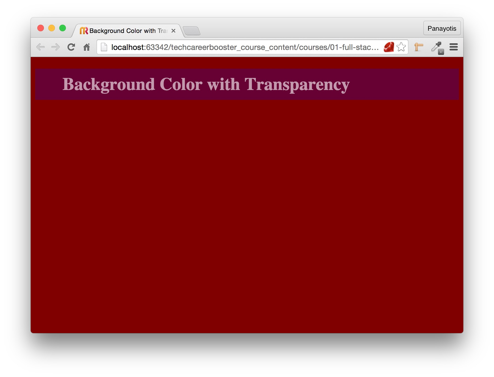

## Let's Talk about Color

Using colors is a must when you design a Web page. If you do not use colors, the browser uses black color for text and white for background.
Very boring page colors of course and if we want to have live, nice-looking cool pages, we need to start using colors.

There are many CSS style properties that use colors and you can definitely set the color for anything that can be visually displayed as part of
the content of your Web page.

### Text Color and Background Color

The two most important color properties are:

1. `color` which specifies the color of text.
2. `background-color` which specifies the color of the background.

``` html
<!DOCTYPE html>
<html>
  <head>
    <meta charset="utf-8">
    <title>Invoice Template</title>
    <link rel="stylesheet" href="stylesheets/basic-color-attributes.css" type="text/css">
  </head>

  <body>
    <p>
      Introduction to Computer Programming is a series of video lectures....
    </p>
  </body>

</html>
```

If you see the above example, the css of which is:

``` css
p {
    padding-top: 10px;
    padding-bottom: 10px;
    padding-left: 10px;
    padding-right: 10px;
 
    color: white;
    background-color: darkblue;
 
    font-size: 20px;
}
```

you will see that you have chosen as background color `darkblue` and foreground color `white`.

The visual result should be something like this:

> **Important** Always try the code that the chapter is using in order to explain to you the concepts.
This is the only way you will learn programming. Just reading is not enough. Also, you need to stop copying/pasting the
code to your editor. You **HAVE** to type everything from the beginning. Copying/pasting will not differ from just reading
the code. You need to type the code text yourself. Do mistakes and correct them. Otherwise, you will never become
a good developer.


### Specifying the color value

We have already seen example on how we can specify the color value. We have used some standard names like `red`, `blue` and `white`.

There are various ways one can specify the color value.

#### By name

You can use names like the following:

* `blue`
* `blueviolet`
* `cadetblue`
* `darkred`
* `red`
* `yellow`
e.t.c.

There are 140 color names supported by all browsers. The following Web Page lists all of them:

[List of Colors Supported by All Browsers](https://s3.amazonaws.com/tech-career-booster-courses/01-full-stack-web-developer/sections/01-html-and-css/chapters/14-talk-about-color/colors-supported-by-all-browsers.html)

#### By Color Value

Colors can be set using the combination of RED, GREEN and BLUE colors.

One can use the hexadecimal value of a color. The hexadecimal has 3 parts. The first part refers to red value. 
The second part refers to green value and the third part refers to blue value. We also prefix the value with the `#` symbol.

All 3 parts should have a value in the range 00..#FF.

Take for example the value:

`#000000`

This has `00` for red, `00` for green and `00` for blue. In other words, we have absolute absence of all three
color components. Which color is that?

It is the black color:

<table>
  <tr><td>#000000</td><td style="background-color:#000000;">&nbsp;</td></tr>
</table>

Let's try this number here:

`#FF0000`

This has the value `FF` for red, `00` for green and `00` for blue. This means that we have the maximum value for red, but the absence of
the other 2 color components. What color will that be?

It will be red:

<table>
  <tr><td>#FF0000</td><td style="background-color: #FF0000">&nbsp;</td></tr>
</table>

With this technique we have 16M different colors. Huge number of colors that we can create and use in our web pages. Let's try that in a real
web page. Here is the code of our HTML page again:
``` html
<!DOCTYPE html>
<html>
  <head>
    <meta charset="utf-8">
    <title>Invoice Template</title>
    <link rel="stylesheet" href="stylesheets/basic-color-attributes.css" type="text/css">
  </head>

  <body>
    <p>
      Introduction to Computer Programming is a series of video lectures....
    </p>
  </body>

</html>
```
We change the content of the `stylesheets/basic-color-attributes.css` as follows:
``` css
p {
    padding-top: 10px;
    padding-bottom: 10px;
    padding-left: 10px;
    padding-right: 10px;

    color: #7CFC00;
    background-color: #4682B4;

    font-size: 20px;
}
```
The visual result will be this:


Please, note that you can use the notation `rgb(<dec red>,<dec green>,<dec blue>)` instead of using the `#<hex red><hex green><hex blue>`.
The `rgb` notation uses the integer numbers 0 up to 255 for the components. With 0 meaning absence and 255 full presence.

Here is an HTML fragment that sets the background of two cells to the same color, but using different technique:
``` html
<table>
  <tr><td>#8C5F1E</td><td style="background-color: #8C5F1E;"></td></tr>
  <tr><td>rgb(140,95,30)</td><td style="background-color: rgb(140,95,30);"></td></tr>
</table>
```
with the final visual result to be:
<table>
  <tr><td>#8C5F1E</td><td style="background-color: #8C5F1E;"></td></tr>
  <tr><td>rgb(140,95,30)</td><td style="background-color: rgb(140,95,30);"></td></tr>
</table>

> *Note:* There are a lot of resources on the Internet that can give you HTML color names
and their mapping to HEX values.
> * [Convert Names to HEX](http://www.color-hex.com/color-names.html)
> 
> Also you can find HEX to decimal converters [like this](http://www.binaryhexconverter.com/hex-to-decimal-converter).

Did you know that you can create a different level of gray shade by giving the same value to
each one of red, green and blue components? See the following HTML fragment which shades 5 
table cells with different shades of gray. 

<table>
  <tr><td>rgb( 5,    5,   5)</td><td style="background-color: rgb(  5,  5,  5);">&nbsp;</td></tr>
  <tr><td>rgb( 15,  15,  15)</td><td style="background-color: rgb( 15, 15, 15);">&nbsp;</td></tr>
  <tr><td>rgb( 55,  55,  55)</td><td style="background-color: rgb( 55, 55, 55);">&nbsp;</td></tr>
  <tr><td>rgb(105, 105, 105)</td><td style="background-color: rgb(105,105,105);">&nbsp;</td></tr>
  <tr><td>rgb(205, 205, 205)</td><td style="background-color: rgb(205,205,205);">&nbsp;</td></tr>
</table>

### RGB Color With Transparency

There are times that you want to specify a color alongside a transparency. This means that the color applied
allows part of the background color to go through it.

For this purpose we are using the function `rgba(<dec red part>, <dec green part>, <dec blue part>, <opacity>)`.

For example, the color `rgba(0, 0, 0, 0.5)` is a black color that is 50% transparent (or 50% opaque). Or, the
value `rgba(255, 255, 255, 0.1)` is a white color that is 90% transparent (or 10% opaque).

Try the following HTML page:

``` html
<!DOCTYPE html>
<html>
  <head>
    <meta charset="utf-8">
    <title>Background Color with Transparency</title>
    <link rel="stylesheet" href="stylesheets/main.css" type="text/css">
  </head>

  <body>
    <h1>Background Color with Transparency</h1>
  </body>
</html>
```
with the following CSS file (in `stylesheets/main.css`):
``` css
body {
    background-color: maroon;
}

h1 {
    background-color: rgba(0, 0, 255, 0.2);
    padding: 10px 50px;
    color: rgba(255, 255, 255, 0.6);
}
```
Save those files and load the page in your browser. You will see the following page:



As you can see here, both the background color and the color of the `h1` element are transparent, letting some of the background color of the body being visible to the user eye.

Play with the opaque value. Set it to 1.0. Set it to 0.1. Set it to 0.0. Inpsect how the various values affect the final result.


