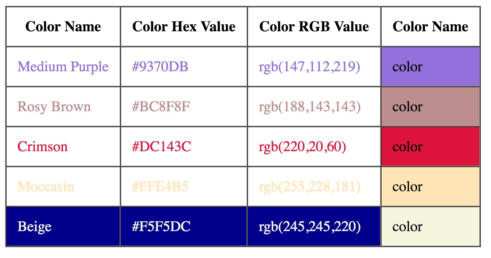

In this chapter we start talking about color. Color is fundamental element in order to make our HTML pages looking nice.
We will be able to define color in various formats and build pages like this:

