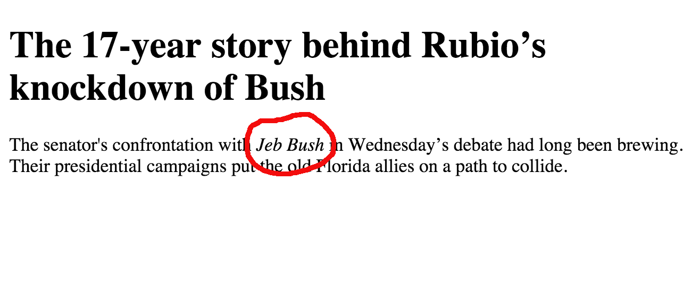
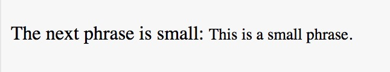
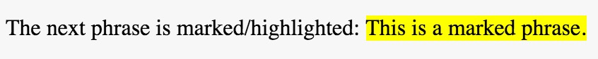
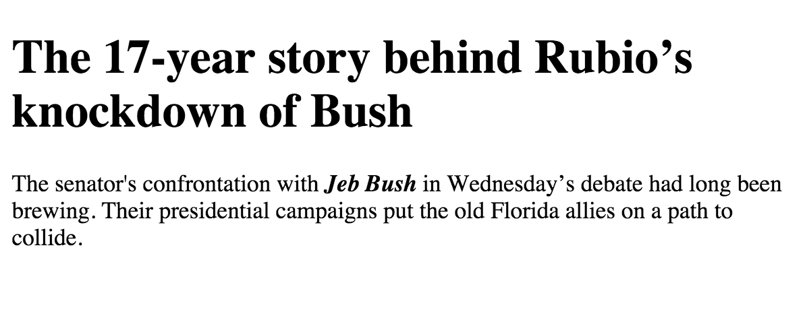

## Formatting parts of text

We have learned how we can apply basic style to our HTML elements. But how do we style parts of text that
is not contained in any particular HTML element?

For example, how can we create the following effect?

As you can see in this image, part of the text, the name `Jeb Bush`, is styled with italic font. We haven't learned so far, any way we can do that.

But of course, there is one, and not only one, as always.

### `span` tag

One way we can do that is by including the part of the text that we want to style inside a `<span>` tag. Then, we can style the
`<span>` element in any way we like, using standard CSS rules.

Hence, the above result can be achieved with the following combination of HTML and CSS code:

The HTML first:
``` html
<!DOCTYPE html>
<html>
  <head>
    <meta charset="utf-8">
    <title>Span Element</title>
    <link rel="stylesheet" href="stylesheets/main.css" type="text/css">
  </head>

  <body>
    <h1>The 17-year story behind Rubio’s knockdown of Bush</h1>

    <p>
      The senator's confrontation with <span class="italic">Jeb Bush</span> in Wednesday’s debate had long been brewing. Their presidential campaigns put the old Florida allies on a path to collide.
    </p>

  </body>
</html>
```
And the CSS next:
``` css
.italic {
    font-style: italic;
}
```
As you can see from the HTML code, we have included the name `Jeb Bush` inside a `span` tag. And then we styled the `span` element using the class `italic`.

So, `<span>` elements are very useful, because they do not change the structure of the document, but they can certainly be used to style parts of the document
that cannot be, otherwise, selected.

### HTML formatting tags

Another way you can accomplish the same effect, is to use the HTML tag `<i>` (from italic) or the HTML tag `<em>` (from emphasize).

#### `<i>` and `<em>`

They turn their content to <em>italic</em> style. However, the `<em>`,
gives also a semantic emphasized importance to the content that it encloses. This is usually taken into consideration by screen readers
that read aloud the content of the page to computer users that have disabilities related to their vision.

See the following HTML extract:

``` html
<p>
  The next word is <i>italic</i>. And the next word is <em>emphasized</em>.
</p>
```

which should be displayed as:

<p>
  The next word is <i>italic</i>. And the next word is <em>emphasized</em>.
</p>

So, this is the equivalent effect as if you had `style="font-style: italic;"`.

Let's see some other HTML formatting tags:

#### `<b>` and `<strong>`

They turn their content to bold. However, the `<strong>` tag gives also a semantic property of "strong" to its content
and might be pronounced differently by screen readers. See the following HTML extract:

``` html
<p>
  The next word is <b>bold</b>. And the next word is <strong>strong</strong>.
</p>
```

which should be displayed as:

<p>
  The next word is <b>bold</b>. And the next word is <strong>strong</strong>.
</p>

So, this is the equivalent effect as if you had `style="font-weight: bold;"`.

#### `<small>`

It turns its content to small font size.

See the following HTML extract:

``` html
<p>
  The next phrase is small: <small>This is a small phrase.</small>
</p>
```

which should be displayed as:



This is equivalent to setting a smaller size value to the `font-size` property.

#### `<mark>`

It highlights its content with yellow background color. As if the reader has used a highlighter to mark part of the text.

See the following HTML extract:

``` html
<p>
  The next phrase is marked/highlighted: <mark>This is a marked phrase.</mark>
</p>
```

which should be displayed as:



This is a equivalent to setting the `background-color` property.

#### `<del>`

It makes the text look as if somebody has deleted it.

See the following HTML extract:

``` html
<p>
  The next phrase is deleted: <del>This is a deleted phrase.</del>
</p>
```

which should be displayed as:

<p>
  The next phrase is deleted: <del>This is a deleted phrase.</del>
</p>

This is a equivalent to setting the `text-decoration` property with value `line-through`.

#### `<sub>`

It makes the text printed below the base line of the main text. See for example this:

H<sub>2</sub>O

Do you see how the number 2 has been printed? In order to produce the above result, you have to enclose the number 2 into
a `<sub>` element (from subscript). Here is the HTML extract that does this:

``` html
H<sub>2</sub>O
```

> **Important:** This is a tag which does not have an equivalent approach in CSS. And this is correct, because this
tag has nothing to do with the styling of your text/document. So, don't look for CSS equivalents.

#### `<sup>`

Similar to `<sub>`, you can print part of your text elevated above the baseline. This is a superscript and can be
achieved with the `<sup>` tag. For example, see the following:

January 1<sup>st</sup>

In order to do that you need to write the following HTML code:

``` html
January 1<sup>st</sup>
```

Again, do not look for CSS alternatives. `<sup>` has nothing to do with styling.

#### Applying multiple formatting

There are times that we want to apply more than one HTML tag formatting. Can we do that?

For example: Can I have part of the text being marked and small at the same time? Like this?

<p>
    Next phrase is both marked and small: <mark><small>Phrase marked and small</small></mark>
</p>

Easy! You only have to include it in both `<mark>` and `<small>` tags. Nesting one tag inside the other.
Like a Russian dol. Make sure that tags close in the reverse order they have been opened.

``` html
<p>
    Next phrase is both marked and small: <mark><small>Phrase marked and small</small></mark>
</p>
```

### Closing note

If you can do things with CSS styling and outside the HTML document, then prefer this method.
On the other hand, it will not harm anybody to use, for example, semantic HTML tags like `<em>`
in order to emphasize the content of your document. Nevertheless, you can always apply rules to
change the style of the formatting tags themselves. See for example the following page:



This has been created with the following HTML code:

``` html
<!DOCTYPE html>
<html>
  <head>
    <meta charset="utf-8">
    <title>Change the em tag style</title>
    <link rel="stylesheet" href="stylesheets/change_em_style.css" type="text/css">
  </head>

  <body>
    <h1>The 17-year story behind Rubio's knockdown of Bush</h1>

    <p>
      The senator's confrontation with <em>Jeb Bush</em> in Wednesday's debate had long been brewing.
      Their presidential campaigns put the old Florida allies on a path to collide.
    </p>
  </body>

</html>
```

and the following CSS code:


``` css
em {
    font-weight: bold;
    font-style: italic;
}
```


