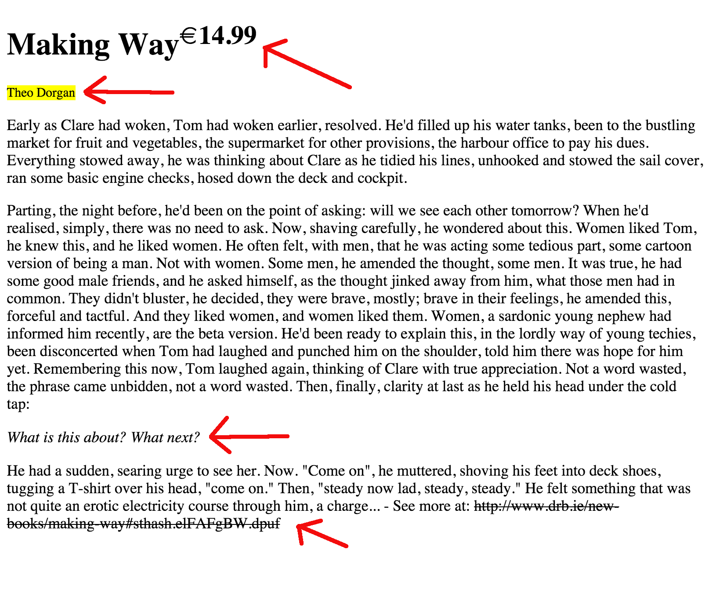

(1) Create the following HTML page (for your convenience, parts of the text are given below, just copy / paste them in your editor):


``` text
Making Way 14.99

Theo Dorgan

Early as Clare had woken, Tom had woken earlier, resolved. He'd filled up his water tanks, been to the bustling market for fruit and vegetables,
the supermarket for other provisions, the harbour office to pay his dues. Everything stowed away, he was thinking about Clare as he tidied his lines,
unhooked and stowed the sail cover, ran some basic engine checks, hosed down the deck and cockpit.

Parting, the night before, he'd been on the point of asking: will we see each other tomorrow? When he'd realised, simply, there was no need to ask.
Now, shaving carefully, he wondered about this. Women liked Tom, he knew this, and he liked women. He often felt, with men, that he was acting some
tedious part, some cartoon version of being a man. Not with women. Some men, he amended the thought, some men. It was true, he had some good male friends,
and he asked himself, as the thought jinked away from him, what those men had in common. They didn't bluster, he decided, they were brave, mostly;
brave in their feel­ings, he amended this, forceful and tactful. And they liked women, and women liked them. Women, a sardonic young nephew had
informed him recently, are the beta version. He'd been ready to explain this, in the lordly way of young techies, been disconcerted when Tom had
laughed and punched him on the shoulder, told him there was hope for him yet. Remembering this now, Tom laughed again, thinking of Clare with true
appreciation. Not a word wasted, the phrase came unbidden, not a word wasted. Then, finally, clarity at last as he held his head under the cold tap:

What is this about? What next?

He had a sudden, searing urge to see her. Now. "Come on", he mut­tered, shoving his feet into deck shoes, tugging a T-shirt over his head,
"come on." Then, "steady now lad, steady, steady." He felt something that was not quite an erotic electricity course through him, a charge...
- See more at: http://www.drb.ie/new-books/making-way#sthash.elFAFgBW.dpuf
```

(2) Watch out the following points:



(3) Use **only** HTML formatting tags. Do not use CSS styling.
