## CSS Box Model

Before we proceed in more advanced techniques in authoring our HTML page, it is very important to understand the
CSS Box Model. This is how browser models how an area in your HTML page is being drawn.

Let's start with an empty page. We will build on that while we will be learning various concepts in the CSS box model area.

``` html
<!DOCTYPE html>
<html>
  <head>
    <meta charset="utf-8">
    <title>CSS Box Model</title>
    <link rel="stylesheet" href="stylesheets/index.css">
  </head>

  <body>


  </body>

</html>
```

### Boundaries of Body

Our HTML page has a `<body>`. Let's see what are its boundaries. Add the following to your CSS file:

``` css
body {
    background-color: antiquewhite;
    border: 1px solid black;
}
```

Save all files and reload your page. You should see this one below:
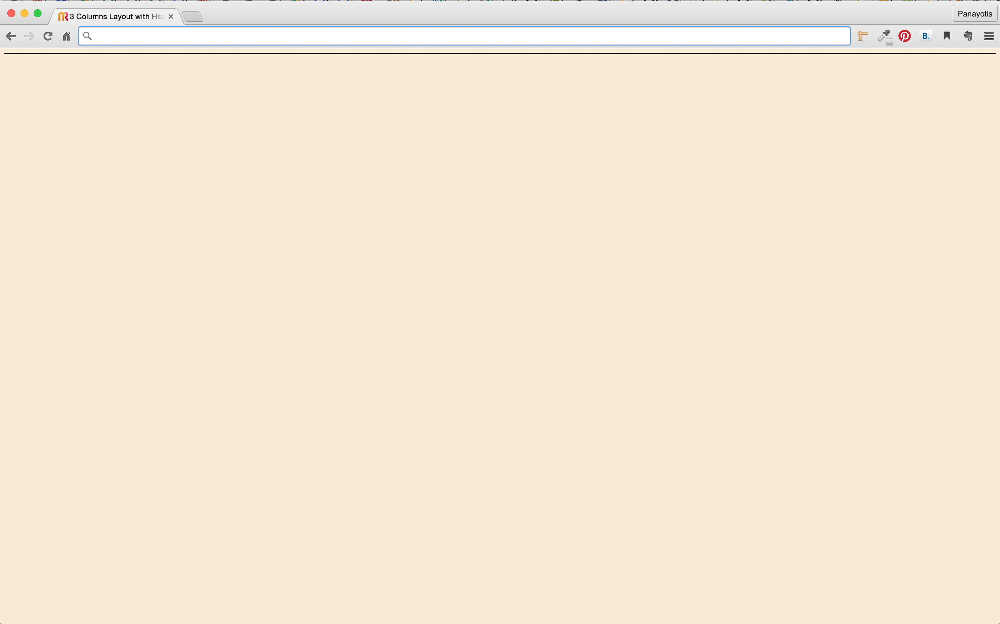
As you can see above, there is a problem with the border. One might expected a border around the edges of the
browser window. But this is not the case. The border surrounds the body according to its height. And the height of the body is 0, because it does not have any content.
Since we don't have any content inside our body element, the box that is supposed to be around it, collapses into a single line.

> **Note:** Since the height of the body is 0, why does the background color of the body expand to the whole viewport?
See at the end of the chapter about this.

Let's prove that if we add some content to the body, then border will not be collapsing to one line. We will add some content inside the body and we will refresh our page.

### Visible Border Box

``` html
<!DOCTYPE html>
<html>
  <head>
    <meta charset="utf-8">
    <title>CSS Box Model</title>
    <link rel="stylesheet" href="stylesheets/index.css">
  </head>

  <body>

    Hello World!

  </body>

</html>
```

What we see is the following:

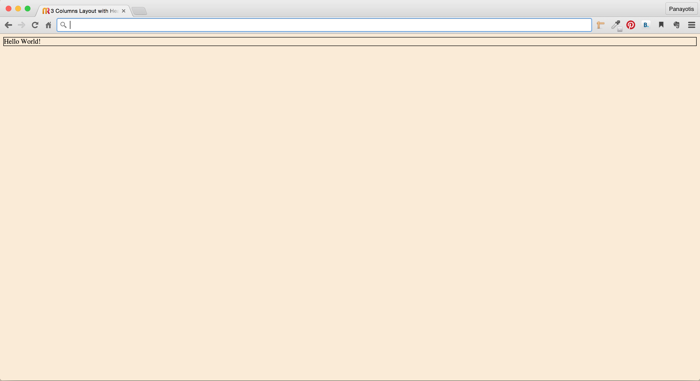

Now things are getting better. We can clearly see the border around the content of the `<body>` element.

### Padding Area

Padding is the blank area that is between the content and the border of an element. So, in our particular example is the blank area around the "Hello World!"
and the borders. One way we can understand where the padding is, is that we can change its size and refresh our page.

Let's do that. In our CSS file make sure the body selector has the following rules:
``` css
body {
    background-color: antiquewhite;
    border: 1px solid black;

    padding-top: 30px;
}
```
The new style property here is the `padding-top`. As its name implies, it controls the size of the top side of the padding. Whatever it is above the content of the element up
and until the border starts.

If you refresh your page you will see the following:


As you can see the top padding has been increased by 30px.

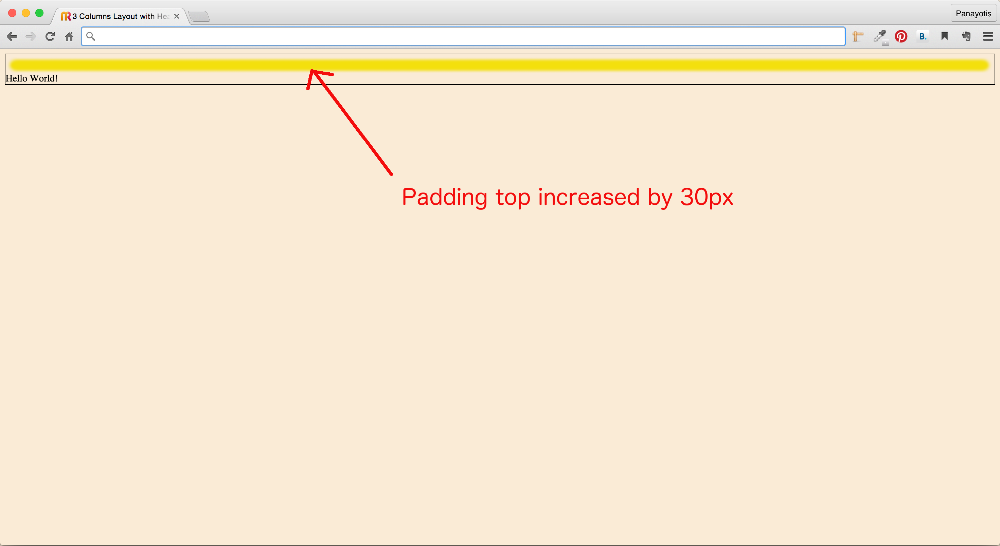

Note that you can separately control the padding on other sides: `padding-left`, `padding-bottom`, `padding-right`. Also, you can always use the `padding` property which
can control all the sides:

1. `padding: 10px;`, when we specify 1 value, then all sides are going to have the same padding.
2. `padding: 10px 20px;`, when we specify 2 values, then first size refers to top and bottom margins and second size refers to right and left margins.
3. `padding: 10px 20px 30px;`, when we specify 3 values, then first goes to top, second to right and left and third size goes to bottom.
4. `padding: 10px 20px 30px 40px;`, when we specify 4 values, then first goes to top, second goes to right, third goes to bottom and last goes to left (like going around
in a clockwise direction)

### Margin Area

Besides the content, padding and border you might have noticed that there is a blank area outside the border, around the box, reaching the edges of the window.
This is the margin. In fact, the margin, by default has the same size on all sides. So, even if you see a lot of blank space below the bottom border, it is only a small
number of pixels that are part of the bottom margin.

In fact, by default, the `body` element has 8pixels size on all sides of the element.

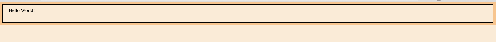

In order for you to visualize the margin, I have highlighted that in the above picture. Is that clear?

Again, margin is the area that surrounds the border of the element.

### CSS Box Model again

As far as the area that an element occupies, we have learned about (inside out):

* content
* padding, which surrounds content
* border, which surrounds padding
* margin, which surrounds border

Let's change our CSS to be as follows:

``` css
body {
    background-color: antiquewhite;

    border: 10px solid black;

    padding: 10px 20px 30px 40px;

    margin: 40px 30px 20px 10px;
}
```
and reload our page. It will look like this:

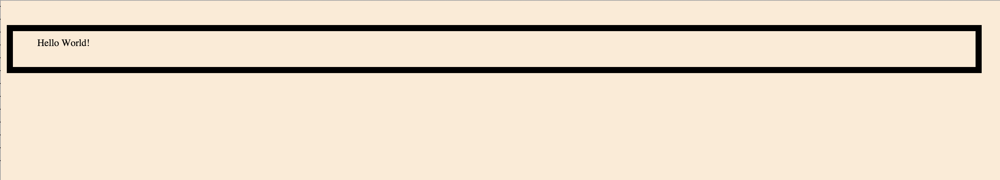

Can you identify the various areas?

This is what you should be having in your mind for this particular HTML page:

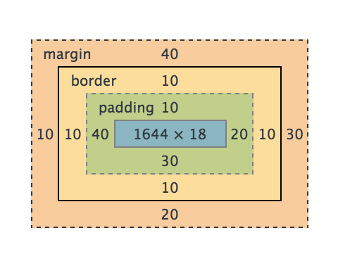

What's in the middle is the width and height, which is dynamically calculated and would probably be different on your end. It depends on the
size of you browser window. But the rest of the metrics should be the same.

And this is another view:

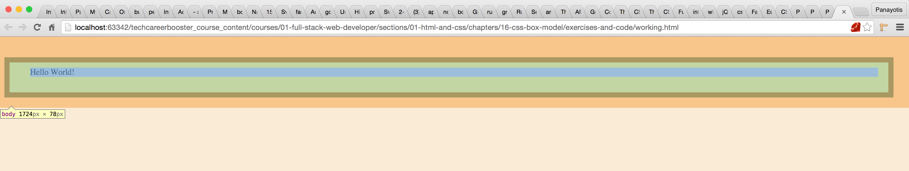

From inside out

* the light blue area is the content area,
* the light green area is the padding area (see how the different padding sides have their own size according to our CSS rule)
* the dark brown area is the border, which has equal size on all sides
* the orange external area is the margin (see how the side sizes differ according to our CSS rule)

### Use Chrome ./images/Developer Tools

This is a good point that we start learning about Google ./images/Developer Tools. When you have a page loaded on Chrome and

* you click on <kbd>cmd+alt+I</kbd> combination of keys if you are on Mac, OR
* you click on <kbd>F12</kbd> if you are on Windows or Linux OR
* pick up an element on the page, right click on that and select, from the menu, "Inspect Element"

you will start the Chrome developer tools.

This is a very useful tool. We will start using it in order to inspect the actual CSS Box Model of various elements on our page.

As you can see here...

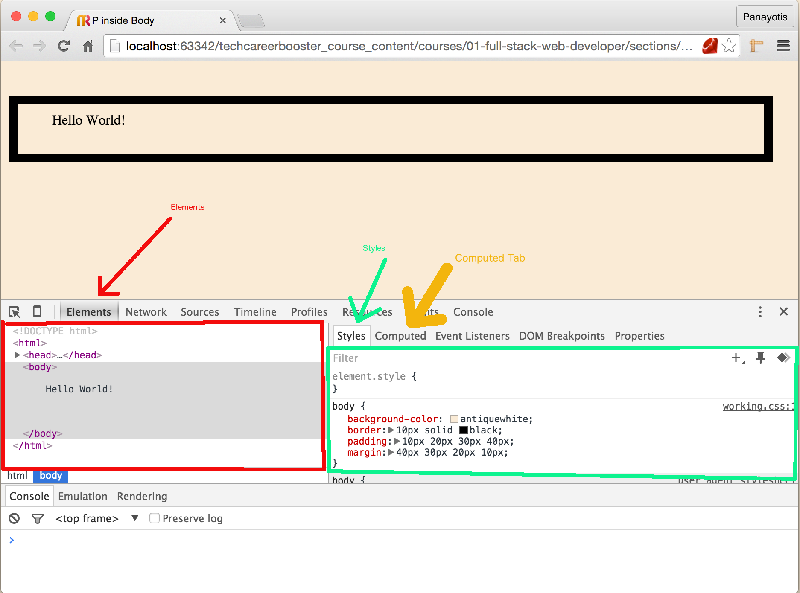

...in the left area of the developer tools I can see the HTML elements of my page. I can click to select specific elements.
On the screenshot, you can see the `<body>` element selected. Further on, on the right, there is an area where I can see the styles of the
selected elements. Hence, on this particular screenshot above, you can see the styles of the `<body>` element.
Also, there is the "Computed" tab that I am suggesting you to click in order to see the values of all the CSS properties of the selected element,
alongside its CSS Box Model.

Here is what the computed tab would look like for our case.

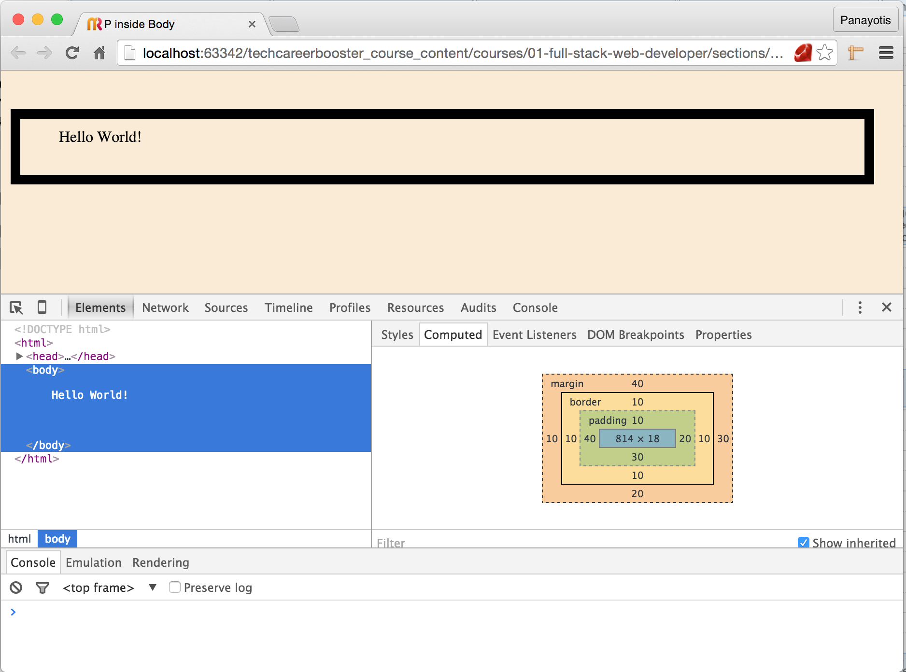

Also, when you keep your mouse on top of an HTML element, in the "Elements" area, then Chrome highlights the box model on the HTML page itself.
See, how I am putting my mouse over the `<body>` element and how Chrome highlights the box model inside the HTML page:

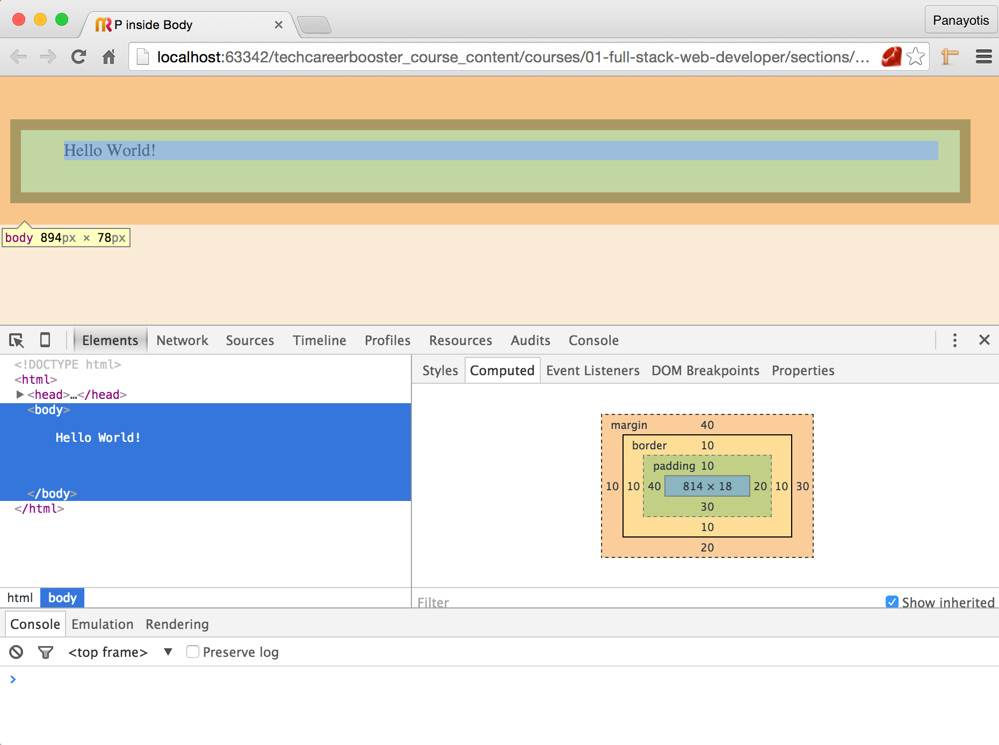

./images/Developer Tools is a fantastic tool and absolutely necessary for you to harness. It will be one of your first assistants in your Web developer career. So,
spend some time to get acquainted with.

In the following notes of this chapter, as well as in the following chapters we will make heavy use of it.

> *Note:* Firefox and Safari also have developer tools, similar to Chrome.

### Width and Box Sizing

As you saw in our previous examples, the width of the `body` is automatically calculated. But we can still set the width to a specific size. Let's try that.
Change the CSS rules as follows:
``` css
body {
    background-color: antiquewhite;

    border: 10px solid black;

    padding: 10px 20px 30px 40px;

    margin: 40px 30px 20px 10px;

    width: 400px;
}
```
If you reload your page, the result will be something like this:

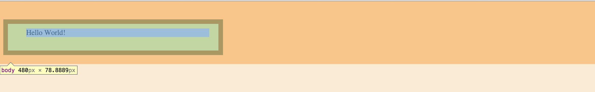

I have highlighted the box areas, using developer tools, for better understanding.

And another view of this is the following:

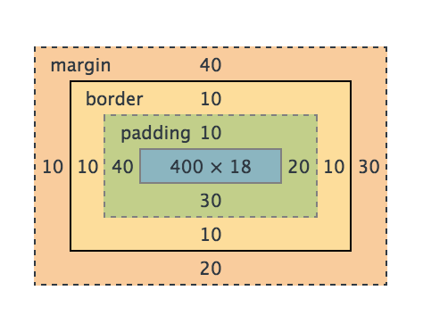

There is a small but critical difference between these two views. The first one says that the width of the `<body>` element is `480px`.

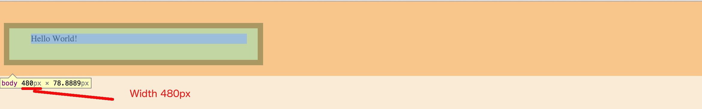

Whereas the second view mentions that the width is `400px` exactly as we have set it up.

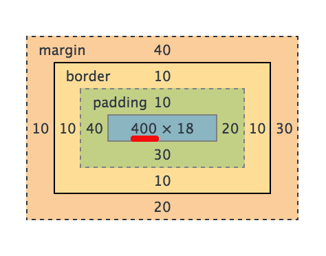

Where does this `480px` come from? And what does it represent? It represents the

<div style="text-align: center;">
  <strong>width content + padding-left size + padding-right size + border-left size + border-right size</strong>
</div>
<br/>
If you do the calculations for the example above, you will verify how this 480px is calculated.

> **Important** By default, when you set the width of an element, you specify the width of its content, excluding padding and border sizes.

Let's do something else to verify this rule. Let's change the `width` property from `400px` to `100%`. When we specify the width of an element
by percentage, we refer to the actual width of the parent/containing element. Hence, if we specify the width of the `body` to be `100%` we actually
say that we want the width to be equal to the width of the `html` (whole document) element. So, the new CSS rules are:

``` css
body {
    background-color: antiquewhite;

    border: 10px solid black;

    padding: 10px 20px 30px 40px;

    margin: 40px 30px 20px 10px;

    width: 100%;
}
```

If you reload your page again, you will see this:

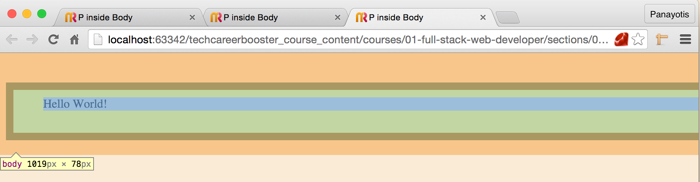

Hmmmm. Things are not good. Having `100%` value for the `width` of `body`, browser draws the content (Hello World!) and then reserves all the rest of the window width for this
content. Then browser draws the padding, border and margin, which, unfortunately are clipped and they are not displayed.

Generally, when the `width` refers to the content width rather than to the actual area that the element occupies, things and calculations become
tricky and we start feeling uncomfortable with.

There is one way we can overcome this and make sure that when we specify the `width` of an element, we actually refer to the whole area that it occupies. This
will make sure that the areas and elements will be put on the page in a much more intuitive way.

We need to specify the `box-sizing` property. The `box-sizing` tells the browser, how it should be interpreting the `width` and `height` properties. The default value
of this property is `content-box` and it is what we have experienced until now. The other value that will make things easier to deal with is the value `border-box` and
instructs the browser to interpret `width` and `height` taking into account both padding and border sizes.

Note that other properties that are affected by this are:

* `min-width` and
* `min-height`

> **Important:** In any case, the `margin` is not taken into account.

But still, with `border-box` setting on `box-sizing` property things are much easier. Let's see that:

Let's change our CSS to be as follows:

``` css
body {
    background-color: antiquewhite;

    border: 10px solid black;

    padding: 10px 20px 30px 40px;

    margin: 40px 30px 20px 10px;

    width: 100%;

    box-sizing: border-box;
}
```

We have added the `box-sizing: border-box;` property. Does that make the things work as expected? If you reload your page
you will see this:

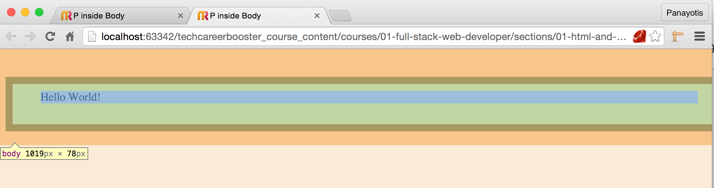

Hmmmm. Not what we really wanted. The problem is the left margin. If you have left margin different from 0 together with `box-sizing` set to `border-box` which does not
take into account the margin, then the result is not really what we would expect. Try to remove the left margin to see the difference:

``` css
body {
    background-color: antiquewhite;

    border: 10px solid black;

    padding: 10px 20px 30px 40px;

    margin: 40px 30px 20px 0;

    width: 100%;

    box-sizing: border-box;
}
```

> *Note:* When we specify a size to be 0, like the left margin here: `margin: 40px 30px 20px 0;` we do not specify the unit of measurement.

If you reload this page the result will be this:

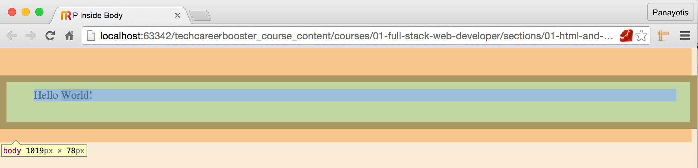

Things are much better but the right border extends beyond the right margin. Do you see that on the right of the browser window? This is not what we really expected.
Browser is a little bit confused. Again, the problem is the right margin that does not "play" well with the `box-sizing` property set to `border-box`. Let's remove right
margin too:

``` css
body {
    background-color: antiquewhite;

    border: 10px solid black;

    padding: 10px 20px 30px 40px;

    margin: 40px 0 20px 0;

    width: 100%;

    box-sizing: border-box;
}
```

If you reload your page you will see this:

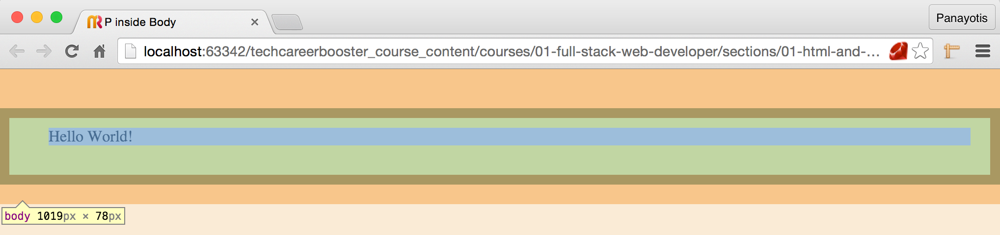

That's much better.

The same problems that we saw for the `width` property are applied to `height` property when we use `box-sizing` `border-box` and we have top and bottom margins.

Having said that, we change our CSS file to be:
``` css
body {
    background-color: antiquewhite;

    border: 10px solid black;

    padding: 10px 20px 30px 40px;

    margin: 0 0;

    width: 100%;

    box-sizing: border-box;
}
```

> *Remember* that default margin for body is 8px. That's why we have to 0 it.

If you reload your page, you should see something like this:

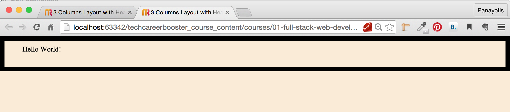

And an alternative view:

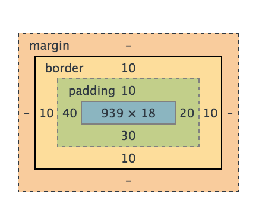

What if I really want to have margins around my border? How would I do that?

Then you have to set your margins and remove the width value requirement of 100% completely. It will be automatically calculated.

Let's do that:

``` css
body {
    background-color: antiquewhite;

    border: 10px solid black;

    padding: 10px 20px 30px 40px;

    margin: 10px 10px;

    box-sizing: border-box;
}
```

If you reload the page it will be like this:

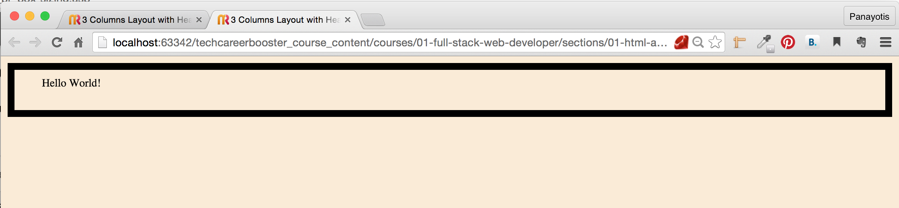

Very nice!

In summary, our recommendation is this:

1. Use `box-sizing: border-box;`. It will make things much more predictable when you set values for `width` and `height`.
2. If you want to use margins, then you should not set the corresponding size properties.

### Line Height

There is a CSS property which is called `line-height` and we will now spend some time on that. In order to do that we will work with some text and see how the
line height is reserved by the browser in order to print that text on the page.

The `line-height` property has enough value so that the characters of text can fit in. This means that the browser, with `line-height`, reserves enough space to
print characters that occupy much height, like characters that are uppercase and have accent (these characters have [ascender portion](https://en.wikipedia.org/wiki/Ascender_(typography))),
like this: O&#770; and characters that expand below the baseline (these characters have [descender portion](https://en.wikipedia.org/wiki/Descender)),
like these `jygq`.

Write the following HTML page:

``` html
<!DOCTYPE html>
<html>
  <head>
    <meta charset="utf-8">
    <title>Line Height Demonstration</title>
    <link rel="stylesheet" href="stylesheets/main.css" type="text/css">
  </head>

  <body>

     <p>Text without descenders or ascenders.</p>
     <p>Text with descendents. Look at the characters "g", "j", "q" and "y": game, joke, query</p>
     <p>Text with ascenders. Look at these characters "O&#770;", "A&#771;"</p>
     <p>Text with ascenders and descenders: gjqyO&#770;A&#771;</p>

  </body>

</html>
```

Also, create the `stylesheets/main.css` file, whith the following content:

``` css
* {
    box-sizing: border-box;
    margin: 0 20px;
    padding: 0;
}

body {
    font-size: 32px;
}
```
which will make sure that we do not have any top or bottom margin neither padding, and we will have large font size to make things more clear.
(Actually, we have removed any left and right padding too, but this is irrelevant to our discussion here.)

Load the `index.html` page on your browser. You should see the following result:

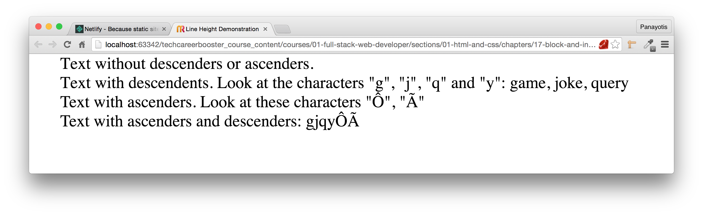

As you can see, one line does not start immediately below the previous one. Each line has enough height to accommodate the accents and the desenders.
Inspect with the developer tools the last line. Open the developer tools and inside the "Elements" area, put your mouse of the last `<p>` element. Do you see the
blue highlight? It depicts the exact line height. And you can see that it is enough to hold the ascenders and descenders of that line.

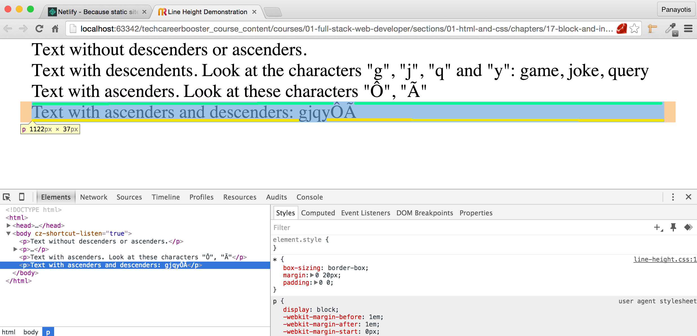

We have marked the ascenders reserved space with the light green color, and the descenders reserved space with the yellow color. This demonstrates how browser reserves the space for
these cases and uses it when needed. Note that this space exists and affects the line height even if the text does not have such characters (ascenders/descenders). See how this
has been done in the first line:

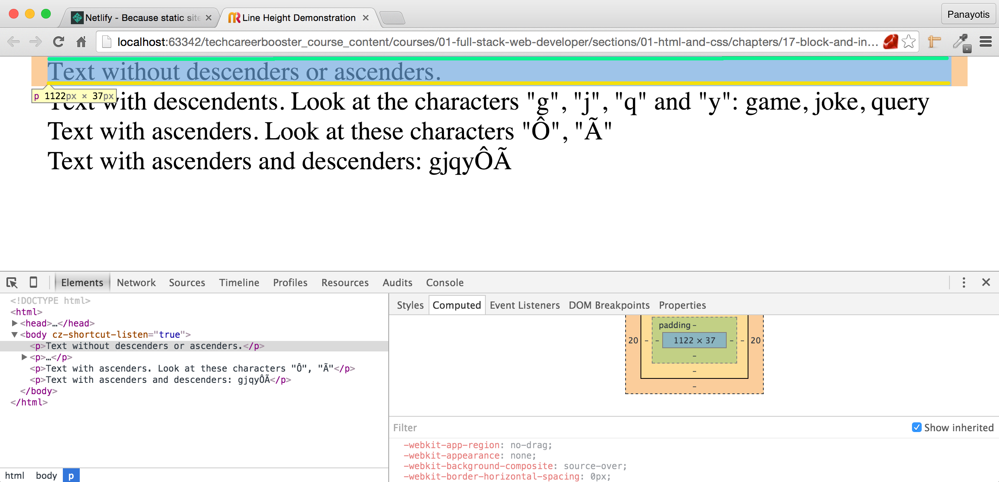

You can see above, the light green color demonstrating the reserved space for ascenders, although this text line does not have any. Same goes for the descenders.

So, keep that in mind, that line height is not equal to the height of the tallest character inside your text, but it is equal to the height that is required to accommodate
the tallest character with the font that you are using to write your text. Even if you are not using ascenders neither descenders characters, the reserved space will be there.

### Inherited and Non-Inherited values

Let's try another example that contains a `<p>` element inside the `<body>` element. Our CSS is as:

``` css
body {
    background-color: antiquewhite;

    border: 10px solid black;

    padding: 10px 20px 30px 40px;

    margin: 10px 10px;

    box-sizing: border-box;
}
```

and our HTML page now is:

``` html
<!DOCTYPE html>
<html>
  <head>
    <meta charset="utf-8">
    <title>P inside Body</title>
    <link rel="stylesheet" href="stylesheets/index.css">
  </head>

  <body>

    <h2>Hello World!</h2>

    <p>
      Sed ut perspiciatis unde omnis iste natus error sit voluptatem accusantium doloremque laudantium, totam rem aperiam,
      eaque ipsa quae ab illo inventore veritatis et quasi architecto beatae vitae dicta sunt explicabo. Nemo enim ipsam
      voluptatem quia voluptas sit aspernatur aut odit aut fugit, sed quia consequuntur magni dolores eos qui ratione voluptatem
      sequi nesciunt. Neque porro quisquam est, qui dolorem ipsum quia dolor sit amet, consectetur, adipisci velit, sed quia non
      numquam eius modi tempora incidunt ut labore et dolore magnam aliquam quaerat voluptatem. Ut enim ad minima veniam,
      quis nostrum exercitationem ullam corporis suscipit laboriosam, nisi ut aliquid ex ea commodi consequatur? Quis autem
      vel eum iure reprehenderit qui in ea voluptate velit esse quam nihil molestiae consequatur, vel illum qui dolorem eum
      fugiat quo voluptas nulla pariatur?
    </p>

  </body>

</html>
```

If you load this page on your browser you will see something like this:

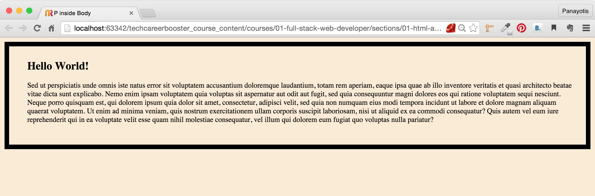

Let's do the following changes inside our CSS file:
``` css
body {
    background-color: antiquewhite;

    border: 10px solid black;

    padding: 10px 20px 30px 40px;

    margin: 10px 10px;

    box-sizing: border-box;

    color: darkblue;
}

p {
    width: 400px;
    padding: 10px 10px;
    border: 3px solid red;
}
```

What we have done was to set the color of the text inside `body` to be `darkblue` and we have also set some attributes for the `p` element.

If you reload your page, the result will be:

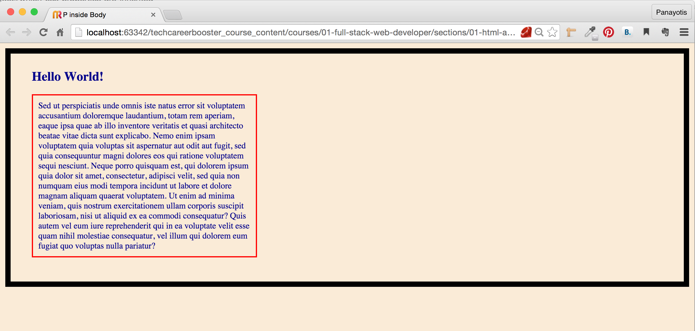

We can clearly see that the width of the `p` element has changed. If we get another view that highlights the areas of the `p` (using developer tools) you will see:

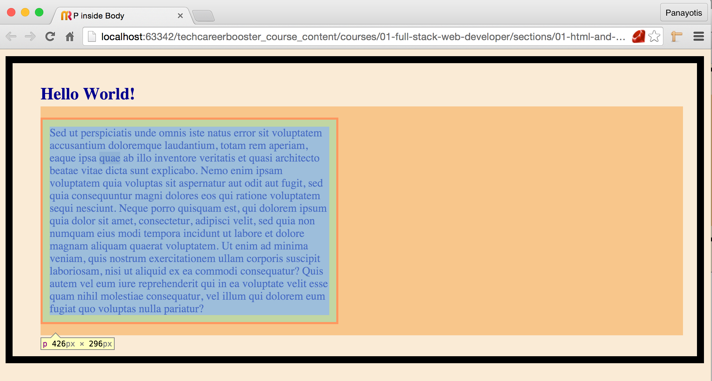

Hmmmm. It says that the width is `426px`. Let's see another view of its box model, using developer tools again.

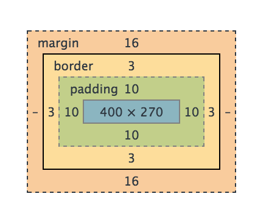

We can see from the above that the width property refers to the content of the `<p>` element (400px). However, we can
see that text color is the same for both elements (`<h1>` and `<p>`) that are inside the `<body>` element.

This small experiment shows that some of the CSS properties have been inherited from the containing element to the contained element, i.e. from `<body>` to `<h1>` and
`<p>`, like the `color`, but others, like `margin`, `border` and `box-sizing` have not been inherited.

If you want one element to inherit the CSS property of parent element, then you have to set the value `inherit` to the particular attribute. See this change here:

``` css
body {
    background-color: antiquewhite;

    border: 10px solid black;

    padding: 10px 20px 30px 40px;

    margin: 10px 10px;

    box-sizing: border-box;

    color: darkblue;
}

p {
    width: 400px;
    padding: 10px 10px;
    border: 3px solid red;

    box-sizing: inherit;
}
```
We have added the property `box-sizing` with the value `inherit` to the `<p>` element. Let's reload the page and see how this changes things. You can see now that the
actual width of the `<p>` element is `400px` meaning that the `<p>` element has inherited the `box-sizing` property from the parent `<body>` element.

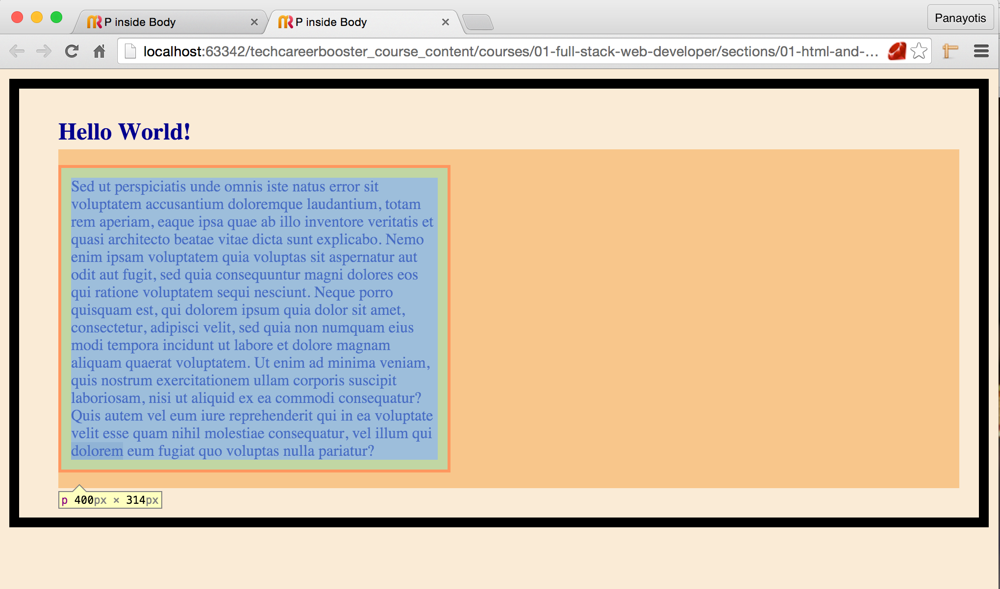

Also, the developer tools can give you the actual properties that are used for the `<p>`. You only have to go to "Computed" tab and see the values of the properties. For example,
there, you will see the value of the `box-sizing` property to be `border-box`. Also, the color will be `rgb(0, 0, 139)` which is the `rgb` representation of the `darkblue` color.


CSS properties are numerous. Some of them are automatically inherited to contained elements, some not. Usually, properties that change/affect the structure of the page,
like margins, paddings, borders e.t.c. are not inherited. Whereas others that affect the format of the content, like color and font-size are automatically inherited.
You will learn to identify them by experience. Of course, there are plenty of resources on the Internet that can tell you whether a property is inherited or not.

### Applying Rule To All Elements

What if you wanted all your elements to work with the `box-model` value for `box-sizing` property? In that case, you do not have to
explicitly set the value to each one of them. You only have to set it to the root element and then specify that all elements will be inheriting this property.

In our example, this would do the trick:
``` css
body {
    background-color: antiquewhite;

    border: 10px solid black;

    padding: 10px 20px 30px 40px;

    margin: 10px 10px;

    box-sizing: border-box;

    color: darkblue;
}

body * {
    box-sizing: inherit;
}

p {
    width: 400px;
    padding: 10px 10px;
    border: 3px solid red;
}
```
Note that we have removed the `box-sizing` setting from the `p` element. And we have added a rule for `body *` which essentially means
for any child of the `body` element.

If you reload your page and inspect both `<h1>` and `<p>` elements, you will see that both of them have `box-sizing` property set to `border-box`.

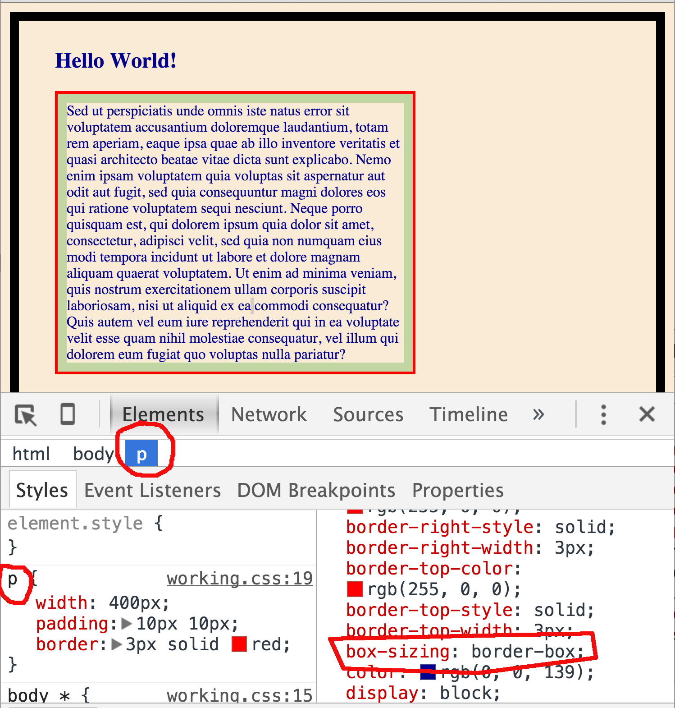

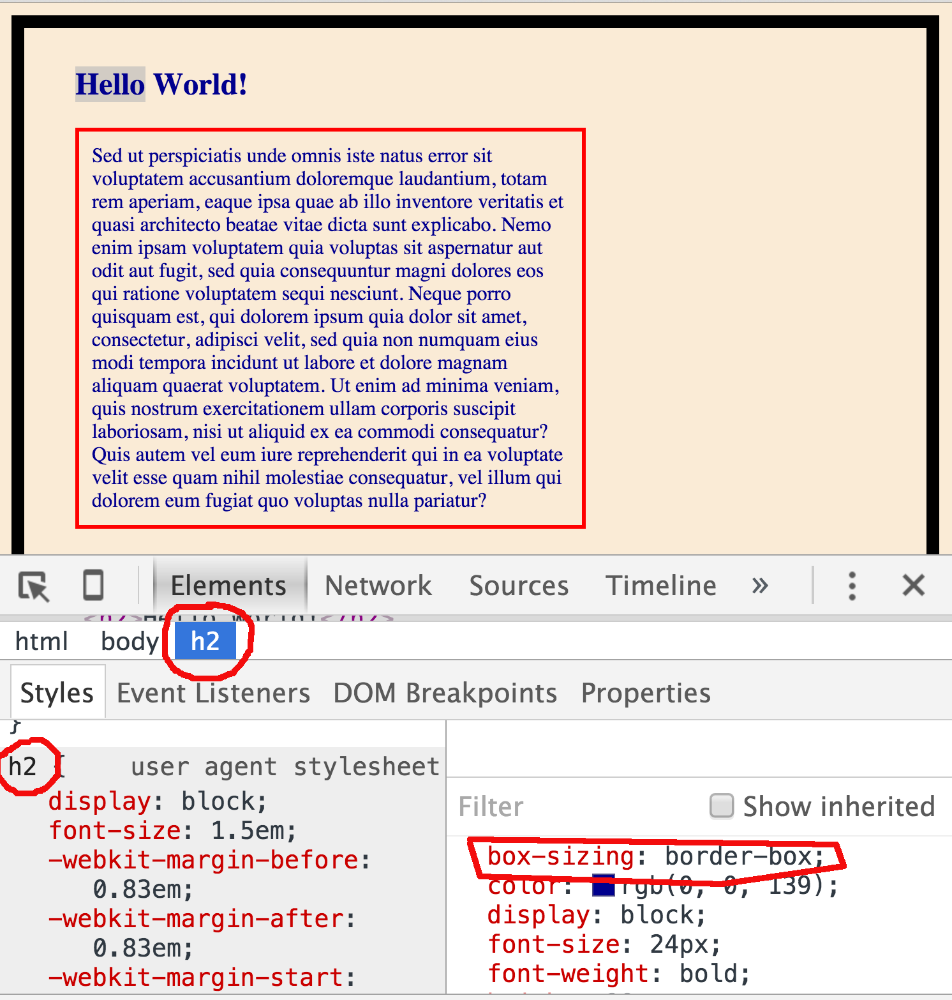

This is because they have inherited that from `body` thanks to the rule:

``` css
body * {
    box-sizing: inherit;
}
```

Other ways you can achieve the same trick is the following:

``` css
* {
    box-sizing: border-box;
}

body {
    background-color: antiquewhite;

    border: 10px solid black;

    padding: 10px 20px 30px 40px;

    margin: 10px 10px;

    color: darkblue;
}

p {
    width: 400px;
    padding: 10px 10px;
    border: 3px solid red;
}
```

You can see here that we have created a very generic rule that applies to all elements, including body:
``` css
* {
    box-sizing: border-box;
}
```
Hence, we have removed the `box-sizing` settings from the other elements. Now all the elements have the `box-sizing` setting to `border-box`;

### Why `body` background-color covers the whole canvas?

We have seen at the beginning of the chapter that the background-color  of the `body` element covered the whole canvas background color, the whole page.
Why was that?

Generally, this does not happen. In other words, the style properties of an element do not propagate to parent elements.

Let's see the following example:

``` html
<!DOCTYPE html>
<html>
  <head>
    <meta charset="utf-8">
    <title>Body with h1 - Background Colors</title>
    <link rel="stylesheet" href="stylesheets/main.css" type="text/css">
  </head>

  <body>
    body
    <h1>Hello World!</h1>

  </body>

</html>
```
As you can see in the HTML code above, the hierarchy of elements is as follows:

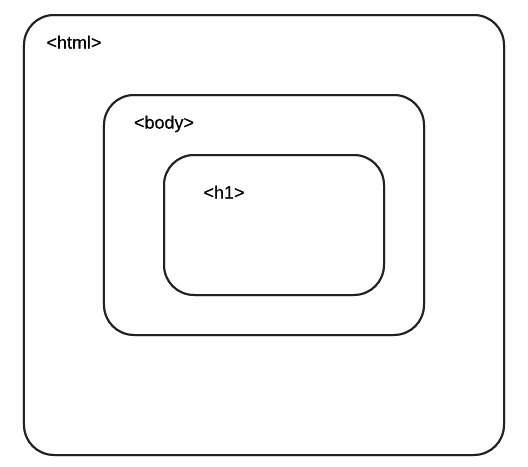

We repeat that the CSS properties do not propagate from child to parent. Hence, if we set the `background-color` of the `h1` element this stays
within it.

Try this CSS file:

``` css
html {
    padding: 10px;
    border: 2px solid #ffb21a;
}
body {
    padding: 10px;
    border: 2px solid red;
}

h1 {
    background-color: Green;
    padding: 20px;
    border: 2px solid Maroon;
}
```
It sets the `background-color` of `h1` to `green`. Also it applies some `padding` and `border` to both `html`, `body` and `h1`
so that we can see that the `background-color` stays within `h1` and so that we can also see the boundaries of the elements.
If you save this file (`stylesheets/main.css`) and you load the HTML page on your browser, you will see the following:

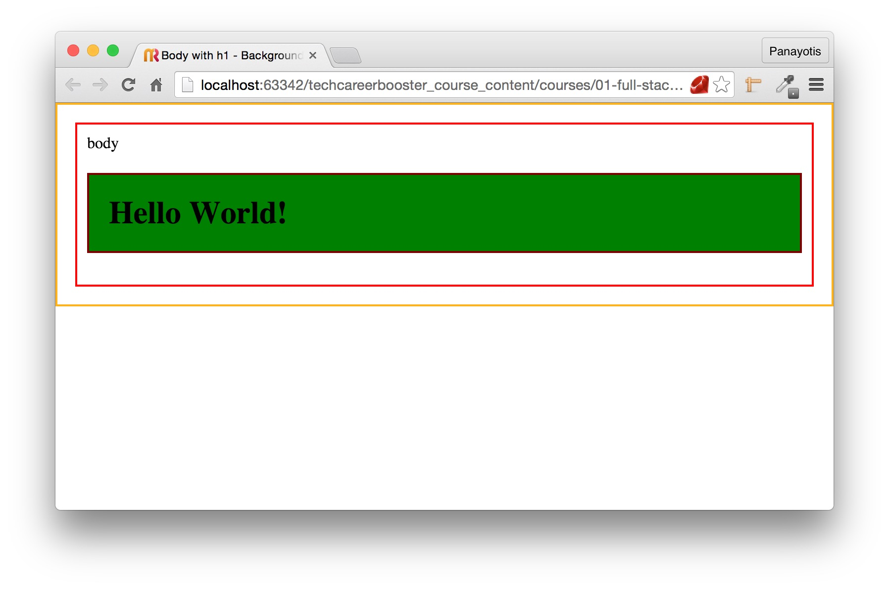

This proves that the background of the child (`h1`) stays within it. Does not propagate to the parent `body` element.

There is, however, an exception to this rule. The `background` properties (including `color`) of the `body` element, propagate to the parent element.
The parent element of the `body` element is the `html` element. You can see that on the previous example. It is the orange-border surrounded area.

Let's see that. We apply `background-color` `Blue` to the `body` element:
``` css
html {
    padding: 10px;
    border: 2px solid #ffb21a;
}
body {
    background-color: Blue;
    padding: 10px;
    border: 2px solid red;
}

h1 {
    background-color: Green;
    padding: 20px;
    border: 2px solid Maroon;
}
```
Save the CSS file and reload the page. What you will see is the following:

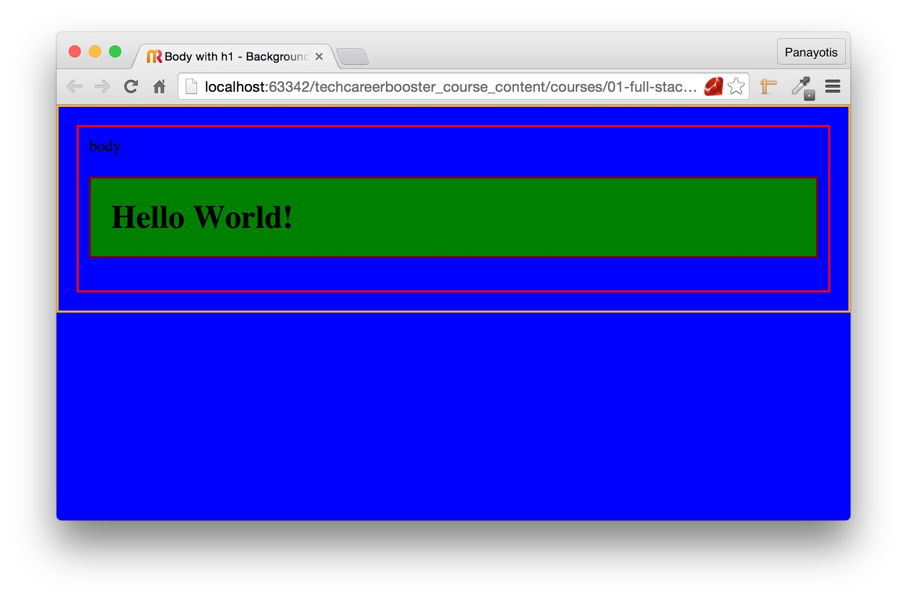

So, the `background-color` is propagated to the `html` element, and becomes the `background-color` of the `html` element. **But not only that**. It seems that the propagation
didn't stop on the `html` element. It has been propagated to the whole canvas, the browser window drawing area.

> **Important**. The `background` properties of the **root** element are propagated to the whole canvas **by design**. This is how it has been specified and this is how it
works.

That is why you see the whole canvas being blue.

Finally, if you want the `html` to have different `background-color` from the `body`, then just assign a different `background-color` to it.
For example, try `background-color: white;` to the `html` element. If you reload the page, you will see this:

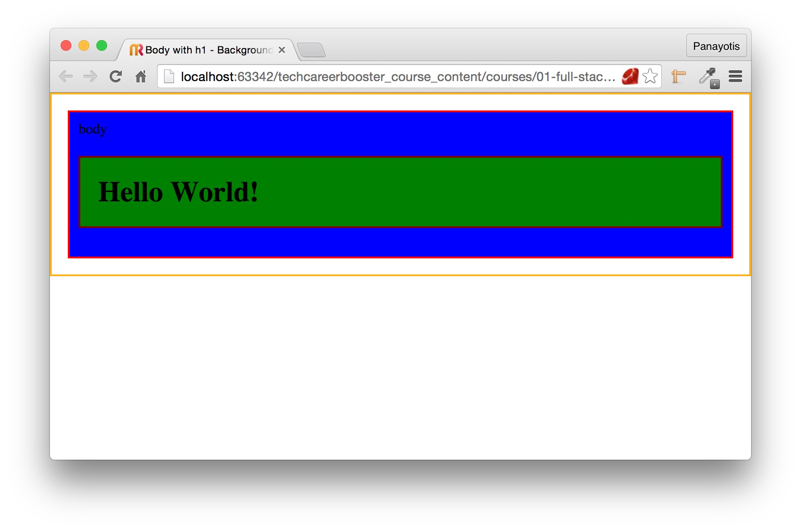

As you can see, now the `html` color has its own `background-color` and does not use the `background-color` of `body` element. However, the rule for the `root` element
still applies. I.e. the `background-color` of the `html` element (which is the `root` element) floods the canvas area.


