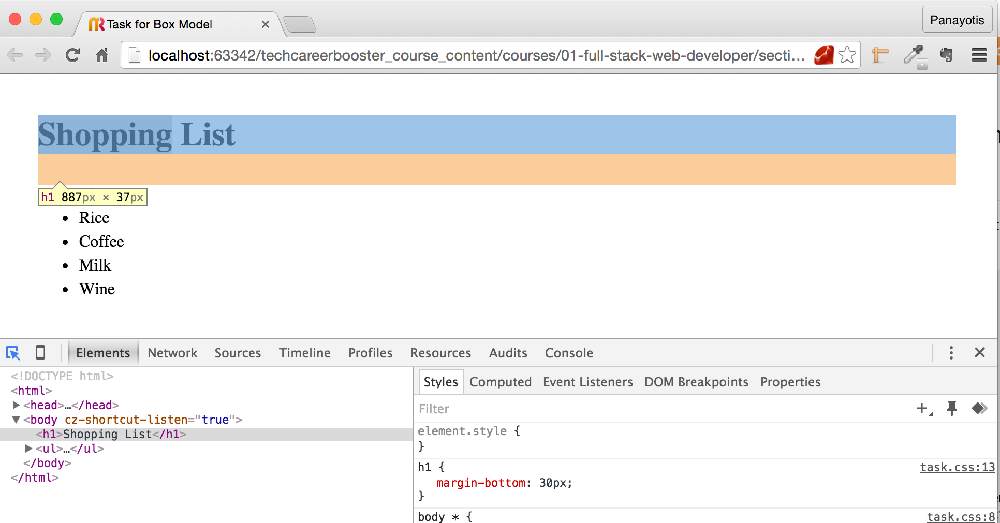

In this chapter you will learn about the CSS box model, which is very important in order for you to understand
how elements are put and sized on the page.

You will also learn how to use Developer Tools, a necessary tool to every Web developer. This will allow you to
inspect metrics and properties of various elements on your HTML page.

So, you will be able to see the CSS box model of each element like this:

and inspect properties and their sizes like this:

