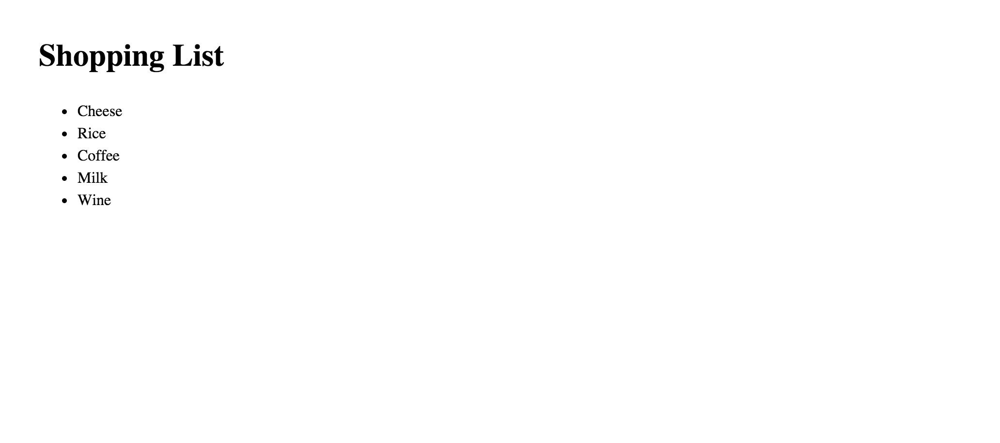
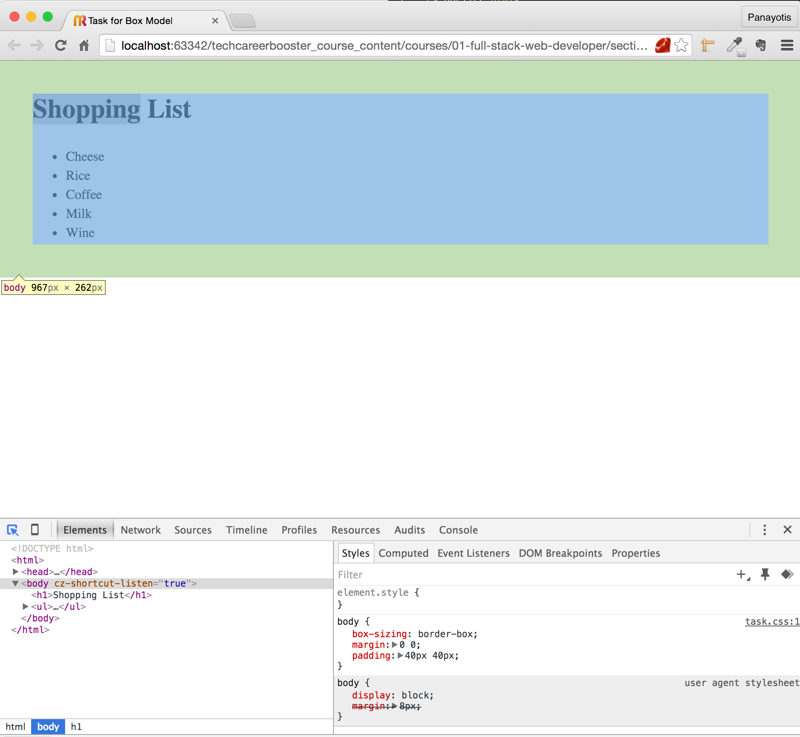
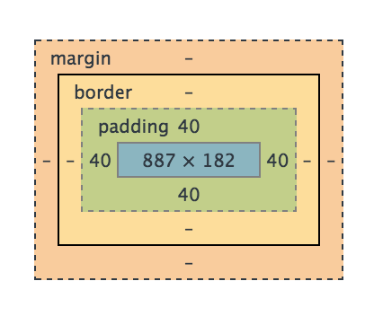

1. Using Chrome visit the page "www.google.com".
2. Inspect the following elements. Take a screenshot of their CSS Box Model as it is presented by the developer tools.
For each one of the boxes, make sure you write down margin, border, padding and content sizes.

    1. The Google doodle image
    2. The Google search box area.
    3. The Google Search box button.
    4. The Google "I'm feeling lucky" button.
3. Implement the following page:

 

  </img>
 

 
Make sure that:
1. The page has 2 elements, besides the `<body>`. An `<h1>` and an unordered list `<ul>`.
2. The `body` has the following properties when inspected with developer tools:

 

  </img>
 

 

  </img>
 

 
3. The `h1` has the following properties when inspected with developer tools:
 

  </img>
 

 

  </img>
 

 
4. The `ul` has default style as applied by the browser.
5. The `li` inside the `ul` has the following properties when inspected with developer tools:

 

  </img>
 

 

  </img>
 

 
6. All elements should have `box-sizing` property equal to `border-box`. However, do not set this property to each one of them literally. Use a technique
that would allow you to write this rule with as little CSS coding as possible.
