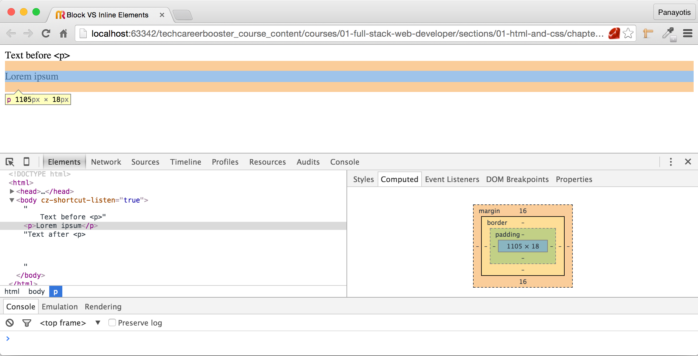
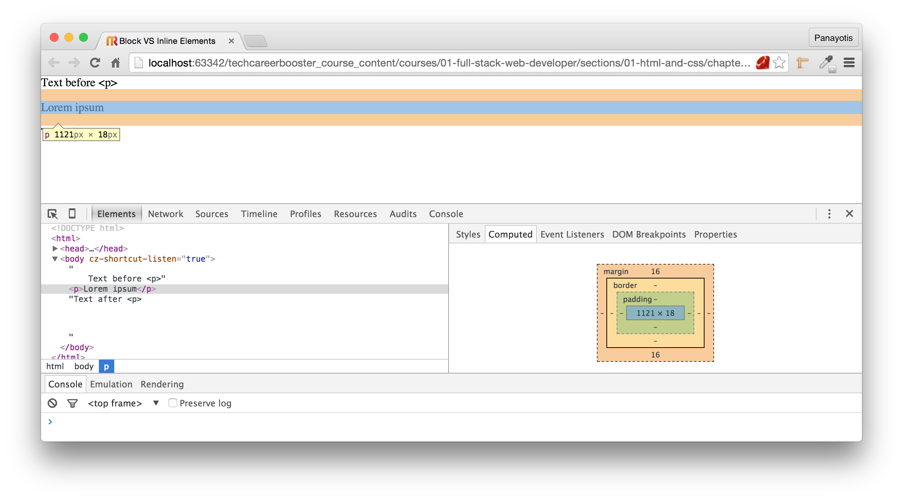
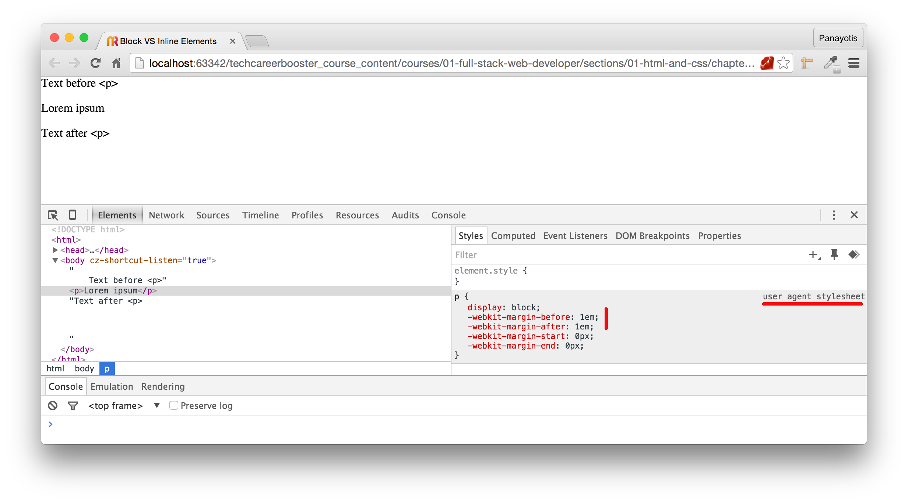
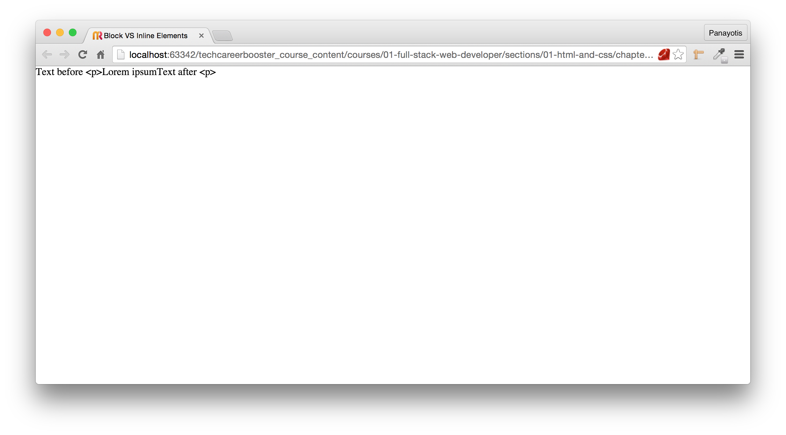
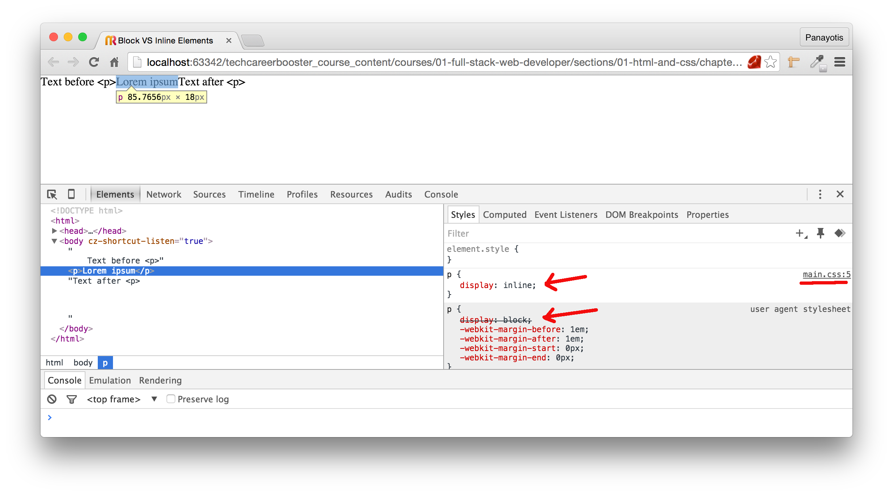
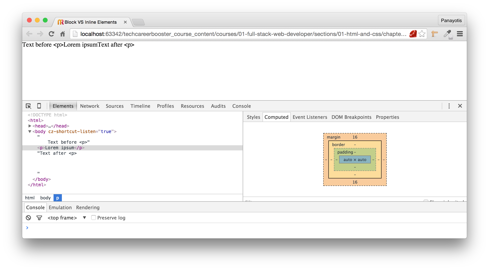
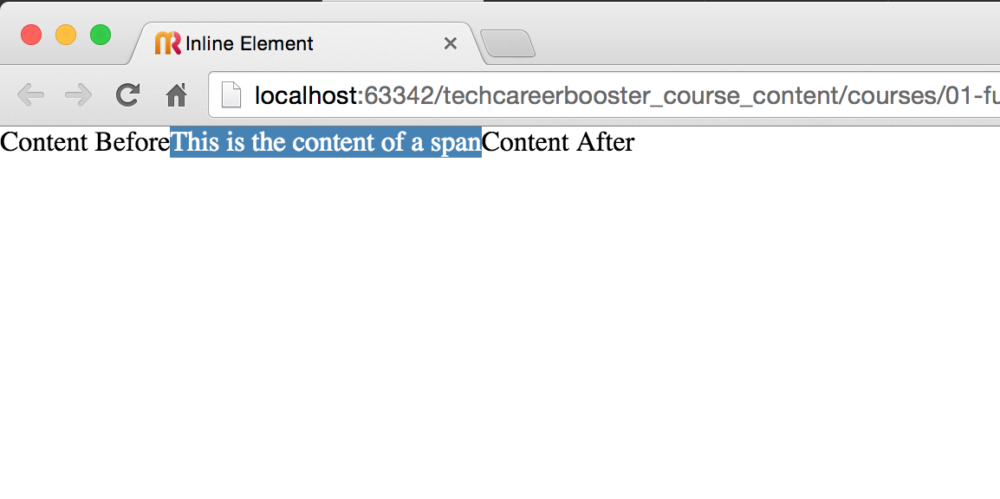
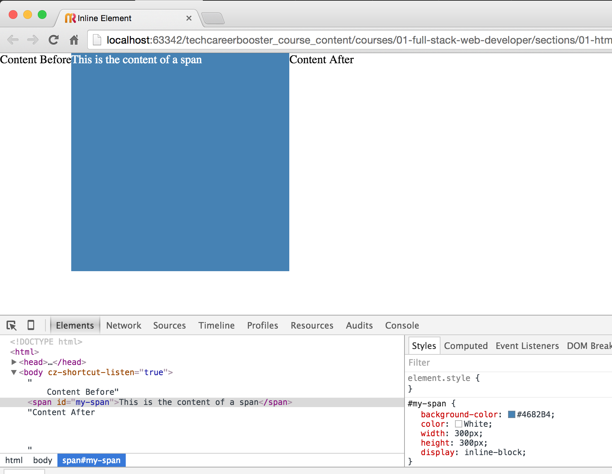

## Block and Inline HTML Elements

Now that we have learned about the CSS Box Model and how we can visualize the area that element occupies, using the developer
tools, it's a good point in time to talk about the `block` vs `inline` elements.

### Block HTML Elements

A block HTML element always starts at a new line and takes the full width available, from left to right, as much as it can.
The available width of a block HTML element is the width that its parent (containing element) allows it to have.

Let's take for example the following HTML page:
``` html
<!DOCTYPE html>
<html>
  <head>
    <meta charset="utf-8">
    <title>Block VS Inline Elements</title>
  </head>

  <body>
    Text before &lt;p&gt;<p>Lorem ipsum</p>Text after &lt;p&gt;
  </body>

</html>
```

If you load this page on your browser, you will see this:


Do you see that there are empty lines before and after the p element?

If you also inspect the p element using developer tools, you will see the following:


As you can see, the `<p>` element occupies the whole width that has available. Note that the parent element of this `<p>` is the `<body>`, which, by default,
has left and right margins. That's why you see some free white space left and right to the `<p>`. If we remove the `<body>` margins, then we will have this:
``` css
body {
    margin: 0 0;
}
```

Save the above CSS rule inside `stylesheets/main.css` and link this file to your HTML page. If you reload, you will see this result here:



Do you also see that `<p>` element has by default top and bottom margins? This is the browser default style and its part of the `user agent stylesheet rules`.
You can see that if you click the `Styles` tab on the developer tools.



> *Note:* Don't worry about the fact that margins are being specified using style properties prefixed with `-webkit`. This is how Chrome (a Webkit browser)
names some of its default and other properties inside its user agent stylesheet. Same does Safari, which is another Webkit engine browser. Firefox names those
`margin-block-start` (for `margin-top`) and `margin-block-end` (for `margin-bottom`).

As you can see from the user agent stylesheet, the property that makes an HTML element behave like a `block` element is the style property with name `display`.

### Inline HTML Elements

`display` property can take various values, but one other important value, relevant to our discussion, is the value `inline`.

Change the CSS file for the page that we are working on now, to have the following content:
``` css
body {
    margin: 0 0;
}

p {
    display: inline;
}
```
If you reload the page you will see the following result:


Aha! The `<p>` element does not have a new line before and a new line after. And this is what an `inline` element is. It has the `display` property
set to `inline`, as you can see in the following picture, and the element appears next to the previously printed content, to its expected position
as the flow of the document is drawn from top to bottom.



See how the user agent style `display: block;` is displayed as deleted by the developer tools. This is because it has been overriden by the value in our `main.css` file.
In fact, developer tools, displays the exact line number where the overriding rule exists inside your `main.css` file. If you click on `main.css` it will take you there
and you will be able to see the actual rule and CSS file inside the developer tools tab.

See also the new box model for this particular p:



Although you can see that there is top and bottom margin, in fact, these are not used.

> **Important:** When an HTML element is `inline`, then, there are some style properties that are automatically calculated and you cannot set them to specific values:
> * `width`,
> * `height`,
> * `margin-top`,
> * `margin-bottom`

### Default Block Elements

Now that you understand the difference between an `inline` element and a `block` element, and you already know that a `<p>` element is, by default, a `block` element,
with `display` property `block`, I can give you the list of the elements that are, by default, `block` elements.

<table>
  <tr><th colspan="2">Default HTML Block Elements</th></tr>
  <tr><td style="text-align: center;">&lt;address&gt;</td><td style="text-align: center;">&lt;article&gt;</td></tr>
  <tr><td style="text-align: center;">&lt;aside&gt;</td><td style="text-align: center;">&lt;blockquote&gt;</td></tr>
  <tr><td style="text-align: center;">&lt;canvas&gt;</td><td style="text-align: center;">&lt;dd&gt;</td></tr>
  <tr><td style="text-align: center;">&lt;div&gt;</td><td style="text-align: center;">&lt;dl&gt;</td></tr>
  <tr><td style="text-align: center;">&lt;fieldset&gt;</td><td style="text-align: center;">&lt;figcaption&gt;</td></tr>
  <tr><td style="text-align: center;">&lt;figure&gt;</td><td style="text-align: center;">&lt;footer&gt;</td></tr>
  <tr><td style="text-align: center;">&lt;form&gt;</td><td style="text-align: center;">&lt;h1&gt;,..,&lt;h6&gt; </td></tr>
  <tr><td style="text-align: center;">&lt;header&gt;</td><td style="text-align: center;">&lt;hgroup&gt; </td></tr>
  <tr><td style="text-align: center;">&lt;hr&gt;</td><td style="text-align: center;">&lt;li&gt; </td></tr>
  <tr><td style="text-align: center;">&lt;main&gt;</td><td style="text-align: center;">&lt;nav&gt; </td></tr>
  <tr><td style="text-align: center;">&lt;noscript&gt;</td><td style="text-align: center;">&lt;ol&gt; </td></tr>
  <tr><td style="text-align: center;">&lt;output&gt;</td><td style="text-align: center;">&lt;p&gt; </td></tr>
  <tr><td style="text-align: center;">&lt;pre&gt;</td><td style="text-align: center;">&lt;section&gt; </td></tr>
  <tr><td style="text-align: center;">&lt;table&gt;</td><td style="text-align: center;">&lt;tfoot&gt; </td></tr>
  <tr><td style="text-align: center;">&lt;ul&gt;</td><td style="text-align: center;">&lt;video&gt; </td></tr>
</table>

During this course, you will learn how to use many of these elements, so, don't worry if most of them do not ring any bell to you.

### Default Inline Elements

The list of default inline elements is this:

<table>
  <tr><th colspan="2">Default HTML Inline Elements</th></tr>
  <tr><td style="text-align: center;">&lt;a&gt;</td><td style="text-align: center;">&lt;abbr&gt;</td></tr>
  <tr><td style="text-align: center;">&lt;acronym&gt;</td><td style="text-align: center;">&lt;b&gt;</td></tr>
  <tr><td style="text-align: center;">&lt;bdo&gt;</td><td style="text-align: center;">&lt;big&gt;</td></tr>
  <tr><td style="text-align: center;">&lt;br&gt;</td><td style="text-align: center;">&lt;button&gt;</td></tr>
  <tr><td style="text-align: center;">&lt;cite&gt;</td><td style="text-align: center;">&lt;code&gt;</td></tr>
  <tr><td style="text-align: center;">&lt;dfn&gt;</td><td style="text-align: center;">&lt;em&gt;</td></tr>
  <tr><td style="text-align: center;">&lt;i&gt;</td><td style="text-align: center;">&lt;img&gt;</td></tr>
  <tr><td style="text-align: center;">&lt;input&gt;</td><td style="text-align: center;">&lt;kbd&gt;</td></tr>
  <tr><td style="text-align: center;">&lt;label&gt;</td><td style="text-align: center;">&lt;map&gt;</td></tr>
  <tr><td style="text-align: center;">&lt;object&gt;</td><td style="text-align: center;">&lt;q&gt;</td></tr>
  <tr><td style="text-align: center;">&lt;samp&gt;</td><td style="text-align: center;">&lt;script&gt;</td></tr>
  <tr><td style="text-align: center;">&lt;select&gt;</td><td style="text-align: center;">&lt;small&gt;</td></tr>
  <tr><td style="text-align: center;">&lt;span&gt;</td><td style="text-align: center;">&lt;strong&gt;</td></tr>
  <tr><td style="text-align: center;">&lt;sub&gt;</td><td style="text-align: center;">&lt;sup&gt;</td></tr>
  <tr><td style="text-align: center;">&lt;textarea&gt;</td><td style="text-align: center;">&lt;time&gt;</td></tr>
  <tr><td style="text-align: center;">&lt;tt&gt;</td><td style="text-align: center;">&lt;var&gt;</td></tr>
</table>

### Setting width and height for inline elements

We have already seen that if an element is an inline element, then its width and height cannot be specified. Take, for example, the following
page:
``` html
<!DOCTYPE html>
<html>
  <head>
    <meta charset="utf-8">
    <title>Inline Element</title>
    <link rel="stylesheet" href="stylesheets/main.css" type="text/css">
  </head>

  <body>
    Content Before<span id="my-span">This is the content of a span</span>Content After
  </body>


</html>
```
with the following CSS rules:
``` css
* {
    box-sizing: border-box;
    margin: 0 0;
}

#my-span {
    background-color: #4682B4;
    color: White;
    width: 300px;
    height: 300px;
}
```
If you load this page on your browser, you will see this:


What if you really want to give some width and height to this inline element? Our suggestion here is that you may need to reconsider your tag and instead
of using an inline tag, try to use a block tag. Does that solve your problem? If not, and you still want your content to be positioned without new lines
before and after the element, then you have the option of `inline-block` value for the `display` property.

Let's change the CSS rule file and add a `display` property with value `inline-block` for your span element:
``` css
* {
    box-sizing: border-box;
    margin: 0 0;
}

#my-span {
    background-color: #4682B4;
    color: White;
    width: 300px;
    height: 300px;
    display: inline-block;
}
```
If you reload the page, you will see something like this:

and if you also see the CSS box model, it will be:


As you can see here, the initially `inline` element is now displayed with the actual `width` and `height` that we have specified in the CSS file.

### Closing Note

That was the first encounter with `block` and `inline` elements. Later on, you will learn more advanced techniques that have to do with how your elements are positioned
on your page.


