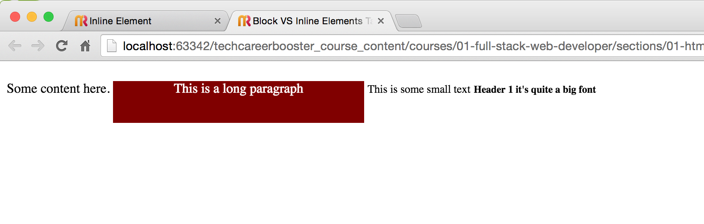

In this chapter, we explain the difference between block and inline elements. This is a fundamental concept, that
will allow you to understand how elements are organized on the HTML page.

You are going to build a simple page like this:

