## Dividing Page to Sections Using `<div>`

We now proceed to one of the most important parts of HTML authoring. It is a way to divide our HTML page into sections.

For example, how do we create a 3 column layout with header and footer? Like this?
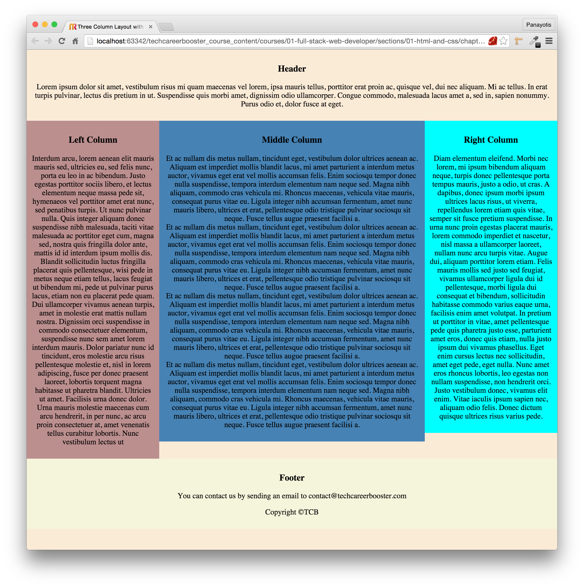

The main tool that will allow us to divide our page into sections is `<div>`.

> **Important:** Do not use HTML tables to divide your page to sections. Use tables only if you want to display tabular data inside a section of your page.

Let's start. Our target is to build the HTML page above. We will take it step by step.

### Step 1: Empty Page

Let's start with an empty HTML page that also references the file that will hold our CSS rules. Note that `stylesheets/content.css` is
empty as well.

``` html
<!DOCTYPE html>
<html>
  <head>
    <meta charset="utf-8">
    <title>./images/3 Columns Layout with Header and Footer</title>
    <link rel="stylesheet" href="stylesheets/content.css">
  </head>

  <body>


  </body>

</html>
```

### Step 2: Let's set the basic rules

We will start with resetting all the elements to border-box. That will make our sizing calculations easier:

``` css
* {
    box-sizing: border-box;
}
```
We still have an empty page of course, and if we reload, there is nothing more to see.

### Step 3: Dividing our page

Before we insert the actual content of our page, we need to understand how we want the page to be divided into sections. Looking at the
final result, we identify 5 sections:

1. Header
2. Left Column
3. Middle Column
4. Right Column
5. Footer

This is pretty much standard layout. And the standard HTML element that is used to divide pages into sections is the `<div>` element. Hence, you probably
need to have 5 div elements, one for each section.

Let's put the first section in:
``` html
<!DOCTYPE html>
<html>
  <head>
    <meta charset="utf-8">
    <title>Three Column Layout with Header and Footer</title>
    <link rel="stylesheet" href="stylesheets/content.css" type="text/css">
  </head>

  <body>

    <div id="header"></div>

  </body>

</html>
```

If you save and reload your page, you will still see nothing, because the div that we inserted does not have any content. Let's add some. The
final result can be achieved with an `<h3>` and a `<p>` inside the header div. Here it is:


``` css
<!DOCTYPE html>
<html>
  <head>
    <meta charset="utf-8">
    <title>Three Column Layout with Header and Footer</title>
    <link rel="stylesheet" href="stylesheets/content.css" type="text/css">
  </head>

  <body>

    <div id="header">
      <h3>Header</h3>
      <p>
        Lorem ipsum dolor sit amet, vestibulum risus mi quam maecenas vel lorem, ipsa mauris tellus,
        porttitor erat proin ac, quisque vel, dui nec aliquam. Mi ac tellus. In erat turpis pulvinar, lectus dis pretium in ut.
        Suspendisse quis morbi amet, dignissim odio ullamcorper. Congue commodo, malesuada lacus amet a, sed in, sapien nonummy.
        Purus odio et, dolor fusce at eget.
      </p>
    </div>

  </body>

</html>
```
If you reload the page, you will see this:
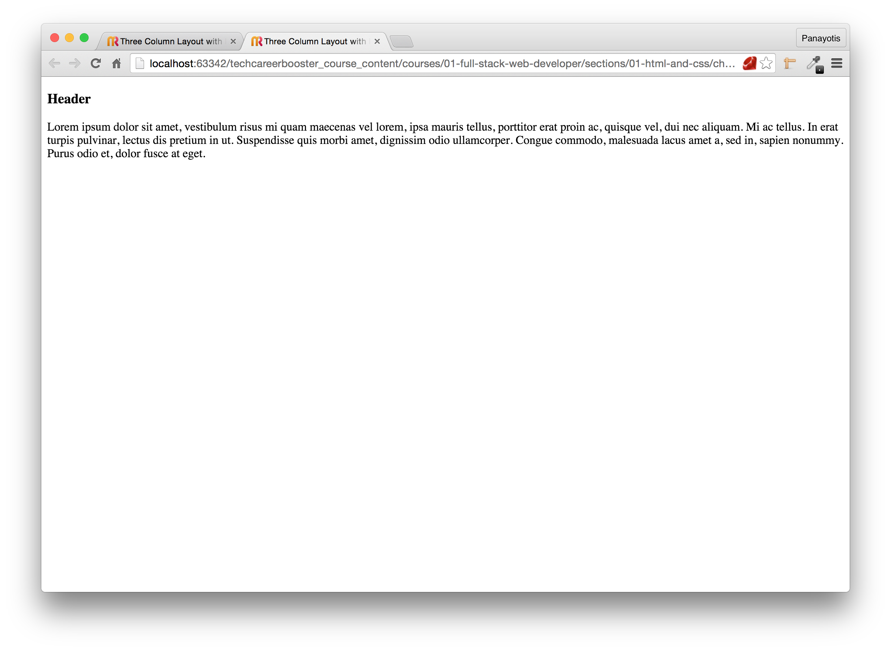

As you already know, the `<div>` element is a `block` element and occupies, by default, the whole width of the browser. Content before or after that, will be on different
lines.

Hence, we are pretty much ready with that. But, let's style it a little bit more in order to bring it where we want. As we inspect the final result, we need to specify
the text alignment to be centered and the background color to be of a particular color. Actually, text alignment center needs to be for the whole document.
Same goes for the background color. If you look at the final result carefully, you will see that the background color of the header is actually the background
of the whole document. Let's do that:

``` css
* {
    box-sizing: border-box;
}

body {
    background-color: antiquewhite;
    text-align: center;
}
```
If you apply these rules and you reload the page, you will see the following:
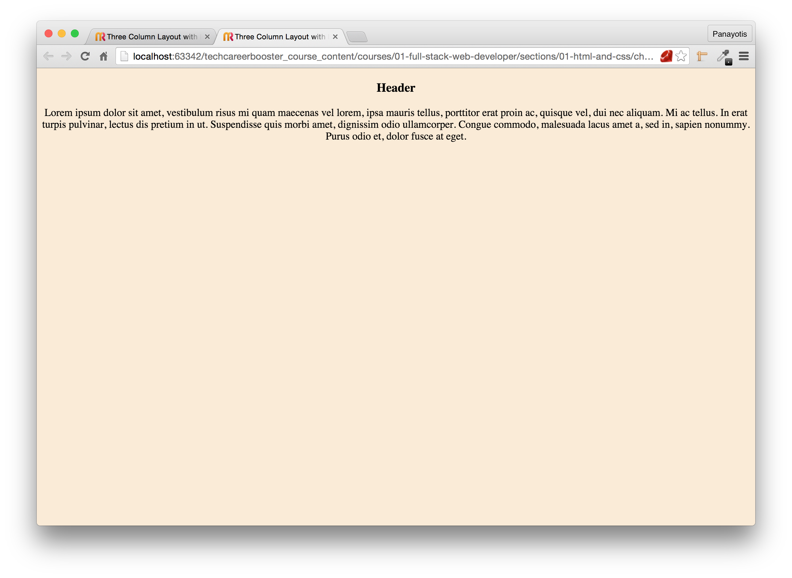

If you look at the page that we want to arrive to, header seems to be ok. There are some details, but we can consider that done, for now and proceed to the
rest of the sections of our page.

### Step 4 - Left Column

We will now put on our page the left column. We need another `<div>` element with the necessary content inside. We will also apply a background style in order
to make it stand out. Let's update our HTML page with the new `<div>` and then our CSS rules file:

``` html
<!DOCTYPE html>
<html>
  <head>
    <meta charset="utf-8">
    <title>Three Column Layout with Header and Footer</title>
    <link rel="stylesheet" href="stylesheets/content.css" type="text/css">
  </head>

  <body>

    <div id="header">
      <h3>Header</h3>
      <p>
        Lorem ipsum dolor sit amet, vestibulum risus mi quam maecenas vel lorem, ipsa mauris tellus,
        porttitor erat proin ac, quisque vel, dui nec aliquam. Mi ac tellus. In erat turpis pulvinar, lectus dis pretium in ut.
        Suspendisse quis morbi amet, dignissim odio ullamcorper. Congue commodo, malesuada lacus amet a, sed in, sapien nonummy.
        Purus odio et, dolor fusce at eget.
      </p>
    </div>

    <div id="left-column">
      <h3>Left Column</h3>

      <p>
        Interdum arcu, lorem aenean elit mauris mauris sed, ultricies eu, sed felis nunc, porta eu leo in ac bibendum. Justo egestas
        porttitor sociis libero, et lectus elementum neque massa pede sit, hymenaeos vel porttitor amet erat nunc, sed penatibus turpis.
        Ut nunc pulvinar nulla. Quis integer aliquam donec suspendisse nibh malesuada, taciti vitae malesuada ac porttitor eget cum,
        magna sed, nostra quis fringilla dolor ante, mattis id id interdum ipsum mollis dis. Blandit sollicitudin luctus fringilla placerat
        quis pellentesque, wisi pede in metus neque etiam tellus, lacus feugiat ut bibendum mi, pede ut pulvinar purus lacus, etiam non eu
        placerat pede quam. Dui ullamcorper vivamus aenean turpis, amet in molestie erat mattis nullam nostra. Dignissim orci suspendisse in
        commodo consectetuer elementum, suspendisse nunc sem amet lorem interdum mauris. Dolor pariatur nunc id tincidunt, eros molestie arcu
        risus pellentesque molestie et, nisl in lorem adipiscing, fusce per donec praesent laoreet, lobortis torquent magna habitasse ut
        pharetra blandit. Ultricies ut amet. Facilisis urna donec dolor. Urna mauris molestie maecenas cum arcu hendrerit, in per nunc,
        ac arcu proin consectetuer at, amet venenatis tellus curabitur lobortis. Nunc vestibulum lectus ut
      </p>
    </div>
  </body>

</html>
```

``` css
* {
    box-sizing: border-box;
}

body {
    background-color: antiquewhite;
    text-align: center;
}

#left-column {
    background-color: #BC8F8F;
}
```
As you see from the HTML code above, we have put our new `<div>` exactly after the previous one, as a sibling element. What is the visual result?
Let's reload the page and see:
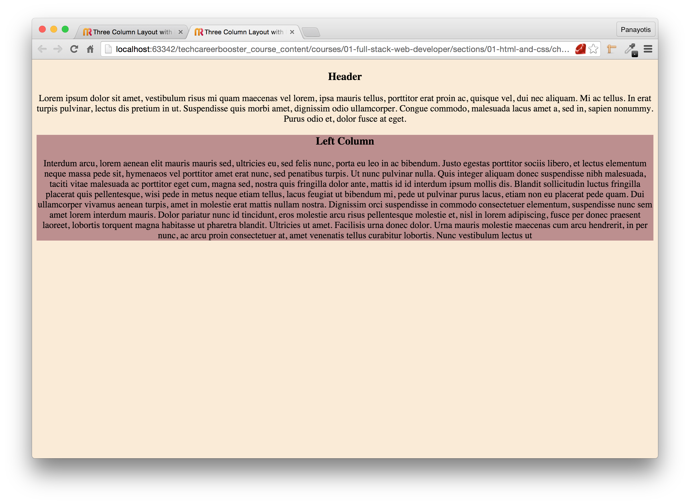

One `<div>` is displayed below the other. And this is expected. As we said, the `<div>` element is a `block` style element. Hence has a line change before
and a line change after and occupies the whole available width.

Let's see now how we can limit the width of this new div to be a quarter of the whole page width. Our intention is to have the left and right columns
be 25% of the page width, and leave the rest of the page width (50%) for the middle column. Shall we just add the required width to the left column?
``` css
* {
    box-sizing: border-box;
}

body {
    background-color: antiquewhite;
    text-align: center;
}

#left-column {
    background-color: #BC8F8F;
    width: 25%;
}
```
Let's reload our page after that. What we will see is this:
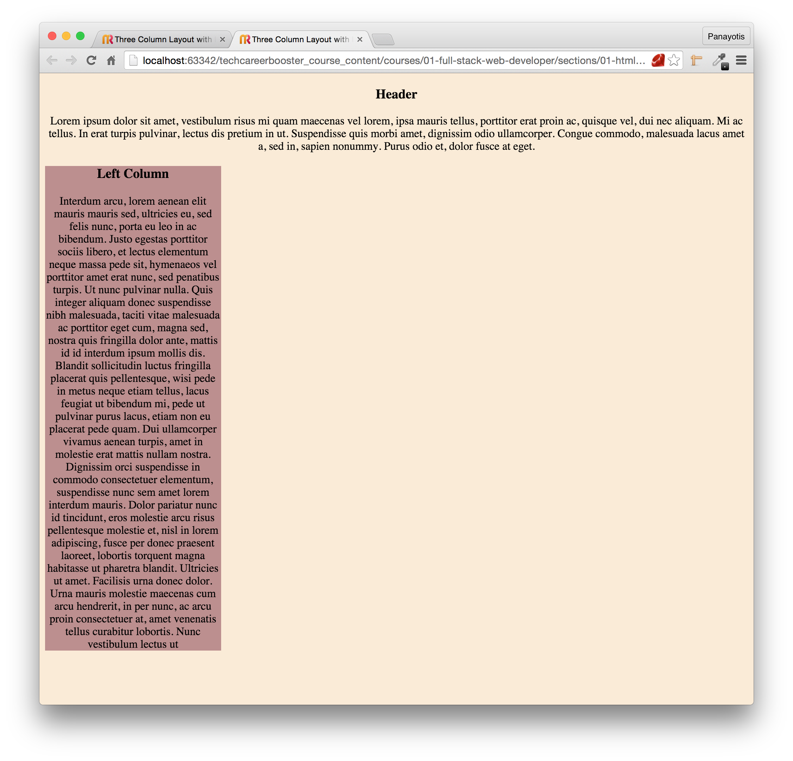
That's much better.

### Step 5 - Middle Column

Let's proceed to the middle column. This needs to be another `<div>`. Let's put it inside our HTML page and give it another background color in order to make it stand out.
``` css
* {
    box-sizing: border-box;
}

body {
    background-color: antiquewhite;
    text-align: center;
}

#left-column {
    background-color: #BC8F8F;
    width: 25%;
}

#middle-column {
    background-color: #4682B4;
}
```
and the HTML now becomes:
``` html
<!DOCTYPE html>
<html>
  <head>
    <meta charset="utf-8">
    <title>Three Column Layout with Header and Footer</title>
    <link rel="stylesheet" href="stylesheets/content.css" type="text/css">
  </head>

  <body>

    <div id="header">
      <h3>Header</h3>
      <p>
        Lorem ipsum dolor sit amet, vestibulum risus mi quam maecenas vel lorem, ipsa mauris tellus,
        porttitor erat proin ac, quisque vel, dui nec aliquam. Mi ac tellus. In erat turpis pulvinar, lectus dis pretium in ut.
        Suspendisse quis morbi amet, dignissim odio ullamcorper. Congue commodo, malesuada lacus amet a, sed in, sapien nonummy.
        Purus odio et, dolor fusce at eget.
      </p>
    </div>

    <div id="left-column">
      <h3>Left Column</h3>

      <p>
        Interdum arcu, lorem aenean elit mauris mauris sed, ultricies eu, sed felis nunc, porta eu leo in ac bibendum. Justo egestas
        porttitor sociis libero, et lectus elementum neque massa pede sit, hymenaeos vel porttitor amet erat nunc, sed penatibus turpis.
        Ut nunc pulvinar nulla. Quis integer aliquam donec suspendisse nibh malesuada, taciti vitae malesuada ac porttitor eget cum,
        magna sed, nostra quis fringilla dolor ante, mattis id id interdum ipsum mollis dis. Blandit sollicitudin luctus fringilla placerat
        quis pellentesque, wisi pede in metus neque etiam tellus, lacus feugiat ut bibendum mi, pede ut pulvinar purus lacus, etiam non eu
        placerat pede quam. Dui ullamcorper vivamus aenean turpis, amet in molestie erat mattis nullam nostra. Dignissim orci suspendisse in
        commodo consectetuer elementum, suspendisse nunc sem amet lorem interdum mauris. Dolor pariatur nunc id tincidunt, eros molestie arcu
        risus pellentesque molestie et, nisl in lorem adipiscing, fusce per donec praesent laoreet, lobortis torquent magna habitasse ut
        pharetra blandit. Ultricies ut amet. Facilisis urna donec dolor. Urna mauris molestie maecenas cum arcu hendrerit, in per nunc,
        ac arcu proin consectetuer at, amet venenatis tellus curabitur lobortis. Nunc vestibulum lectus ut
      </p>
    </div>

    <div id="middle-column">
      <h3>Middle Column</h3>

      <p>
        Et ac nullam dis metus nullam, tincidunt eget, vestibulum dolor ultrices aenean ac. Aliquam est imperdiet mollis blandit lacus,
        mi amet parturient a interdum metus auctor, vivamus eget erat vel mollis accumsan felis. Enim sociosqu tempor donec nulla suspendisse,
        tempora interdum elementum nam neque sed. Magna nibh aliquam, commodo cras vehicula mi. Rhoncus maecenas, vehicula vitae mauris, consequat
        purus vitae eu. Ligula integer nibh accumsan fermentum, amet nunc mauris libero, ultrices et erat, pellentesque odio tristique pulvinar sociosqu
        sit neque. Fusce tellus augue praesent facilisi a.<br/>
        Et ac nullam dis metus nullam, tincidunt eget, vestibulum dolor ultrices aenean ac. Aliquam est imperdiet mollis blandit lacus,
        mi amet parturient a interdum metus auctor, vivamus eget erat vel mollis accumsan felis. Enim sociosqu tempor donec nulla suspendisse,
        tempora interdum elementum nam neque sed. Magna nibh aliquam, commodo cras vehicula mi. Rhoncus maecenas, vehicula vitae mauris, consequat
        purus vitae eu. Ligula integer nibh accumsan fermentum, amet nunc mauris libero, ultrices et erat, pellentesque odio tristique pulvinar sociosqu
        sit neque. Fusce tellus augue praesent facilisi a.<br/>
        Et ac nullam dis metus nullam, tincidunt eget, vestibulum dolor ultrices aenean ac. Aliquam est imperdiet mollis blandit lacus,
        mi amet parturient a interdum metus auctor, vivamus eget erat vel mollis accumsan felis. Enim sociosqu tempor donec nulla suspendisse,
        tempora interdum elementum nam neque sed. Magna nibh aliquam, commodo cras vehicula mi. Rhoncus maecenas, vehicula vitae mauris, consequat
        purus vitae eu. Ligula integer nibh accumsan fermentum, amet nunc mauris libero, ultrices et erat, pellentesque odio tristique pulvinar sociosqu
        sit neque. Fusce tellus augue praesent facilisi a.<br/>
        Et ac nullam dis metus nullam, tincidunt eget, vestibulum dolor ultrices aenean ac. Aliquam est imperdiet mollis blandit lacus,
        mi amet parturient a interdum metus auctor, vivamus eget erat vel mollis accumsan felis. Enim sociosqu tempor donec nulla suspendisse,
        tempora interdum elementum nam neque sed. Magna nibh aliquam, commodo cras vehicula mi. Rhoncus maecenas, vehicula vitae mauris, consequat
        purus vitae eu. Ligula integer nibh accumsan fermentum, amet nunc mauris libero, ultrices et erat, pellentesque odio tristique pulvinar sociosqu
        sit neque. Fusce tellus augue praesent facilisi a.<br/>
      </p>
    </div>

  </body>

</html>
```
If you load this page on your browser, the result will be the following:

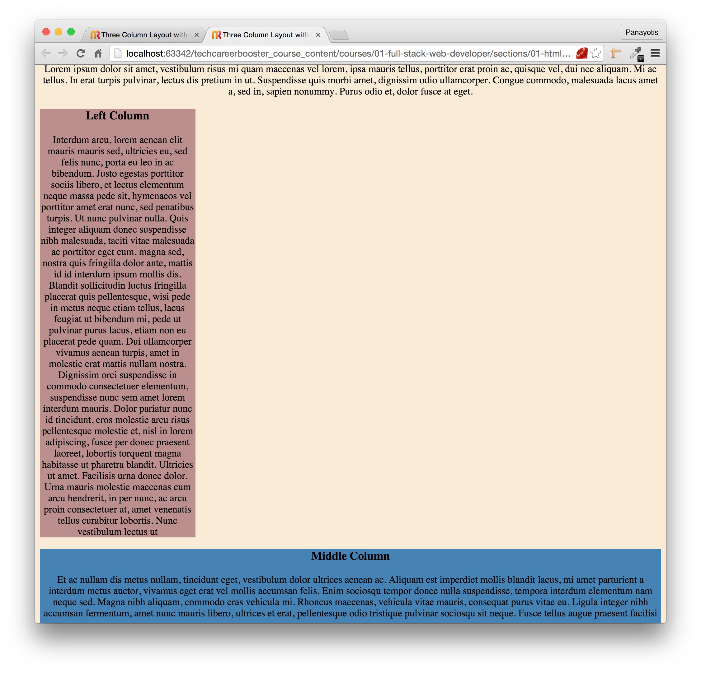

The result is the expected one. Isn't it? The fact that we defined the `width` of the left column div does not stop it from being a block style element. But even if
it were an inline-block element, then, still, the middle column div, is a block element, which means it stays on its own line.

So, what is the solution to bring both divs (left and middle column) on the same line and still allow them to have limited widths? The `inline-block` value of the
`display` property, for both of them. Let's do it.

``` css
* {
    box-sizing: border-box;
}

body {
    background-color: antiquewhite;
    text-align: center;
}

#left-column {
    background-color: #BC8F8F;
    width: 25%;
    display: inline-block;
}

#middle-column {
    background-color: #4682B4;
    width: 50%;
    display: inline-block;
}
```

As you can see above, we have set `display` property to the value `inline-block` for both divs. We have also specified the width of the middle column to be 50%.
Is that getting better? Let's reload the page and see:

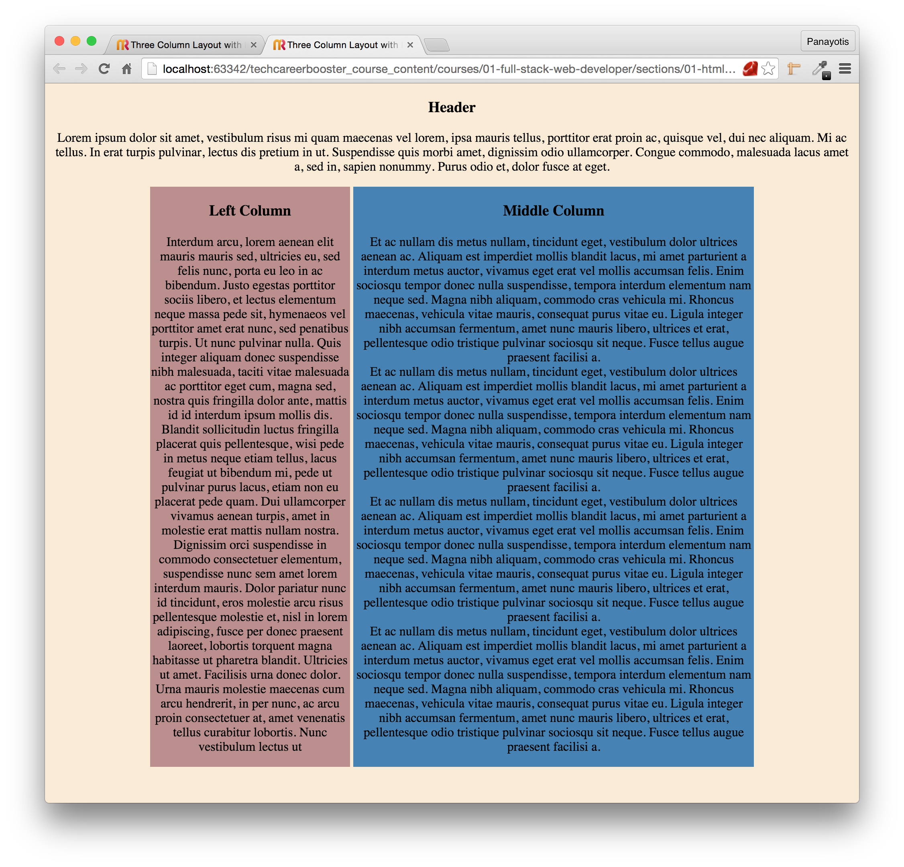

It does getting better.

### Step 6 - Right Column

Ok. I guess that now, we know how we can add the right column. It is another div. Let's put it inside our HTML page:

``` html
<!DOCTYPE html>
<html>
  <head>
    <meta charset="utf-8">
    <title>Three Column Layout with Header and Footer</title>
    <link rel="stylesheet" href="stylesheets/content.css" type="text/css">
  </head>

  <body>

    <div id="header">
      <h3>Header</h3>
      <p>
        Lorem ipsum dolor sit amet, vestibulum risus mi quam maecenas vel lorem, ipsa mauris tellus,
        porttitor erat proin ac, quisque vel, dui nec aliquam. Mi ac tellus. In erat turpis pulvinar, lectus dis pretium in ut.
        Suspendisse quis morbi amet, dignissim odio ullamcorper. Congue commodo, malesuada lacus amet a, sed in, sapien nonummy.
        Purus odio et, dolor fusce at eget.
      </p>
    </div>

    <div id="left-column">
      <h3>Left Column</h3>

      <p>
        Interdum arcu, lorem aenean elit mauris mauris sed, ultricies eu, sed felis nunc, porta eu leo in ac bibendum. Justo egestas
        porttitor sociis libero, et lectus elementum neque massa pede sit, hymenaeos vel porttitor amet erat nunc, sed penatibus turpis.
        Ut nunc pulvinar nulla. Quis integer aliquam donec suspendisse nibh malesuada, taciti vitae malesuada ac porttitor eget cum,
        magna sed, nostra quis fringilla dolor ante, mattis id id interdum ipsum mollis dis. Blandit sollicitudin luctus fringilla placerat
        quis pellentesque, wisi pede in metus neque etiam tellus, lacus feugiat ut bibendum mi, pede ut pulvinar purus lacus, etiam non eu
        placerat pede quam. Dui ullamcorper vivamus aenean turpis, amet in molestie erat mattis nullam nostra. Dignissim orci suspendisse in
        commodo consectetuer elementum, suspendisse nunc sem amet lorem interdum mauris. Dolor pariatur nunc id tincidunt, eros molestie arcu
        risus pellentesque molestie et, nisl in lorem adipiscing, fusce per donec praesent laoreet, lobortis torquent magna habitasse ut
        pharetra blandit. Ultricies ut amet. Facilisis urna donec dolor. Urna mauris molestie maecenas cum arcu hendrerit, in per nunc,
        ac arcu proin consectetuer at, amet venenatis tellus curabitur lobortis. Nunc vestibulum lectus ut
      </p>
    </div>

    <div id="middle-column">
      <h3>Middle Column</h3>

      <p>
        Et ac nullam dis metus nullam, tincidunt eget, vestibulum dolor ultrices aenean ac. Aliquam est imperdiet mollis blandit lacus,
        mi amet parturient a interdum metus auctor, vivamus eget erat vel mollis accumsan felis. Enim sociosqu tempor donec nulla suspendisse,
        tempora interdum elementum nam neque sed. Magna nibh aliquam, commodo cras vehicula mi. Rhoncus maecenas, vehicula vitae mauris, consequat
        purus vitae eu. Ligula integer nibh accumsan fermentum, amet nunc mauris libero, ultrices et erat, pellentesque odio tristique pulvinar sociosqu
        sit neque. Fusce tellus augue praesent facilisi a.<br/>
        Et ac nullam dis metus nullam, tincidunt eget, vestibulum dolor ultrices aenean ac. Aliquam est imperdiet mollis blandit lacus,
        mi amet parturient a interdum metus auctor, vivamus eget erat vel mollis accumsan felis. Enim sociosqu tempor donec nulla suspendisse,
        tempora interdum elementum nam neque sed. Magna nibh aliquam, commodo cras vehicula mi. Rhoncus maecenas, vehicula vitae mauris, consequat
        purus vitae eu. Ligula integer nibh accumsan fermentum, amet nunc mauris libero, ultrices et erat, pellentesque odio tristique pulvinar sociosqu
        sit neque. Fusce tellus augue praesent facilisi a.<br/>
        Et ac nullam dis metus nullam, tincidunt eget, vestibulum dolor ultrices aenean ac. Aliquam est imperdiet mollis blandit lacus,
        mi amet parturient a interdum metus auctor, vivamus eget erat vel mollis accumsan felis. Enim sociosqu tempor donec nulla suspendisse,
        tempora interdum elementum nam neque sed. Magna nibh aliquam, commodo cras vehicula mi. Rhoncus maecenas, vehicula vitae mauris, consequat
        purus vitae eu. Ligula integer nibh accumsan fermentum, amet nunc mauris libero, ultrices et erat, pellentesque odio tristique pulvinar sociosqu
        sit neque. Fusce tellus augue praesent facilisi a.<br/>
        Et ac nullam dis metus nullam, tincidunt eget, vestibulum dolor ultrices aenean ac. Aliquam est imperdiet mollis blandit lacus,
        mi amet parturient a interdum metus auctor, vivamus eget erat vel mollis accumsan felis. Enim sociosqu tempor donec nulla suspendisse,
        tempora interdum elementum nam neque sed. Magna nibh aliquam, commodo cras vehicula mi. Rhoncus maecenas, vehicula vitae mauris, consequat
        purus vitae eu. Ligula integer nibh accumsan fermentum, amet nunc mauris libero, ultrices et erat, pellentesque odio tristique pulvinar sociosqu
        sit neque. Fusce tellus augue praesent facilisi a.<br/>
      </p>
    </div>

    <div id="right-column">
      <h3>Right Column</h3>
      <p>
        Diam elementum eleifend. Morbi nec lorem, mi ipsum bibendum aliquam neque, turpis donec pellentesque porta tempus mauris, justo a odio,
        ut cras. A dapibus, donec ipsum morbi ipsum ultrices lacus risus, ut viverra, repellendus lorem etiam quis vitae, semper sit fusce pretium
        suspendisse. In urna nunc proin egestas placerat mauris, lorem commodo imperdiet et nascetur, nisl massa a ullamcorper laoreet,
        nullam nunc arcu turpis vitae. Augue dui, aliquam porttitor lorem etiam. Felis mauris mollis sed justo sed feugiat, vivamus ullamcorper
        ligula dui id pellentesque, morbi ligula dui consequat et bibendum, sollicitudin habitasse commodo varius eaque urna, facilisis enim amet
        volutpat. In pretium ut porttitor in vitae, amet pellentesque pede quis pharetra justo esse, parturient amet eros, donec quis etiam,
        nulla justo ipsum dui vivamus phasellus. Eget enim cursus lectus nec sollicitudin, amet eget pede, eget nulla. Nunc amet eros rhoncus
        lobortis, leo egestas non nullam suspendisse, non hendrerit orci. Justo vestibulum donec, vivamus elit enim. Vitae iaculis ipsum sapien nec,
        aliquam odio felis. Donec dictum quisque ultrices risus varius pede.
      </p>
    </div>

  </body>

</html>
```

Let's also add a background color and make the div to be inline-block, with width 25%. Otherwise, it will appear below the left and middle column. Our CSS becomes:

``` css
* {
    box-sizing: border-box;
}

body {
    background-color: antiquewhite;
    text-align: center;
}

#left-column {
    background-color: #BC8F8F;
    width: 25%;
    display: inline-block;
}

#middle-column {
    background-color: #4682B4;
    width: 50%;
    display: inline-block;
}

#right-column {
    background-color: aqua;
    width: 25%;
    display: inline-block;
}
```

If we reload this page, the result will be the following:

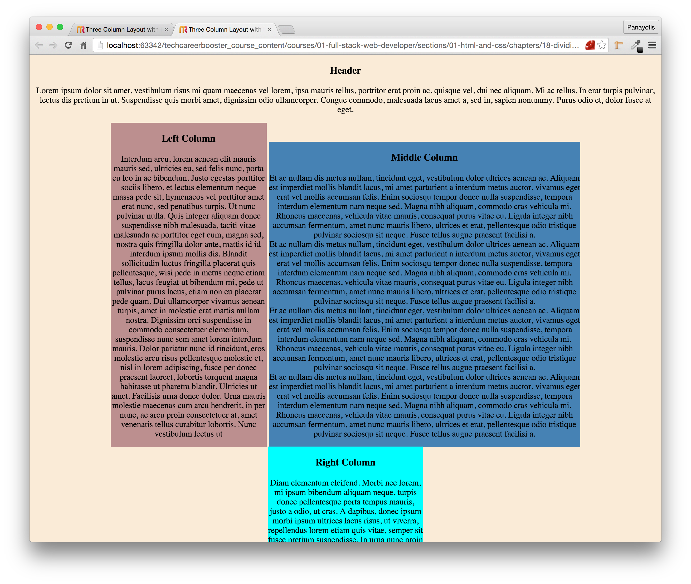

Oooops. This is not what we really expected. Is it? The right column div, although it has the correct style properties, does not have enough room to be positioned to the
right of the middle column and wraps to the next line. Why is that? Did you notice that there is a small blank vertical gap between left column and middle column?
Here:


Actually, there is another one too, between middle column and right column. Now positioned right to the middle column and it is not visible (but exists), because the right column
has jumped to the next line. Here:

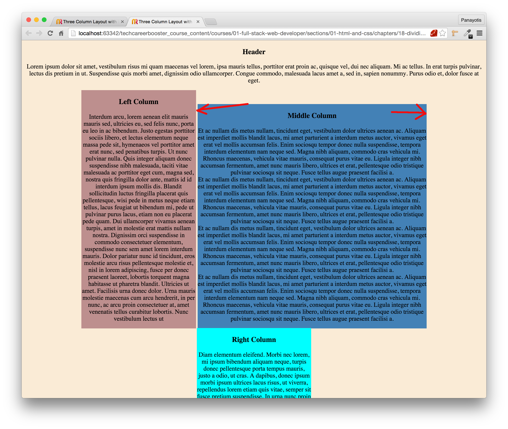

The small gaps, added to the widths of the 3 divs (25% + 50% + 25%) make the whole line not fit in the width of the page and that's why the right column wraps below.

Why does the browser create these gaps? It does it because we have it in our HTML code. The `inline` elements that have spaces around them, are printed with their spaces together.
We have turned our divs to `inline-block` elements (which are basically inline elements with the ability to specify width and height) and our HTML code has spaces around them:
(you can see the following picture if you right click on your page and you select View Source)

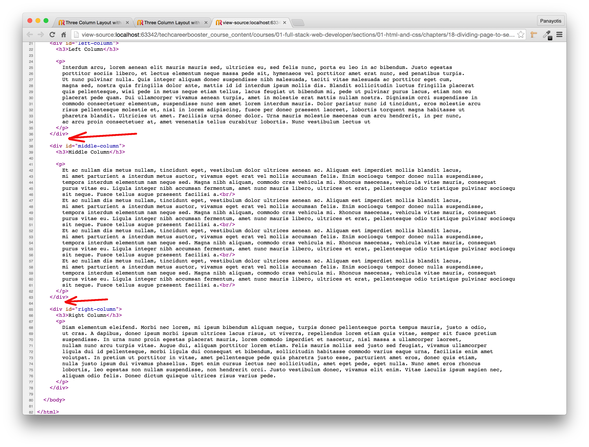

Does that mean that if we eliminate those gaps, the columns will appear on the same line? Let's try that:

``` html
<!DOCTYPE html>
<html>
  <head>
    <meta charset="utf-8">
    <title>Three Column Layout with Header and Footer</title>
    <link rel="stylesheet" href="stylesheets/content.css" type="text/css">
  </head>

  <body>

    <div id="header">
      <h3>Header</h3>
      <p>
        Lorem ipsum dolor sit amet, vestibulum risus mi quam maecenas vel lorem, ipsa mauris tellus,
        porttitor erat proin ac, quisque vel, dui nec aliquam. Mi ac tellus. In erat turpis pulvinar, lectus dis pretium in ut.
        Suspendisse quis morbi amet, dignissim odio ullamcorper. Congue commodo, malesuada lacus amet a, sed in, sapien nonummy.
        Purus odio et, dolor fusce at eget.
      </p>
    </div>

    <div id="left-column">
      <h3>Left Column</h3>

      <p>
        Interdum arcu, lorem aenean elit mauris mauris sed, ultricies eu, sed felis nunc, porta eu leo in ac bibendum. Justo egestas
        porttitor sociis libero, et lectus elementum neque massa pede sit, hymenaeos vel porttitor amet erat nunc, sed penatibus turpis.
        Ut nunc pulvinar nulla. Quis integer aliquam donec suspendisse nibh malesuada, taciti vitae malesuada ac porttitor eget cum,
        magna sed, nostra quis fringilla dolor ante, mattis id id interdum ipsum mollis dis. Blandit sollicitudin luctus fringilla placerat
        quis pellentesque, wisi pede in metus neque etiam tellus, lacus feugiat ut bibendum mi, pede ut pulvinar purus lacus, etiam non eu
        placerat pede quam. Dui ullamcorper vivamus aenean turpis, amet in molestie erat mattis nullam nostra. Dignissim orci suspendisse in
        commodo consectetuer elementum, suspendisse nunc sem amet lorem interdum mauris. Dolor pariatur nunc id tincidunt, eros molestie arcu
        risus pellentesque molestie et, nisl in lorem adipiscing, fusce per donec praesent laoreet, lobortis torquent magna habitasse ut
        pharetra blandit. Ultricies ut amet. Facilisis urna donec dolor. Urna mauris molestie maecenas cum arcu hendrerit, in per nunc,
        ac arcu proin consectetuer at, amet venenatis tellus curabitur lobortis. Nunc vestibulum lectus ut
      </p>
    </div><div id="middle-column">
      <h3>Middle Column</h3>

      <p>
        Et ac nullam dis metus nullam, tincidunt eget, vestibulum dolor ultrices aenean ac. Aliquam est imperdiet mollis blandit lacus,
        mi amet parturient a interdum metus auctor, vivamus eget erat vel mollis accumsan felis. Enim sociosqu tempor donec nulla suspendisse,
        tempora interdum elementum nam neque sed. Magna nibh aliquam, commodo cras vehicula mi. Rhoncus maecenas, vehicula vitae mauris, consequat
        purus vitae eu. Ligula integer nibh accumsan fermentum, amet nunc mauris libero, ultrices et erat, pellentesque odio tristique pulvinar sociosqu
        sit neque. Fusce tellus augue praesent facilisi a.<br/>
        Et ac nullam dis metus nullam, tincidunt eget, vestibulum dolor ultrices aenean ac. Aliquam est imperdiet mollis blandit lacus,
        mi amet parturient a interdum metus auctor, vivamus eget erat vel mollis accumsan felis. Enim sociosqu tempor donec nulla suspendisse,
        tempora interdum elementum nam neque sed. Magna nibh aliquam, commodo cras vehicula mi. Rhoncus maecenas, vehicula vitae mauris, consequat
        purus vitae eu. Ligula integer nibh accumsan fermentum, amet nunc mauris libero, ultrices et erat, pellentesque odio tristique pulvinar sociosqu
        sit neque. Fusce tellus augue praesent facilisi a.<br/>
        Et ac nullam dis metus nullam, tincidunt eget, vestibulum dolor ultrices aenean ac. Aliquam est imperdiet mollis blandit lacus,
        mi amet parturient a interdum metus auctor, vivamus eget erat vel mollis accumsan felis. Enim sociosqu tempor donec nulla suspendisse,
        tempora interdum elementum nam neque sed. Magna nibh aliquam, commodo cras vehicula mi. Rhoncus maecenas, vehicula vitae mauris, consequat
        purus vitae eu. Ligula integer nibh accumsan fermentum, amet nunc mauris libero, ultrices et erat, pellentesque odio tristique pulvinar sociosqu
        sit neque. Fusce tellus augue praesent facilisi a.<br/>
        Et ac nullam dis metus nullam, tincidunt eget, vestibulum dolor ultrices aenean ac. Aliquam est imperdiet mollis blandit lacus,
        mi amet parturient a interdum metus auctor, vivamus eget erat vel mollis accumsan felis. Enim sociosqu tempor donec nulla suspendisse,
        tempora interdum elementum nam neque sed. Magna nibh aliquam, commodo cras vehicula mi. Rhoncus maecenas, vehicula vitae mauris, consequat
        purus vitae eu. Ligula integer nibh accumsan fermentum, amet nunc mauris libero, ultrices et erat, pellentesque odio tristique pulvinar sociosqu
        sit neque. Fusce tellus augue praesent facilisi a.<br/>
      </p>
    </div><div id="right-column">
      <h3>Right Column</h3>
      <p>
        Diam elementum eleifend. Morbi nec lorem, mi ipsum bibendum aliquam neque, turpis donec pellentesque porta tempus mauris, justo a odio,
        ut cras. A dapibus, donec ipsum morbi ipsum ultrices lacus risus, ut viverra, repellendus lorem etiam quis vitae, semper sit fusce pretium
        suspendisse. In urna nunc proin egestas placerat mauris, lorem commodo imperdiet et nascetur, nisl massa a ullamcorper laoreet,
        nullam nunc arcu turpis vitae. Augue dui, aliquam porttitor lorem etiam. Felis mauris mollis sed justo sed feugiat, vivamus ullamcorper
        ligula dui id pellentesque, morbi ligula dui consequat et bibendum, sollicitudin habitasse commodo varius eaque urna, facilisis enim amet
        volutpat. In pretium ut porttitor in vitae, amet pellentesque pede quis pharetra justo esse, parturient amet eros, donec quis etiam,
        nulla justo ipsum dui vivamus phasellus. Eget enim cursus lectus nec sollicitudin, amet eget pede, eget nulla. Nunc amet eros rhoncus
        lobortis, leo egestas non nullam suspendisse, non hendrerit orci. Justo vestibulum donec, vivamus elit enim. Vitae iaculis ipsum sapien nec,
        aliquam odio felis. Donec dictum quisque ultrices risus varius pede.
      </p>
    </div>

  </body>

</html>
```

Do you see in the above code that we eliminated the gaps between left and middle and between middle and right column? When the one div element ends,
exactly after that, the next div element starts. No newline, no space. Nothing. Does that solve the problem? Let's reload the page and see:

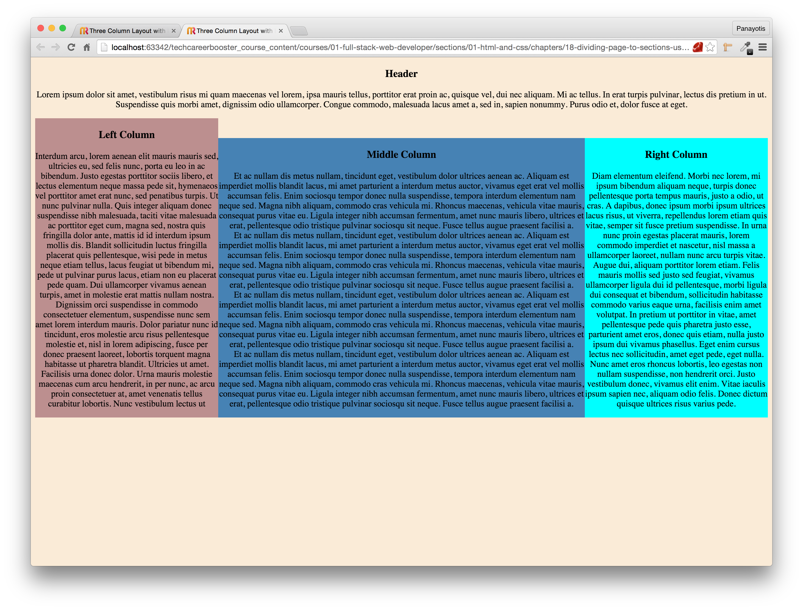

All right! We have managed to bring the three columns on the same line. However, this approach has the following disadvantages:

1. The columns, as you see, are not top-aligned, but bottom-aligned. As if the
browser draws them from bottom to top, rather than from top to bottom.
2. The fact that we had to glue together, in our HTML code, the divs that are `inline-block` styled, is not very intuitive, does not make our code
easy to read and it may not be maintainable. It's not future-proof. Somebody might go and add a blank in between. This shouldn't break our layout.

For the above, reasons, we will drop this solution and we will try another one. It is called the `float` property.

### Step 7 - Use `float` to position the elements.

Firstly, let's return our HTML code back to something easier to read, without having to glue together the inline block divs.

``` html
<!DOCTYPE html>
<html>
  <head>
    <meta charset="utf-8">
    <title>Three Column Layout with Header and Footer</title>
    <link rel="stylesheet" href="stylesheets/content.css" type="text/css">
  </head>

  <body>

    <div id="header">
      <h3>Header</h3>
      <p>
        Lorem ipsum dolor sit amet, vestibulum risus mi quam maecenas vel lorem, ipsa mauris tellus,
        porttitor erat proin ac, quisque vel, dui nec aliquam. Mi ac tellus. In erat turpis pulvinar, lectus dis pretium in ut.
        Suspendisse quis morbi amet, dignissim odio ullamcorper. Congue commodo, malesuada lacus amet a, sed in, sapien nonummy.
        Purus odio et, dolor fusce at eget.
      </p>
    </div>

    <div id="left-column">
      <h3>Left Column</h3>

      <p>
        Interdum arcu, lorem aenean elit mauris mauris sed, ultricies eu, sed felis nunc, porta eu leo in ac bibendum. Justo egestas
        porttitor sociis libero, et lectus elementum neque massa pede sit, hymenaeos vel porttitor amet erat nunc, sed penatibus turpis.
        Ut nunc pulvinar nulla. Quis integer aliquam donec suspendisse nibh malesuada, taciti vitae malesuada ac porttitor eget cum,
        magna sed, nostra quis fringilla dolor ante, mattis id id interdum ipsum mollis dis. Blandit sollicitudin luctus fringilla placerat
        quis pellentesque, wisi pede in metus neque etiam tellus, lacus feugiat ut bibendum mi, pede ut pulvinar purus lacus, etiam non eu
        placerat pede quam. Dui ullamcorper vivamus aenean turpis, amet in molestie erat mattis nullam nostra. Dignissim orci suspendisse in
        commodo consectetuer elementum, suspendisse nunc sem amet lorem interdum mauris. Dolor pariatur nunc id tincidunt, eros molestie arcu
        risus pellentesque molestie et, nisl in lorem adipiscing, fusce per donec praesent laoreet, lobortis torquent magna habitasse ut
        pharetra blandit. Ultricies ut amet. Facilisis urna donec dolor. Urna mauris molestie maecenas cum arcu hendrerit, in per nunc,
        ac arcu proin consectetuer at, amet venenatis tellus curabitur lobortis. Nunc vestibulum lectus ut
      </p>
    </div>

    <div id="middle-column">
      <h3>Middle Column</h3>

      <p>
        Et ac nullam dis metus nullam, tincidunt eget, vestibulum dolor ultrices aenean ac. Aliquam est imperdiet mollis blandit lacus,
        mi amet parturient a interdum metus auctor, vivamus eget erat vel mollis accumsan felis. Enim sociosqu tempor donec nulla suspendisse,
        tempora interdum elementum nam neque sed. Magna nibh aliquam, commodo cras vehicula mi. Rhoncus maecenas, vehicula vitae mauris, consequat
        purus vitae eu. Ligula integer nibh accumsan fermentum, amet nunc mauris libero, ultrices et erat, pellentesque odio tristique pulvinar sociosqu
        sit neque. Fusce tellus augue praesent facilisi a.<br/>
        Et ac nullam dis metus nullam, tincidunt eget, vestibulum dolor ultrices aenean ac. Aliquam est imperdiet mollis blandit lacus,
        mi amet parturient a interdum metus auctor, vivamus eget erat vel mollis accumsan felis. Enim sociosqu tempor donec nulla suspendisse,
        tempora interdum elementum nam neque sed. Magna nibh aliquam, commodo cras vehicula mi. Rhoncus maecenas, vehicula vitae mauris, consequat
        purus vitae eu. Ligula integer nibh accumsan fermentum, amet nunc mauris libero, ultrices et erat, pellentesque odio tristique pulvinar sociosqu
        sit neque. Fusce tellus augue praesent facilisi a.<br/>
        Et ac nullam dis metus nullam, tincidunt eget, vestibulum dolor ultrices aenean ac. Aliquam est imperdiet mollis blandit lacus,
        mi amet parturient a interdum metus auctor, vivamus eget erat vel mollis accumsan felis. Enim sociosqu tempor donec nulla suspendisse,
        tempora interdum elementum nam neque sed. Magna nibh aliquam, commodo cras vehicula mi. Rhoncus maecenas, vehicula vitae mauris, consequat
        purus vitae eu. Ligula integer nibh accumsan fermentum, amet nunc mauris libero, ultrices et erat, pellentesque odio tristique pulvinar sociosqu
        sit neque. Fusce tellus augue praesent facilisi a.<br/>
        Et ac nullam dis metus nullam, tincidunt eget, vestibulum dolor ultrices aenean ac. Aliquam est imperdiet mollis blandit lacus,
        mi amet parturient a interdum metus auctor, vivamus eget erat vel mollis accumsan felis. Enim sociosqu tempor donec nulla suspendisse,
        tempora interdum elementum nam neque sed. Magna nibh aliquam, commodo cras vehicula mi. Rhoncus maecenas, vehicula vitae mauris, consequat
        purus vitae eu. Ligula integer nibh accumsan fermentum, amet nunc mauris libero, ultrices et erat, pellentesque odio tristique pulvinar sociosqu
        sit neque. Fusce tellus augue praesent facilisi a.<br/>
      </p>
    </div>

    <div id="right-column">
      <h3>Right Column</h3>
      <p>
        Diam elementum eleifend. Morbi nec lorem, mi ipsum bibendum aliquam neque, turpis donec pellentesque porta tempus mauris, justo a odio,
        ut cras. A dapibus, donec ipsum morbi ipsum ultrices lacus risus, ut viverra, repellendus lorem etiam quis vitae, semper sit fusce pretium
        suspendisse. In urna nunc proin egestas placerat mauris, lorem commodo imperdiet et nascetur, nisl massa a ullamcorper laoreet,
        nullam nunc arcu turpis vitae. Augue dui, aliquam porttitor lorem etiam. Felis mauris mollis sed justo sed feugiat, vivamus ullamcorper
        ligula dui id pellentesque, morbi ligula dui consequat et bibendum, sollicitudin habitasse commodo varius eaque urna, facilisis enim amet
        volutpat. In pretium ut porttitor in vitae, amet pellentesque pede quis pharetra justo esse, parturient amet eros, donec quis etiam,
        nulla justo ipsum dui vivamus phasellus. Eget enim cursus lectus nec sollicitudin, amet eget pede, eget nulla. Nunc amet eros rhoncus
        lobortis, leo egestas non nullam suspendisse, non hendrerit orci. Justo vestibulum donec, vivamus elit enim. Vitae iaculis ipsum sapien nec,
        aliquam odio felis. Donec dictum quisque ultrices risus varius pede.
      </p>
    </div>

  </body>

</html>
```

We now apply the style property `float` with value `left` to left, middle and right column divs. So, our CSS becomes:

``` css
* {
    box-sizing: border-box;
}

body {
    background-color: antiquewhite;
    text-align: center;
}

#left-column {
    background-color: #BC8F8F;
    width: 25%;
    display: inline-block;
    float: left;
}

#middle-column {
    background-color: #4682B4;
    width: 50%;
    display: inline-block;
    float: left;
}

#right-column {
    background-color: aqua;
    width: 25%;
    display: inline-block;
    float: left;
}
```

If you save and reload your page, you will see the following result:

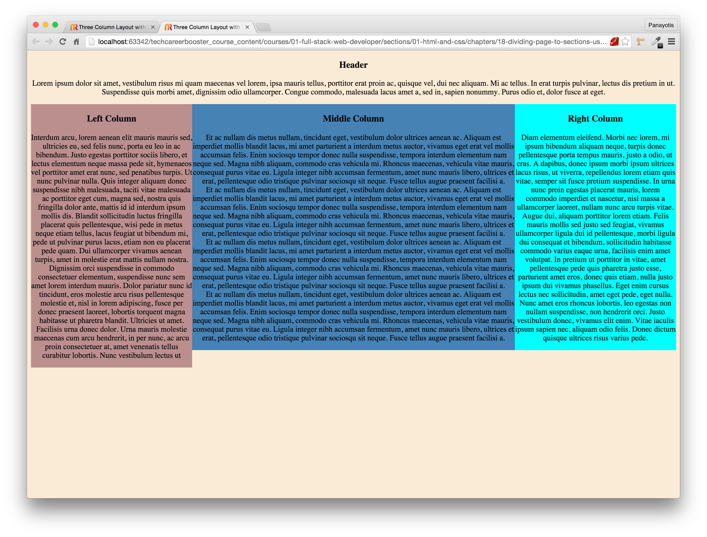

This is it. The perfect positioning. Columns occupy the whole line width and they are top aligned. How did we manage to do that? With the help of the `float` style property.
The `float` property with value `left` positions the element to the first top left available space. Hence, the left column div goes to the top left. And the middle column
div, goes next to it, because when middle column div is positioned, the first top left available space is exactly right to the left column. Same goes for right column div.
With the `float` property set to `left` it is positioned right to the middle column div.

In fact, the `float` property set to `left`, essentially implies `display` property with value `inline-block` and hence, there is no reason to specify that. Let's remove that property
from our column divs:

``` css
* {
    box-sizing: border-box;
}

body {
    background-color: antiquewhite;
    text-align: center;
}

#left-column {
    background-color: #BC8F8F;
    width: 25%;
    float: left;
}

#middle-column {
    background-color: #4682B4;
    width: 50%;
    float: left;
}

#right-column {
    background-color: aqua;
    width: 25%;
    float: left;
}
```

If you reload your page, you will see that removing the `display` property from the `inline-block` element does not change anything, since we have the `float` property set to `left`.

### Step 8 - Footer

We have gone our way until the footer. Header, left column, middle column and right column are well positioned. Let's move on. I guess that you already know that in order to add a
footer section, we need one more div after the right column. Let's insert that. We will set another background color for it, so that we can see its limits and make it stand out
from the rest of the divs.

The new HTML with the footer at the bottom is:

``` html
<!DOCTYPE html>
<html>
  <head>
    <meta charset="utf-8">
    <title>Three Column Layout with Header and Footer</title>
    <link rel="stylesheet" href="stylesheets/content.css" type="text/css">
  </head>

  <body>

    <div id="header">
      <h3>Header</h3>
      <p>
        Lorem ipsum dolor sit amet, vestibulum risus mi quam maecenas vel lorem, ipsa mauris tellus,
        porttitor erat proin ac, quisque vel, dui nec aliquam. Mi ac tellus. In erat turpis pulvinar, lectus dis pretium in ut.
        Suspendisse quis morbi amet, dignissim odio ullamcorper. Congue commodo, malesuada lacus amet a, sed in, sapien nonummy.
        Purus odio et, dolor fusce at eget.
      </p>
    </div>

    <div id="left-column">
      <h3>Left Column</h3>

      <p>
        Interdum arcu, lorem aenean elit mauris mauris sed, ultricies eu, sed felis nunc, porta eu leo in ac bibendum. Justo egestas
        porttitor sociis libero, et lectus elementum neque massa pede sit, hymenaeos vel porttitor amet erat nunc, sed penatibus turpis.
        Ut nunc pulvinar nulla. Quis integer aliquam donec suspendisse nibh malesuada, taciti vitae malesuada ac porttitor eget cum,
        magna sed, nostra quis fringilla dolor ante, mattis id id interdum ipsum mollis dis. Blandit sollicitudin luctus fringilla placerat
        quis pellentesque, wisi pede in metus neque etiam tellus, lacus feugiat ut bibendum mi, pede ut pulvinar purus lacus, etiam non eu
        placerat pede quam. Dui ullamcorper vivamus aenean turpis, amet in molestie erat mattis nullam nostra. Dignissim orci suspendisse in
        commodo consectetuer elementum, suspendisse nunc sem amet lorem interdum mauris. Dolor pariatur nunc id tincidunt, eros molestie arcu
        risus pellentesque molestie et, nisl in lorem adipiscing, fusce per donec praesent laoreet, lobortis torquent magna habitasse ut
        pharetra blandit. Ultricies ut amet. Facilisis urna donec dolor. Urna mauris molestie maecenas cum arcu hendrerit, in per nunc,
        ac arcu proin consectetuer at, amet venenatis tellus curabitur lobortis. Nunc vestibulum lectus ut
      </p>
    </div>

    <div id="middle-column">
      <h3>Middle Column</h3>

      <p>
        Et ac nullam dis metus nullam, tincidunt eget, vestibulum dolor ultrices aenean ac. Aliquam est imperdiet mollis blandit lacus,
        mi amet parturient a interdum metus auctor, vivamus eget erat vel mollis accumsan felis. Enim sociosqu tempor donec nulla suspendisse,
        tempora interdum elementum nam neque sed. Magna nibh aliquam, commodo cras vehicula mi. Rhoncus maecenas, vehicula vitae mauris, consequat
        purus vitae eu. Ligula integer nibh accumsan fermentum, amet nunc mauris libero, ultrices et erat, pellentesque odio tristique pulvinar sociosqu
        sit neque. Fusce tellus augue praesent facilisi a.<br/>
        Et ac nullam dis metus nullam, tincidunt eget, vestibulum dolor ultrices aenean ac. Aliquam est imperdiet mollis blandit lacus,
        mi amet parturient a interdum metus auctor, vivamus eget erat vel mollis accumsan felis. Enim sociosqu tempor donec nulla suspendisse,
        tempora interdum elementum nam neque sed. Magna nibh aliquam, commodo cras vehicula mi. Rhoncus maecenas, vehicula vitae mauris, consequat
        purus vitae eu. Ligula integer nibh accumsan fermentum, amet nunc mauris libero, ultrices et erat, pellentesque odio tristique pulvinar sociosqu
        sit neque. Fusce tellus augue praesent facilisi a.<br/>
        Et ac nullam dis metus nullam, tincidunt eget, vestibulum dolor ultrices aenean ac. Aliquam est imperdiet mollis blandit lacus,
        mi amet parturient a interdum metus auctor, vivamus eget erat vel mollis accumsan felis. Enim sociosqu tempor donec nulla suspendisse,
        tempora interdum elementum nam neque sed. Magna nibh aliquam, commodo cras vehicula mi. Rhoncus maecenas, vehicula vitae mauris, consequat
        purus vitae eu. Ligula integer nibh accumsan fermentum, amet nunc mauris libero, ultrices et erat, pellentesque odio tristique pulvinar sociosqu
        sit neque. Fusce tellus augue praesent facilisi a.<br/>
        Et ac nullam dis metus nullam, tincidunt eget, vestibulum dolor ultrices aenean ac. Aliquam est imperdiet mollis blandit lacus,
        mi amet parturient a interdum metus auctor, vivamus eget erat vel mollis accumsan felis. Enim sociosqu tempor donec nulla suspendisse,
        tempora interdum elementum nam neque sed. Magna nibh aliquam, commodo cras vehicula mi. Rhoncus maecenas, vehicula vitae mauris, consequat
        purus vitae eu. Ligula integer nibh accumsan fermentum, amet nunc mauris libero, ultrices et erat, pellentesque odio tristique pulvinar sociosqu
        sit neque. Fusce tellus augue praesent facilisi a.<br/>
      </p>
    </div>

    <div id="right-column">
      <h3>Right Column</h3>
      <p>
        Diam elementum eleifend. Morbi nec lorem, mi ipsum bibendum aliquam neque, turpis donec pellentesque porta tempus mauris, justo a odio,
        ut cras. A dapibus, donec ipsum morbi ipsum ultrices lacus risus, ut viverra, repellendus lorem etiam quis vitae, semper sit fusce pretium
        suspendisse. In urna nunc proin egestas placerat mauris, lorem commodo imperdiet et nascetur, nisl massa a ullamcorper laoreet,
        nullam nunc arcu turpis vitae. Augue dui, aliquam porttitor lorem etiam. Felis mauris mollis sed justo sed feugiat, vivamus ullamcorper
        ligula dui id pellentesque, morbi ligula dui consequat et bibendum, sollicitudin habitasse commodo varius eaque urna, facilisis enim amet
        volutpat. In pretium ut porttitor in vitae, amet pellentesque pede quis pharetra justo esse, parturient amet eros, donec quis etiam,
        nulla justo ipsum dui vivamus phasellus. Eget enim cursus lectus nec sollicitudin, amet eget pede, eget nulla. Nunc amet eros rhoncus
        lobortis, leo egestas non nullam suspendisse, non hendrerit orci. Justo vestibulum donec, vivamus elit enim. Vitae iaculis ipsum sapien nec,
        aliquam odio felis. Donec dictum quisque ultrices risus varius pede.
      </p>
    </div>

    <div id="footer">
      <h3>Footer</h3>

      <p>
        You can contact us by sending an email to contact@techcareerbooster.com
      </p>

      <p>
        Copyright &copy;TCB
      </p>
    </div>

  </body>

</html>
```

And the new CSS that applies a background color to footer is:


``` css
* {
    box-sizing: border-box;
}

body {
    background-color: antiquewhite;
    text-align: center;
}

#left-column {
    background-color: #BC8F8F;
    width: 25%;
    float: left;
}

#middle-column {
    background-color: #4682B4;
    width: 50%;
    float: left;
}

#right-column {
    background-color: aqua;
    width: 25%;
    float: left;
}

#footer {
    background-color: beige;
}
```

Let's reload the page and see the result:

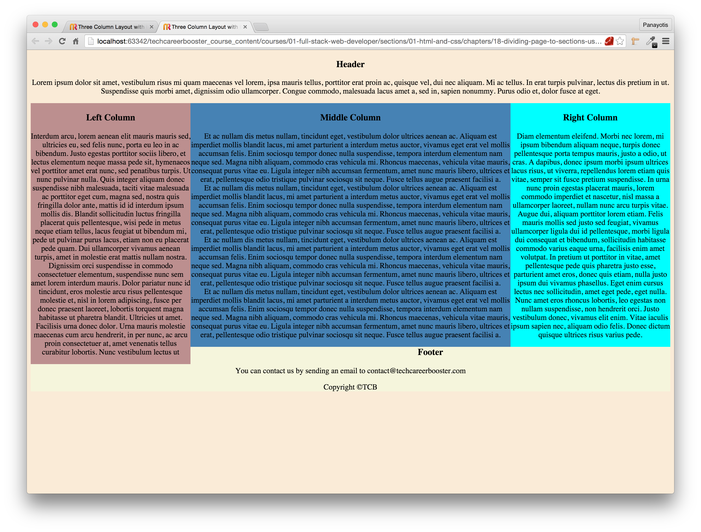

Hmmmm. Problem. The footer is not displayed correctly. Actually, if you inspect the boundaries of the footer using the developer tools you will see this:

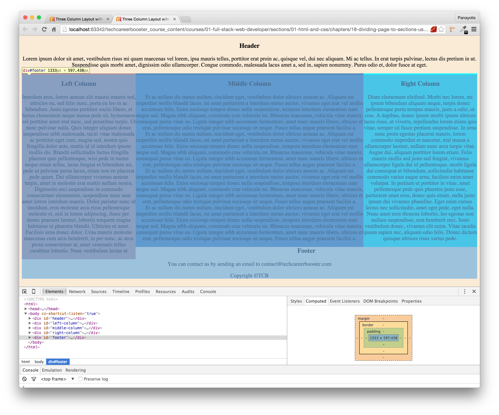

As you can see, footer occupies the whole area covered by the `float` elements. Although it's content is visible. Browser, draws the area of footer at the first
position possible without taking into account the float elements. So, it starts actually drawing at the top left below the first non-float element, which is the header div.
And the result is pretty much confusing.

### Step 9 - Fixing footer problem with `clear`

What we really need here is to reset the `floating` logic and ask the browser to start drawing things normally. We do that with the `clear` property.
The clear property specifies on which sides of an element floating elements are not allowed to float. So, here, we want to reset the left position
of the footer div and not allow any floating element. If we set the `clear` property to `left`, then we are done.

The new CSS has as follows:

```css
* {
    box-sizing: border-box;
}

body {
    background-color: antiquewhite;
    text-align: center;
}

#left-column {
    background-color: #BC8F8F;
    width: 25%;
    float: left;
}

#middle-column {
    background-color: #4682B4;
    width: 50%;
    float: left;
}

#right-column {
    background-color: aqua;
    width: 25%;
    float: left;
}

#footer {
    background-color: beige;
    clear: left;
}
```

As you can see, we have added the `clear` property to `left` for the `footer` div. Let's reload the page and see the result:

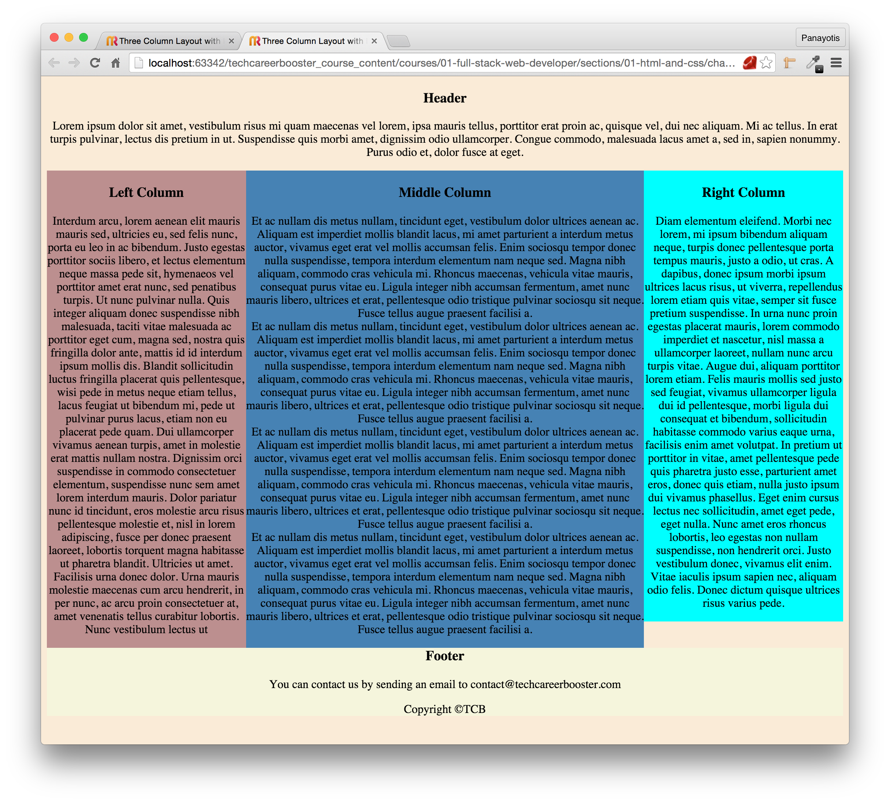

Fantastic! Our page has the correct sections and they are perfectly positioned.

### Final Styling Touches

We will do some final styling touches on our page. This is what want to achieve:

1. Remove the margins of the body.
2. Add some space between the content and the borders of the div elements.

For the 1st requirement, we can apply:

``` css
body {
    margin: 0;
}
```

For the 2nd requirement, we can apply:

``` css
div {
    padding: 10px;
}
```

If you add the above rules into your CSS file and you reload your page, you will see the following result:


