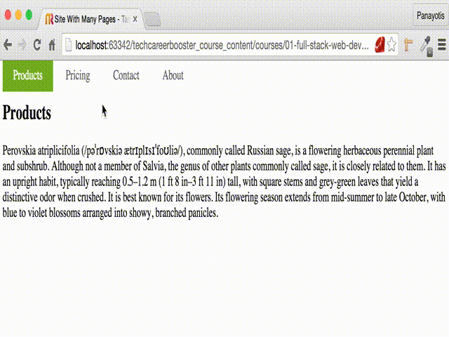

In this chapter, you are going to learn about HTML links, the elements that allow the visitor
to travel from one page to another.

Besides that, you will learn how to style links and create a top navigation menu. The new site
you are developing now, has many pages and user uses the top navigation bar to go from one page to the other.

