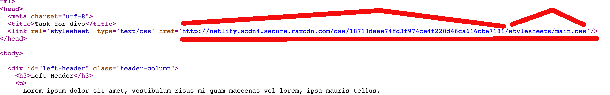
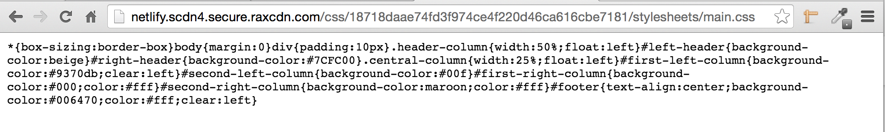

## Deploying Our Work

We have created a lot of HTML pages until now. It's about time to let the world be able to have a look at them.
This will expose ourselves and our work and will be our incentive to make our work be very good.
Also, we will start understanding little-by-little what does release to production mean.

### Static Sites

Currently, we have created static pages for static sites. They are called `static` because they do not build their
content at run-time, dynamically. The HTML content preexists inside `.html` files. The content is served as it is
and it is not changed on the fly by the server.

> *Note:* We will learn how to change the content of our HTML pages on the client side. This can be done with JavaScript.
> However, this would be a technique that takes place on the browser, rather than on the server sending the
> content to browser. That is why one may consider, even in those cases, the site to be static.

### Sites are hosted on Servers

Sites are hosted on servers that are 24x7 switched on, publicly available, as part of the global Internet. So, in order for
our site to be publicly available, its content needs to be uploaded into such a server.

### Companies Offering Hosting

There are many companies that offer hosting for static Web sites. One such company is `Netlify` and this is the one that
we are going to use in this course for our static sites.

### Netlify - Create an Account

So, your responsibility now is to create an account with `https://www.netlify.com`. This is very easy. You visit the home
page of the service and you click on Start Here. You need to register with your email and provide a password. After that,
you will need to confirm your email. Then you are done.

See a short video that demonstrates this process:

<div style="margin-top: 20px; margin-bottom: 20px; margin-left: auto; margin-right: auto; text-align: center;">
  <a href="http://www.youtube.com/watch?v=9lQBXVfzUDw">
    </img>
  </a>
</div>

### Deploy our first Site

We are about to deploy our first site. Deploying to Netlify basically means uploading the contents of our site to Netlify.
Netlify has a very handy drag-n-drop functionality that allows us to upload our content.

#### Deploy our Hello World Site

First we will deploy our Hello World Site. On <a href="#" data-type="content-navigation" data-target-course="full-stack-web-developer"
data-target-section="html-and-css" data-target-chapter="hello-world">chapter 3</a>, we have created the content of this site.

> **Important:** Each static site, needs to have a file with name `index.html`. This file should exist in the root folder of
your site. This is the file that the server is using as a start-navigation file, in order to serve your site to your visitors.
So, **name** your hello world HTML page with the filename `index.html` before trying to upload that to Netlify.

Take this file and upload it to your Netlify account, in the area that Netlify tells you to upload your file. Assuming that the
file has the name "index.html", watch the following video to see what you have to do:

<div id="media-title-How you can upload your hello world site to Netlify">How you can upload your hello world site to Netlify</div>
<a href="https://player.vimeo.com/video/194000146"></a>
           

#### Updating our Site

With Netlify is very easy to update the content of your site. You only have to drag-n-drop the new content in the area that
corresponds to your site. Suppose that we want to update our hello world site with the following code:

``` html
<!DOCTYPE html>
<html>
  <head>
    <meta charset="utf-8">
    <title>Hello World Page</title>
  </head>

  <body>
    <h1>Hello World</h1>
    <div>
      <small>Copyright &copy; ACME 2016</small>
    </div>
  </body>
</html>
```
which basically adds a small copyright notice.

Save this file with the name **index.html** and follow the steps on the following video to upload it to Netlify.

> **Important:** On Netlify, do not create a new site every time you want to update a new one.

<div id="media-title-How you can update your hello world site on Netlify">How you can update your hello world site on Netlify</div>
<a href="https://player.vimeo.com/video/193998810"></a>

### Deploying a Site with Stylesheets/CSS

Until now we have uploaded a site that was composed of only 1 file, the `index.html` file. Now, we are going to
upload a site that contains both an `index.html` file (which is absolutely necessary for the static sites as we
said earlier) and another file `main.css` that resides inside the folder `stylesheets`. So, the structure of the
folders and files for our site is as follows:

```
--[stylesheets]
       |
       |-- main.css
-- index.html
```

For `index.html` use the following content:
```
<!DOCTYPE html>
<html>
  <head>
    <meta charset="utf-8">
    <title>Task for divs</title>
    <link rel="stylesheet" href="stylesheets/main.css" type="text/css">
  </head>

  <body>

    <div id="left-header" class="header-column">
      <h3>Left Header</h3>
      <p>
        Lorem ipsum dolor sit amet, vestibulum risus mi quam maecenas vel lorem, ipsa mauris tellus,
        porttitor erat proin ac, quisque vel, dui nec aliquam.
      </p>
    </div>

    <div id="right-header" class="header-column">
      <h3>Right Header</h3>
      <p>
        Lorem ipsum dolor sit amet, vestibulum risus mi quam maecenas vel lorem, ipsa mauris tellus,
        porttitor erat proin ac, quisque vel, dui nec aliquam.
      </p>

    </div>

    <div id="first-left-column" class="central-column">
      <h3>First Left Column</h3>
      <p>
        Interdum arcu, lorem aenean elit mauris mauris sed, ultricies eu, sed felis nunc, porta eu leo in ac bibendum. Justo egestas
        porttitor sociis libero, et lectus elementum neque massa pede sit, hymenaeos vel porttitor amet erat nunc, sed penatibus turpis.
        Ut nunc pulvinar nulla. Quis integer aliquam donec suspendisse nibh malesuada, taciti vitae malesuada ac porttitor eget cum,
        magna sed, nostra quis fringilla dolor ante, mattis id id interdum ipsum mollis dis. Blandit sollicitudin luctus fringilla placerat
        quis pellentesque, wisi pede in metus neque etiam tellus, lacus feugiat ut bibendum mi, pede ut pulvinar purus lacus, etiam non eu
        placerat pede quam. Dui ullamcorper vivamus aenean turpis, amet in molestie erat mattis nullam nostra. Dignissim orci suspendisse in
        commodo consectetuer elementum, suspendisse nunc sem amet lorem interdum mauris. Dolor pariatur nunc id tincidunt, eros molestie arcu
        risus pellentesque molestie et, nisl in lorem adipiscing, fusce per donec praesent laoreet, lobortis torquent magna habitasse ut
        pharetra blandit. Ultricies ut amet. Facilisis urna donec dolor. Urna mauris molestie maecenas cum arcu hendrerit, in per nunc,
        ac arcu proin consectetuer at, amet venenatis tellus curabitur lobortis. Nunc vestibulum lectus ut
      </p>
    </div>

    <div id="second-left-column" class="central-column">
      <h3>Second Left Column</h3>
      <p>
        Interdum arcu, lorem aenean elit mauris mauris sed, ultricies eu, sed felis nunc, porta eu leo in ac bibendum. Justo egestas
        porttitor sociis libero, et lectus elementum neque massa pede sit, hymenaeos vel porttitor amet erat nunc, sed penatibus turpis.
        Ut nunc pulvinar nulla. Quis integer aliquam donec suspendisse nibh malesuada, taciti vitae malesuada ac porttitor eget cum,
        magna sed, nostra quis fringilla dolor ante, mattis id id interdum ipsum mollis dis. Blandit sollicitudin luctus fringilla placerat
        quis pellentesque, wisi pede in metus neque etiam tellus, lacus feugiat ut bibendum mi, pede ut pulvinar purus lacus, etiam non eu
        placerat pede quam. Dui ullamcorper vivamus aenean turpis, amet in molestie erat mattis nullam nostra. Dignissim orci suspendisse in
        commodo consectetuer elementum, suspendisse nunc sem amet lorem interdum mauris. Dolor pariatur nunc id tincidunt, eros molestie arcu
        risus pellentesque molestie et, nisl in lorem adipiscing, fusce per donec praesent laoreet, lobortis torquent magna habitasse ut
        pharetra blandit. Ultricies ut amet. Facilisis urna donec dolor. Urna mauris molestie maecenas cum arcu hendrerit, in per nunc,
        ac arcu proin consectetuer at, amet venenatis tellus curabitur lobortis. Nunc vestibulum lectus ut
      </p>
    </div>

    <div id="first-right-column" class="central-column">
      <h3>First Right Column</h3>
      <p>
        Interdum arcu, lorem aenean elit mauris mauris sed, ultricies eu, sed felis nunc, porta eu leo in ac bibendum. Justo egestas
        porttitor sociis libero, et lectus elementum neque massa pede sit, hymenaeos vel porttitor amet erat nunc, sed penatibus turpis.
        Ut nunc pulvinar nulla. Quis integer aliquam donec suspendisse nibh malesuada, taciti vitae malesuada ac porttitor eget cum,
        magna sed, nostra quis fringilla dolor ante, mattis id id interdum ipsum mollis dis. Blandit sollicitudin luctus fringilla placerat
        quis pellentesque, wisi pede in metus neque etiam tellus, lacus feugiat ut bibendum mi, pede ut pulvinar purus lacus, etiam non eu
        placerat pede quam. Dui ullamcorper vivamus aenean turpis, amet in molestie erat mattis nullam nostra. Dignissim orci suspendisse in
        commodo consectetuer elementum, suspendisse nunc sem amet lorem interdum mauris. Dolor pariatur nunc id tincidunt, eros molestie arcu
        risus pellentesque molestie et, nisl in lorem adipiscing, fusce per donec praesent laoreet, lobortis torquent magna habitasse ut
        pharetra blandit. Ultricies ut amet. Facilisis urna donec dolor. Urna mauris molestie maecenas cum arcu hendrerit, in per nunc,
        ac arcu proin consectetuer at, amet venenatis tellus curabitur lobortis. Nunc vestibulum lectus ut
      </p>
    </div>

    <div id="second-right-column" class="central-column">
      <h3>Second right Column</h3>
      <p>
        Interdum arcu, lorem aenean elit mauris mauris sed, ultricies eu, sed felis nunc, porta eu leo in ac bibendum. Justo egestas
        porttitor sociis libero, et lectus elementum neque massa pede sit, hymenaeos vel porttitor amet erat nunc, sed penatibus turpis.
        Ut nunc pulvinar nulla. Quis integer aliquam donec suspendisse nibh malesuada, taciti vitae malesuada ac porttitor eget cum,
        magna sed, nostra quis fringilla dolor ante, mattis id id interdum ipsum mollis dis. Blandit sollicitudin luctus fringilla placerat
        quis pellentesque, wisi pede in metus neque etiam tellus, lacus feugiat ut bibendum mi, pede ut pulvinar purus lacus, etiam non eu
        placerat pede quam. Dui ullamcorper vivamus aenean turpis, amet in molestie erat mattis nullam nostra. Dignissim orci suspendisse in
        commodo consectetuer elementum, suspendisse nunc sem amet lorem interdum mauris. Dolor pariatur nunc id tincidunt, eros molestie arcu
        risus pellentesque molestie et, nisl in lorem adipiscing, fusce per donec praesent laoreet, lobortis torquent magna habitasse ut
        pharetra blandit. Ultricies ut amet. Facilisis urna donec dolor. Urna mauris molestie maecenas cum arcu hendrerit, in per nunc,
        ac arcu proin consectetuer at, amet venenatis tellus curabitur lobortis. Nunc vestibulum lectus ut
      </p>
    </div>

    <div id="footer">
      <h3>Footer</h3>

      <p>
        You can contact us by sending an email to contact@techcareerbooster.com
      </p>

      <p>
        Copyright &copy;TCB
      </p>
    </div>

  </body>
</html>
```

and for the `stylesheets\main.css` file use the content:

``` css
* {
    box-sizing: border-box;
}

body {
    margin: 0;
}

div {
    padding: 10px;
}

.header-column {
    width: 50%;
    float: left;
}

#left-header {
    background-color: #F5F5DC;
}

#right-header {
    background-color: #7CFC00;
}

.central-column {
    width: 25%;
    float: left;
}

#first-left-column {
    background-color: mediumpurple;
    clear: left;
}

#second-left-column {
    background-color: blue;
}

#first-right-column {
    background-color: black;
    color: White;
}

#second-right-column {
    background-color: maroon;
    color: White;
}

#footer {
    text-align: center;
    background-color: #006470;
    color: White;
    clear: left;
}
```
If you load the `index.html` file on your browser, you should see the following:


Now, we are going to create **a new site** on Netlify and upload the content above. The important things that you need to take care of are the following:

* We are creating a new site
* We need to select on our file browser (Finder for Mac, Windows File Browser for Windows, File Explorer for Linux) all the files and folders that comprise
our site
* Drag the selection of previous step and drop it on the Netlify placeholder that accepts site content for upload.

**Watch** the video below, before you try that yourself:

<div id="media-title-Deploy a site with index and stylesheets folder">Deploy a site with index and stylesheets folder</div>
<a href="https://player.vimeo.com/video/193998225"></a>

### Deploying to Netlify using the command line

Netlify offers a command line tool that can be used for you to deploy your site. You can read about it [here](https://www.netlify.com/docs/cli). However,
we will not expand further on that.


### Netlify Optimizes our CSS

Netlify, and this is done by many other host providers, optimizes our CSS with the following things that it does:

1. Delivers the CSS content from a file that does not reside on the same host server as the main HTML content.
2. Compresses the CSS content (for example, by removing white spaces and turning the whole content into one line).

If you inspect the source code of the page of your Netlify deployed site, you will experience these two optimizations above. Here is the source code image:



As you can see in this picture, Netlify serves the `stylesheets/main.css` file from their optimized CDN network (Content Delivery Network),
and not from the URL of your production site. CDNs are optimized to serve static content, like CSS and JavaScript files.

You can copy the URL that is used by Netlify as the CSS reference and paste it on your browser address. This will fetch the CSS that your production site is
using. You will see something like that:



As you can see above, the CSS content is compressed (compare it to the original content of your `stylesheets\main.css` file). It has the blanks removed, it is one line
(although displayed wrapped by the browser) and it has other optimizations too.

Watch the following video to understand again the process of inspecting the source code and the CSS compressed content.

<div id="media-title-Inspect Source Code and Use Developer Tools To See Optimized CSS">Inspect Source Code and Use Developer Tools To See Optimized CSS</div>
<a href="https://player.vimeo.com/video/193999616"></a>

### Disable Optimization of your CSS content

Sometimes it is useful to ask Netlify to NOT compress the CSS content. We want Netlify to leave the CSS content as is
when we want to do some kind of debugging on deployed site, using the developer tools. Or when we want our site to
serve development-mode or staging-mode purposes and not production-mode purposes. In that case, compressed CSS content
might not help.

> **Important** On production sites, we always want the hosting provider, like Netlify, to compress our CSS content
and serve it from their special CDN server.

If we want to disable CSS optimization, we need to go to our Netlify site settings, on the `Post Processing` section, click `Edit`
and remove the `Bundle CSS` and `Minify CSS` options.

> *Information:* `Bundle CSS` is used when we have more than 1 CSS file. It concatenates the files into one in order to reduce the
number of browser requests. `Minify CSS` compresses the content of the CSS file.

Go ahead and do this change for your site. Then visit your site and using the developer tools. Inspect the CSS reference (in the `head` section
of your file) and the actual CSS content.

Watch this video to understand what I mean:

<div id="media-title-Inspect Source Code and Use Developer Tools To See Non-Optimized Version of your CSS">Inspect Source Code and Use Developer Tools To See Non-Optimized Version of your CSS</div>
<a href="https://player.vimeo.com/video/193999064"></a>
