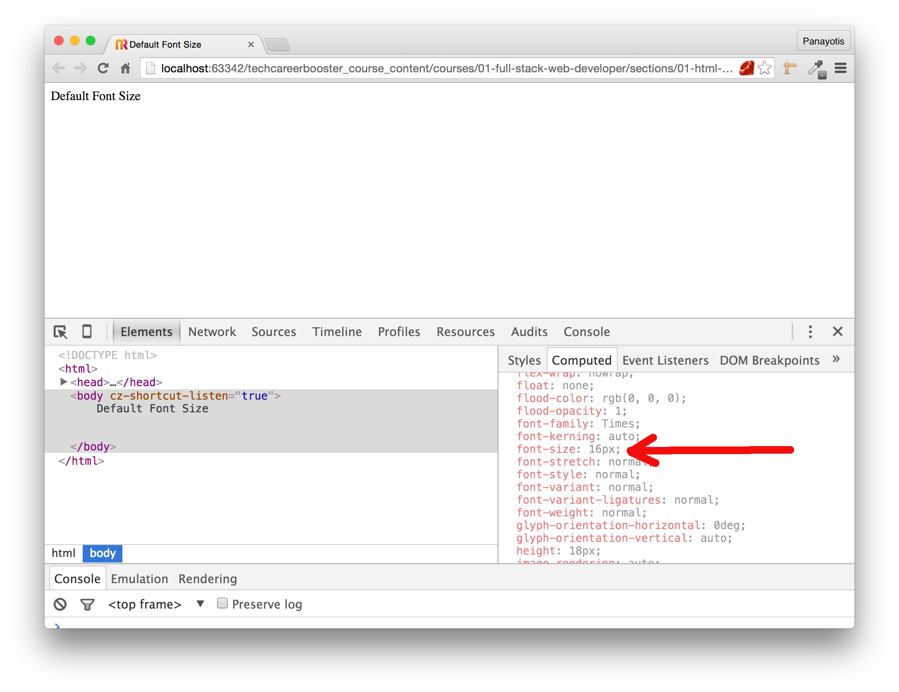
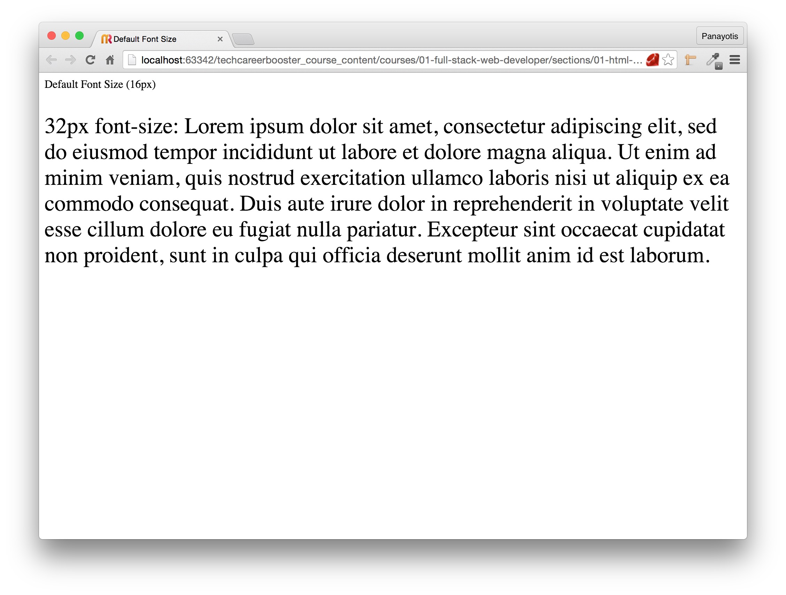
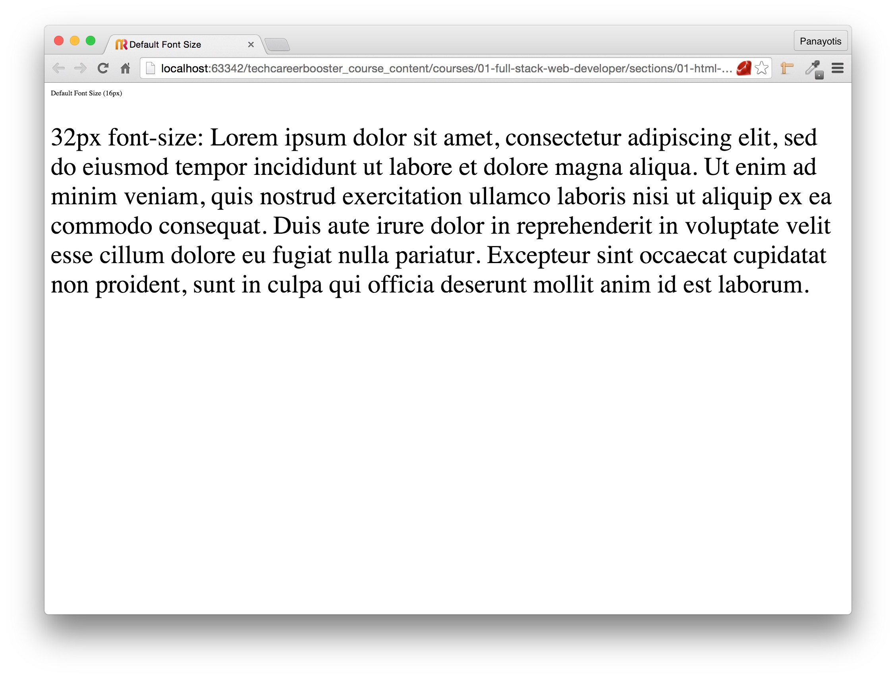
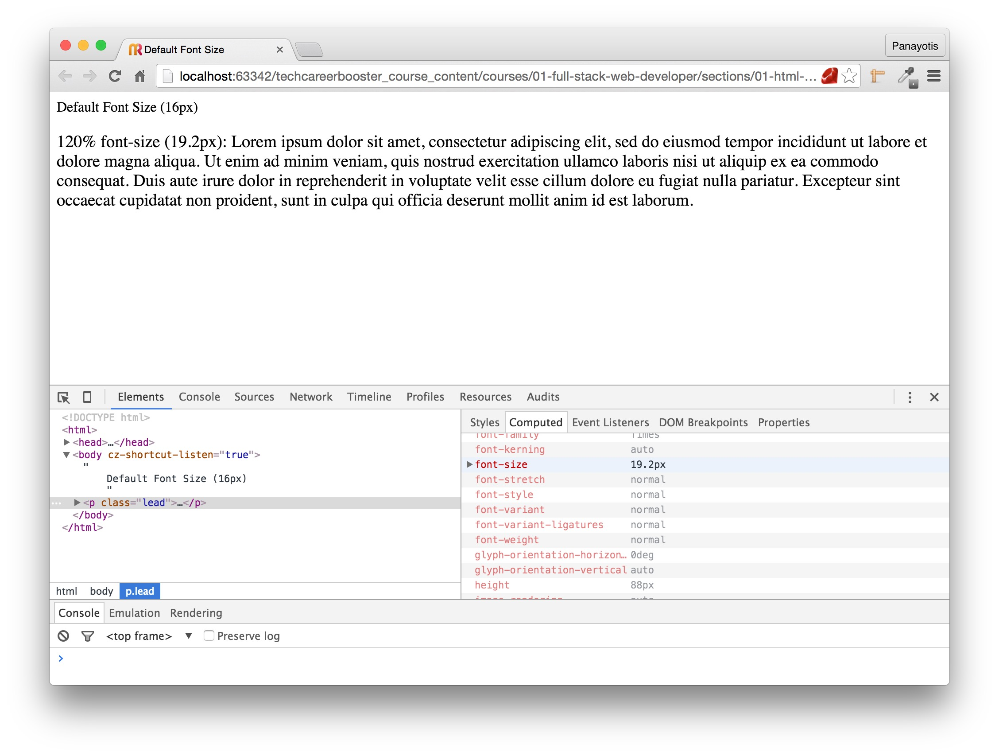

In our CSS files, we have used a couple of measurement units to declare the width and/or height of an element, or the font size of text.

* `px` We have used pixels (`px`) in various occasions. For example to declare the size of a `div` or an `image`. Or in order to set the font size.
* `%` We have used a percentage value to declare the size of an element in relation to the size of its container.

Let's learn some more things about measurement units in CSS.

### Everything is pixels

No matter what unit we use to specify the dimensions of an element, finally, the browser is going to calculate its size in pixels. We will later on
see how different units are converted to pixels. The point here is that 1 pixel does not necessary occupy the same space (e.g. calculated in inches or
centimeters) on the display. It depends on the quality of the display. So, a display with high number of dpi (dots per inch) or ppi (pixels per inch) will display an area
of 10 x 10 pixels in less, more compact, space from another display with lower dpi. In other words, if we have a display that has 10dpi resolution, it
will require 1 inch<sup>2</sup> area to display 10 x 10 pixels. Whereas if the display has 20dpi resolution, it will require 0.25 inch<sup>2</sup> (0.5 x 0.5). Or in other words,
a 10px font-size letter will be displayed smaller on higher resolution displays.

### Absolute Units

`px` is an absolute unit of measurement. Some other absolute units that you can use are the following:

* `cm`: centimeters
* `mm`: millimeters
* `in`: inches
* `pt`: points. Each point is 1/72 of 1 inch.
* `pc`: picas. Each pica is 12 points.

Which measurement unit you would use, depends on the device medium you are trying to design a page for. If it is for a display, we usually use
pixels. If it is for a printer, we might use points or inches or other absolute measurement unit. But again, there is no rule here. As long as
you know what you are doing, you can use any of the above absolute units.

### Default Font Size

When you have an empty, bare minimum, web page, the browsers are using a default font size for the content of the `body`. Let's see that:

``` html
<!DOCTYPE html>
<html>
  <head>
    <meta charset="utf-8">
    <title>Default Font Size</title>
  </head>

  <body>
    Default Font Size
  </body>

</html>
```

Save the above page and load it on your browser. Then open the developer tools, select the `body` on the elements and go on the right panel
on `Computed` values. Scroll down to find the `font-size` property. You will see that it has the value `16px`.



All popular browsers are using the default font-size of `16px` if you do not specify any font size. This, however, can be changed via the settings of your browser. For
Chrome, if one goes to `Settings` and then to `Advanced Settings`, he can change the default font size from `Medium` to other value.

Watch this video here to see how we change the browser default font size value from `Medium` (which is the default and corresponds to 16px)
to other values and then back to `Medium`.

<div id="media-title-video-changing-browser-default-font-size.mp4-How to change browser default font size?">How to change browser default font size?</div>
<a href="https://player.vimeo.com/video/194086890"></a>

### Default Font Size and Absolute Units

There is a problem with default font size and absolute units, that you might expect. The absolute units, ignore the default font size. Hence, if the
user changes the default browser font size, but the page uses an absolute value to specify the font size of the text, default value is ignored.

Let's see the following example:

``` html
<!DOCTYPE html>
<html>
  <head>
    <meta charset="utf-8">
    <title>Default Font Size</title>
    <link rel="stylesheet" href="stylesheets/main.css" type="text/css">
  </head>

  <body>
    Default Font Size (16px)
    <p class="lead">
      32px font-size: Lorem ipsum dolor sit amet, consectetur adipiscing elit, sed do eiusmod tempor incididunt ut labore et dolore magna aliqua.
      Ut enim ad minim veniam, quis nostrud exercitation ullamco laboris nisi ut aliquip ex ea commodo consequat. Duis aute irure dolor
      in reprehenderit in voluptate velit esse cillum dolore eu fugiat nulla pariatur. Excepteur sint occaecat cupidatat non proident,
      sunt in culpa qui officia deserunt mollit anim id est laborum.
    </p>
  </body>

</html>
```

with the following CSS:

``` css
* {
    box-sizing: border-box;
}

.lead {
    font-size: 32px;
}
```

If you save and reload your page, you will see this:



The above picture is when viewing at the page with the default browser font size to 16px and with the paragraph absolute font size to 32px. Now if you go and change the
default browser font size to `Very Small`, which corresponds to `9px`, you will see that the paragraph font size is not changed, because its font size is
hard coded to `32px` absolute value. You will see this:



> *Note:* If you changed your default browser settings to `Very Small` (`9px`) set it back to `Medium`

### Relative Units

Sometimes, we do not want to specify the font-size with an absolute unit value, but we want to do that in relation to the font-size of another element. Let's see the
following HTML code:

``` html
<!DOCTYPE html>
<html>
  <head>
    <meta charset="utf-8">
    <title>Default Font Size</title>
    <link rel="stylesheet" href="stylesheets/main.css" type="text/css">
  </head>

  <body>
    Default Font Size (16px)
    <p class="lead">
      120% font-size (19.2px): Lorem ipsum dolor sit amet, consectetur adipiscing elit, sed do eiusmod tempor incididunt ut labore et dolore magna aliqua.
      Ut enim ad minim veniam, quis nostrud exercitation ullamco laboris nisi ut aliquip ex ea commodo consequat. Duis aute irure dolor
      in reprehenderit in voluptate velit esse cillum dolore eu fugiat nulla pariatur. Excepteur sint occaecat cupidatat non proident,
      sunt in culpa qui officia deserunt mollit anim id est laborum.
    </p>
  </body>

</html>
```

with the following CSS:

``` css
* {
    box-sizing: border-box;
}

.lead {
    font-size: 120%;
}
```

As you can see above, the `font-size` for the paragraph is set to `120%`. This means 120% of the `font-size` value of its parent. Its parent is `body`, which has the
browser default `font-size` value of `16px`. Hence, the `font-size` of the paragraph is 16 * 120% = 19.2px.

If you save the above files and reload the page in your browser you will see this:


`%` is a *relative unit* of sizing. We have already used that to create multi-column layouts. Here we have used it to define the font size of an element. The good thing with
relative units is that, when the size of the element, that size depends on, changes, then that size changes proportionally too. So, this means, that, in our example, if
the default browser font size changes, then the paragraph font size will change too. Let's do that. Go to your browser settings and change the default browser font size
to `Very Small`. Then see how both the body and the paragraph font sizes change proportionally.

<div id="media-title-video-changing-browser-default-font-size-p-with-relative-unit.mp4-How relative units are affected by the size of the property they depend on">How relative units are affected by the size of the property they depend on</div>
<a href="https://player.vimeo.com/video/194083762"></a>
             
In the above video, you will see that when we change the browser default font size to `9px`, then paragraph font size changes to `10.8px`, which is the 120% of 9. When
we set the browser default font size to `Very Large`, i.e. `24px`, then paragraph font size changes to `28.8px`, which is 120% of 24. This proportional change of the
paragraph font size is realized because we have used a relative unit (`%`) to set its font-size. This didn't happen when we used an absolute unit earlier (`px`).

There are some other popular relative units used in the web development today. Some of them are the following:

* `em`: relative to the font size of the current element.
* `rem`: relative to the font size of the root element, i.e. `html` element. So, 1rem usually is 16px, since the `html` font-size, by default, in most browsers is `16px`. The
nice thing with `rem` is that they are not affected by nesting. Whereas `em` and `%`, they are. Nesting and relative font sizes might cause some difficult problems to tackle.
* `vw`: relative to 1% of the width of the viewport. The viewport is the browser window size.
* `vh`: relative to 1% of the height of the viewport.

`rem` units have become very popular to define font sizes. But it is a little bit difficult to convert them to pixels or vice versa:

<table>
    <thead>
      <tr><th colspan="2">Example of Pixels and their REM</th></tr>
      <tr><th>px</th><th>rem</th></tr>
    </thead>
    <tbody>
      <tr><td>12px</td><td>0.75rem</td></tr>
      <tr><td>14px</td><td>0.875rem</td></tr>
      <tr><td>16px</td><td>1rem</td></tr>
      <tr><td>18px</td><td>1.125rem</td></tr>
      <tr><td>20px</td><td>1.25rem</td></tr>
    </tbody>
</table>

This means that if you want to have a paragraph with font size `20px`, you need to remember, calculate, that this is equal to `1.25rem` (assuming that the default font size is `16px`).

There is a trick that you can use to avoid that complex calculation. Applying the following trick, converting pixels to rems would only require you to divide the pixels size
by 10. If you use the following CSS rules:

``` css
html {
    font-size: 62.5%; /* which is equal to 10px (16 * 0.625 = 10) */
}
body {
    font-size: 1.6rem; /* which makes it 16px */
}
```
Then, the body will start having `16px` font-size, but still relevant to browser default font size. And you can convert pixels to rems very easily:

<table>
    <thead>
      <tr><th colspan="2">Example of Pixels and their REM</th></tr>
      <tr><th>px</th><th>rem</th></tr>
    </thead>
    <tbody>
      <tr><td>12px</td><td>1.2rem</td></tr>
      <tr><td>14px</td><td>1.4rem</td></tr>
      <tr><td>16px</td><td>1.6rem</td></tr>
      <tr><td>18px</td><td>1.8rem</td></tr>
      <tr><td>20px</td><td>2.0rem</td></tr>
    </tbody>
</table>

Look at the following html page:

``` html
<!DOCTYPE html>
<html>
  <head>
    <meta charset="utf-8">
    <title>Default Font Size</title>
    <link rel="stylesheet" href="stylesheets/main.css" type="text/css">
  </head>

  <body>
    Body text 1.6rem (16px)
    <p class="lead">
      1.92rem font-size (19.2px): Lorem ipsum dolor sit amet, consectetur adipiscing elit, sed do eiusmod tempor incididunt ut labore et dolore magna aliqua.
      Ut enim ad minim veniam, quis nostrud exercitation ullamco laboris nisi ut aliquip ex ea commodo consequat. Duis aute irure dolor
      in reprehenderit in voluptate velit esse cillum dolore eu fugiat nulla pariatur. Excepteur sint occaecat cupidatat non proident,
      sunt in culpa qui officia deserunt mollit anim id est laborum.
    </p>
  </body>

</html>
```

With the following CSS file:

``` css
* {
    box-sizing: border-box;
}

html {
    font-size: 62.5%;
}

body {
    font-size: 1.6rem;
}

.lead {
    font-size: 1.92rem;
}
```

If you save the above and you reload the page, you will see that you have the same result as earlier. But now, that you are using this technique:

1. You can calculate the `rem` easily, because you only have to divide pixels by 10.
2. Since you are using `rem` you will not face any problem with nesting. All sizes are relevant to the root element font-size.

The good thing with relative units is that if a browser uses a different default font-size, then all sizes are automatically adjusted accordingly.
This capability will become invaluable when we would like our web site to be properly viewed on mobile devices too.

