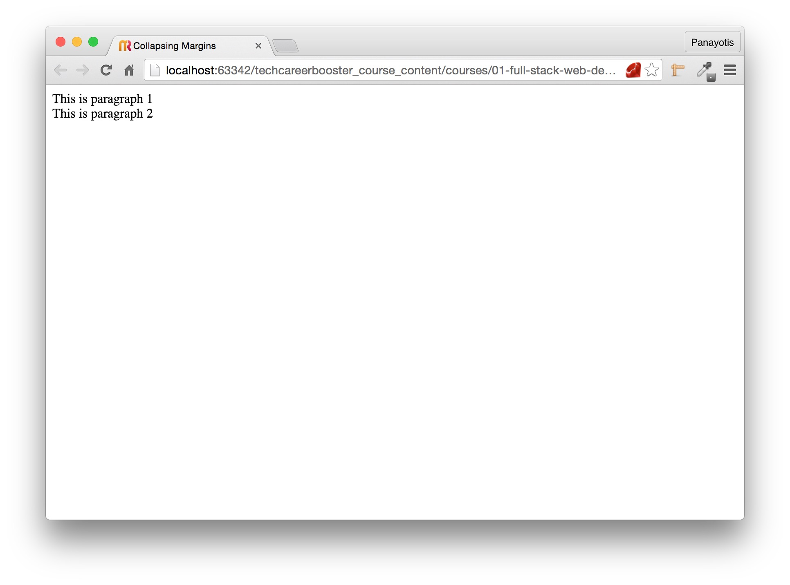
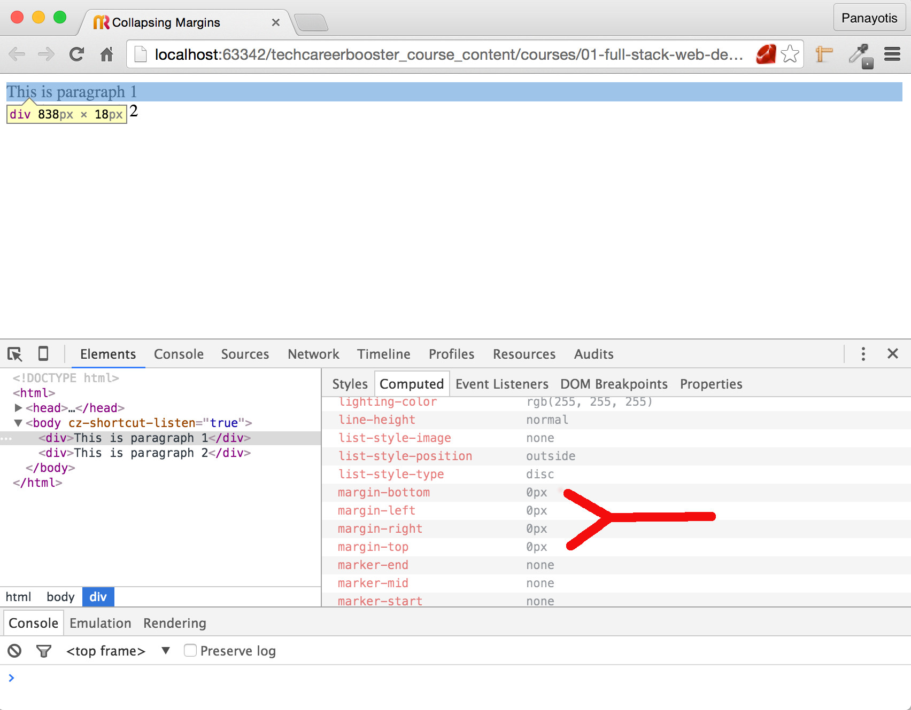
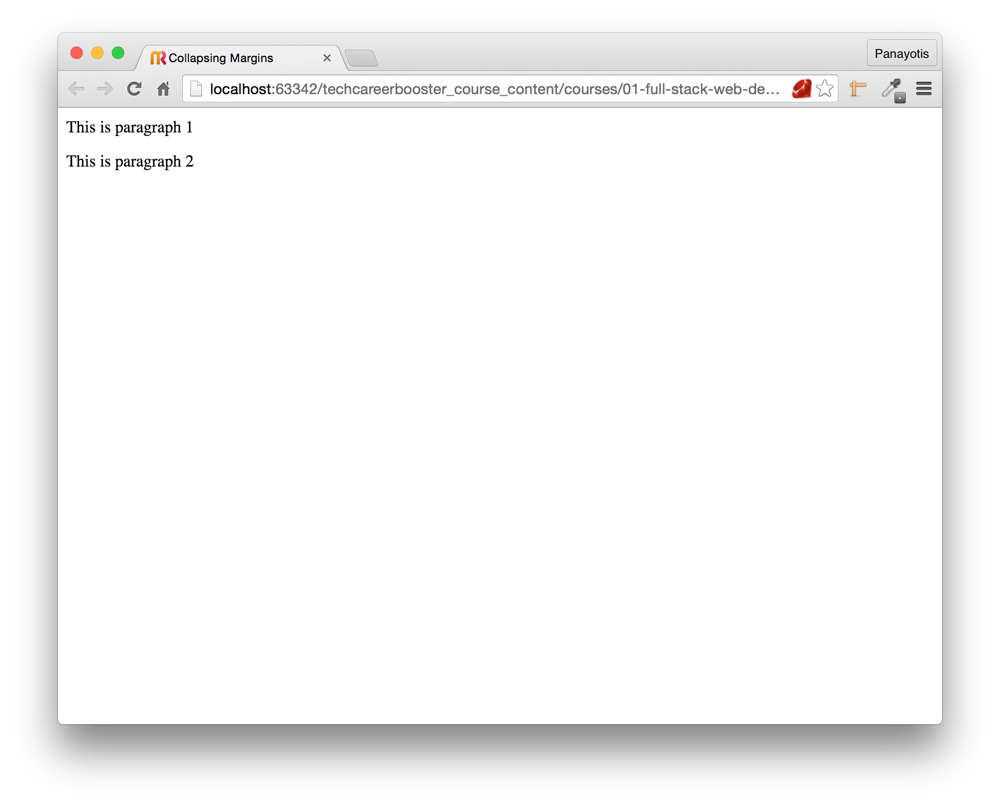
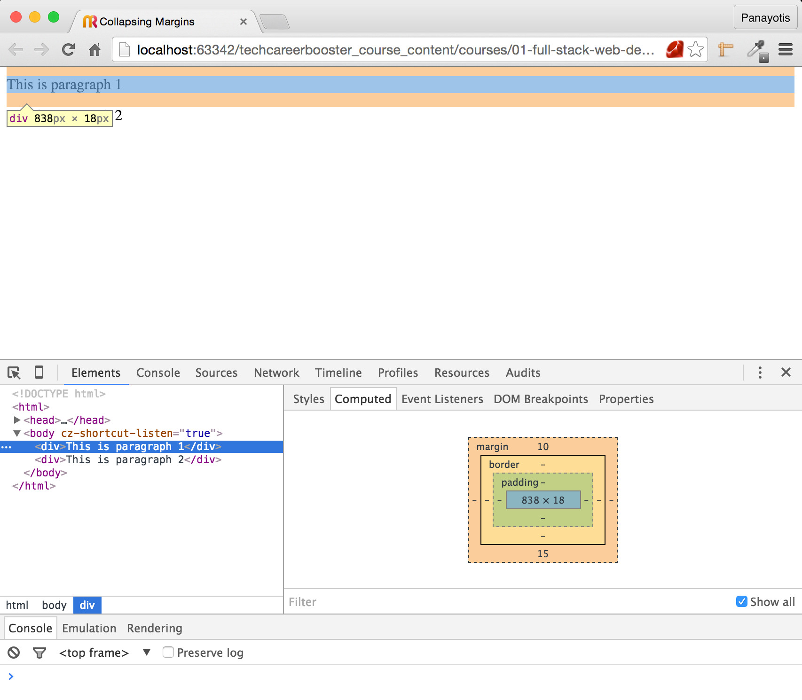
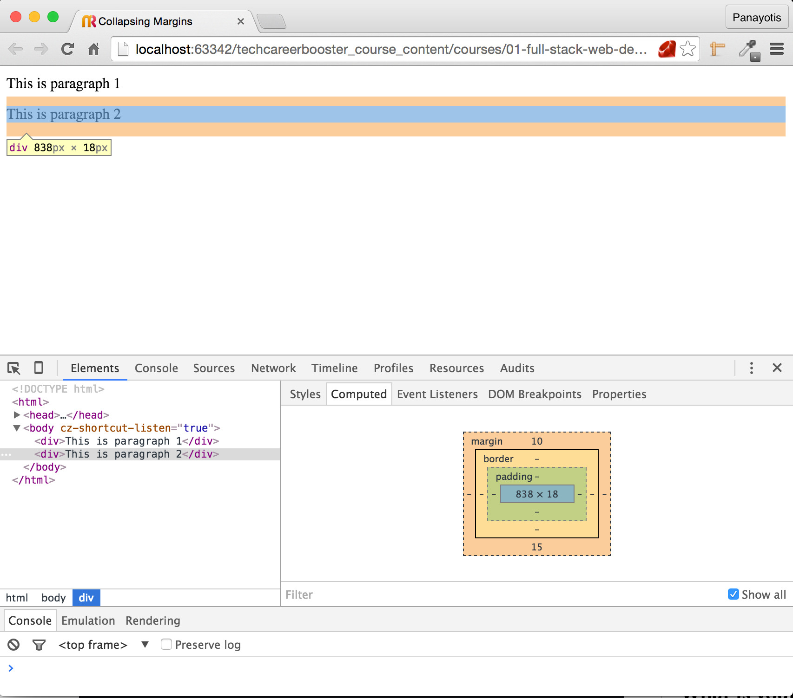
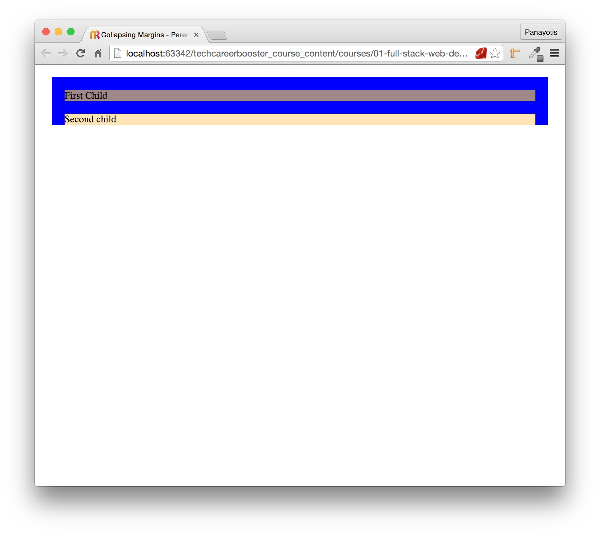
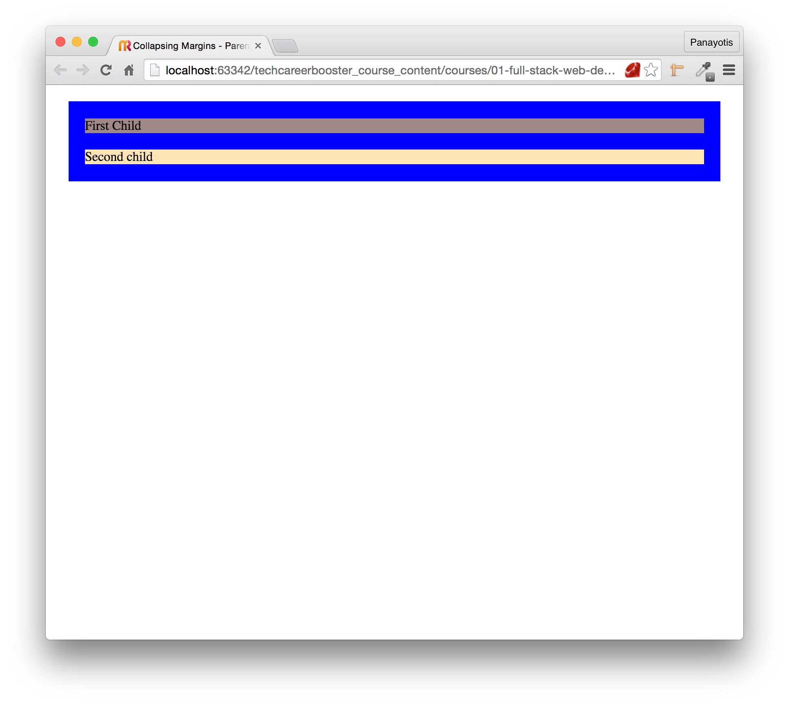
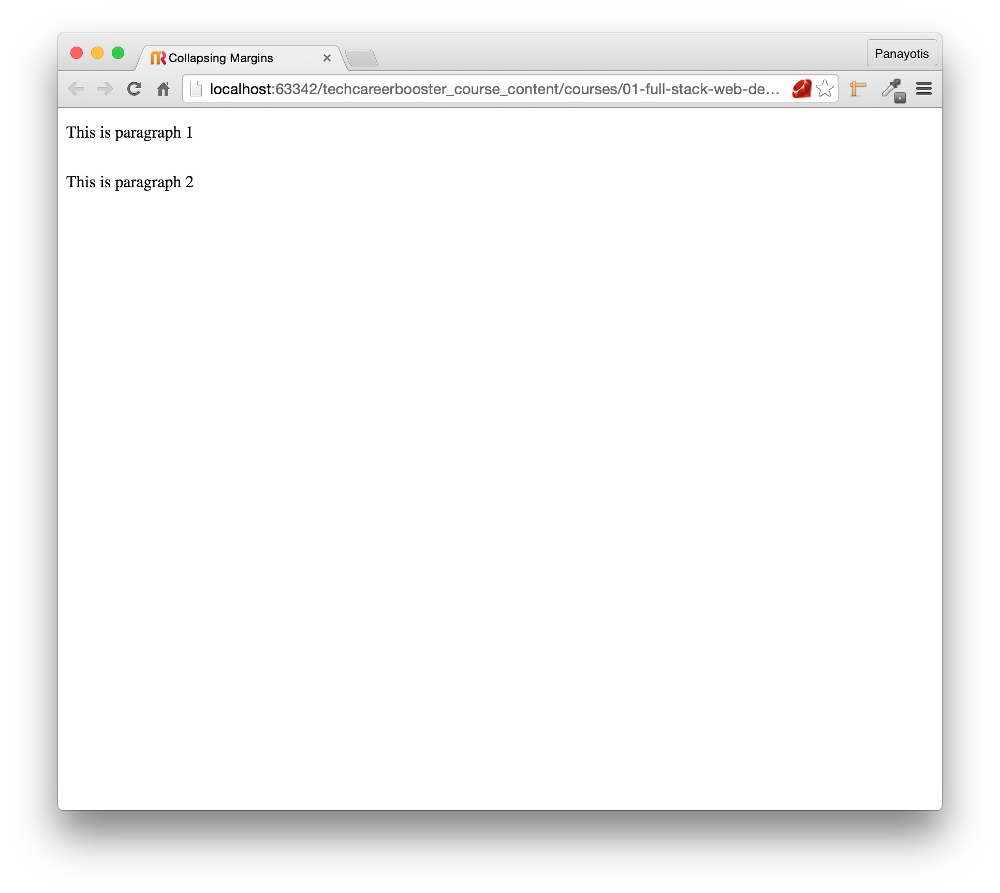
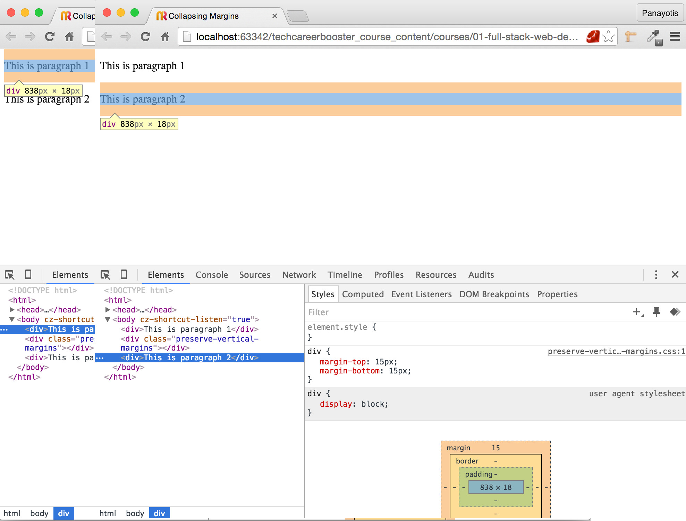

You will often stand in front of a situation in which you are supposed to be having margins, but you do not see them.

Let's see the following simple HTML page:

``` html
<!DOCTYPE html>
<html>
  <head>
    <meta charset="utf-8">
    <title>Collapsing Margins</title>
  </head>

  <body>
    <div>This is paragraph 1</div>
    <div>This is paragraph 2</div>
  </body>
</html>
```

Save the above file as an HTML page and load it on your browser. You will see something like this:



These are two simple `divs`, one on top of the other. If we inspect them with developer tools, we will see that they do not have any top or bottom margins:



Let's create a CSS file that is referenced by our HTML page above. The CSS file should have the following rules:

``` css
div {
    margin-top: 10px;
    margin-bottom: 15px;
}
```

Make sure that your HTML page references the above CSS content:

``` html
<!DOCTYPE html>
<html>
  <head>
    <meta charset="utf-8">
    <title>Collapsing Margins</title>
    <link rel="stylesheet" href="stylesheets/main.css" type="text/css">
  </head>

  <body>
    <div>This is paragraph 1</div>
    <div>This is paragraph 2</div>
  </body>
</html>
```

and reload your page. You will see this:



Note that we gave both divs the same top and bottom margins. And we can see that. But, if you carefully inspect with the developer tools, you will see that the two margins that
were supposed to be touching each other, i.e. the bottom margin of the top div and the top margin of the bottom div, do not both exist.

This is the picture that we see when we inspect the top div with developer tools:



Top div clearly has 10px top and 15px bottom margins. But, if you look carefully, you will see that the bottom margin edge is exactly above the content area of the bottom div.
Why is that? This was not supposed to be like that. It seems that the top margin of the bottom div has disappeared.

What about the picture of the bottom div margins in developer tools? There it is:



Bottom div too, has 10px top and 15px bottom margins.

But, if you look carefully, the top margin of the bottom div does not start at the expected vertical position, i.e. after the end of the bottom edge of the bottom margin of the
top div. It starts **inside** the top div bottom margin area. In fact it is contained, it is completely drawn **inside** the bottom margin area of the top div.
That's why the bottom margin of the top div ends exactly before the main content area of the bottom div starts. As if the bottom div
didn't have any margin.

You can verify that too, if you put the two pictures of the developer tools one next to the other:


In summary, the distance between the content of the top div to the content of the bottom div, is not the sum of the height of the bottom margin of the top div plus the
height of the top margin of the bottom div, a.k.a. 25px. It is only 15px, which is the maximum of the two margins.

This is an example of the collapsing margins phenomenon. And it can cause a lot of headaches when trying to design our page.

### What is collapsing margins?

This phenomenon occurs when two vertical margins are in contact. If one margin is greater than the other, then the larger margin overrides the smaller one, leaving us with only
one margin. If the two margins are of equal size, only one of them stays in.

In fact:

* When we have two positive margins, e.g. 15px and 10px, the total margin is the bigger one, i.e. 15px on our example.
* When we have two equal margins, e.g. 15px each, the total margin is equal to the one of the two, i.e. 15px on our example.
* When we have one positive margin and one negative margin, e.g. 15px and -10px, then the final margin is the sum of the positive and negative margin.
On our example 15px + (-10px) turns out to be 5px.
* When we have two negative margins, e.g. -15px and -10px, then the final margin is the bigger negative margin, i.e. -15px on our example.

### Parents and Children

Things are getting a little bit more complicated when you have nested elements with margins.

Take for example the following HTML page:

``` html
<!DOCTYPE html>
<html>
  <head>
    <meta charset="utf-8">
    <title>Collapsing Margins - Parent Child</title>
    <link rel="stylesheet" href="stylesheets/main.css" type="text/css">
  </head>

  <body>
    <div id="parent">
      <div id="first-child">
        First Child
      </div>
      <div id="second-child">
        Second child
      </div>
    </div>
  </body>
</html>
```
with the following CSS rules:

``` css
div {
    background-color: Blue;
    margin: 20px;
}

#first-child {
    background-color: #A08888;
}

#second-child {
    background-color: #FFE4B5;
}
```
As you can see, we have given a margin around all divs. The parent div has 2 nested children divs. Save those files and load the page on your browser.
The result will be the following:


As you can see, the parent has the expected margins, but:

* The first child top margin has been merged with the parent div top margin.
* The first child bottom margin has been merged with the second child top margin.
* The second child bottom margin has been merged with the parent div bottom margin.

### How can we preserve both parent and children margins?

We need to add something *solid* in the parent content area (border to center area). For example, we can add 1px top padding. Let's do that.
Change the CSS file content to be as follows:

``` css
div {
    background-color: Blue;
    margin: 20px;
}

#parent {
    padding-top: 1px;
}

#first-child {
    background-color: #A08888;
}

#second-child {
    background-color: #FFE4B5;
}
```
Save and reload your page. You will see this:



As you can see, the first child top margin is preserved. It is not merged into the top margin of the parent div. You can do the same for the bottom margin of the
parent div. You can add a padding bottom on the parent div and this will make the second child bottom margin to be preserved.

Let's do that:

``` css
div {
    background-color: Blue;
    margin: 20px;
}

#parent {
    padding-top: 1px;
    padding-bottom: 1px;
}

#first-child {
    background-color: #A08888;
}

#second-child {
    background-color: #FFE4B5;
}
```

If you reload the page you will see this:



As you can see, the second child bottom margin is now preserved.

### How can we eliminate the collapsing vertical margins phenomenon?

Is there a way we can bring back the vertical margins that are collapsed?

If you really want to avoid your vertical margins being collapsed, you can create an empty div in between the two divs and apply `overflow: auto;` style.
Let's do that on the first page that we created:

``` html
<!DOCTYPE html>
<html>
  <head>
    <meta charset="utf-8">
    <title>Collapsing Margins</title>
    <link rel="stylesheet" href="stylesheets/main.css" type="text/css">
  </head>

  <body>
    <div>This is paragraph 1</div>
    <div class="preserve-vertical-margins"></div>
    <div>This is paragraph 2</div>
  </body>
</html>
```

As you can see above, we have added an empty div in between the two original divs. Let's define the class `preserve-vertical-margins` inside the CSS. The CSS should be:
``` css
div {
    margin-top: 15px;
    margin-bottom: 15px;
}

.preserve-vertical-margins {
    overflow: auto;
}
```
*Note:* we have made the top and bottom margins equal, just to be easier to inspect with developer tools how the two divs are now positioned at the expected positions on the
page.

Save and reload the page. You will see this:



If you inspect the margins of these two divs you will see that they both preserve the margins that they touch each other. The bottom margin of the top div and the top margin
of the bottom div. Here is a picture that shows that the margins are preserved.



As you can see above, the vertical margins are not collapsing and are preserved. This is done with the help of this little hack, with the `overflow` set to `auto`.

### Why do the vertical margins collapse?

The vertical margins collapsing comes from graphic design. There, you have margins to title and subtitles, but when a subtitle comes just after the title you should not double the margins.
This is why they developed the concept of collapsed margins and this is why it happens just on vertical margins.

### Closing Suggestion

Generally, vertical margin collapsing can cause great headaches. So, our suggestion here is to stop using both top and bottom margins on your elements. In fact, stick to
one direction for all your block level elements. Use only bottom margin. Then your layout will be much more easy to maintain and change.

If you want to read more about why using vertical margin on one direction only is a very good practice, you [can read this article here](http://csswizardry.com/2012/06/single-direction-margin-declarations/).
