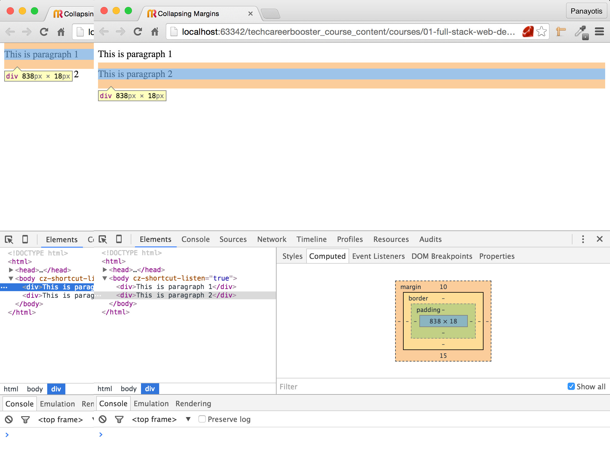
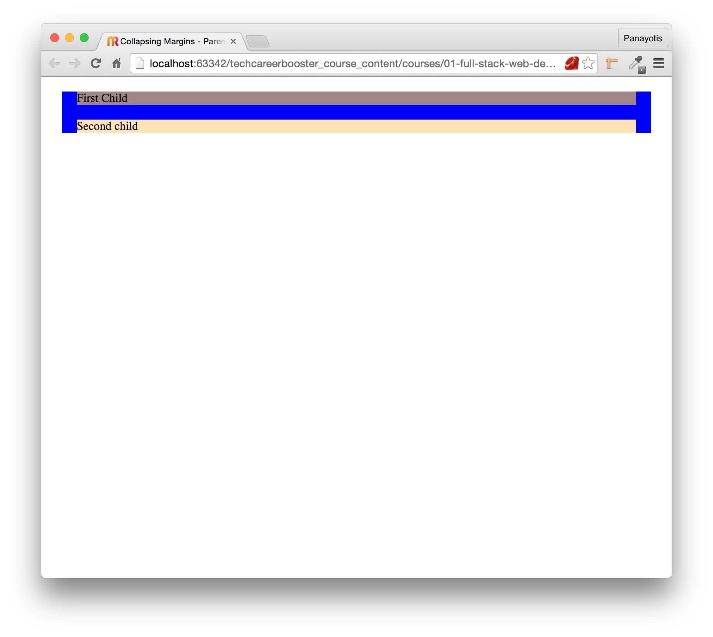

When you are novice to CSS you will get surprised by vertical margins missing from your final HTML page, even if you have
clearly set them to non-zero values. This is the phenomenon of the vertical collapsing margins. This chapter explains why and when
does it happen. Also it proposes how you should deal with that so that you will have designs that are easier to maintain.

Hence, on this chapter you will encounter the vertical collapsing margins phenomenon.

Like in this case, where we have two divs, one on top of the other:

And like in this case, in which we have nested children divs that they lose their margins:

Finally, you will be requested to implement a page like this:

