Until now, in this course, we have used text on our pages, but we have not paid any particular attention to the
shape of the characters. In this chapter we are talking about character shapes, but we will also expand on other
properties of fonts.

### Font Families

In order for us to be able to specify a particular shape of characters, we have decided to give different shapes
a different name. So, the following are some examples of different shape names:

* Times New Roman
* Arial
* Verdana
* Courier New

We officially call them **Font Families**.

Having done that, we are able to specify which shape of characters we would like to use for our text in our HTML page.

Note that all characters in a font family follow the same design characteristics. And that's the reason of being in the
same family. Which means, for example, that all lower case letters have the same height.

Look at the following pictures. You can see the same phrase printed on an HTML page, "Programming is all about Creativity", using different
font families:


### General Families

Besides the distinction of different shapes of characters, we have decided to group font families in the following, more generic families:

1. Serif
2. Sans-Serif
3. Monospace
4. Cursive
5. Fantasy

#### Serif

The Serif family groups all the font families that are using characters that have small lines at the ends of their characters.
Look at the following picture. You can see a serif font family (Times New Roman). We have marked with red some of the lines
that exist at the edges of the character shapes. These are the serifs.

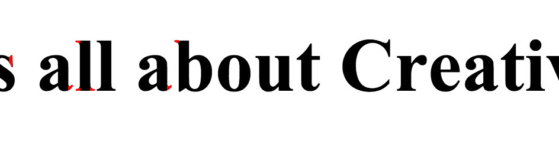

#### Sans-Serif

The Sans-Serif family groups all the font families that do not have serifs, i.e. do not have small lines extending the edges of the characters. The word "sans" is a French word
and means "without". Look at the following picture and compare it to the previous one. The font family used is Arial, which is a font family without serifs, a sans-serif font
family.


#### Monospace

The Monospace family groups all the font families that are using the same width for all of their characters. These families make sure that 1 character occupies the same
horizontal space like any other in the same font family. So, they are more predictable when we have width concerns that we need to take care of. For example, two phrases,
one on top of the other will occupy the same width space if they have the same number of characters, irrespective of which are the exact characters used.

Look at the following picture.


As you can see above, the same length phrases occupy different horizontal space, if we use non-monospace font families and if the phrases have different characters. On the other
hand, the monospace font families use the same horizontal space for the same length phrases, even if these phrases have different characters.

#### Cursive

The cursive family groups all the font families that simulate the hand writing. Look at the following page fragment:

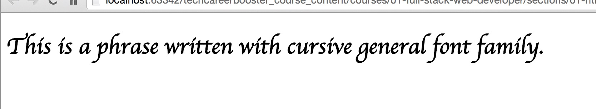

#### Fantasy

The fantasy family groups all the font families that have decorative fonts, used for titles, e.t.c. Look at the following page fragment:
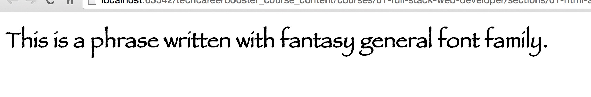

### Specifying Font Family with CSS

In order to specify the font family that we want to use, we need to give value to the CSS property `font-family`. In fact, we usually give more than one alternatives, separated
by commas, and
we end up with the last alternative to be the name of one of the five general families. We give alternatives to the browser, because the font family that we primarily ask for,
i.e. the one that we specify first, might not be supported by the browser of the user that is accessing our page.

So, if we want to use the `Verdana` font family, we can specify that as follows:

``` css
body {
    font-family: Verdana, sans-serif;
}
```

In the above example, we ask browser to use `Verdana` for the typeface of our page. But if Verdana cannot be used for any reason, we ask browser to pick up any `sans-serif`
font that it supports.

> *Note:* Usually, we specify, as last alternative, a general family that is the same as the general family the primary font family belongs to. In the previous example, `Verdana`
is a `sans-serif` family. Hence, we ask browser to pick up any other `sans-serif` family, in case `Verdana` cannot be applied.

We can specify more than one font families before giving the last one general family. Here is another example:

``` css
body {
    font-family: Verdana, Arial, sans-serif;
}
```
In this example, we give as a second option `Arial`, which is another `sans-serif` font family. If browser cannot apply `Verdana`, it will try with `Arial` before resorting to
any other `sans-serif` font family that it can support.

> *Note:* If a font family name is composed of more than one word, then you need to enclose the name in double quotes.

Let's try our first example here. We are going to implement the following HTML page:
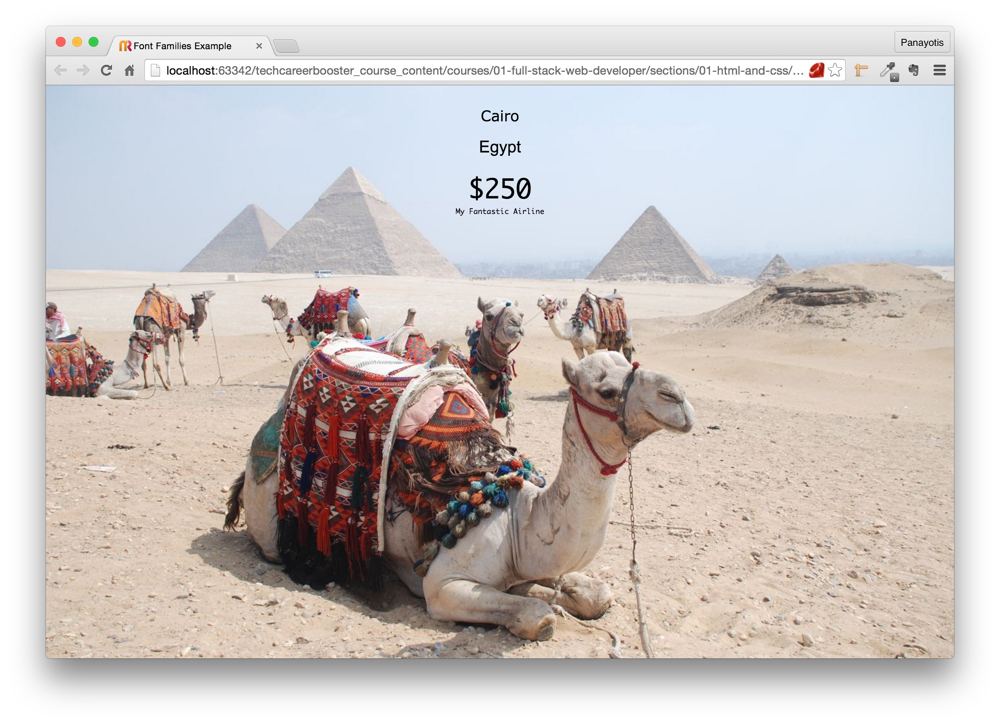

Here is the content of this HTML page:

``` html
<!DOCTYPE html>
  <html>
    <head>
      <meta charset="utf-8">
      <title>Font Families Example</title>
      <link rel="stylesheet" href="stylesheets/main.css" type="text/css">
    </head>

    <body>
      <div id="city">
        Cairo
      </div>

      <div id="country">
        Egypt
      </div>

      <div id="price">
        $250
      </div>

      <div id="airline">
        <a href="#">My Fantastic Airline</a>
      </div>
    </body>
</html>
```
The content of the HTML page is very simple. What we need to take care of is the CSS content. In the following picture you can see which font families we want to apply
on the texts of this page:


Here is the CSS content for this page:
``` css
* {
    box-sizing: border-box;
    padding: 0;
    margin: 0;
}

html {
    font-size: 62.5%;
}

body {
    font-size: 1.6rem;
    text-align: center;
    margin-top: 1.6em;
    background-image: url("../images/cairo.jpg");
    background-repeat: no-repeat;
    background-attachment: fixed;
    background-position: center center;
    background-size: cover;
}

#city {
    font-size: 1.8rem;
    font-family: Verdana, Arial, sans-serif;
    margin-bottom: 1.6rem;
}

#country {
    font-size: 2.0rem;
    font-family: "Open Sans", Arial, sans-serif;
    margin-bottom: 1.8rem;
}

#price, #airline {
    font-size: 3.2rem;
    font-family: "Lucida Console", Monaco, monospace;
}

#airline {
    font-size: 0.8rem;
}

a {
    text-decoration: none;
    color: black;
}

```

The CSS rules relevant to our discussion are the following:

1) The word with the city:
``` css
#city {
    font-family: Verdana, Arial, sans-serif;
}
```
It is requesting the browser to use `Verdana` font. If this font cannot be applied, we are requesting `Arial` font. If this is not applicable, then we are asking browser to
apply any available `sans-serif` font.

2) The word for the country:
``` css
#country {
    font-family: "Open Sans", Arial, sans-serif;
}
```
It is requesting the browser to use `Open Sans` font. If this font cannot be applied, we are requesting `Arial` font. If this is not applicable, then we are asking browser to apply any available
`sans-serif` font.

3) The word for price and airline:
``` css
#price, #airline {
    font-family: "Lucida Console", Monaco, monospace;
}
```
It is requesting `Lucida Console`, which is a monospace font family. If this font cannot be applied, we are requesting `Monaco` font. If this is not applicable, then we are asking
browser to apply any available `monospace` font.

After we load the Web page on our browser, we can use the developer tools, in order to see which font was finally applied by the browser.

Look at the following picture:

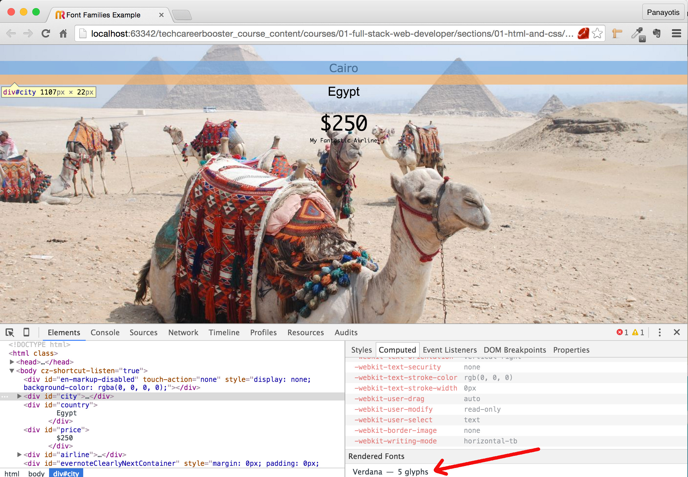

It shows how we can identify the actual font finally used for the city word ("Cairo"). If you have selected the item for the city on the left, and the "Computed" tab on the right,
then scroll down at the bottom. You will see "Rendered Fonts" panel, in which it displays "Verdana - 5 glyphs". This proves that when we requested `Verdana, Arial, sans-serif;` for
the city `div`, the browser has managed to apply the `Verdana` font and didn't have to resort to `Arial`.

Let's do the same for the country word. Inspect the element and identify the actual font used by the browser. You will see this:
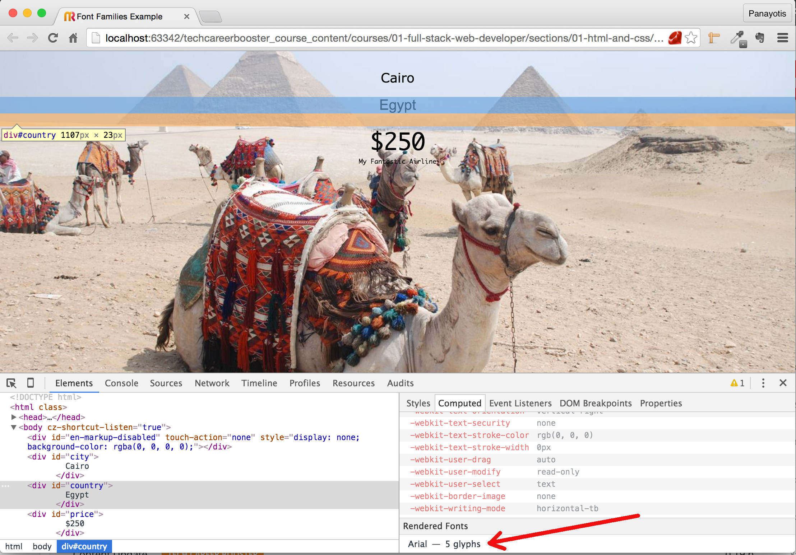

As you can see above, the "Open Sans" font has not been applied, because it was not found installed and supported on the client browser. The `Arial` font family was finally
applied which was the second alternative.

#### CSS Font Stack

The fact that we can specify a series of font families, starting with the one that we want to be applied, but listing other alternatives too, ending with a general font
family, is called `CSS Font Stack`. This is because the font families are stacked one on top of the other, and browser tries to apply first the one that is on top of the
stack.

### Default Font Families

If you want to see which font families your browser would pick up for any one of the general families, you can do that by just specifying the general family name and not being
specific about the font family you would like to use. Let's see that:

Here is an HTML page that uses all the general family names:

``` html
<!DOCTYPE html>
<html>
  <head>
    <meta charset="utf-8">
    <title>Cursive Example</title>
    <link rel="stylesheet" href="stylesheets/main.css" type="text/css">
  </head>

  <body>

    <h1 class="serif">This is a phrase written with <em>serif</em> general font family.</h1>
    <h1 class="sans-serif">This is a phrase written with <em>sans-serif</em> general font family.</h1>
    <h1 class="monospace">This is a phrase written with <em>monospace</em> general font family.</h1>
    <h1 class="cursive">This is a phrase written with <em>cursive</em> general font family.</h1>
    <h1 class="fantasy">This is a phrase written with <em>fantasy</em> general font family.</h1>

  </body>
</html>
```
and the corresponding CSS:

``` css
.serif {
    font-family: serif;
}

.sans-serif {
    font-family: sans-serif;
}

.monospace {
    font-family: monospace;
}

.cursive {
    font-family: cursive;
}

.fantasy {
    font-family: fantasy;
}
```
If you save the above files and load the page on your browser you will see this:


Let's inspect, one-by-one, the text lines above, in order to see what is the exact font that browser has finally applied on each case.

> **Important Note:** The following results, i.e. the default font family picked up by your browser on your operating system, might be different from the one
presented below. This is because the decision that browser takes depends on both the actual browser brand and the operating system the browser is hosted in.

* The `serif` case:

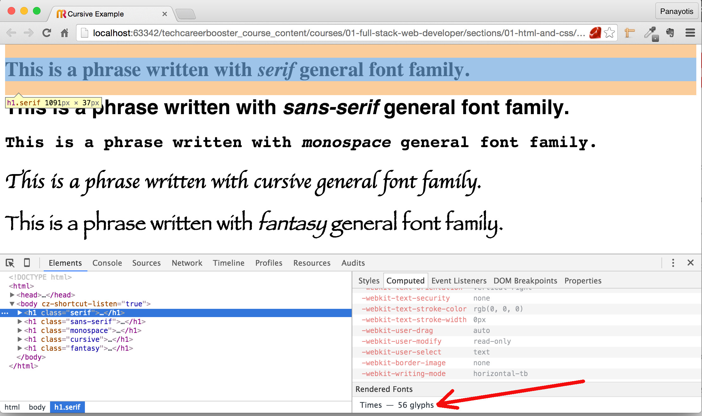

As you can see above, the default font for the `serif` general family is `Times`.

* The `sans-serif` case:

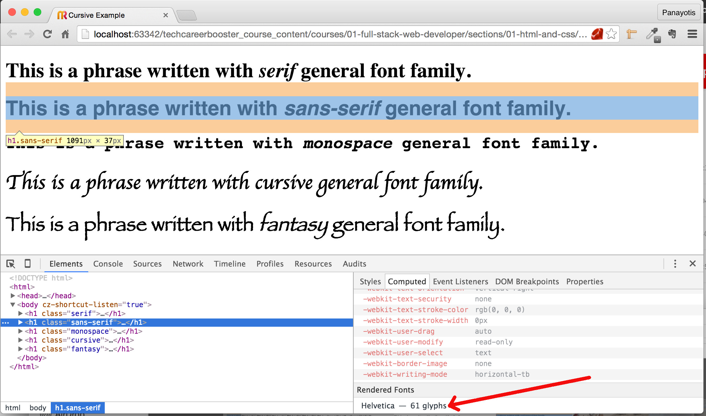

As you can see above, the default font for the `sans-serif` general family is `Helvetica`.

* The `monospace` case:

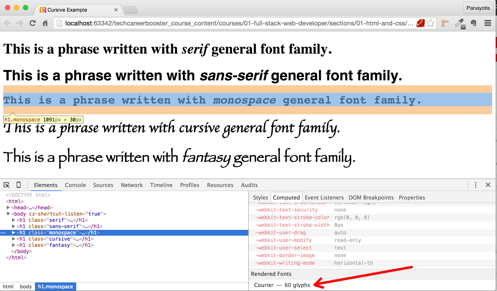

As you can see above, the default font for the `monospace` general family is `Courier`.

* The `cursive` case:

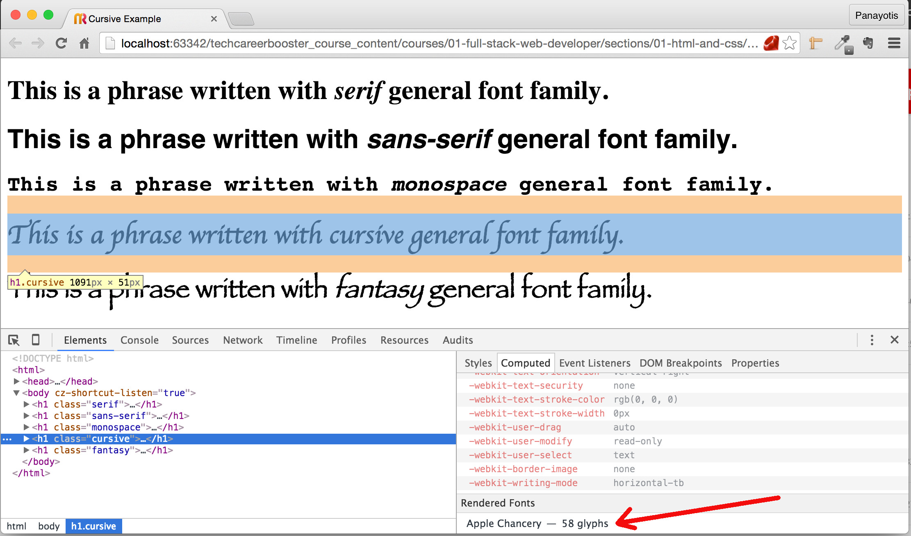

As you can see above, the default font for the `cursive` general family is `Apple Chancery`.

* The `fantasy` case:

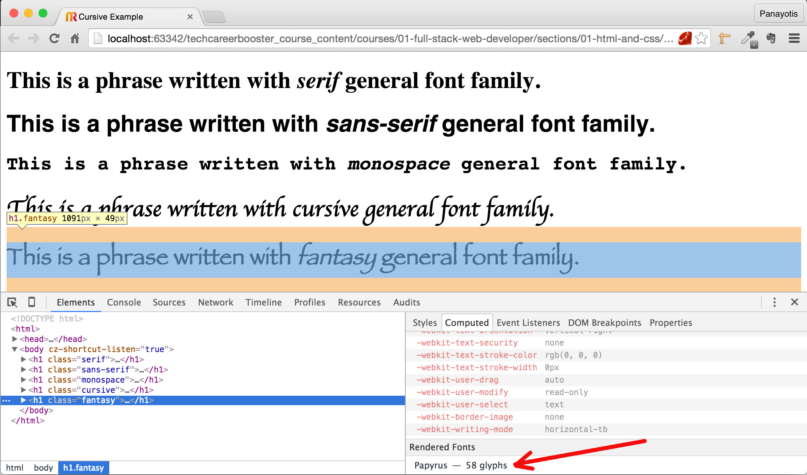

As you can see above, the default font for the `fantasy` general family is `Papyrus`.

In Summary:

<table>
    <tr><th colspan="2"><em>Results for Chrome 47.0, Mac OS X 10 - Yosemite</em></th></tr>
    <tr><th>General Family</th><th>Default Font</th></tr>
    <tr><td>serif</td><td>Times</td></tr>
    <tr><td>sans-serif</td><td>Helvetica</td></tr>
    <tr><td>monospace</td><td>Courier</td></tr>
    <tr><td>cursive</td><td>Apple Chancery</td></tr>
    <tr><td>fantasy</td><td>Papyrus</td></tr>
</table>

We ran the same test on Chrome 47.0 on Windows 7. Here are the results:

<table>
    <tr><th colspan="2"><em>Results for Chrome 47.0, Windows 7</em></th></tr>
    <tr><th>General Family</th><th>Default Font</th></tr>
    <tr><td>serif</td><td>Times New Roman</td></tr>
    <tr><td>sans-serif</td><td>Arial</td></tr>
    <tr><td>monospace</td><td>Consolas</td></tr>
    <tr><td>cursive</td><td>Comic Sans MS</td></tr>
    <tr><td>fantasy</td><td>Impact</td></tr>
</table>

We ran the same test on Chrome 47.0 on Ubuntu 12. Here are the results:

<table>
    <tr><th colspan="2"><em>Results for Chrome 47.0, Ubuntu 12</em></th></tr>
    <tr><th>General Family</th><th>Default Font</th></tr>
    <tr><td>serif</td><td>Times New Roman</td></tr>
    <tr><td>sans-serif</td><td>Arial</td></tr>
    <tr><td>monospace</td><td>DejaVu Sans Mono</td></tr>
    <tr><td>cursive</td><td>Comic Sans MS</td></tr>
    <tr><td>fantasy</td><td>Impact</td></tr>
</table>

As you can understand, when you specify generic font families for your `font-family` property, the result is not always the same. It depends on the operating system and browser.
Hence, do not specify general font families. Only as final fallbacks. User specific font families.

### Safe CSS Font Stacks

The above discussion reveals the fact that, it is very important to specify a CSS font stack that makes sense and has quite good chances to be applied as specified.

Here are some good examples:

* `sans-serif`
    * `font-family: "Helvetica Neue", Helvetica, Arial, sans-serif;`
    * `font-family: Verdana, Geneva, sans-serif;`
* `serif`
    * `font-family: TimesNewRoman, "Times New Roman", Times, Baskerville, Georgia, serif;`
    * `font-family: "Gill Sans", "Gill Sans MT", Calibri, sans-serif;`
* `monospace`
    * `font-family: "Arial Black", "Arial Bold", Gadget, sans-serif;`
    * `font-family: "Lucida Sans Typewriter", "Lucida Console", Monaco, "Bitstream Vera Sans Mono", monospace;`
* `cursive`
    * `font-family: "Apple Chancery", "Comic Sans MS", cursive;

There are a lot of sites on Internet that can give you nice CSS Font Stacks. Google for `web safe font stacks`.

### Make Sure Browser Is Using the Font We Want

It has become quite common, nowadays, to not rely on the font families that are supported by default by the browser/operating system combination. We want our Web sites to
be more specific and use the fonts that we want, without being very common (like using Arial or Verdana), and without falling back to other font families.
In order to make sure that our site uses the font that we want, we can tell the browser to download the font and install it from a specific location on the Internet,
or have it as a resource, already part of the resource bundle of our site.

#### Using Fonts Provided by Google

One very good resource for you to use a font family is Google. In fact, the [Google Fonts](https://www.google.com/fonts) web site. Visit this site and pick up the font
family that best matches your requirements.

One way you can work with Google Fonts is the following:

1) You need to create a Collection, by first choosing one or more of the font families that you want and Adding them to the Collection.

Here is a video that demonstrates how we use the filters on the Google Fonts site, to select a font family that matches specific criteria and add it to our collection.

<div id="media-title-video-choosing-the-google-font-family.mp4-How we can select a font family from Google Fonts and add it to our collection">How we can select a font family from Google Fonts and add it to our collection</div>
<a href="https://player.vimeo.com/video/194088488"></a>
           

In this video, the user selects the `Catamaran` font family.

2) You need to review the font and add any extra style that you want and it is not pre-selected. For example, you may want to finally select all the bold styles.

Here is the next part of the video that shows how the user reviews the properties of the font family selected and selects any style that is not already selected.

<div id="media-title-video-reviewing-selected-font.mp4-How we can review the properties of a font family selected">How we can review the properties of a font family selected</div>
<a href="https://player.vimeo.com/video/194090014"></a>

3) You finally need to use the font, by first following the directions on the "Choose" tab of the Google Fonts. Watch the following video:

<div id="media-title-video-using-the-reviewed-font.mp4-How we can use a font family">How we can use a font family</div>
<a href="https://player.vimeo.com/video/194091589"></a>
           
One common way to use a font is to create a `link` tag in the `head` section of our HTML page that would reference the font resource. This is actually a remotely loaded
CSS file.

For example, let's use the font selected by the user in the video above. As you can see from the last part of the video, the one that user accesses the "Use" tab, there is
a `link` tag code, that user can copy and paste directly to his HTML `head` section.

This is the `link` code:

``` html
<link href="https://fonts.googleapis.com/css?family=Catamaran:400,200,300,900,100,500,600,700,800&subset=latin,latin-ext" rel="stylesheet" type="text/css">
```

Let's put that inside an HTML page and write some text and see whether the font is indeed `Catamaran`:
``` html
<!DOCTYPE html>
<html>
  <head>
    <meta charset="utf-8">
    <title>Using a Google Font</title>
    <link href="https://fonts.googleapis.com/css?family=Catamaran:400,200,300,900,100,500,600,700,800&subset=latin,latin-ext" rel="stylesheet" type="text/css">
    <link href="stylesheets/main.css" rel="stylesheet" type="text/css">
  </head>

  <body>

    <h1>This is a phrase with font family 'Catamaran'</h1>

  </body>

</html>
```
As you can see above, we put our own CSS file (`stylesheets/main.css`) **after** the reference to the Google font Catamaran resource. This is necessary in order for us
to be able to use the `Catamaran` font family within our own CSS rules. Our own CSS rules have as follows:

``` css
html {
    font-size: 62.5%;
}

body {
    font-size: 1.6rem;
}

h1 {
    font-family: Catamaran, sans-serif;
}
```

Very simply, we specify that the `h1` tag content will be drawn with the font family `Catamaran`. If this cannot be loaded for some reason, we fallback to `sans-serif`. We chose
`sans-serif` as a fallback because `Catamaran` is a `sans-serif` font family. As long as Google font `Catamaran` can be loaded, then falling back to `sans-serif` will never
take place. And Google site with fonts being unavailable has very small, if any, chances. Hence, fall back to `sans-serif` is very unlikely. But still, we include that to be
on the safe side.

If you save the above two files and load the page on your browser you will see this:

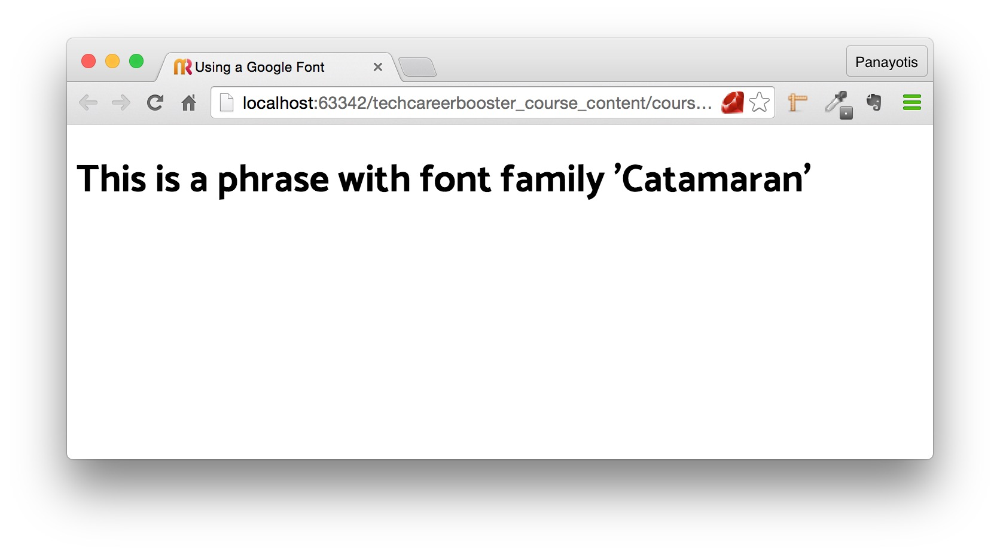

And if you inspect the `h1` tag with developer tools, you will see this:

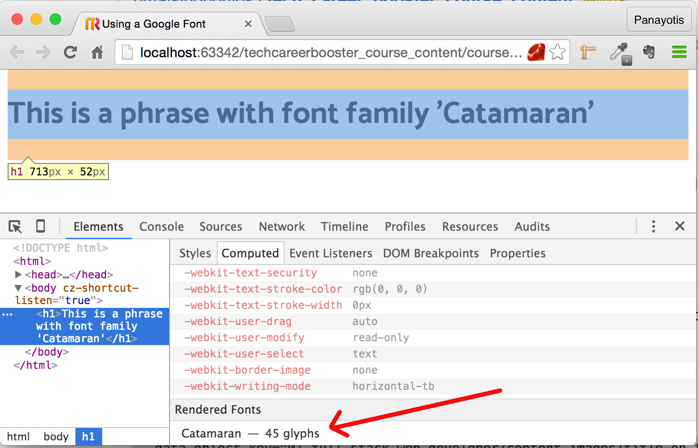

As you can see above, the font family used for the content of `h1` tag, is `Catamaran`.

### Other Properties of the Fonts

Besides the font family, there are some other CSS properties that are related to the font one wants to apply to an HTML text.

#### `font-style`

Takes the three values:

1. `normal`. In that case the text is shown normally.
2. `italic`. In that case the text is shown in italics.
3. `oblique`. In that case the text is shown similar to italic. This property is not widely supported.

#### `font-size`

This specifies the size of the font. We have extensively talked about this in the chapter CSS Units.

#### `font-weight`

This specifies the `weight` of the font. It can take values like:

1. `normal`. Which means no bold.
2. `bold`. Bold text.
3. `bolder`. For even more bold text.
4. An integer that corresponds to a weight according to the font family used. For example, earlier we used the font family `Catamaran` from the Google Fonts. There, we have
said that we want to be able to use the weight versions: 100,200,300,400,500,600,700,800,900, which are all the weight version this font family has been designed for. This means that
we can write CSS rules like the following:
``` css
body {
    font-family: Catamaran, sans-serif;
    font-weight: 200;
}
```
which picks up the font weight with value `200`.


