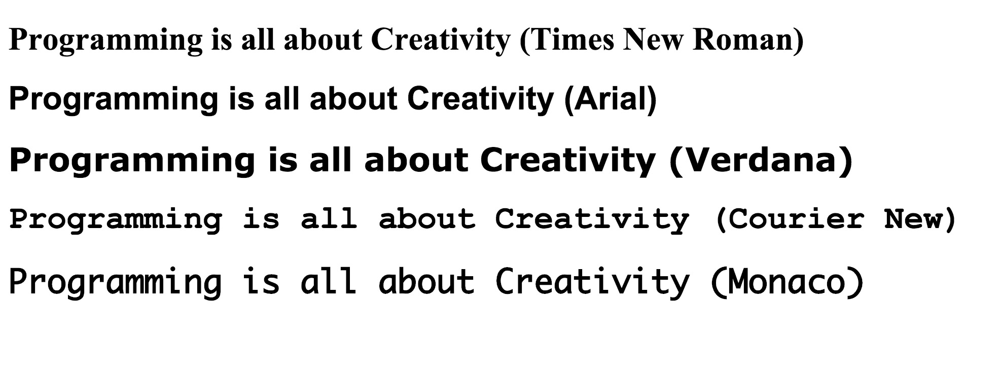
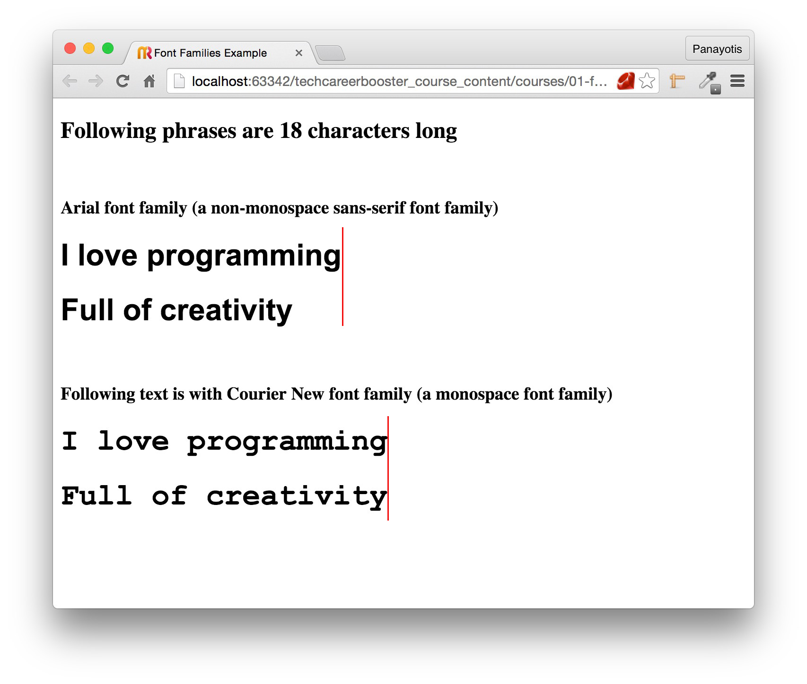
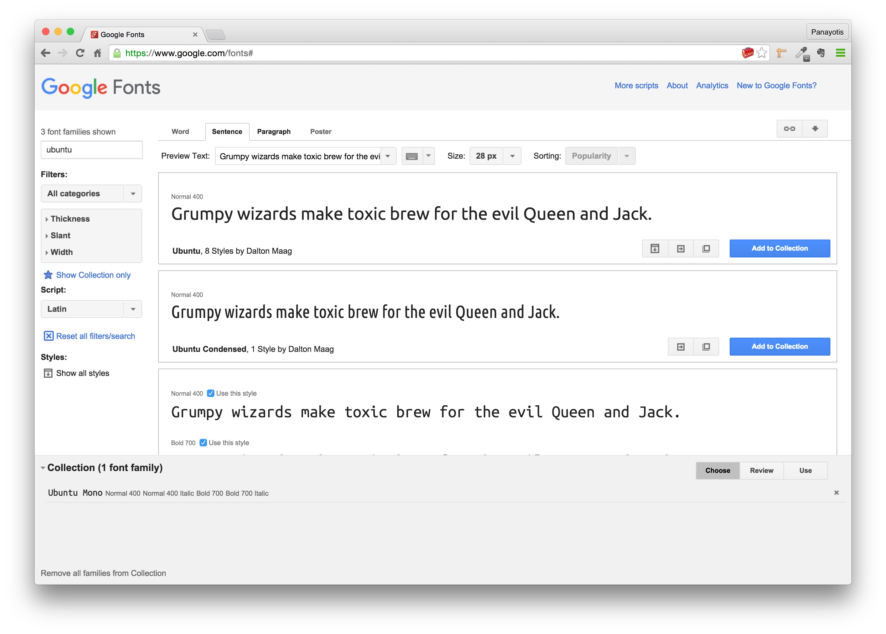

In this chapter, we are going to learn how we can choose different shapes for the characters of our HTML text.
Hence, we are going to learn about font families.

There are some default commonly used font families like these here:

We are going to teach you the small but important differences between them. For example, you are going to learn
how the length of the text is affected by the font family chosen, and not only by the font size.

You are going to build a Web page like this:

with different font shapes, in order to practice applying different font families.

You are also going to learn about the default font families and how they might differ from one computer to the other.

Finally, you will also learn how to pick up a font family from one font providing service like Google Fonts:

