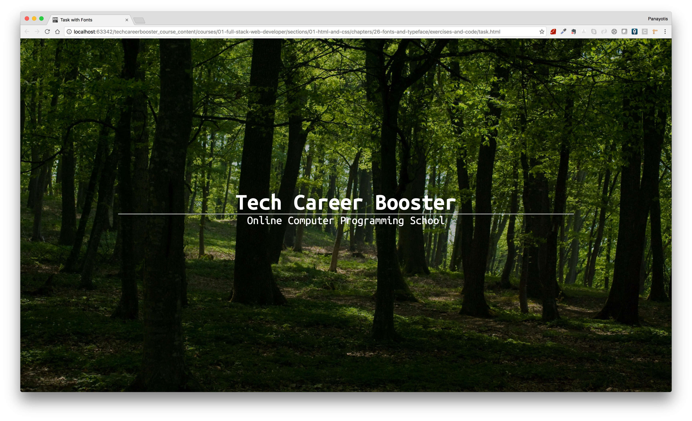

1. You need to implement the following HTML page:

 

    
Task with Font Families

    </img>
 

 
2. Make sure you take care of the following:
    1. You use the Google Font with name "Ubuntu Mono".
    2. The styles that you should include in your font collection are:
        * 400
        * 400 Italic
        * 700 and
        * 700 Italic
    3. "Tech Career Booster" should be included inside an `h1`.
    4. "Online Computer Programming School" should be included inside a `small` tag.
    5. There is a `div` that will help you make the image a little bit darker than its original color so that the text stands out clearly. This `div` needs to cover the whole background,
    like the background image does. And it has to have a background color `rgba(0, 0, 0, 0.3)`.
    6. There is a horizontal line that does not extend from left to right. It has 70% width. But it is centered. Hint: the value `auto` on left and right margins allows elements
    with specific width to be centered.
    7. All elements, by default, should be using `border-box` for `box-sizing`. Also 0 padding and 0 margin.
    8. Use `rem` unit for the size of text.
    9. The `h1` font size should end up being 64px.
    10. the `small` font size should end up being 32px.
    13. There is some margin on top of the body element, which needs to be calculated as relative unit of the viewport height (vh). 43 is a good value for that.
3. Upload your site to your Netlify account.

**Important**: Try to use your own brand, instead of Tech Career Booster brand, logos and motos. These are pages that you create and you
should promote your profile and your work. This is a general rule and does not apply to this task only.

