This chapter enters the interactive world of HTML. We will have an introduction on the `form` element and the most important
UI elements that are used to collect information from the user.

You will build pages like the following:

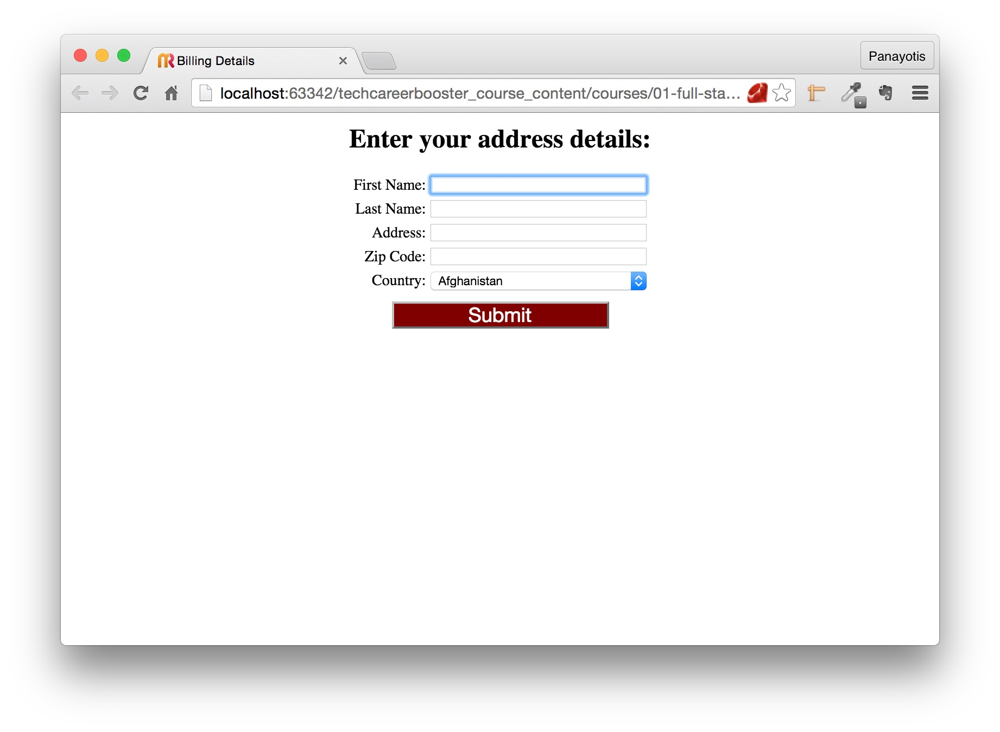

And not only that. We will spend some time tuning the input element properties. For example, we will add validations like this:

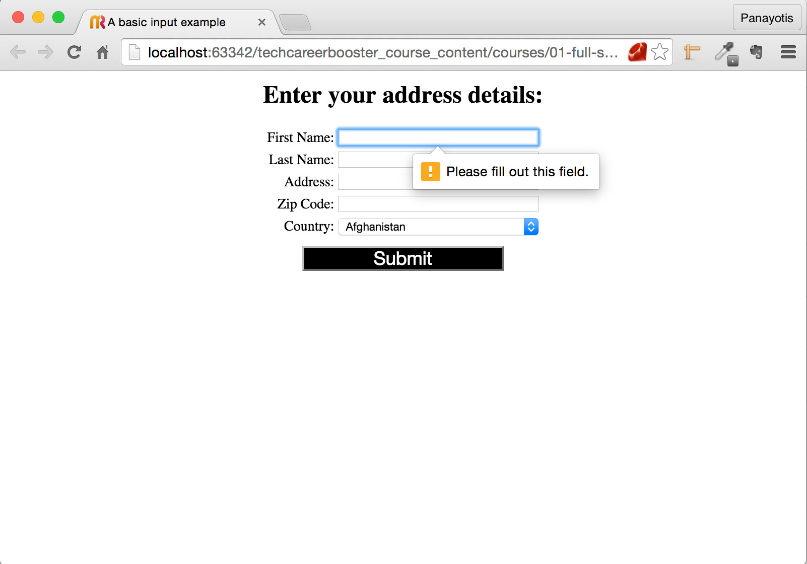

We will learn to use specific types of input elements, like emails and passwords. For example, in order to build a sign up form:

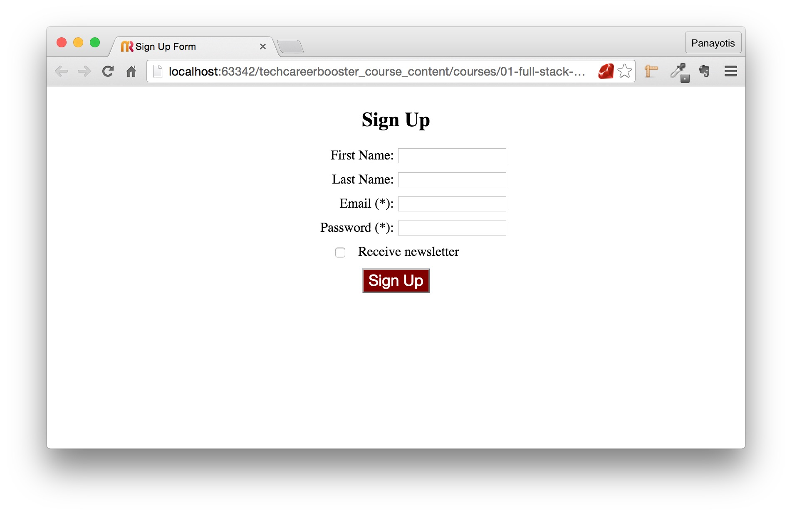

We will learn to use a series of checkboxes in order to let the user tell us which options would he prefer:

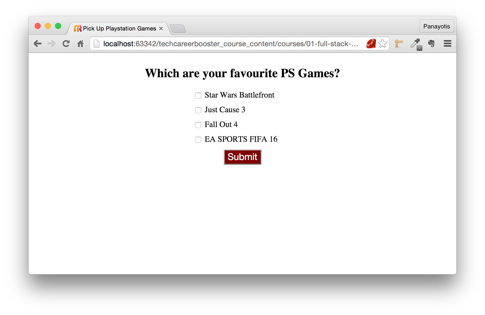

We will also learn how we could select one or more options using multiple select boxes:

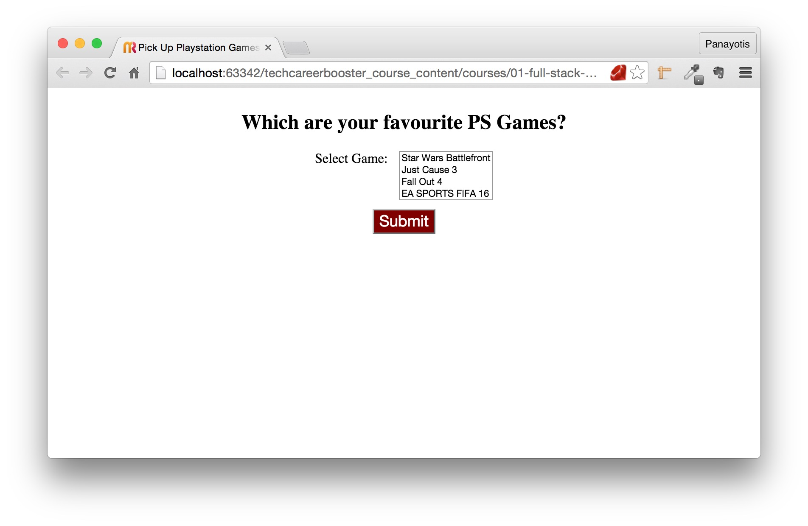

Next we will learn how we could select one option amongst many using radio buttons:

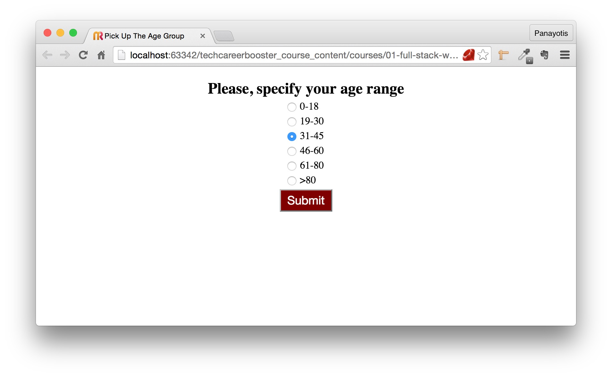

And we will learn how we can ask the user to enter a multi-line message like in a contact form:

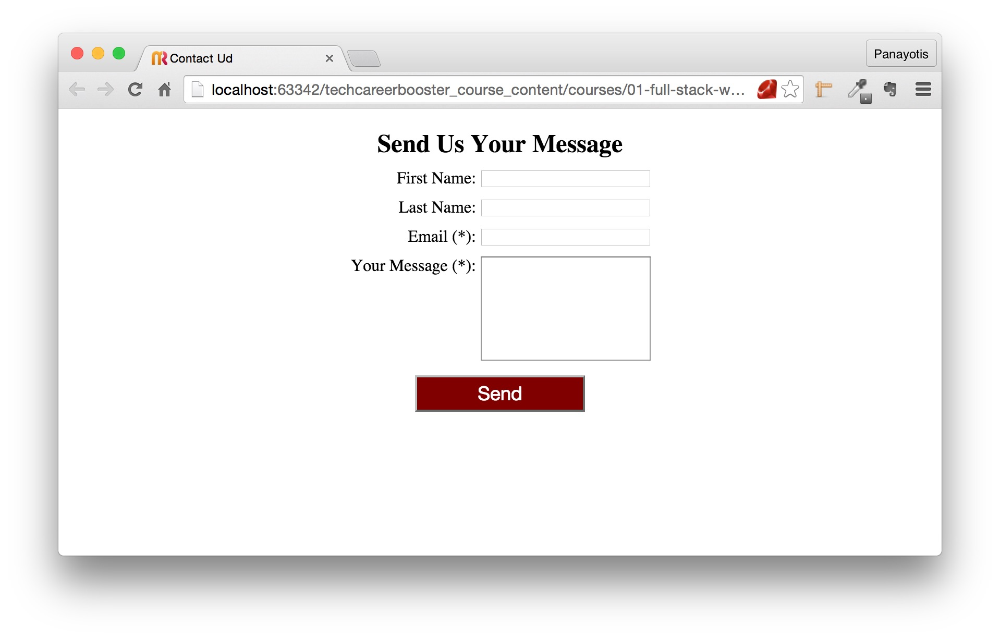

We will proceed in explaining other features of input elements too, like placeholders and titles, min and max attributes. We will use UI elements that visualize a range
of values, like in the following volume slider:

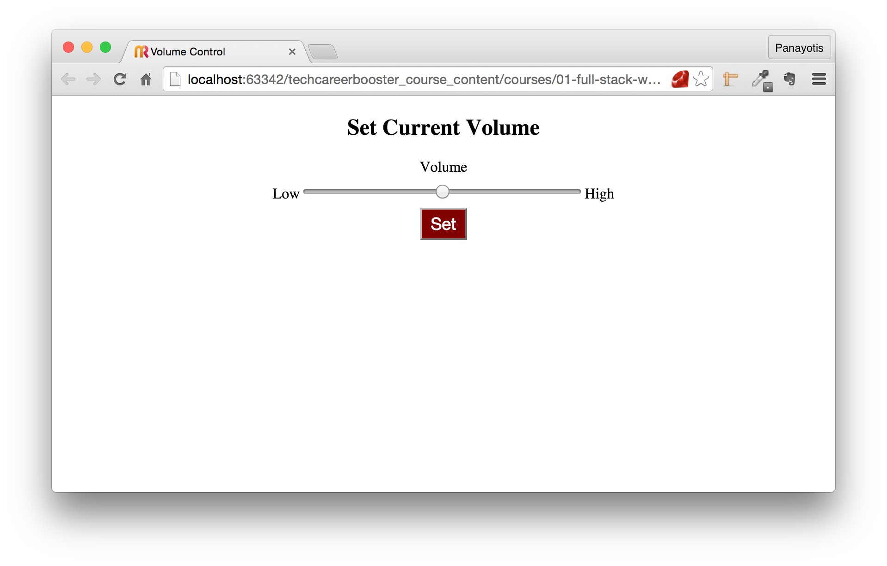

We will learn how we can group options in a drop down list:

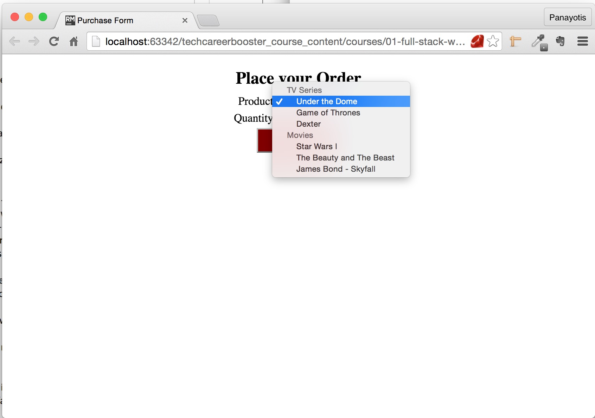

We will learn how we can use a color picker to let user pick up a color:

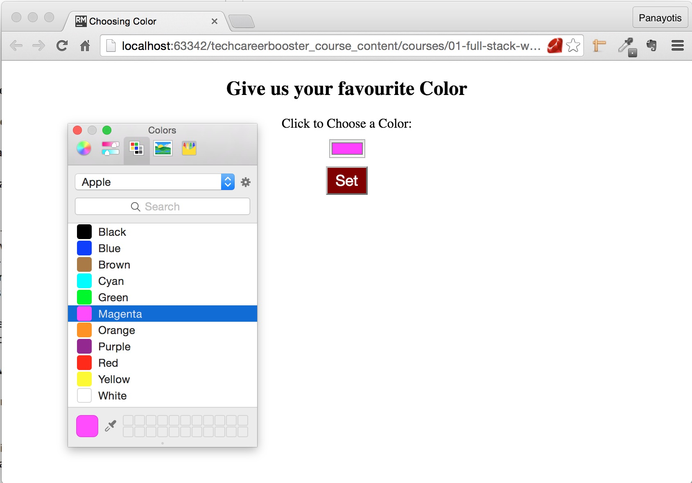

We will learn how we can use a date picker to let user pick up a date:

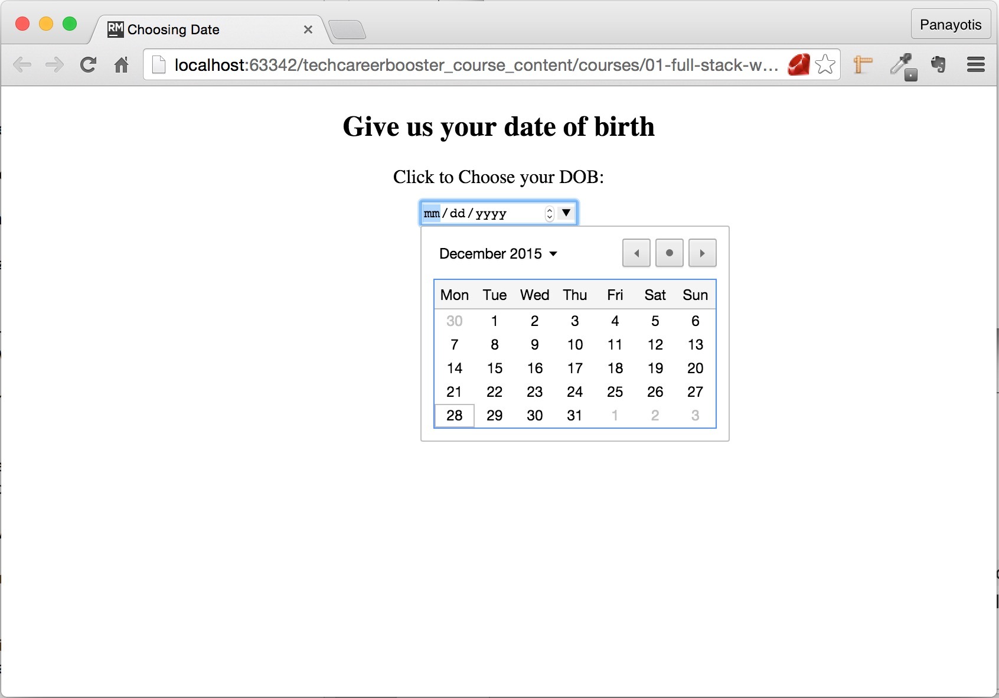

We will learn how we can ask the user to upload a file, like in this example:

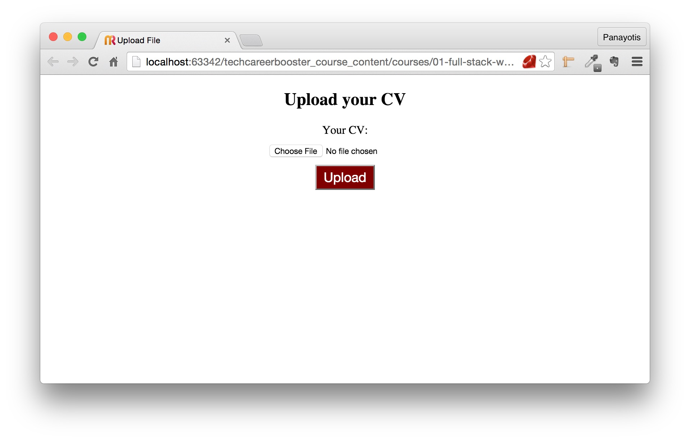

And we will finally learn how we can visually group form fields like in this example:

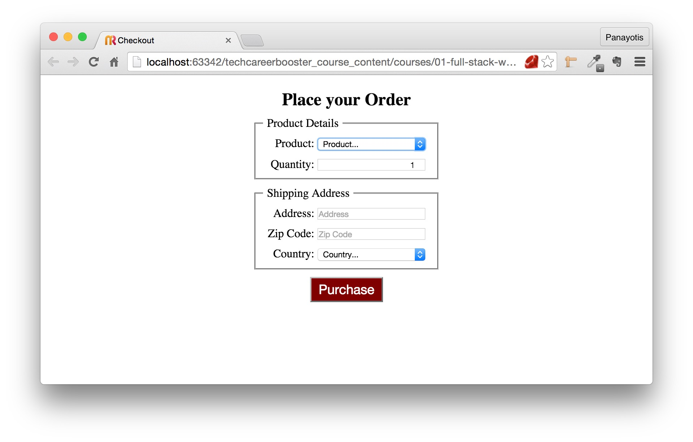

Your task, at the end of the chapter, will be to build a page with this form here:

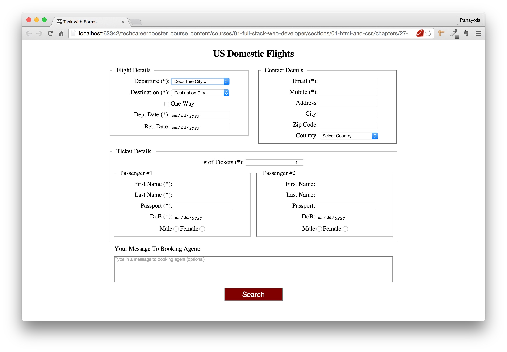

