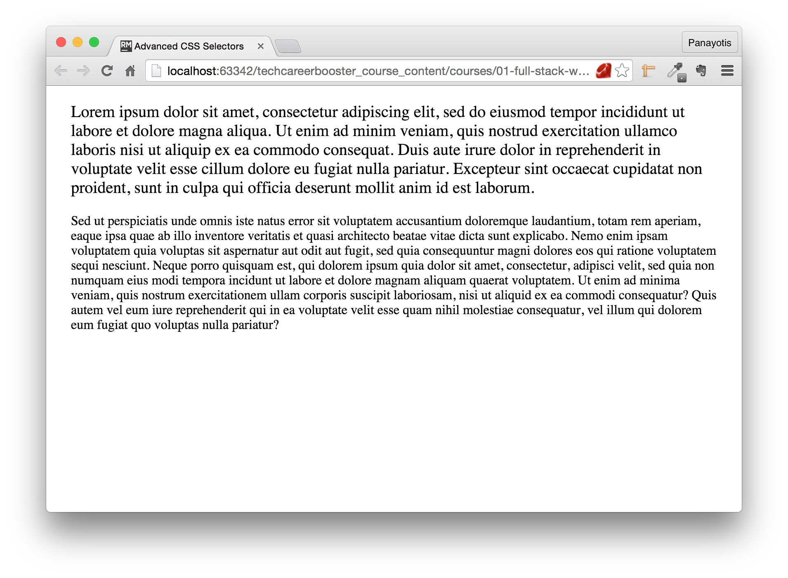
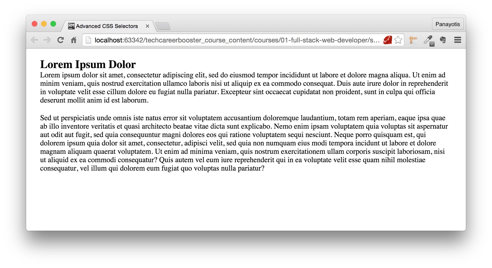
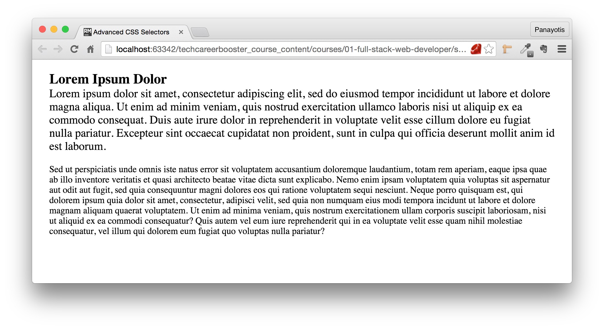
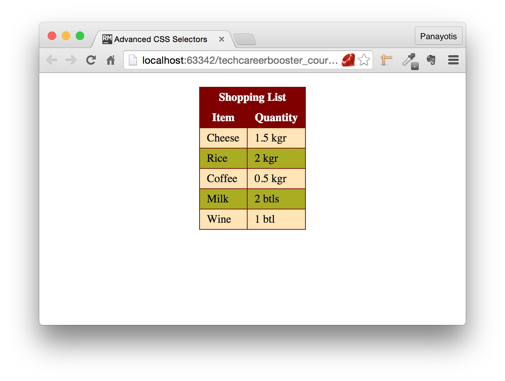
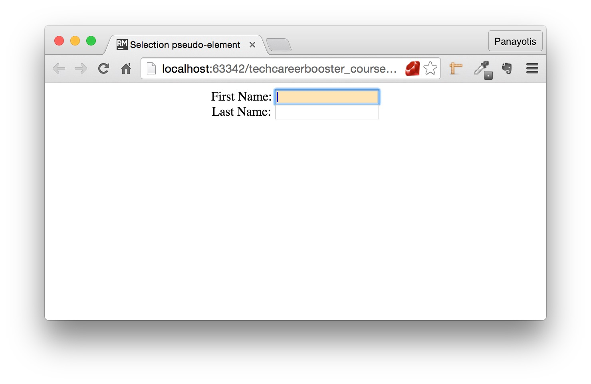
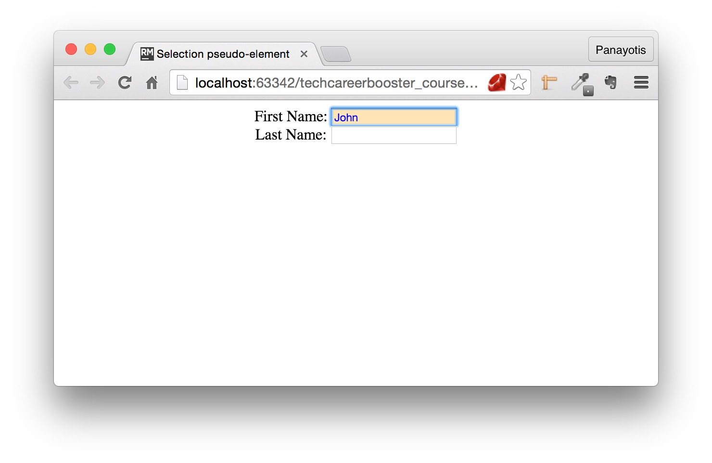
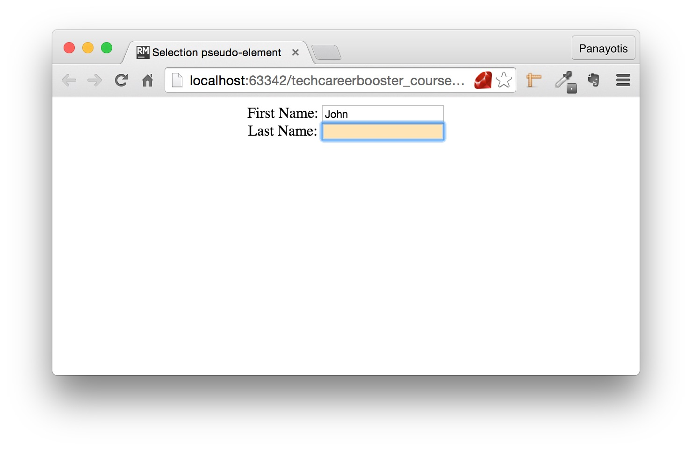
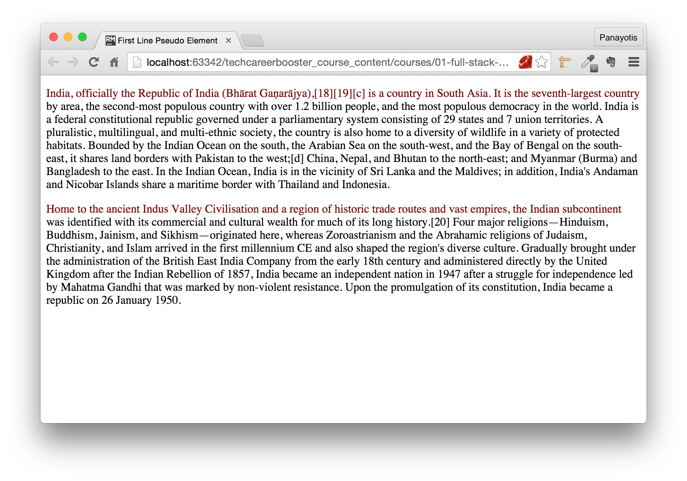
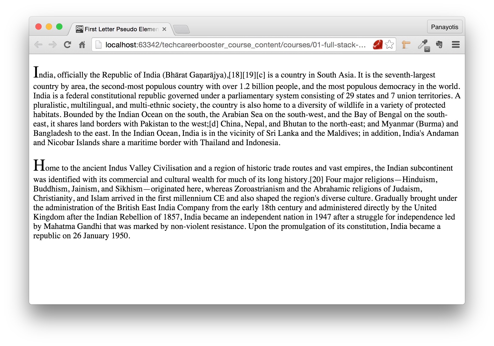
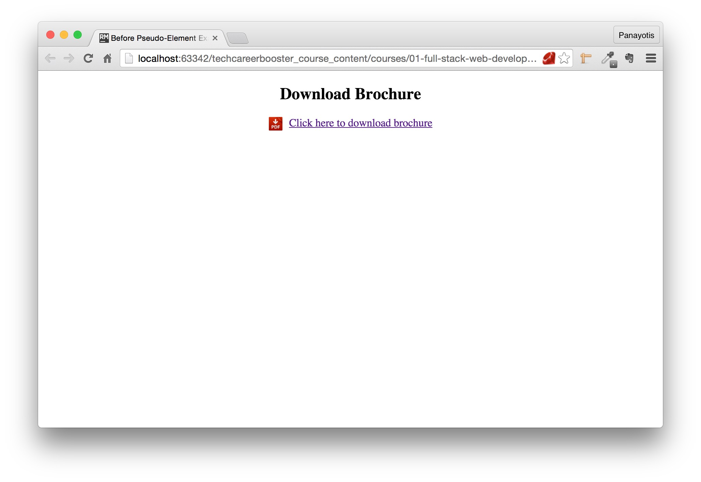

### Pseudo-classes

We have already worked with selectors like this:

``` css
a:link {
  color: Blue;
}
```

which is the unvisited link selector. The `:link` part of the selector defines a state or a characteristic of the actual element, of the anchor `a` element.
It is a link that has not been visited. This kind of element attribution to specify a particular state or characteristic of the element is called a *pseudo-class*.

#### About the states of an anchor `a`

There are some pseudo-classes that are used for anchor `a` elements. These are the following:

1. `:link`, is for an unvisited anchor
2. `:visited`, is for a visited anchor
3. `:hover`, is for an anchor when the mouse is over it
4. `:active`, is for an anchor that is selected, i.e. clicked but mouse button has not been released.

> **Important:** `:hover` styling must be defined AFTER `:link` and `:visited`. And `:active` must come after `:hover`. So, if you remember the acronym `LVHA`, then you will never
make a mistake in the order.

#### `:first-child` and `:first-of-type`. `:last-child` and `:last-of-type`

The pseudo-class `:first-child` specifies that the element needs to be the first child of a containing element. Let's see the following example:

``` html
<!DOCTYPE html>
<html>
  <head>
    <meta charset="utf-8">
    <title>Advanced CSS Selectors</title>
    <link rel="stylesheet" href="stylesheets/main.css" type="text/css">
  </head>
  <body>

    <div id="wrapper">
      <p>
        Lorem ipsum dolor sit amet, consectetur adipiscing elit, sed do eiusmod tempor incididunt ut labore et
        dolore magna aliqua. Ut enim ad minim veniam, quis nostrud exercitation ullamco laboris nisi ut aliquip ex ea
        commodo consequat. Duis aute irure dolor in reprehenderit in voluptate velit esse cillum dolore eu fugiat nulla
        pariatur. Excepteur sint occaecat cupidatat non proident, sunt in culpa qui officia deserunt mollit anim id est laborum.
      </p>

      <p>
        Sed ut perspiciatis unde omnis iste natus error sit voluptatem accusantium doloremque laudantium, totam rem aperiam, eaque ipsa
        quae ab illo inventore veritatis et quasi architecto beatae vitae dicta sunt explicabo. Nemo enim ipsam voluptatem quia voluptas
        sit aspernatur aut odit aut fugit, sed quia consequuntur magni dolores eos qui ratione voluptatem sequi nesciunt. Neque porro
        quisquam est, qui dolorem ipsum quia dolor sit amet, consectetur, adipisci velit, sed quia non numquam eius modi tempora
        incidunt ut labore et dolore magnam aliquam quaerat voluptatem. Ut enim ad minima veniam, quis nostrum exercitationem
        ullam corporis suscipit laboriosam, nisi ut aliquid ex ea commodi consequatur? Quis autem vel eum iure reprehenderit
        qui in ea voluptate velit esse quam nihil molestiae consequatur, vel illum qui dolorem eum fugiat quo voluptas nulla pariatur?
      </p>
    </div>
  </body>
</html>
```
As you can see above, there are 2 paragraphs in this document. What if we wanted to set the styling for the first paragraph, but not for the
second? We can apply the following CSS:

``` css
* {
    box-sizing: border-box;
    padding: 0;
    margin: 0;
}

html {
    font-size: 62.5%;
}

body {
    font-size: 1.6rem;
    margin-top: 20px;
}

#wrapper {
    margin: 0 30px;
}

p {
    margin-bottom: 20px;
}

p:first-child {
    font-size: 2rem;
}
```

Do you see the `p:first-child`. This is the way to select the first child `p` element. The first paragraph has a little bit larger font. Here is the final result:



However, let's see this example here:

``` html
<!DOCTYPE html>
<html>
  <head>
    <meta charset="utf-8">
    <title>Advanced CSS Selectors</title>
    <link rel="stylesheet" href="stylesheets/main.css" type="text/css">
  </head>
  <body>

    <div id="wrapper">
      <h2>Lorem Ipsum Dolor</h2>

      <p>
        Lorem ipsum dolor sit amet, consectetur adipiscing elit, sed do eiusmod tempor incididunt ut labore et
        dolore magna aliqua. Ut enim ad minim veniam, quis nostrud exercitation ullamco laboris nisi ut aliquip ex ea
        commodo consequat. Duis aute irure dolor in reprehenderit in voluptate velit esse cillum dolore eu fugiat nulla
        pariatur. Excepteur sint occaecat cupidatat non proident, sunt in culpa qui officia deserunt mollit anim id est laborum.
      </p>

      <p>
        Sed ut perspiciatis unde omnis iste natus error sit voluptatem accusantium doloremque laudantium, totam rem aperiam, eaque ipsa
        quae ab illo inventore veritatis et quasi architecto beatae vitae dicta sunt explicabo. Nemo enim ipsam voluptatem quia voluptas
        sit aspernatur aut odit aut fugit, sed quia consequuntur magni dolores eos qui ratione voluptatem sequi nesciunt. Neque porro
        quisquam est, qui dolorem ipsum quia dolor sit amet, consectetur, adipisci velit, sed quia non numquam eius modi tempora
        incidunt ut labore et dolore magnam aliquam quaerat voluptatem. Ut enim ad minima veniam, quis nostrum exercitationem
        ullam corporis suscipit laboriosam, nisi ut aliquid ex ea commodi consequatur? Quis autem vel eum iure reprehenderit
        qui in ea voluptate velit esse quam nihil molestiae consequatur, vel illum qui dolorem eum fugiat quo voluptas nulla pariatur?
      </p>

    </div>
  </body>
</html>
```
If you save the above and reload it on your browser, you will see this:



This is because, now, the `p` is *not the first child* of its containing element. There is a solution to this and it is called `:first-of-type`. `:first-of-type`
matches the first child that has the type of the element attributed. Hence `p:first-of-type` will select the first `p` element that is child of a containing element. Hence,
`p` can be in any child position, first, second, third or any larger, but it has to be the first of type `p`.

Let's change the CSS:

``` css
* {
    box-sizing: border-box;
    padding: 0;
    margin: 0;
}

html {
    font-size: 62.5%;
}

body {
    font-size: 1.6rem;
    margin-top: 20px;
}

#wrapper {
    margin: 0 30px;
}

p {
    margin-bottom: 20px;
}

p:first-of-type {
    font-size: 2rem;
}
```
and reload the last page. You will see this:



As you can see above, the first paragraph is now styled with larger font. It has been selected with the `:first-of-type` pseudo-class.

Now that you have learned how `:first-child` and `:first-of-type` work, you can easily guess what the `:last-child` and `:last-of-type` do too.

#### `:nth-child(n)` and `:nth-of-type(n)`

These are generalizations of the previous ones. So, instead of being limited to `first` and `last` you can now use the `:nth-child(n)` and `:nth-of-type(n)` to specify
any child position. So,

1. if you want to specify the `p` elements that are on 2nd child position of their parent: `:nth-child(2)`
2. If you want to specify the `p` elements that are on 2nd position amongst the `p` children of their parent: `:nth-of-type(2)`

However, these pseudo-classes here can be even more generic, because the value `n` inside the parentheses can also be:

1. a keyword or
2. a formula

Let's have a look at the following page:



As you can see above, the table body, has different styling on odd vs even rows. Here is how we can achieve that:

The HTML code is the following:

``` html
<!DOCTYPE html>
<html>
  <head>
    <meta charset="utf-8">
    <title>Advanced CSS Selectors</title>
    <link rel="stylesheet" href="stylesheets/main.css" type="text/css">
  </head>
  <body>

    <table>

      <thead>
        <tr><th colspan="2">Shopping List</th></tr>
        <tr><th>Item</th><th>Quantity</th></tr>
      </thead>

      <tbody>
        <tr><td>Cheese</td><td>1.5 kgr</td></tr>
        <tr><td>Rice</td><td>2 kgr</td></tr>
        <tr><td>Coffee</td><td>0.5 kgr</td></tr>
        <tr><td>Milk</td><td>2 btls</td></tr>
        <tr><td>Wine</td><td>1 btl</td></tr>
      </tbody>

    </table>
  </body>
</html>
```

which is pretty straight forward. Nothing new here. Note that there is not styling attributes on the HTML markup for the table. All the styling will take place inside the CSS
file. So, read carefully the following:

``` css
* {
    box-sizing: border-box;
    padding: 0;
    margin: 0;
}

html {
    font-size: 62.5%;
}

body {
    font-size: 1.6rem;
    margin-top: 20px;
}

table {
    /* Next rule will make the borders of table cells to collapse and appear uniformly */
    border-collapse: collapse;
    /* Next rule will make the table appear in the horizontal middle of the page */
    margin: 0 auto;
}

table ,
table th,
table td {
    /* This is necessary to give a border around the table and in between the cells */
    border: 1px solid maroon;
}

th, td {
    /* This is necessary to allow for some space around the text inside the table cells */
    padding: 5px 10px;
}

th {
    background-color: maroon;
    color: white;
}

/* This is the new stuff here. The first CSS selector selects the odd rows ...*/
tbody tr:nth-child(odd) {
    background-color: #FFE4B5;
}

/* ...and the 2nd CSS selector, selects the even rows */
tbody tr:nth-child(even) {
    background-color: #aaad21;
}
```

Please, read the explanations provided inside the CSS file. The new stuff is here:

``` css
tbody tr:nth-child(odd) {
    background-color: #FFE4B5;
}

tbody tr:nth-child(even) {
    background-color: #aaad21;
}
```

Do you see how we select the `odd` and the `even` rows inside the `tbody` element? We are using the pseudo-class `:nth-child` giving as input argument to the
parentheses the `odd` and `even` keywords respectively.

Besides the two keywords above, you can also use a formula inside the `:nth-child` parentheses. The formula is of the format: `an + b` where `a` is a cycle size,
`n` is the counter that starts from 0 and `b` is an offset value.

Here are some example:

1. `2n`, takes the values 0, 2, 4, 6... e.t.c. Hence it selects all the even positions.
2. `3n`, takes the values 0, 3, 6, 9... e.t.c. Hence it selects all the positions that are multiple of 3.
3. `2n + 1`, takes the values 1, 3, 5... e.t.c. Hence it selects all the odd positions.

#### Some other useful pseudo-classes

Some other useful pseudo-classes are the following:

##### `:not(selector)`

This one selects every element that does not match the selector inside the parentheses. For example: `p:not(.lead)` selects all the paragraphs that do not have the class `lead`.

##### `:optional` and `:required`

Selects all the elements that do not have the attribute `required` set. For example: `input:optional` will select all the `input` elements that do not have `required="required"`.

On the other hand, the `:required` pseudo-class does the oposite. Selects all the elements that have the `required="required"` attribute.

##### `:focus`

This pseudo-class is matching the focus state of an input element. So, you can change the way an input element is styled when the focus is on that element.

Let's see the following HTML page:

``` html
<!DOCTYPE html>
<html>
  <head>
    <meta charset="utf-8">
    <title>Selection pseudo-element</title>
    <link rel="stylesheet" href="stylesheets/focus.css" type="text/css"/>
  </head>

  <body>

    <form>
      <div class="input-group">
        <label for="first-name">First Name:</label>
        <input id="first-name" type="text" autofocus="autofocus"/>
      </div>

      <div class="input-group">
        <label for="last-name">Last Name:</label>
        <input id="last-name" type="text"/>
      </div>
    </form>

  </body>
</html>
```

And the accompanying CSS:

``` css
body {
    text-align: center;
}

input[type=text]:focus {
    background-color: #FFE4B5;
    color: blue;
}
```

If you save the two files and load the HTML page on your browser, you will see this:



As you can see above, the focused input element has background color `#FFE4B5`. Also, if you type in some text you will see that it is blue:



whereas when the focus is out to another field the text and background are with default colors:



### Pseudo-elements

Except from the pseudo-classes, which are used to select elements with specific state or characteristic, we can select specific parts of an element using `pseudo-elements`.

> **Note:** The pseudo-elements are specified like the pseudo-classes but with double colon (`::`), instead of single colon (`:`). This is part of the CSS3 specification.
Older specifications used to have single colon for both pseudo-classes and pseudo-elements.

#### `::first-line`

It is used to add special style to the first line of a text. Let's see the following HTML page:

``` html
<!DOCTYPE html>
<html>
  <head>
    <meta charset="utf-8">
    <title>First Line Pseudo Element</title>
    <link rel="stylesheet" href="stylesheets/main.css" type="text/css"/>
  </head>

  <body>

    <p>India, officially the Republic of India (Bhārat Gaṇarājya),[18][19][c] is a country in South Asia. It is the seventh-largest country by area,
      the second-most populous country with over 1.2 billion people, and the most populous democracy in the world. India is a federal constitutional
      republic governed under a parliamentary system consisting of 29 states and 7 union territories. A pluralistic, multilingual, and multi-ethnic society,
      the country is also home to a diversity of wildlife in a variety of protected habitats. Bounded by the Indian Ocean on the south, the Arabian Sea on the
      south-west, and the Bay of Bengal on the south-east, it shares land borders with Pakistan to the west;[d] China, Nepal, and Bhutan to the north-east;
      and Myanmar (Burma) and Bangladesh to the east. In the Indian Ocean, India is in the vicinity of Sri Lanka and the Maldives; in addition, India's
      Andaman and Nicobar Islands share a maritime border with Thailand and Indonesia.</p>

    <p>
      Home to the ancient Indus Valley Civilisation and a region of historic trade routes and vast empires, the Indian subcontinent was identified with its
      commercial and cultural wealth for much of its long history.[20] Four major religions—Hinduism, Buddhism, Jainism, and Sikhism—originated here, whereas
      Zoroastrianism and the Abrahamic religions of Judaism, Christianity, and Islam arrived in the first millennium CE and also shaped the region's diverse culture.
      Gradually brought under the administration of the British East India Company from the early 18th century and administered directly by the United Kingdom after
      the Indian Rebellion of 1857, India became an independent nation in 1947 after a struggle for independence led by Mahatma Gandhi that was marked by non-violent
      resistance. Upon the promulgation of its constitution, India became a republic on 26 January 1950.
    </p>

  </body>
</html>
```

If you apply the CSS rules here:

``` css
p::first-line {
    color: Maroon;
}
```

and load the page on your browser, you will see this:



Do you see that the first line has been styled with its own color? This is thanks to the `::first-line` pseudo-element.

Note that the `::first-line` pseudo-element is only applied to block elements. Moreover, you cannot set every style property. The properties that can be set are:

* font properties
* color properties
* background properties
* word-spacing
* letter-spacing
* text-decoration
* vertical-align
* text-transform
* line-height
* clear

#### `::first-letter`

The `::first-letter` pseudo-element is used to style the first letter of a text.

Let's see the following HTML code:

``` html
<!DOCTYPE html>
<html>
  <head>
    <meta charset="utf-8">
    <title>First Letter Pseudo Element</title>
    <link rel="stylesheet" href="stylesheets/main.css" type="text/css"/>
  </head>

  <body>

    <p>India, officially the Republic of India (Bhārat Gaṇarājya),[18][19][c] is a country in South Asia. It is the seventh-largest country by area,
      the second-most populous country with over 1.2 billion people, and the most populous democracy in the world. India is a federal constitutional
      republic governed under a parliamentary system consisting of 29 states and 7 union territories. A pluralistic, multilingual, and multi-ethnic society,
      the country is also home to a diversity of wildlife in a variety of protected habitats. Bounded by the Indian Ocean on the south, the Arabian Sea on the
      south-west, and the Bay of Bengal on the south-east, it shares land borders with Pakistan to the west;[d] China, Nepal, and Bhutan to the north-east;
      and Myanmar (Burma) and Bangladesh to the east. In the Indian Ocean, India is in the vicinity of Sri Lanka and the Maldives; in addition, India's
      Andaman and Nicobar Islands share a maritime border with Thailand and Indonesia.</p>

    <p>
      Home to the ancient Indus Valley Civilisation and a region of historic trade routes and vast empires, the Indian subcontinent was identified with its
      commercial and cultural wealth for much of its long history.[20] Four major religions—Hinduism, Buddhism, Jainism, and Sikhism—originated here, whereas
      Zoroastrianism and the Abrahamic religions of Judaism, Christianity, and Islam arrived in the first millennium CE and also shaped the region's diverse culture.
      Gradually brought under the administration of the British East India Company from the early 18th century and administered directly by the United Kingdom after
      the Indian Rebellion of 1857, India became an independent nation in 1947 after a struggle for independence led by Mahatma Gandhi that was marked by non-violent
      resistance. Upon the promulgation of its constitution, India became a republic on 26 January 1950.
    </p>

  </body>
</html>
```

with the following CSS:

``` css
p::first-letter {
    font-size: xx-large;
}
```

If you save the above files and load the HTML page on your browser, you will see this:



Do you see the first letter of each paragraph with its own style? Large font? This has been achieved with the help of the `::first-letter` pseudo-element.

Note that the `::first-letter` pseudo-element is only applied to block elements. Moreover, you cannot set every style property. The properties that can be set are:

* font properties
* color properties
* background properties
* margin properties
* padding properties
* border properties
* text-decoration
* vertical-align (only if "float" is "none")
* text-transform
* line-height
* float
* clear

#### `::selection`

This is used to match the portion of the page content that has been selected by the user.

Look at the following HTML page:

``` html
<!DOCTYPE html>
<html>
  <head>
    <meta charset="utf-8">
    <title>First Letter Pseudo Element</title>
    <link rel="stylesheet" href="stylesheets/main.css" type="text/css"/>
  </head>

  <body>

    <p>India, officially the Republic of India (Bhārat Gaṇarājya),[18][19][c] is a country in South Asia. It is the seventh-largest country by area,
      the second-most populous country with over 1.2 billion people, and the most populous democracy in the world. India is a federal constitutional
      republic governed under a parliamentary system consisting of 29 states and 7 union territories. A pluralistic, multilingual, and multi-ethnic society,
      the country is also home to a diversity of wildlife in a variety of protected habitats. Bounded by the Indian Ocean on the south, the Arabian Sea on the
      south-west, and the Bay of Bengal on the south-east, it shares land borders with Pakistan to the west;[d] China, Nepal, and Bhutan to the north-east;
      and Myanmar (Burma) and Bangladesh to the east. In the Indian Ocean, India is in the vicinity of Sri Lanka and the Maldives; in addition, India's
      Andaman and Nicobar Islands share a maritime border with Thailand and Indonesia.</p>

    <p>
      Home to the ancient Indus Valley Civilisation and a region of historic trade routes and vast empires, the Indian subcontinent was identified with its
      commercial and cultural wealth for much of its long history.[20] Four major religions—Hinduism, Buddhism, Jainism, and Sikhism—originated here, whereas
      Zoroastrianism and the Abrahamic religions of Judaism, Christianity, and Islam arrived in the first millennium CE and also shaped the region's diverse culture.
      Gradually brought under the administration of the British East India Company from the early 18th century and administered directly by the United Kingdom after
      the Indian Rebellion of 1857, India became an independent nation in 1947 after a struggle for independence led by Mahatma Gandhi that was marked by non-violent
      resistance. Upon the promulgation of its constitution, India became a republic on 26 January 1950.
    </p>

  </body>
</html>
```
with this CSS here:
``` css
::selection {
    background-color: red;
    color: white;
}
```
Save the files and load the page on your browser. If you select part of the text, you will see the background color to be red and the color of text to be white.


Note that not all CSS properties can be used in `::selection` pseudo-element. The ones that can be used are:

* color
* background
* cursor
* outline

#### `::before` and `::after`

These pseudo-elements are used to add content exactly before or after, respectively, the content of the element they are attached to.

Let's see the following page:



As you can see above, there is an icon left to the anchor content. Let's see how we can implement this. Here is the HTML code:

``` html
<!DOCTYPE html>
<html>

  <head>
    <meta charset="utf-8">
    <title>Before Pseudo-Element Example</title>
    <link rel="stylesheet" href="stylesheets/main.css" type="text/css">
  </head>

  <body>
    <h2>Download Brochure</h2>
    <a href="https://manuals.info.apple.com/MANUALS/1000/MA1565/en_US/iphone_user_guide.pdf">Click here to download brochure</a>
  </body>

</html>
```

This is very simple, as you can see. And if you read the content carefully, you will see that there is no `img` element left to the phrase "Click here to download brochure".

Let's add the following CSS:

``` css
body {
    text-align: center;
}

a::before {
    content: "";

    display: inline-block;
    height: 20px;
    width: 20px;
    margin-right: 10px;
    vertical-align: middle;

    background-image: url(../images/pdf-download.png);
    background-repeat: no-repeat;
    background-attachment: scroll;
    background-position: center;
    background-size: 100% 100%;
}
```

Here, we are telling the browser to create an `inline-block` element dynamically and put it before the content of the anchor. The selection is done with `a::before`.
The `::before` rules need to specify the content that they will be appending to the existing element content. This is done with the `content` property. In our example,
we have the `content` being an empty string. This means that we do not want to actually append anything that has content. It will be a block with 20 x 20 dimensions
and it will have a background image. For the background image, we are using the properties that we already know.

What are the advantages of this approach. There is only one real advantage. We do not have to repeat an `img` element for every anchor element in our page. This means that
we can quickly add a second and a third and even more download link elements, pointing to PDF documents. They will all automatically going to have a PDF icon left to them, that the
user can click to carry out the download.

Can we achieve the same feature using other methods? Yes we can. But we need to know this technique too, because it is found in many Web sites and applications nowadays.

Please, take into account the following about the `::before` and `::after` pseudo-elements:

1. The `content` property is mandatory. It can be a string, it can be a url to an image (e.g. `content: url(../images/foo.png)`). It can be a reference to an attribute of the
element attached. E.g. `content: attr(href)` would attach the value of the attribute `href` at the beginning (if `::before`) or at the end of the content (if `::after`).
2. The content that is dynamically attached is not visible in the source code of the HTML page.
3. The content attached is by default an inline element. But you can use the `display` property to turn it to a block element or an inline-block element.
4. Don't put critical information in such elements. Firstly, they are not accessible by assistive technologies, because they are not part of the HTML source page. Also, they
may not be supported by all browsers.

### Other CSS Selectors

We will close this chapter by listing some of the CSS selectors that we believe you need to be aware of:

* `element > element`. Example: `div > p`, selects all `p` elements that have a `div` element as parent.
* `element + element`. Example: `div + p`, selects all `p` elements that are placed immediately after a `div` element.
* `[attribute]`. Example: `[data-first-name]`, selects all elements that have an attribute with name `data-first-name`.
* `[attribute=value]` or `[attribute="value"]` or `[attribute='value']`. Example: `[type="submit"]`, selects all elements that have the attribute `type` with value `submit`.
Another example is this `input[type="submit"]` in which we select all the `input` elements with attribute `type` having the value `submit`.
* `[attribute~=value]` or `[attribute~="value"]` or `[attribute~='value']`. Example `a[href~="www.google.com"]` which selects all the anchor `a` elements that have an `href` attribute
that includes the word `www.google.com`.
* `[attribute*=value]` or `[attribute*="value"]` or `[attribute*='value']`. Same as the `~=` operator.
* `[attribute|=value]` or `[attribute|="value"]` or `[attribute|='value']`. Example `a[href|="https"]` which selects all the anchor `a` elements that have an `href` attribute
that starts with `https`.
* `[attribute^=value]` or `[attribute^="value"` or `[attribute^='value']`. Same as the `|=` operator.
* `[attribute$=value]` or `[attribute$="value"]` or `[attribute$='value']`. Example `a[href$="pdf"]` which selects all the anchor `a` elements that have an `href` attribute
  that ends with `pdf`.


