HTML has been invented in 1990's. From 1991 till 1998 has gone from version 1 to version 4. HTML 4 is the version that has been widely
used until today. In parallel, XHTML has been introduced. It has been recommended by W3C in 2000. The XHTML syntax was strict and the
developers were forced to write valid and "well-formed" code. For example, all the elements need to had a closing tag even if they didn't have any content.
In 2004, W3C decided to close the development of HTML (version 4 at that time) in favor of XHTML. Then WHATWG (Web Hypertext Application Technology Working Group)
decided to further develop HTML but keep it compatible with older versions of it. Hence in 2008, the first public draft of HTML5 was released.

WHATWG released HTML5 in 2012 as a **living standard**. Living standard means that the specification is continuously under the improvement process. New features
are added but old ones are not removed. In 2014, W3C, which had announced their support to WHATWG, released the HTML5 recommendation. [Here is the link to that
recommendation](http://www.w3.org/TR/html5/), just in case you want to have a look.

Hence, today, we are talking about HTML5 which is backwards compatible with HTML4 but includes a lot of new features.

We have already used a lot of the HTML5 features since we started this course, but we really didn't mention that explicitly. In this chapter we are going to talk
about HTML5 explicitly and discuss about its main new features that it brings when compared to HTML4.

### Semantic Elements

HTML5 defines a series of HTML elements that have semantic names. They are block-level elements and they should be used instead of just `divs` when appropriate.
Semantic elements are here to make sure that when one reads the HTML code can easier understand what the elements' content is supposed to be about.

Here are some of the semantic HTML5 elements:

1. `header`
2. `section`
3. `footer`
4. `aside`
5. `nav`
6. `article`
7. `main`
8. `figure`

Here is an example HTML page that builds its layout using some of the above HTML5 elements:

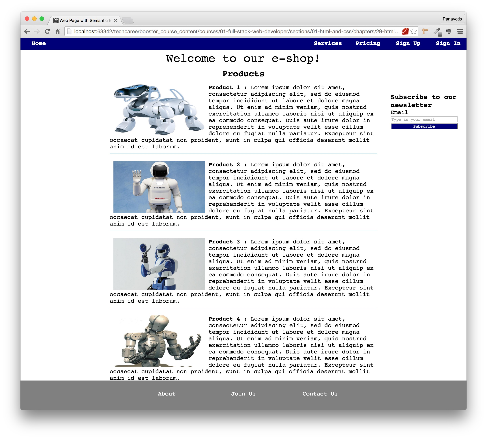

There is no visual element on this page that would tell us it is an HTML5 page. If you want to tell whether this page is HTML5 or not, you would have to look into the source
code of it.

Let's try to build the above HTML page using HTML5 elements.

Here are the properties of this page that we need to pay attention to:

1. It uses a font family fetched from Google Fonts. It is "Source Code Pro" which is a monospace font family.
2. The top navigation bar stays on fixed position, even if we scroll the content of the page.
3. The top navigation bar items change color to yellow when the mouse hovers over them.
4. The right-hand side, with the newsletter subscription form, stays on the same position even if we scroll the content.
5. The bottom navigation bar stays on fixed position, even if we scroll the content of the page.
6. The bottom navigation bar items change color to black when we hover over them.

You can watch this short video that demonstrates the above:

<div id="media-title-video-html5-page-demo.mp4-Usage of the HTML5 page">Usage of the HTML5 page</div>
<a href="https://player.vimeo.com/video/194159882"></a>
           
Please, note again, that visually, the HTML5 page, that uses semantic elements like the above, does not differ to anything if compared to a page that uses HTML4
simple `div` elements. The difference is that the actual HTML markup with semantic elements is more self-descriptive and tries to describe its meaning both
to the browser and to the developers that read the code.

Having said that, let's see how the above can be constructed with HTML5 semantic elements:

``` html
<!DOCTYPE html>
<html>
  <head>
    <meta charset="utf-8">
    <title>Web Page with Semantic Elements</title>
    <link href='https://fonts.googleapis.com/css?family=Source+Code+Pro:400,500,600,700,900,300,200' rel='stylesheet' type='text/css'>
    <link rel="stylesheet" href="stylesheets/main.css" type="text/css"/>
  </head>

  <body>
    <nav>
      <ul class="pull-left">
        <li><a href="#">Home</a></li>
      </ul>

      <ul class="pull-right">
        <li><a href="#">Services</a></li>
        <li><a href="#">Pricing</a></li>
        <li><a href="#">Sign Up</a></li>
        <li><a href="#">Sign In</a></li>
      </ul>
    </nav>

    <header>
      Welcome to our e-shop!
    </header>

    <section>
      <h2>Products</h2>
      <ul>

        <li>
           <strong>Product 1 :</strong> Lorem ipsum dolor sit amet, consectetur adipiscing elit, sed do eiusmod tempor incididunt ut labore et dolore magna
          aliqua. Ut enim ad minim veniam, quis nostrud exercitation ullamco laboris nisi ut aliquip ex ea commodo consequat. Duis aute irure dolor in reprehenderit in
          voluptate velit esse cillum dolore eu fugiat nulla pariatur. Excepteur sint occaecat cupidatat non proident, sunt in culpa qui officia deserunt mollit anim id est laborum.
        </li>

        <li>
           <strong>Product 2 :</strong> Lorem ipsum dolor sit amet, consectetur adipiscing elit, sed do eiusmod tempor incididunt ut labore et dolore magna
          aliqua. Ut enim ad minim veniam, quis nostrud exercitation ullamco laboris nisi ut aliquip ex ea commodo consequat. Duis aute irure dolor in reprehenderit in
          voluptate velit esse cillum dolore eu fugiat nulla pariatur. Excepteur sint occaecat cupidatat non proident, sunt in culpa qui officia deserunt mollit anim id est laborum.

        </li>

        <li>
           <strong>Product 3 :</strong> Lorem ipsum dolor sit amet, consectetur adipiscing elit, sed do eiusmod tempor incididunt ut labore et dolore magna
          aliqua. Ut enim ad minim veniam, quis nostrud exercitation ullamco laboris nisi ut aliquip ex ea commodo consequat. Duis aute irure dolor in reprehenderit in
          voluptate velit esse cillum dolore eu fugiat nulla pariatur. Excepteur sint occaecat cupidatat non proident, sunt in culpa qui officia deserunt mollit anim id est laborum.
        </li>

        <li>
           <strong>Product 4 :</strong> Lorem ipsum dolor sit amet, consectetur adipiscing elit, sed do eiusmod tempor incididunt ut labore et dolore magna
          aliqua. Ut enim ad minim veniam, quis nostrud exercitation ullamco laboris nisi ut aliquip ex ea commodo consequat. Duis aute irure dolor in reprehenderit in
          voluptate velit esse cillum dolore eu fugiat nulla pariatur. Excepteur sint occaecat cupidatat non proident, sunt in culpa qui officia deserunt mollit anim id est laborum.
        </li>
      </ul>
    </section>

    <aside>
      <h3>Subscribe to our newsletter</h3>
      <form>
        <div class="input-group">
          <label for="newsletter-email">Email</label>
          <input type="email" id="newsletter-email" placeholder="Type in your email"/>
        </div>
        <div class="input-group">
          <input type="submit" value="Subscribe"/>
        </div>
      </form>
    </aside>

    <footer>
      <ul>
        <li><a href="#">About</a></li>
        <li><a href="#">Join Us</a></li>
        <li><a href="#">Contact Us</a></li>
      </ul>
    </footer>
  </body>
</html>
```

As you can see, the code above is very simple and basically, does not have anything new to you, other than the semantic elements. Instead of the semantic elements you could have
equally used `div` elements.

Let's pay some attention to the following:

1. The top navigation bar is composed of two `ul` elements. It is very common to create navigation bar items lists using `ul` elements. It may seem to be a little bit unintuitive
to you at the beginning, because you are used to have lists being with bullets and usually vertical. But we will show how we can convert them to nice menu items lists. Note that
the first list is composed of the `Home` menu item only. This is because we want the left side of the bar to have only the `Home` item. The second list contains the rest of the
items.
2. The main content of the page starts with a `header` element.
3. Next, below the `header` element we have the main content of the page, which is the list of products. The list of products is contained inside a `section` element.
4. For the list of products we are using, again, an unsorted list, a `ul` element. This is another example to demonstrate that lists (`ol` and `ul`) do not necessarily have to
be the boring top down lists, with the simple bullets.
5. The subscription to newsletter part of the page is included inside an `aside` element. Works like a side note, something that is not related to the actual content of the
particular page. This element contains a form with elements that we have already learned about in the forms chapter.
6. The bottom navigation bar is a `footer` element. We use this semantic element because this part of the page stays at the bottom as a page footer. Again, here, we are using
a `ul` element. With similar to top navigation bar techniques, we convert this list to something that can work as a list of menu items. We will explain, later on, how we have
managed to do that.

Let's start with a very basic `main.css` file:

``` css
* {
    box-sizing: border-box;
    padding: 0;
    margin: 0;
}

html {
    font-size: 62.5%;
}

html,
input {
    font-family: "Source Code Pro", monospace;
}

input[type=submit] {
    -webkit-appearance: button;
    -moz-appearance: button;
    -o-appearance: button;
    -ms-appearance: button;
    appearance: button;
}

body {
    font-size: 1.6rem;
    margin-top: 3.6rem;
    margin-bottom: 8.0rem;
}

h2 {
    text-align: center;
}

input[type=email] {
    width: 100%;
}

input[type=submit] {
    width: 100%;
    background-color: #000078;
    color: White;
}
```

There is nothing new to you on this CSS, except from the fact that you need to precisely tell the browser to treat the `input` of type `submit` as a button:
``` css
input[type=submit] {
    -webkit-appearance: button;
    -moz-appearance: button;
    -o-appearance: button;
    -ms-appearance: button;
    appearance: button;
}
```
If you do not do that, there are combinations of browsers and operating systems that will not display the button with the font family that we want, but they
will use a system font.

> *Note:* In the above CSS rules, we are using the so-called vendor-specific prefixes:
>
> 1. `-webkit-` for Webkit based browsers (e.g. Chrome, Safari)
> 2. `-moz-` for Mozilla based browsers (e.g. Firefox).
> 3. `-o-` for Opera based browsers.
> 4. `-ms-` for Microsoft based browsers.
>
> and finally, we are specifying a generic name for the same property. This is because this property might not be supported under the same name on all versions and brands of
popular browsers.

If you save the above files and load the HTML page on your browser, then it will not be displaying the content properly:

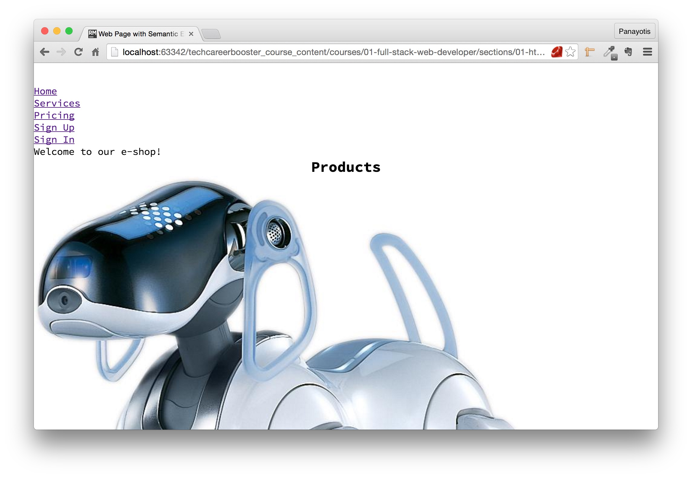

Let's fix that. We will start with the navigation bar. We need to add the following CSS rules:

``` css
.pull-right {
    float: right;
}

.pull-left {
    float: left;
}

nav {
    background-color: #000078;
    color: white;
    position: fixed;
    top: 0;
    left: 0;
    width: 100%;
    height: 3.2rem;
}

nav ul {
    list-style-type: none;
    padding: 5px 0;
}

nav ul li {
    display: inline-block;
    width: 100px;
    text-align: center;
}

nav ul li a {
    text-decoration: none;
    color: White;
    font-weight: 700;
}

nav ul li a:hover {
    color: yellow;
}
```

1. The `pull-left` class is used to float the `Home` menu item to the left.
2. The `pull-right` class is used to float the rest of the menu items on the top navigation bar to the right.
3. The `nav` bar is styled so that it has fixed position.
4. The `nav ul` is styling the list of menu items. The important property here is the `list-style-type`, which takes the value `none`. This removes the default bullets that
usually exist next to each `li` content.
5. The `nav ul li` selector makes the `li` items to be `inline-block`. This makes them appear in one line.
6. Then we style the anchors `a` inside each one of the `li` items.

If you save the above file and load the page on your browser, you will see this:

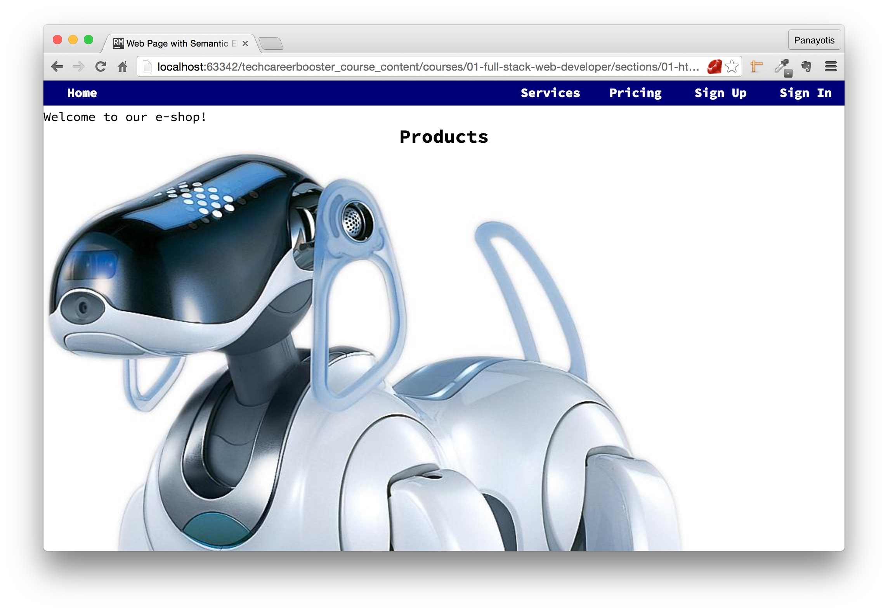

As you can see above, the top navigation bar has been styled correctly. Also, if you move your mouse over the menu items, you will see that their color changes to yellow.

Let's now, quickly, fix the header content. Add the following to your CSS file:

``` css
header {
    text-align: center;
    margin-bottom: 1.0rem;
    font-size: 3.2rem;
    font-weight: 500;
}
```
Pretty straightforward here. Look how we add the `font-weight`. We are using one of the weight integers that come together with our font-family.

If you save your CSS file and reload your page, you will see this:

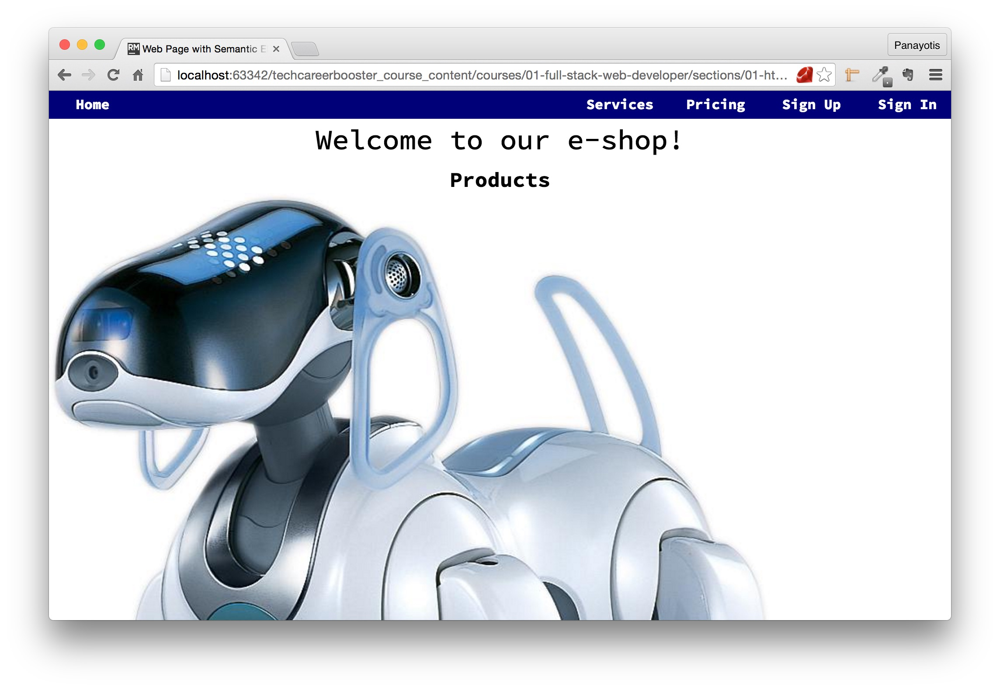

Let's now take care of the section with the list of products. We will first make sure that the images are floated to the left, so that the text goes around it.
Also, we make all the images of equal size. Let's do that:

``` css
.product-image {
    width: 250px;
    height: 141px;
    float: left;
    margin: 0 10px;
}
```

If you amend your CSS file with the above rules and reload your page, you will see this:

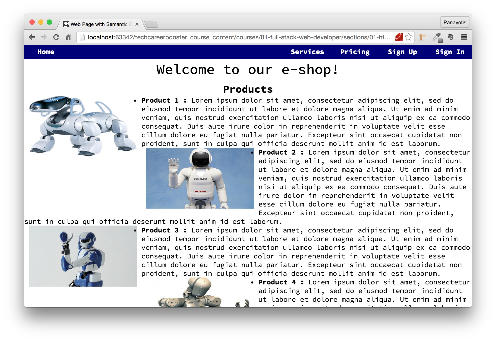

As you can see above, the images float left and the text goes around each image. Also, all images are of the same size. Let's style the list of products now:

``` css
section ul {
    list-style-type: none;
}

section ul li {
    margin-bottom: 20px;
    padding-bottom: 10px;
    border-bottom: 1px solid lightblue;
    min-height: 150px;
}
```

As you can see above, we remove the default style type from the list (`list-style-type: none;`) and we also add some border bottom on each one of the list items. 
Moreover, we make sure that the `li` height is at least `150px`, a little bit higher than the image height, to make sure that the image does not overflow the `li`
height. If you save the above and reload your HTML page you will see this:

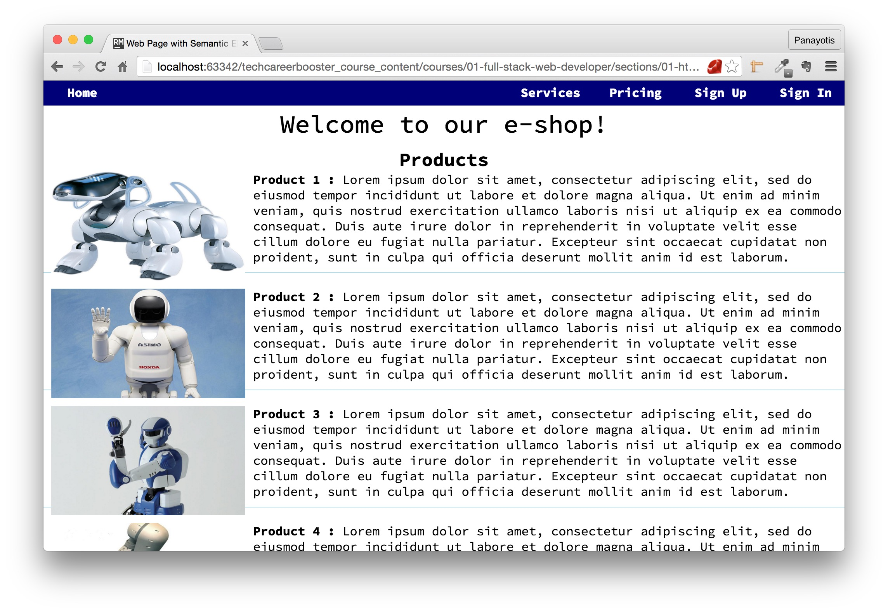

As you can see above, the list of products seems to be ready. What is missing, is some margins to the left and right of the section with products. Let's do that too:

``` css
section {
    width: 60%;
    margin: 0 auto;
}
```
We limit the width of the section to 60% of the width of the browser window. We also make sure that the section appears in the center by setting the left and right margins to `auto`.

If you add the above to your CSS file and reload the page you will see this:

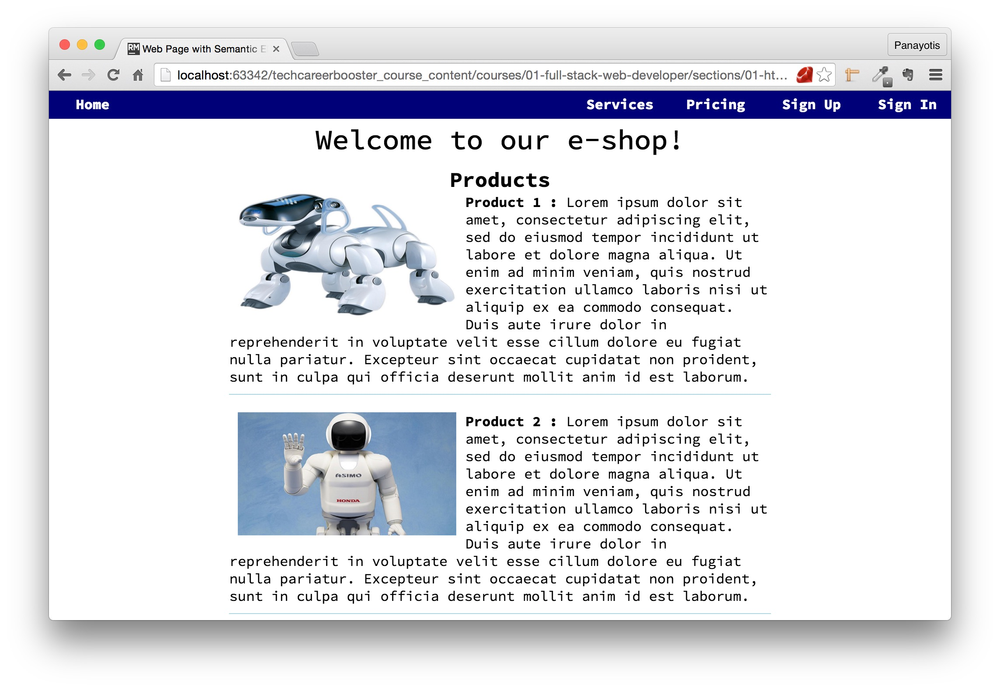

Perfect. We now move to the other part of the page that has the newsletter subscription. As we said earlier, we want this to always be on a fixed position in relation to browser edges.
Add the following CSS code to your CSS file:
``` css
aside {
    width: 15%;
    position: fixed;
    top: 150px;
    right: 2%;
}
```

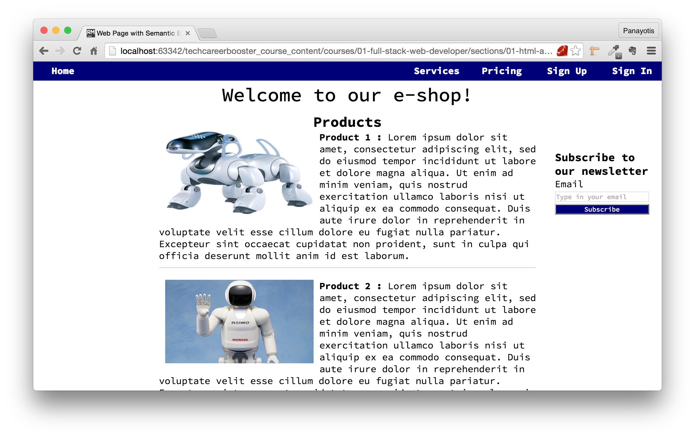

What remains to be styled is the bottom navigation bar, the footer. Its style is similar to the top navigation bar. Add the following to your CSS file:

``` css
footer {
    position: fixed;
    bottom: 0;
    left: 0;
    width: 100%;
    height: 8.0rem;
    background-color: gray;
    color: white;
    text-align: center;
}

footer ul {
    list-style-type: none;
    width: 60%;
    margin: 2.7rem auto;
}

footer ul li {
    display: inline-block;
    width: 200px;
}

footer ul li a {
    text-decoration: none;
    color: White;
}

footer ul li a:hover {
    color: Black;
}
```

If you amend your file and reload the page you will see this:

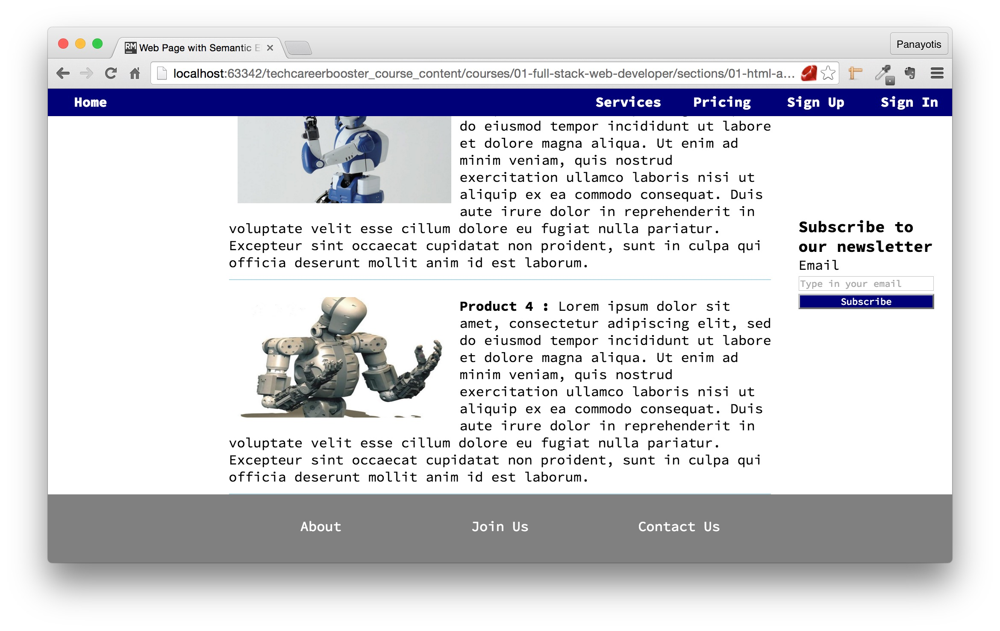

The page looks quite ready. There are some small CSS touches that will make it look better. For example, the margins below the headers. The final, complete CSS file should be like that:

``` css
* {
    box-sizing: border-box;
    padding: 0;
    margin: 0;
}

html {
    font-size: 62.5%;
}

html,
input {
    font-family: "Source Code Pro", monospace;
}

input[type=submit] {
    -webkit-appearance: button;
    -moz-appearance: button;
    -ms-appearance: button;
    -o-appearance: button;
    appearance: button;
}

body {
    font-size: 1.6rem;
    margin-top: 3.6rem;
    margin-bottom: 8.0rem;
}

/* Utility classes */

.pull-right {
    float: right;
}

.pull-left {
    float: left;
}

/* general elements */
h2 {
    text-align: center;
}

/* Navigation Bar Styling */

nav {
    background-color: #000078;
    color: white;
    position: fixed;
    top: 0;
    left: 0;
    width: 100%;
    height: 3.2rem;
}

nav ul {
    list-style-type: none;
    padding: 5px 0;
}

nav ul li {
    display: inline-block;
    width: 100px;
    text-align: center;
}

   /* LVHA */

nav ul li a {
    text-decoration: none;
    color: White;
    font-weight: 700;
}

nav ul li a:hover {
    color: yellow;
}

/* --- end of navigation bar styling --- */

/* Header */
header {
    text-align: center;
    margin-bottom: 1.0rem;
    font-size: 3.2rem;
    font-weight: 500;
}

section {
    width: 60%;
    margin: 0 auto;
}

aside {
    width: 15%;
    position: fixed;
    top: 150px;
    right: 2%;
}

/* section with products */

section h2 {
    margin-bottom: 15px;
}

section ul {
    list-style-type: none;
}

section ul li {
    margin-bottom: 20px;
    padding-bottom: 10px;
    border-bottom: 1px solid lightblue;
    min-height: 150px;
}

.product-image {
    width: 250px;
    height: 141px;
    float: left;
    margin: 0 10px;
}

input[type=email] {
    width: 100%;
}

input[type=submit] {
    width: 100%;
    background-color: #000078;
    color: White;
}

/* footer */
footer {
    position: fixed;
    bottom: 0;
    left: 0;
    width: 100%;
    height: 8.0rem;
    background-color: gray;
    color: white;
    text-align: center;
}

footer ul {
    list-style-type: none;
    width: 60%;
    margin: 2.7rem auto;
}

footer ul li {
    display: inline-block;
    width: 200px;
}

footer ul li a {
    text-decoration: none;
    color: White;
}

footer ul li a:hover {
    color: Black;
}
```
If you save this file and load your page you will see the final version of the page.

This finishes our encounter with HTML5 semantic elements. We are proceeding to other aspects of HTML5 that you need to be aware of.

### HTML5 Graphics

You can use two techniques to draw graphics with HTML5. The `svg` and the `canvas`. We will not deal with that now. These are advanced topics
and we will talk about them in the JavaScript chapters.

### HTML5 Multimedia

HTML5 defines some HTML elements that have a special use to display multimedia content: `video` and `audio`.

#### `video`

Before HTML5 there was not any standard way to show videos on a web page. The HTML5 `video` element specifies a standard way to embed a video in a web page.

See the following example:

``` html
<!DOCTYPE html>
<html>
  <head>
    <meta charset="utf-8">
    <title>Video Player Example</title>
  </head>

  <body>
    <video width="320" height="240" controls="controls">
      <source src="http://tech-career-booster-courses.s3.amazonaws.com/01-full-stack-web-developer/sections/01-html-and-css/chapters/29-html5/assets/videos/animals-house-of-the-rising-sun.mp4"/>
      Your browser does not support the video tag.
    </video>
  </body>
</html>
```
Save the above code as an HTML page and load it on your browser. You will see something like this:

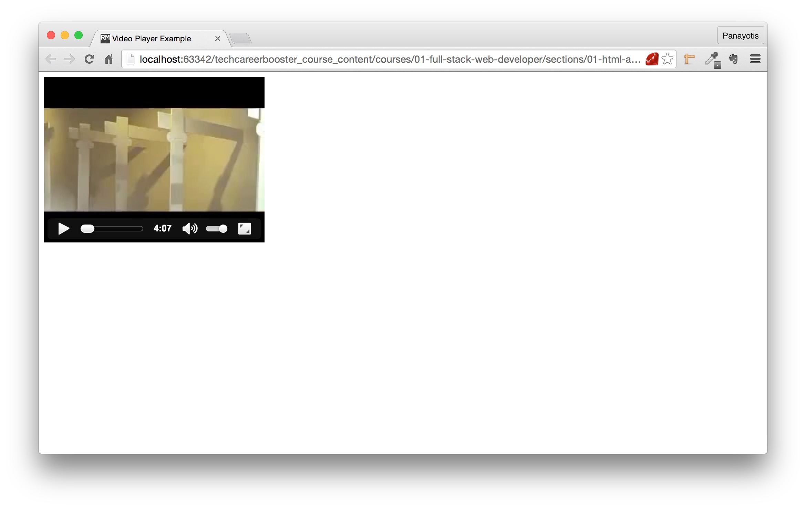

The video will start playing if you click on the play button. Pretty simple. Isn't it?

Here are some details that have to do with the `video` element:

1. the `controls="controls"` adds play, pause, resume e.t.c. play control buttons.
2. always include `width` and `height` attributes so that you control how the video player is drawn on you page.
3. `video` is an inline element.
4. Text that exists between the opening and closing tags, will appear only if the browser does not support the `video` tag.
5. You can include multiple times the `source` element. Usually we do that if we have the same video in different digital formats, e.g. AVI, MP4. The browser will pick up the
first that will be able to play back. So, extra `source` elements pointing to different formats of the same video content work like a fallback source, in case the first source
format is not supported.

#### `audio`

Like for video, before HTML5 there was not any standard way to display an audio player inside an HTML page and allow the user to listen to an audio file. With HTML5, the `<audio>`
element can be used to give user access to audio files.

Let's see the following example:

``` html
<!DOCTYPE html>
<html>
  <head>
    <meta charset="utf-8">
    <title>Audio Player Example</title>
  </head>

  <body>
    <audio controls="controls">
      <source src="http://tech-career-booster-courses.s3.amazonaws.com/01-full-stack-web-developer/sections/01-html-and-css/chapters/29-html5/assets/audio/eagles-hotel-california-with-lyrics.mp3"/>
      This browser does not support the audio HTML element.
    </audio>
  </body>
</html>
```

As you can see above, the `<audio>` tag is similar to `<video>`. It is very simple. You have to define the source of the audio. Again the `controls` attribute adds play controls
on the player displayed inside the HTML page.

If you save the above page and then load it on your browser, you will see this:

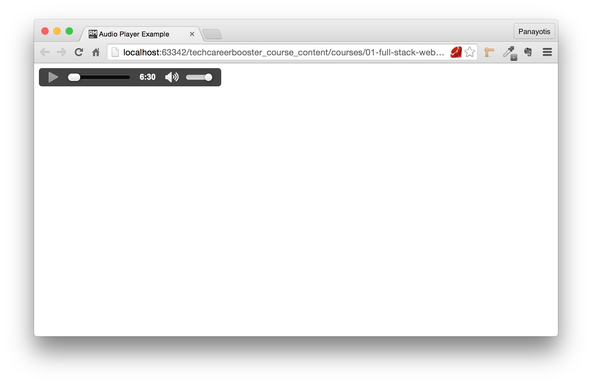

As you can see the audio player has play controls and it also displays the duration of the audio play back.

#### Common to `video` and `audio`

There are some properties that are common to both `video` and `audio` tags. Here they are:

* `autoplay`. This is a boolean attribute. If it exists it will instruct browser to start playing back the video or audio as soon as it can. Here is how you should be
using that:

``` html
<video controle="controls" autoplay="autoplay">
 <source src="link-to-video.mp3">
</video>
```
Note that `autoplay` is by default switched off.

* `preload`. This is an attribute that controls whether the media will be loaded along side with the rest of the page content or not. It is very important and affects
the user experience and performance of your page. It takes the following values:
    * `auto`. The entire media is loaded as soon as the rest of the page loads. This is the heaviest method. It might significantly increase the amount of time required
    for your page to load. Note that this is the default value. So, if `preload` is not present, then `auto` is assumed and the media loads alongside with the rest of the
    content of your page.
    * `none`. None of the media content if preloaded. Neither the content nor any metadata (e.g. its duration).
    * `metadata`. This is very useful because it is both quick and allows the browser to display enough information about the media that makes for a nice user experience. It does not
    download the media content. It downloads the media metadata, e.g. its duration.

> **Important:** If your page requires a lot of media to be displayed at the same time, i.e. has a lot of audio or video tags, the best preloading method that you should use
is `metadata`. If you do not use that, due to limitations in number of requests and downloads that a page can do at the same time, some of your media might not be accessible. This also
means that you need to be careful with the `autoplay` property too. Since it basically preloads the content as if you had `preload="auto"`.

#### YouTube Videos

You may wondering whether you can attach a YouTube video source to your HTML page using the `video` tag. The answer is no, because you do not actually have the real source, web address, of the
video resource.

If you want to embed YouTube videos on your page, you will need to follow the "embed" instructions on the "share part" of the video YouTube page.

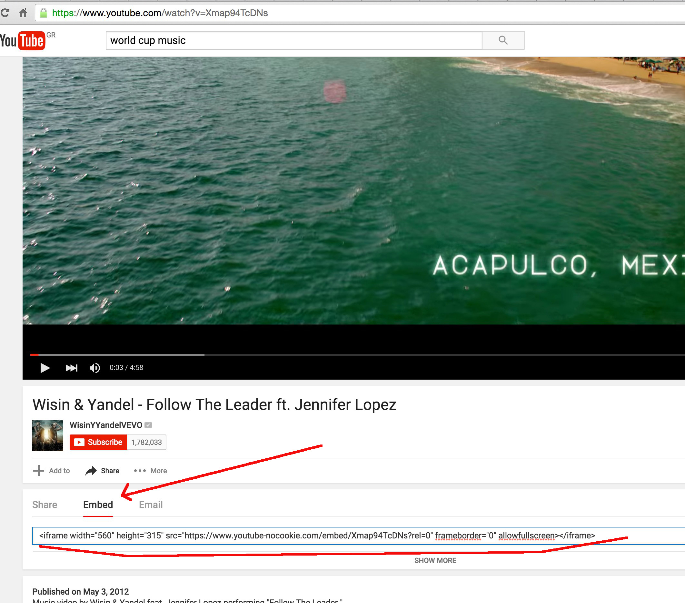

Above, you can see a screenshot from a video page on YouTube. [Visit this page](https://www.youtube.com/watch?v=Xmap94TcDNs) and click on "Share", then click on "Embed". You will be
presented with an input text box where it has the code that you need to embed into your HTML page code. This will allow you to have this video inside your Web page. Let's do that:

``` html
<!DOCTYPE html>
<html>
  <head>
    <meta charset="utf-8">
    <title>YouTube Video Example</title>
  </head>

  <body>
    <iframe width="560" height="315" src="https://www.youtube-nocookie.com/embed/Xmap94TcDNs?rel=0" frameborder="0" allowfullscreen></iframe>
  </body>
</html>
```

As you can see above, the `body` tag contains the code that YouTube is telling us to use. It is an `iframe` element.

> *Note:* for the `iframe` element, see next chapter that has a short reference to some other HTML elements.

Save the above HTML code into an HTML file and load the page
on your browser. You will see this:

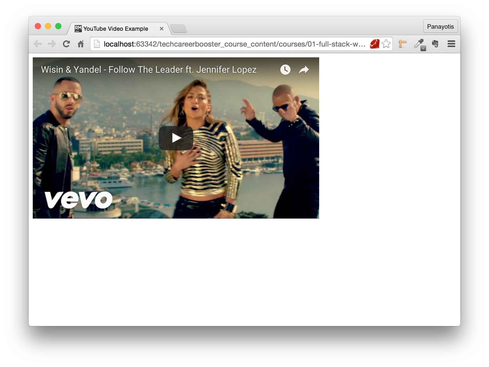
