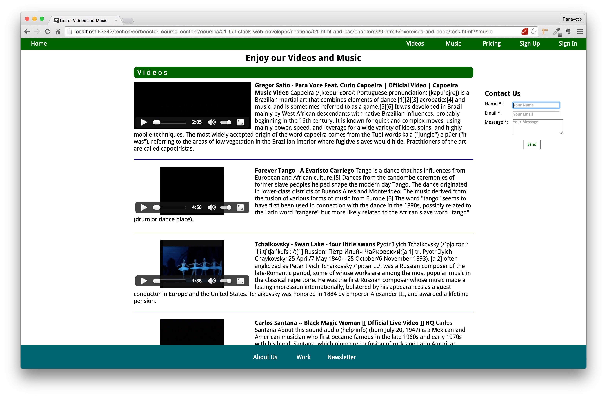

1. You need to implement the following web page that includes a series of video and audio tags:

2. Watch this video to see how this page works:

Video showing the page for the Task with Videos and Audios

3. Here are some requirements and hints to help you finish this task:
    1. It uses the font "Droid Sans" from Google Fonts.
    2. When the user clicks on "Videos" menu item, the page scrolls at the point where the videos section starts. You many need to read back again the chapter on "Positioning".
    It has a tip on how you can solve the problem of content being hidden behind the top navigation bar.
    3. The video links that you should use are the following:
        1. `http://tech-career-booster-courses.s3.amazonaws.com/01-full-stack-web-developer/sections/01-html-and-css/chapters/29-html5/assets/videos/gregor-salto-para-voce-feat-curio-capoeira.mp4`
        2. `http://tech-career-booster-courses.s3.amazonaws.com/01-full-stack-web-developer/sections/01-html-and-css/chapters/29-html5/assets/videos/forever-tango-a-evaristo-carriego.mp4`
        3. `http://tech-career-booster-courses.s3.amazonaws.com/01-full-stack-web-developer/sections/01-html-and-css/chapters/29-html5/assets/videos/tchaikovsky-swan-lake-four-little-swans.mp4`
        4. `http://tech-career-booster-courses.s3.amazonaws.com/01-full-stack-web-developer/sections/01-html-and-css/chapters/29-html5/assets/videos/carlos-santana.mp4`
        5. `http://tech-career-booster-courses.s3.amazonaws.com/01-full-stack-web-developer/sections/01-html-and-css/chapters/29-html5/assets/videos/rachmaninov-rhapsody-on-a-theme-of-paganini_Op-43-variation-18-andantecant.mp4`
    4. The audio links that you should use are the following:
        1. `http://tech-career-booster-courses.s3.amazonaws.com/01-full-stack-web-developer/sections/01-html-and-css/chapters/29-html5/assets/audio/We Are One (Ole Ola) [The Official 2014 FIFA World Cup Song] (Olodum Mix).mp3`
        2. `http://tech-career-booster-courses.s3.amazonaws.com/01-full-stack-web-developer/sections/01-html-and-css/chapters/29-html5/assets/audio/shakira-waka-waka-the-official-2010-fifa-world-cup.mp3`
        3. `http://tech-career-booster-courses.s3.amazonaws.com/01-full-stack-web-developer/sections/01-html-and-css/chapters/29-html5/assets/audio/Shakira - La La La (Brazil 2014) ft. Carlinhos Brown.mp3`
        4. `http://tech-career-booster-courses.s3.amazonaws.com/01-full-stack-web-developer/sections/01-html-and-css/chapters/29-html5/assets/audio/Shakira - Loca (Spanish Version) ft. El Cata.mp3`
        5. `http://tech-career-booster-courses.s3.amazonaws.com/01-full-stack-web-developer/sections/01-html-and-css/chapters/29-html5/assets/audio/Jennifer Lopez - On The Floor ft. Pitbull.mp3`
    5. The contact us form on the right
        1. Needs to have all the fields required.
        2. The focus should be on the Name field when the page loads.
        3. The visible rows that user can type inside the message box should be 3.
    6. Be careful with the styling:
        1. `body` element needs to have enough top and bottom margins so that the content is not hidden.
        2. The button of the Contact us form, needs to have the font family "Droid Sans" like the rest of the document.
        3. Choose your own colors, but make sure that
            1. When the mouse moves over any of the menu items, top or bottom, the color changes.
            2. When the mouse moves over the "Send" button on Contact Us form the background color and color of the button change.
        4. You may need to increase the z-index of the top navigation bar. This is because the video player controls UI might be drawn on top of the navigation bar if not done.
4. You will need to upload your work to Netlify.
