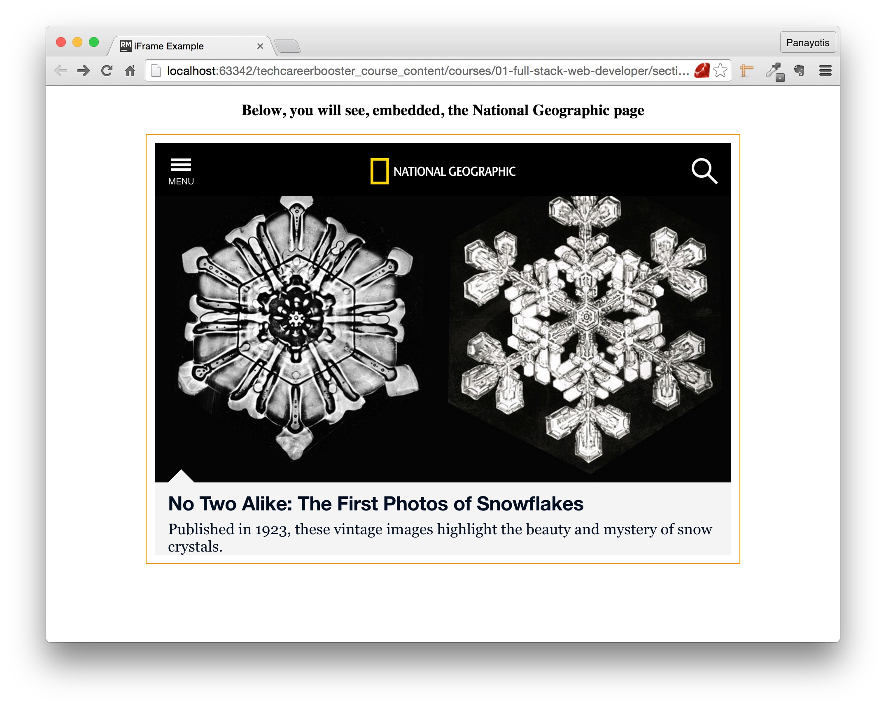
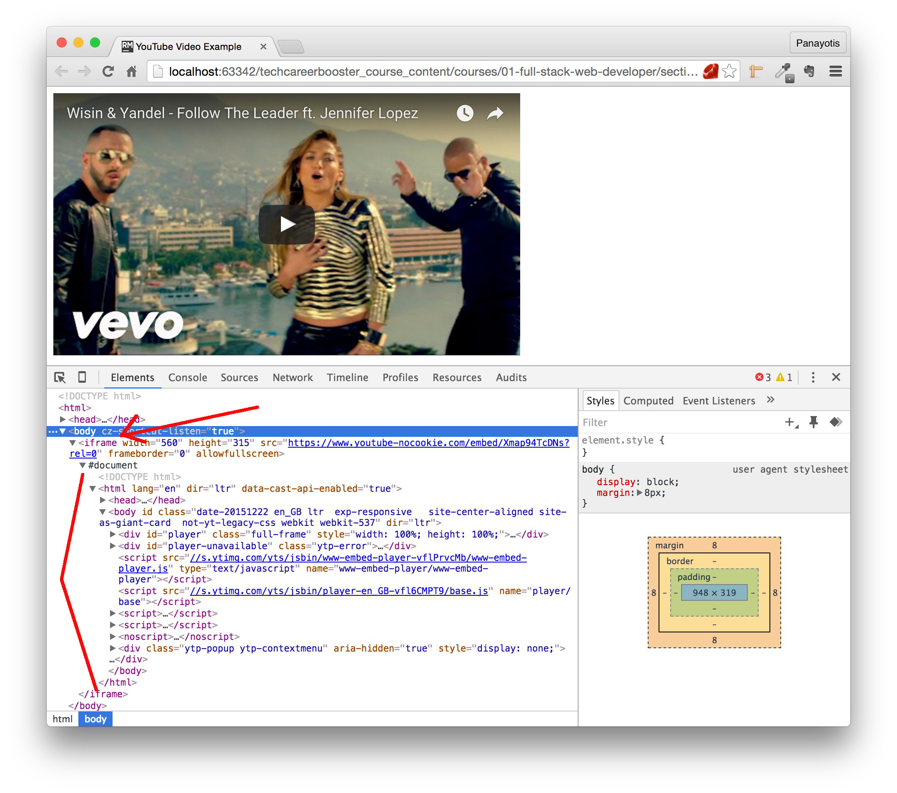
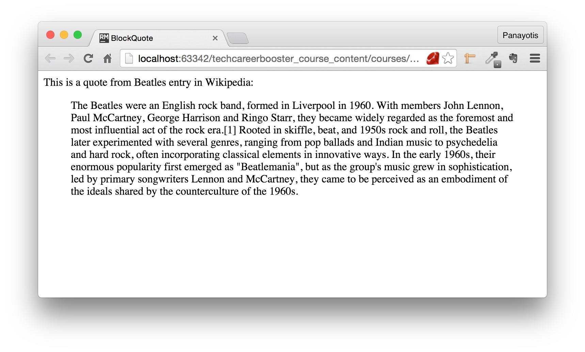
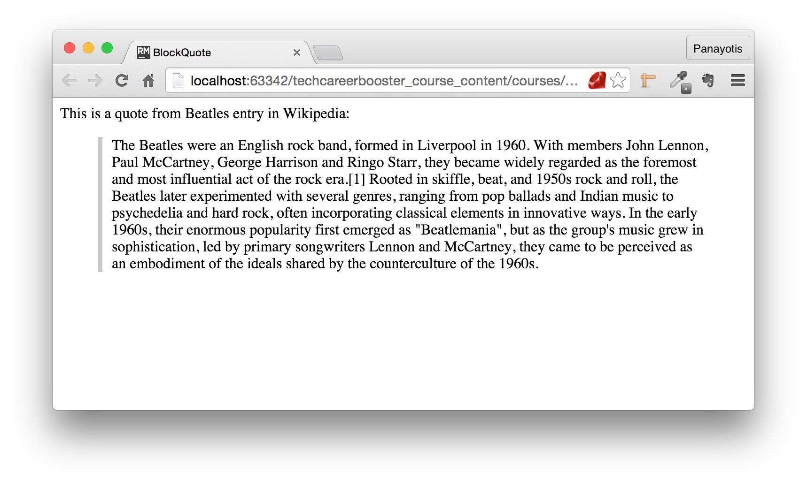
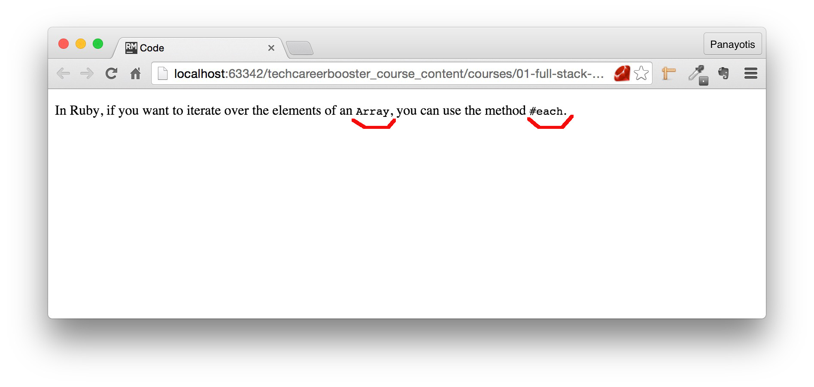
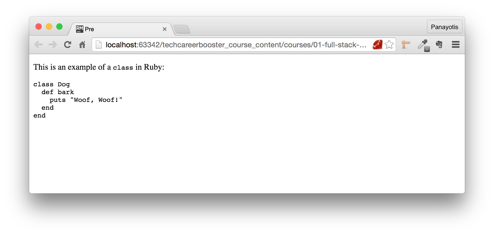

In this chapter we will make a short reference to a series of HTML elements that you will find, sooner or later, quite useful.

### `iframe`

The `iframe` stands for `inline frame` and it is used to embed into our HTML page the source code of another HTML page. One page inside another.

Let's see this example:

``` html
<!DOCTYPE html>
<html>

  <head>
    <meta charset="utf-8">
    <title>iFrame Example</title>
    <link rel="stylesheet" href="stylesheets/main.css" type="text/css">
  </head>

  <body>
    <h3>Below, you will see, embedded, the National Geographic page</h3>
    <div>
      <iframe src="http://www.nationalgeographic.com"></iframe>
    </div>
  </body>

</html>
```
with CSS:

``` css
body {
    text-align: center;
}
```

If you save the above two files and load the page on your browser, you will see this:


As you can see above, the browser reserves some area on your page to display the content of another. The content of the other page is fully functional. You can scroll,
and click on the links of the embedded page. And the content on the main page does not change. It is the content of the area that shows the embedded page that changes.

Watch this video to understand what we mean:

<div id="media-title-video-national-geographic-embedded.mp4-How the user can use the embedded National Geographic page">How the user can use the embedded National Geographic page</div>
<a href="https://player.vimeo.com/video/194164603"></a>
           
The important attribute of the `iframe` tag is the `src`, which takes as value, the URL address of the external Web page to embed.

When we want to style an `iframe` we should use CSS. Let's improve the style of the above example:

1. We will increase its dimensions
2. We will add some border around it, alongside some padding.

Here is the CSS file:

``` css
body {
    text-align: center;
}

iframe {
    height: 500px;
    width: 700px;
    border: 1px solid #FF9800;
    padding: 10px 10px;
}
```
If you save this file and reload the page, you will see this:



Pretty nice.

Before closing the `iframe` section, we would like to tell you that, usually, when you use an `iframe` your browser creates a whole HTML document inside your current HTML page.
Let's take another example:


``` html
<!DOCTYPE html>
<html>
  <head>
    <meta charset="utf-8">
    <title>YouTube Video Example</title>
  </head>

  <body>
    <iframe width="560" height="315" src="https://www.youtube-nocookie.com/embed/Xmap94TcDNs?rel=0" frameborder="0" allowfullscreen></iframe>
  </body>
</html>
```

It is the page that includes an `iframe` as instructed by YouTube share / embed feature. If you load this page on your browser and open the developer tools to inspect
the `iframe` content, you will see this:



As you can see above, browser creates the `iframe` content as a whole HTML page.

### `blockquote`

The `blockquote` element is used to include a part of HTML content that is quoted from another source. Look at the following example:

``` html
<!DOCTYPE html>
<html>
  <head>
    <meta charset="utf-8">
    <title>BlockQuote</title>
  </head>
  <body>
    This is a quote from Beatles entry in Wikipedia:
    <blockquote cite="https://en.wikipedia.org/wiki/The_Beatles">
      The Beatles were an English rock band, formed in Liverpool in 1960. With members John Lennon, Paul McCartney, George Harrison and Ringo Starr, they became
      widely regarded as the foremost and most influential act of the rock era.[1] Rooted in skiffle, beat, and 1950s rock and roll, the Beatles later experimented
      with several genres, ranging from pop ballads and Indian music to psychedelia and hard rock, often incorporating classical elements in innovative ways.
      In the early 1960s, their enormous popularity first emerged as "Beatlemania", but as the group's music grew in sophistication, led by primary
      songwriters Lennon and McCartney, they came to be perceived as an embodiment of the ideals shared by the counterculture of the 1960s.
    </blockquote>
  </body>
</html>
```

Do you see the `blockquote` element? It includes some text that has been copied from Wikipedia, "The Beatles" entry. The actual page that the content was
quoted from is given as value to the `cite` attribute of the `blockquote` element.

If you save the above content and load the page on your browser, you will see this:



As you can see above, the content of the blockquote is right indented. Let's try to style the blockquote a little bit:

Write the following CSS code and link to the CSS file, main.css, from your HTML page:

``` css
blockquote {
    border-left: 5px solid #c8c8c8;
    padding-left: 10px;
}
```

The HTML content should be:

``` html
<!DOCTYPE html>
<html>
  <head>
    <meta charset="utf-8">
    <title>BlockQuote</title>
    <link rel="stylesheet" href="stylesheets/main.css" type="text/css">
  </head>
  <body>
    This is a quote from Beatles entry in Wikipedia:
    <blockquote cite="https://en.wikipedia.org/wiki/The_Beatles">
      The Beatles were an English rock band, formed in Liverpool in 1960. With members John Lennon, Paul McCartney, George Harrison and Ringo Starr, they became
      widely regarded as the foremost and most influential act of the rock era.[1] Rooted in skiffle, beat, and 1950s rock and roll, the Beatles later experimented
      with several genres, ranging from pop ballads and Indian music to psychedelia and hard rock, often incorporating classical elements in innovative ways.
      In the early 1960s, their enormous popularity first emerged as "Beatlemania", but as the group's music grew in sophistication, led by primary
      songwriters Lennon and McCartney, they came to be perceived as an embodiment of the ideals shared by the counterculture of the 1960s.
    </blockquote>
  </body>
</html>
```

If you save the above page and load it on your browser, you will see this:



As you can see from the above screenshot, the blockquote now has some border to the left side of it.

### `code` and `pre`

Sometimes we want to include programming source code examples. For these blocks, we want to make them stand out from the rest of the text.
This can be achieved with the help of the `code` HTML tag. Look at the following example:

``` html
<!DOCTYPE html>
<html>
  <head>
    <meta charset="utf-8">
    <title>Code</title>
  </head>

  <body>
    <p>
      In Ruby, if you want to iterate over the elements of an <code>Array</code>, you can use the method <code>#each</code>.
    </p>
  </body>
</html>
```

If you save the above code and load the page on your browser, you will see this:



Browser is using a special kind of font family (usually a monospace family) to print text that is included inside `code` blocks. And you can always style `code` blocks with CSS
according to your preferences. `code` element is used when we want to mark, as source code, only short text. If you want to mark as source code long multi-line text you should
prefer the `pre` element. The `pre` element defines a pre-formatted piece of content and preserves the spaces, new lines e.t.c.

Look at the following example:

``` html
<!DOCTYPE html>
<html>
  <head>
    <meta charset="utf-8">
    <title>Pre</title>
  </head>

  <body>
    <p>
      This is an example of a <code>class</code> in Ruby:
    </p>

    <pre>
class Dog
  def bark
    puts "Woof, Woof!"
  end
end
    </pre>
  </body>
</html>
```

If you save the above file and reload the page you will see this:



If you compare with the HTML source code, you will see that the content inside the `pre` element has been printed exactly as given, using a special
kind of font family.
