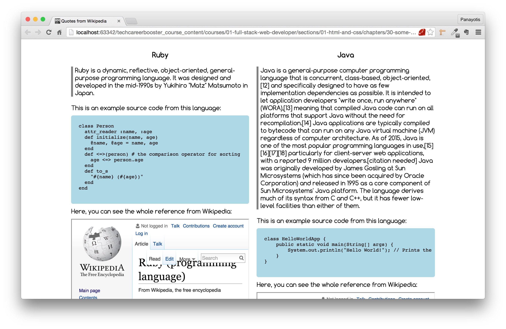

1. Build a web page with 2 quotes from Wikipedia and 2 inline frames of the corresponding pages. The
Wikipedia pages that you have to use need to be about specific programming languages. Also, you need to
find some sample code (multi-line) and put it inside your page as example of code of these languages.
2. Here is an example of such a page:

Watch this video too to see how it works:

Task page for Other HTML Elements Chapter

           
3. Here are some hints and requirements:
    1. Use the font "Comfortaa" (all available weights: 300, 400, 700) from Google Fonts.
    2. You can find example of source code inside the corresponding Wikipedia pages.
    3. Make sure that the page content is centered and that there are equal margins left and right.
    4. The blockquotes need to have a border at the left side.
    5. The pre-formatted container needs to be with a background color and needs to have a lot of padding so that the source code inside is quite away from the edges of the
    container, like in the example page above. Also, make sure the container has rounded corners.
    6. The iframe height should be 300px, and the width should be 100%;
    7. Inside the pre-formatted container, the content may be quite long, wider than the actual available width. In that case, you can use the property "overflow-x" with
    value "auto". In that case, browser will limit the visible source code to the available width, and will add a horizontal bar to allow user to see the rest of the content that is hidden.
4. You will need to upload your work to Netlify.    
