Now that mobile phones have become so popular, it is very likely that our Web site visitors
are coming to our Web pages via a mobile browser. We need to make sure that the pages are
looking nice and are functioning well on small displays, either mobiles or tablets or other
small display devices.

When our Web page adapts nicely on small devices we have a responsive Web page design. Our
Web pages need to be responsive.

### The Viewport

The first detail that you need to master is the concept of the Viewport. The viewport is the area of the page that is visible to the user. The viewport varies by
device. For smaller devices that viewport is smaller.

Imagine that you have designed the following Web page that looks good on your desktop


The source code for this page is the following:

HTML:

``` html
<!DOCTYPE html>
<html>
  <head>
    <meta charset="utf-8">
    <title>A Sample Web Page</title>
    <link rel="stylesheet" href="stylesheets/main.css" type="text/css">
  </head>

  <body>

    <h1>New Zealand</h1>

    

    <p>
      New Zealand (/njuːˈzilənd/ new-zee-lənd, Māori: Aotearoa [aɔˈtɛaɾɔa]) is an island country in the southwestern Pacific Ocean. The country geographically comprises
      two main landmasses – that of the North Island, or Te Ika-a-Māui, and the South Island, or Te Waipounamu – and numerous smaller islands. New Zealand is situated
      some 1,500 kilometres (900 mi) east of Australia across the Tasman Sea and roughly 1,000 kilometres (600 mi) south of the Pacific island areas of New Caledonia,
      Fiji, and Tonga. Because of its remoteness, it was one of the last lands to be settled by humans. During its long isolation, New Zealand developed a distinctive
      biodiversity of animal, fungal and plant life. The country's varied topography and its sharp mountain peaks, such as the Southern Alps, owe much to the tectonic
      uplift of land and volcanic eruptions. New Zealand's capital city is Wellington, while its most populous city is Auckland.
    </p>

    <p>
      Polynesians settled in the islands that were to become New Zealand somewhere between 1250 and 1300 CE, and developed a distinctive Māori culture. In 1642, Abel
      Tasman, a Dutch explorer, became the first European to sight New Zealand.[11] In 1840, representatives of the British Crown and Māori Chiefs signed the Treaty
      of Waitangi, making New Zealand a British colony. Today, the majority of New Zealand's population of 4.5 million is of European descent; the indigenous Māori
      are the largest minority, followed by Asians and Pacific Islanders. Reflecting this, New Zealand's culture is mainly derived from Māori and early British settlers,
      with recent broadening arising from increased immigration. The official languages are English, Māori and New Zealand Sign Language, with English predominant.
    </p>

  </body>

</html>
```
and CSS
```
* {
    box-sizing: border-box;
    padding: 0;
    margin: 0;
}

html {
    font-size: 62.5%;
}

body {
    font-size: 1.6rem;
    text-align: center;
}

h1 {
    margin-bottom: 3rem;
}

p {
    padding: 0 2rem;
    margin-bottom: 2rem;
    text-align: justify;
}
```
Save the above file and load it on your browser. You will see a nice looking page, like the one displayed on the above screenshot.

Now, let's try to see how this page would look like on a mobile device. We will use the Chrome developer tools to switch to mobile device mode emulation.

1. Open the developer tools.
2. Click on the device mode icon.
3. Select the device "Apple iPhone 6" (for example).
4. Refresh the page.

The instructions to do that are displayed on this video:

<div id="media-title-video-mobile-device-mode-with-developer-tools.mp4-How you can enable mobile device mode on Chrome developer tools">How you can enable mobile device mode on Chrome developer tools</div>
<a href="https://player.vimeo.com/video/194213937"></a>
           
What you see is something like this:

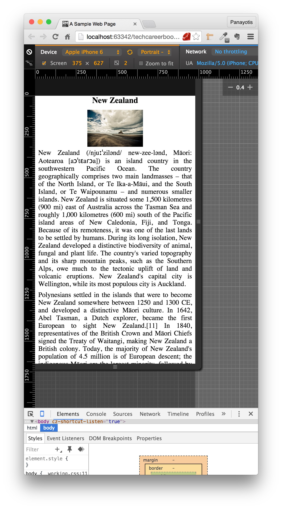

The browser scales down (zoomed out) the original page, so that the entire page fits inside the screen of the mobile device. In fact, on this particular device, the
browser has scaled down the page to 40% of its original size. Do you see the 0.4 on the far right? This is the indicator of the scaling that has been performed.

You will understand that even better if you do the following. Let's add a div at the top of the page with width equal to the screen size of the iPhone 6, a.k.a. 375px.

``` html
<!DOCTYPE html>
<html>
  <head>
    <meta charset="utf-8">
    <title>A Sample Web Page</title>
    <link rel="stylesheet" href="stylesheets/main.css" type="text/css">
  </head>

  <body>

    <div id="rectangle">
      375px width
    </div>

    <h1>New Zealand</h1>

    

    <p>
      New Zealand (/njuːˈzilənd/ new-zee-lənd, Māori: Aotearoa [aɔˈtɛaɾɔa]) is an island country in the southwestern Pacific Ocean. The country geographically comprises
      two main landmasses – that of the North Island, or Te Ika-a-Māui, and the South Island, or Te Waipounamu – and numerous smaller islands. New Zealand is situated
      some 1,500 kilometres (900 mi) east of Australia across the Tasman Sea and roughly 1,000 kilometres (600 mi) south of the Pacific island areas of New Caledonia,
      Fiji, and Tonga. Because of its remoteness, it was one of the last lands to be settled by humans. During its long isolation, New Zealand developed a distinctive
      biodiversity of animal, fungal and plant life. The country's varied topography and its sharp mountain peaks, such as the Southern Alps, owe much to the tectonic
      uplift of land and volcanic eruptions. New Zealand's capital city is Wellington, while its most populous city is Auckland.
    </p>

    <p>
      Polynesians settled in the islands that were to become New Zealand somewhere between 1250 and 1300 CE, and developed a distinctive Māori culture. In 1642, Abel
      Tasman, a Dutch explorer, became the first European to sight New Zealand.[11] In 1840, representatives of the British Crown and Māori Chiefs signed the Treaty
      of Waitangi, making New Zealand a British colony. Today, the majority of New Zealand's population of 4.5 million is of European descent; the indigenous Māori
      are the largest minority, followed by Asians and Pacific Islanders. Reflecting this, New Zealand's culture is mainly derived from Māori and early British settlers,
      with recent broadening arising from increased immigration. The official languages are English, Māori and New Zealand Sign Language, with English predominant.
    </p>

  </body>

</html>
```
and fix its width inside the CSS file:

``` css
* {
    box-sizing: border-box;
    padding: 0;
    margin: 0;
}

html {
    font-size: 62.5%;
}

body {
    font-size: 1.6rem;
    text-align: center;
}

h1 {
    margin-bottom: 3rem;
}

p {
    padding: 0 2rem;
    margin-bottom: 2rem;
    text-align: justify;
}

#rectangle {
    width: 375px;
    border: 1px solid red;
}
```
If you save the above two files and reload the page on your browser, you will see this (still with the mobile device mode on):

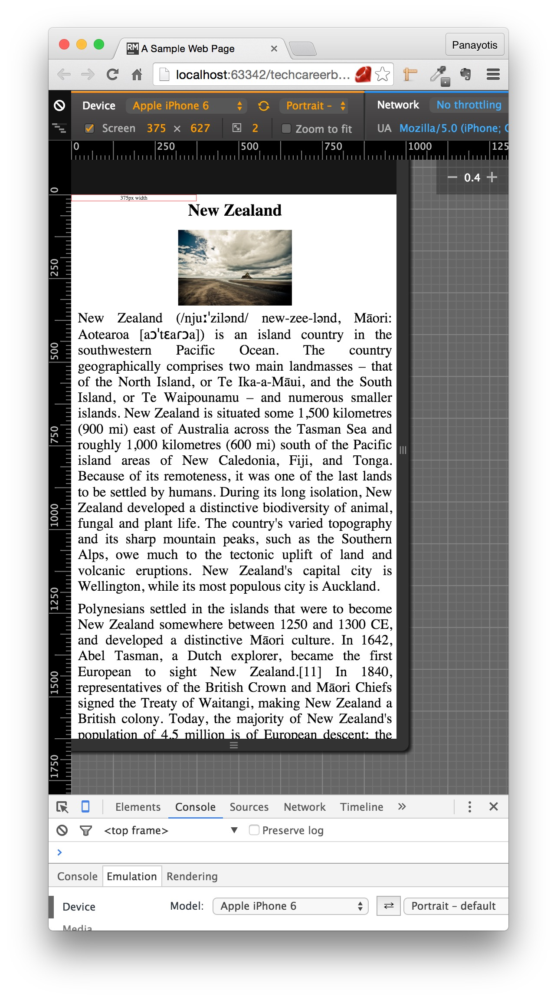

Do you see that the fixed width div, has been scaled down? It is now displayed on 40% of its original size. The CSS instructs the browser to draw that div
with width 375px, which is the width of the iPhone 6 screen size. The div, should have occupied the whole width of the screen, but it does not.

So, that trick does not work well on modern Web pages, that do not have only text to display. You can also see the problem with the image too. It is very small, although there is a lot of blank space
left and right to it, that could have been used to display the image in a larger scale.

With the advent of HTML5, modern web pages give instructions to browser how to load the Web page on mobile devices. This is done with the use of the `meta` with `name`
equal to `viewport`, i.e. the `viewport` `meta` tag.

All your Web pages should have the following `meta` tag on their `head` section:

``` html
<meta name="viewport" content="width=device-width, initial-scale=1.0">
```

This instructs the browser to do the following:

1. consider as viewport width the width of the device. This is the `width=device-width` feature. So, if the device width is 375px (like on iPhone 6),
then the number of pixels of the page that will be available to view on the horizontal direction will be 375px.
2. do not scale down or scale up the page contents. But, instead, use the original page scale/size. This is the `initial-scale=1.0`

Add this meta tag to the page above, like here:

``` html
<!DOCTYPE html>
<html>
  <head>
    <meta charset="utf-8">
    <meta name="viewport" content="width=device-width, initial-scale=1.0">
    <title>A Sample Web Page</title>
    <link rel="stylesheet" href="stylesheets/main.css" type="text/css">
  </head>

  <body>

    <div id="rectangle">
      375px width
    </div>

    <h1>New Zealand</h1>

    

    <p>
      New Zealand (/njuːˈzilənd/ new-zee-lənd, Māori: Aotearoa [aɔˈtɛaɾɔa]) is an island country in the southwestern Pacific Ocean. The country geographically comprises
      two main landmasses – that of the North Island, or Te Ika-a-Māui, and the South Island, or Te Waipounamu – and numerous smaller islands. New Zealand is situated
      some 1,500 kilometres (900 mi) east of Australia across the Tasman Sea and roughly 1,000 kilometres (600 mi) south of the Pacific island areas of New Caledonia,
      Fiji, and Tonga. Because of its remoteness, it was one of the last lands to be settled by humans. During its long isolation, New Zealand developed a distinctive
      biodiversity of animal, fungal and plant life. The country's varied topography and its sharp mountain peaks, such as the Southern Alps, owe much to the tectonic
      uplift of land and volcanic eruptions. New Zealand's capital city is Wellington, while its most populous city is Auckland.
    </p>

    <p>
      Polynesians settled in the islands that were to become New Zealand somewhere between 1250 and 1300 CE, and developed a distinctive Māori culture. In 1642, Abel
      Tasman, a Dutch explorer, became the first European to sight New Zealand.[11] In 1840, representatives of the British Crown and Māori Chiefs signed the Treaty
      of Waitangi, making New Zealand a British colony. Today, the majority of New Zealand's population of 4.5 million is of European descent; the indigenous Māori
      are the largest minority, followed by Asians and Pacific Islanders. Reflecting this, New Zealand's culture is mainly derived from Māori and early British settlers,
      with recent broadening arising from increased immigration. The official languages are English, Māori and New Zealand Sign Language, with English predominant.
    </p>

  </body>

</html>
```
If you save the above file and reload the page on the mobile device mode, you will see this:


Do you see that the page is now displayed on its original scale/size? The div is exactly 375px (the size of iPhone 6 screen width) and the image has been displayed
with the correct dimensions. You can also see that the scaling factor on the far right is "1.0":

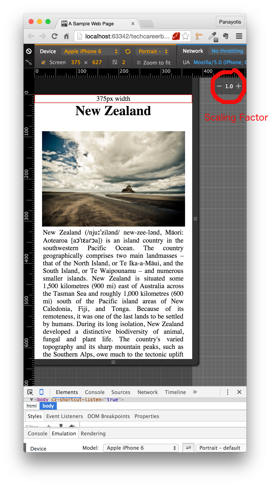

Now that we have instructed the browser to not do any scaling down trick in order to draw the contents of the page on smaller devices, we know that the
sizes specified inside our CSS rules are going to be respected.

And here comes another problem now. Sometimes, elements have sizes that are looking good on desktop computers,
but, these sizes, are not appropriate for smaller device displays. Or there are page designs that are good for large screens but not adequate for small screens.
How can we adapt our page design according to the media type and its features?

Generally, we need to find a way to follow the next rules:

1. The users are used to scroll down vertically, but not horizontally. Horizontal scrolling or need for zoom out actions by the user results in a bad experience.
Hence, we need to make sure that the content of our page is of such width that can fit to the viewport width of the device.
2. On the other hand, we should not rely on a particular specific viewport size when thinking about the sizes of our elements. In other words, we should not design our
page for iPhone 6 375px width only, or for large desktop displays 1920px only.

There are some tools at your hand that can help you design a Web page that would look good both on large desktops and on tablets and mobile devices. For example:

1. Try to avoid large absolute positioning.
2. Try to use relative sizing for width, i.e. 80% will set the size of an element to 80% of this containing parent.
3. Use media queries to apply different CSS rules depending on the device width.

The last item on the previous list is the new thing that you are going to learn now. Let's expand on this.

### Media Queries

A `media` query is composed by a `media type` and one or more expressions. The `media type` defines on which types
of media the `media` query is referring to. The expression tells which properties of the particular media types need
to be met in order for the CSS rules scoped by the `media` query are going to be applied.

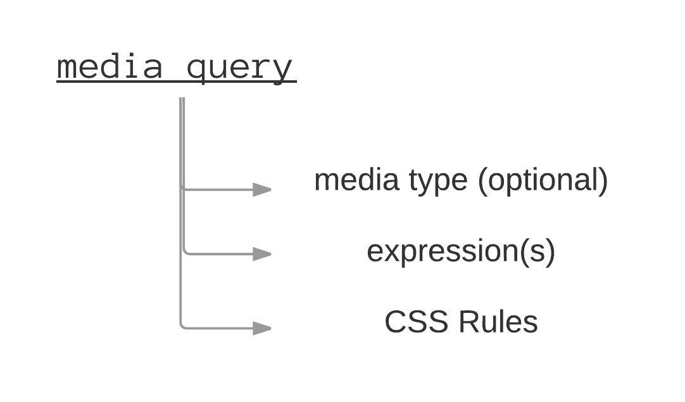

#### Media Type

The media type can take the following values:

1. `all`, which refers to any display / media type.
2. `print`, which refers to documents that are to be presented in print preview mode.
3. `screen`, which refers to color computer or mobile displays.
4. `speech`, which refers to speech synthesizers.

If you do not specify the media type, then it is assumed to be `all`. Exception to this rule is when using the operators `not` or `only`. Will talk about that later on.

#### Expressions

The expressions are composed of media features, properties, that, when calculated at run time, they have to evaluate to either true or false.

This is an example of an expression:

`(max-device-width: 800px)`

It uses the media feature `max-device-width` and it is true when the media that is used to display the HTML content has maximum screen width 800px. Otherwise it is false.
In other words, CSS rules that come with a media query that has this expression, will only be applied on all screens with width up to 800px, including.

#### `@media` Rule

In order to use media queries, you need to define them with the `@media` CSS keyword. The `@media` CSS syntax is the following:

<div>
  <code>@media</code> <em>condition set 1</em>, <em>condition set 2</em>, ... <code>{</code><br/>
  &nbsp;&nbsp;&nbsp;&nbsp;&nbsp;&nbsp;<em>CSS code</em><br/>
  <code>}</code>
</div>

1. We start with the `@media` word.
2. We then specify one or more condition sets separated by commas. For the condition sets see later on.
3. Then we open a block of CSS code, starting with a left curly brace `{`, then on their own lines, we have the CSS code, and then we close with a right curly brace `}`
in its own line.

The condition sets are specified as follows:

<code>not|only</code> <em>mediatype</em> <code>and</code> <em>(media features)</em>

1. We specify, optionally, the media type. Note that if we do not specify the media type, then it is assumed `all`.
2. We can start a condition with the `not` or `only` keyword. The `not` negates the whole condition set. So, if the condition set would have been true
without the `not` keyword, it becomes false when the `not` keyword exists. The `only` keyword is not very common and it is used if we want to support
older browsers that they didn't have support for condition sets with media features.
3. We can use the boolean operator `and` to combine media types with expressions of media features. This specializes our rules by requiring all the conditions combined
with the `and` boolean operator to be true.
4. The media features which are given inside parentheses.

#### Examples

We will immediately proceed to some examples of media queries as we learn how we can define and use them.

1) Example 1

``` css
@media (max-device-width: 800px) {
    .left-column {
        width: 30%;
    }
}
```

In the above example:

1. We do not specify any media type. So, `all` is implied
2. There is one expression: `(max-device-width: 800px)`.
3. There is one CSS rule that is scoped by this media query:
``` css
.left-column {
    width: 30%;
}
```
This means that if the HTML page contains an HTML element that has the class `left-column` and the page is displayed on a screen with width 800px or less,
then that particular element will have size equal to 30% of its container. Otherwise, if the browser displays the HTML page on a media with width greater than 800px, then
this rule will not affect the way the element with class `left-column` is displayed.

2) Example 2

``` css
@media (min-device-width: 700px) and (orientation: landscape) {
    div {
       width: 700px;
    }
}
```
This example uses the boolean operator `and`. So, it requires two conditions to be true. The first is that the minimum device width is 700px (`(min-device-width: 700px)`.
The second is that the orientation of the display is landscape (`(orientation: landscape)`).

3) Example 3

``` css
@media screen and (min-device-width: 700px) and (orientation: landscape) {
    div {
       width: 700px;
    }
}
```
This is the same example case as example number 2, but it has one more condition that needs to be true. It is about the media type that has to be a screen one.

4) Example 4

``` css
@media (min-device-width: 700px), screen and (orientation: landscape) {
    div {
        width: 700px;
    }
}
```
This is an example that has 2 condition sets. First set is `(min-device-width: 700px)` and second condition set is `screen and (orientation: landscape)`.
As you can see the condition sets are separated by comma (`,`). In order for the CSS rules to be applied, the conditions are evaluated from left to right, and at least one
condition needs to be true. So, the comma works like an `or` boolean operator.

This means that the above example could have been written as:

``` css
@media (min-device-width: 700px) {
    div {
        width: 700px;
    }
}

@media screen and (orientation: landscape) {
    div {
        width: 700px;
    }
}
```
or it could have been written as:
``` css
@media (min-device-width: 700px),
@media screen and (orientation: landscape) {
     div {
         width: 700px;
     }
 }
```
As you can understand, the first version is the shortest one and it is preferred.

5) Example 5

``` css
@media (min-device-width: 700px), not print and (orientation: landscape) {
    div {
        width: 700px;
    }
}
```

On this example, we are using two condition sets. The second one is using the operator `not` which actually negates the conditions of the condition set. Hence, the CSS
block will be applied to either devices with minimum device width `700px` or to devices that are not `print` media and do not have orientation landscape.

#### Media Features

We have seen examples with some media features, such as `min-device-width` and `orientation`.
The most important media features are the ones that have to do with the device or viewport dimensions. This is because they can be used to make our Web pages
responsive to various device and display sizes.

Let's see the full list of media features that we can use:

1. `aspect-ratio`, `max-aspect-ratio`, `min-aspect-ratio`: Width over height of the viewport.
2. `color`, `max-color`, `min-color`: The number of bits per color for the output device.
3. `color-index`, `max-color-index`, `min-color-index`: The number of colors the device can display.
4. `device-aspect-ratio`, `max-device-aspect-ratio`, `min-device-aspect-ratio`: Width over height of the device dimensions.
5. `device-height`, `max-device-height`, `min-device-height`: The height of the device.
6. `device-width`, `max-device-width`, `min-device-width`: The width of the device.
7. `height`, `max-height`, `min-height`: The viewport height.
8. `width`, `max-width`, `min-width`: The width of the viewport.
9. `resolution`, `max-resolution`, `min-resolution`: The resolution of the device, using dpi or dpcm.
10. `orientation`: The orientation of the viewport (landscape or portrait).

### A more complex example page with responsive design

Let's try another more complex example with a page that needs to be responsive. Here is the original HTML code:

``` html
<!DOCTYPE html>
<html>
  <head>
    <meta charset="utf-8">
    <meta name="viewport" content="width=device-width, initial-scale=1.0">
    <title>Three Columns Page</title>
    <link rel="stylesheet" href="stylesheets/main.css" type="text/css">
  </head>

  <body>
    <h1>Sports</h1>
    <div id="left-column" class="column">
      <h2>Football</h2>
      
      <p>
        Football refers to a number of team sports that involve, to varying degrees, kicking a ball to score a goal. Unqualified, the word football is understood to
        refer to whichever form of football is the most popular in the regional context in which the word appears. Sports commonly called 'football' in certain places
        include: association football (known as soccer in some countries); gridiron football (specifically American football or Canadian football); Australian rules
        football; rugby football (either rugby league or rugby union); and Gaelic football.[1][2] These different variations of football are known as football codes.
      </p>
      <p>
        Various forms of football can be identified in history, often as popular peasant games. Contemporary codes of football can be traced back to the codification
        of these games at English public schools during the nineteenth century.[3][4] The expanse of the British Empire allowed these rules of football to spread to
        areas of British influence outside of the directly controlled Empire,[5] though by the end of the nineteenth century, distinct regional codes were already
        developing: Gaelic football, for example, deliberately incorporated the rules of local traditional football games in order to maintain their heritage.[6] In
        1888, The Football League was founded in England, becoming the first of many professional football competitions. During the twentieth century, several of the
        various kinds of football grew to become some of the most popular team sports in the world
      </p>
    </div>

    <div id="middle-column" class="column">
      <h2>Basketball</h2>
      
      <p>
        Basketball is a sport played by two teams of five players on a rectangular court. The objective is to shoot a ball through a hoop 18 inches (46 cm) in diameter
        and 10 feet (3.048 m) high mounted to a backboard at each end. Basketball is one of the world's most popular and widely viewed sports.[1] The National Basketball
        Association (NBA) is the most popular and widely considered to be the highest level of professional basketball in the world and NBA players are the world's best
        paid sportsmen, by average annual salary per player.[2][3]
      </p>
      <p>
        A team can score a field goal by shooting the ball through the basket during regular play. A field goal scores three points for the shooting team if the player
        shoots from behind the three-point line, and two points if shot from in front of the line. A team can also score via free throws, which are worth one point,
        after the other team was assessed with certain fouls. The team with the most points at the end of the game wins, but additional time (overtime) is issued when
        the score is tied at the end of regulation. The ball can be advanced on the court by bouncing it while walking or running or throwing it to a teammate. It is a
        violation to lift or drag one's pivot foot without dribbling the ball, to carry it, or to hold the ball with both hands then resume dribbling.
      </p>
    </div>

    <div id="right-column" class="column">
      <h2>Formula One</h2>
      
      <p>
        Formula One (also Formula 1 or F1) is the highest class of single-seat auto racing that is sanctioned by the Fédération Internationale de l'Automobile (FIA).
        The FIA Formula One World Championship has been the premier form of racing since the inaugural season in 1950, although other Formula One races were regularly
        held until 1983. The "formula", designated in the name, refers to a set of rules, to which all participants' cars must conform.[2] The F1 season consists of
        a series of races, known as Grands Prix (from French, originally meaning great prizes), held throughout the world on purpose-built F1 circuits and public roads.
      </p>
      <p>
        The results of each race are evaluated using a points system to determine two annual World Championships, one for drivers, one for constructors. The racing
        drivers are required to be holders of valid Super Licences, the highest class of racing licence issued by the FIA.[3] The races are required to be held on
        tracks graded 1 (formerly A), the highest grade a track can receive by the FIA.[3] Most events are held in rural locations on purpose-built tracks, but there
        are several events in city centres throughout the world, with the Monaco Grand Prix being the most obvious and famous example.
      </p>
    </div>

  </body>

</html>
```

with the following CSS:

``` css
* {
    box-sizing: border-box;
    padding: 0;
    margin: 0;
}

html {
    font-size: 62.5%;
    font-family: Verdana, Arial, sans-serif;
}

body {
    font-size: 1.6rem;
}

.column {
    float: left;
}

#left-column,
#right-column {
    width: 30%;
}

#middle-column {
    width: 40%;
}

img {
    float: left;
    padding: 0.5rem 1rem;
    width: 40%;
}

p {
    margin-bottom: 2rem;
    padding: 0 1.5rem;
}

h1 {
    text-align: center;
    margin-bottom: 3rem;
}

h2 {
    text-align: center;
    margin-bottom: 1rem;
    padding-bottom: 0.5rem;
    border-bottom: 1px solid lightblue;
}
```

If you save the above and load the page on your browser, you will see this:


This page looks quite nice on a desktop display. But how does it look on an Apple iPhone 6 mobile device? Switch your mode to that phone emulation and see. You will get something like that:

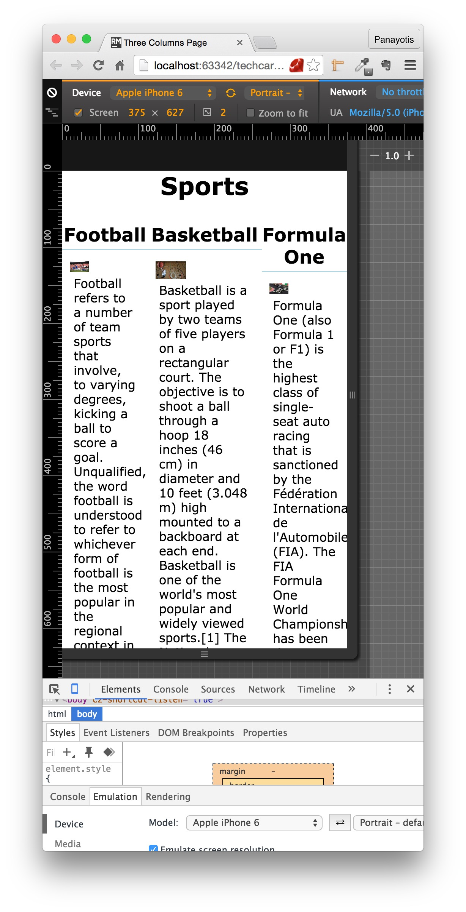

As you can verify, the page is looking really bad on mobile devices. Why is that? What are the problems that we see?

First problem is that the width of the device is quite small to fit the 3 columns. We have these columns occupy 30%, for left and right, and 40% for middle column, of the width
of the viewport. This is quite narrow on a viewport of width 375px like the one we have on iPhone 6.

What we can do to improve that?

First, we can say that on small devices like this, we are not going to use a 3-columns layout like this, but we are going to use 1-column layout. Right? How can we do that?
We can say that the columns width is 100% for small devices. Let's change the CSS as follows:

``` css
* {
    box-sizing: border-box;
    padding: 0;
    margin: 0;
}

html {
    font-size: 62.5%;
    font-family: Verdana, Arial, sans-serif;
}

body {
    font-size: 1.6rem;
}

.column {
    float: left;
}

#left-column, #middle-column, #right-column {
    width: 100%;
}

@media (min-device-width: 400px) {
    #left-column,
    #right-column {
        width: 30%;
    }

    #middle-column {
        width: 40%;
    }
}

img {
    float: left;
    padding: 0.5rem 1rem;
    width: 40%;
}

p {
    margin-bottom: 2rem;
    padding: 0 1.5rem;
}

h1 {
    text-align: center;
    margin-bottom: 3rem;
}

h2 {
    text-align: center;
    margin-bottom: 1rem;
    padding-bottom: 0.5rem;
    border-bottom: 1px solid lightblue;
}
```

What we did was the following:

1. We inserted a rule to apply `width: 100%;` to all 3 columns. Hence, making all the columns occupying the whole width of the device. AND
2. We have wrapped the part of the CSS code that sets other / different widths on the columns, inside a media query block that would apply only
to devices with width 400px or wider.
``` css
@media (min-device-width: 400px) {
    #left-column,
    #right-column {
        width: 30%;
    }

    #middle-column {
        width: 40%;
    }
}
```

If you save the above CSS file and reload the page on the mobile device mode, you will see this:


Perfect. As you can see above, the Web page now is looking really good. CSS is now giving 100% width to the column divs, since the device has width which is less than 400px, and hence,
the media query block is not applied.

If you load the same page on your desktop display now, then the page would look like before. This is because the @media rules would overwrite the CSS rules for "#left-column, #middle-column, #right-column",
which are exactly before that.

> **Important - Mobile First:** As you can see above, the main CSS rules, the ones outside of the media query blocks, are rules that make the page look good on the mobile device.
The exceptions are being handled by the media query rules. Hence, main CSS rules handle the mobile devices and media queries handle the non-mobile devices. This is a <strong>Mobile First</strong>
approach. We could have equally dealt with the same problem as follows:
>
> ``` css
> #left-column,
> #right-column {
>     width: 30%;
> }
>
> #middle-column {
>     width: 40%;
> }
>
> @media (max-device-width: 399px) {
>    #left-column, #middle-column, #right-column {
>        width: 100%;
>    }
> }
> ```
>
> That would have been a non-mobile first approach, because we first deal for non-mobile devices and then handle exceptionally the mobile devices. Try to use Mobile First approach in your
design, because it will make your CSS and your page displayed faster on mobile devices. So, in order to do mobile first design, write your CSS for mobile devices and then introduce
media queries to handle exceptions for larger devices.

#### Breakpoints

With the responsive design that we followed for the previous page, we introduced a limit on 400px width. Devices with width less than 400px and devices with width greater than or equal
to 400px. For that reason, we call the 400px a breakpoint.

We have also seen that our page looks good on iPhone 6, which has 375px width. What happens if the mobile phone has larger than 400px width, but still quite small?

On the device mode emulator choose the iPhone 6 Plus. This one has 414px width. Inspect how the page looks on that device:

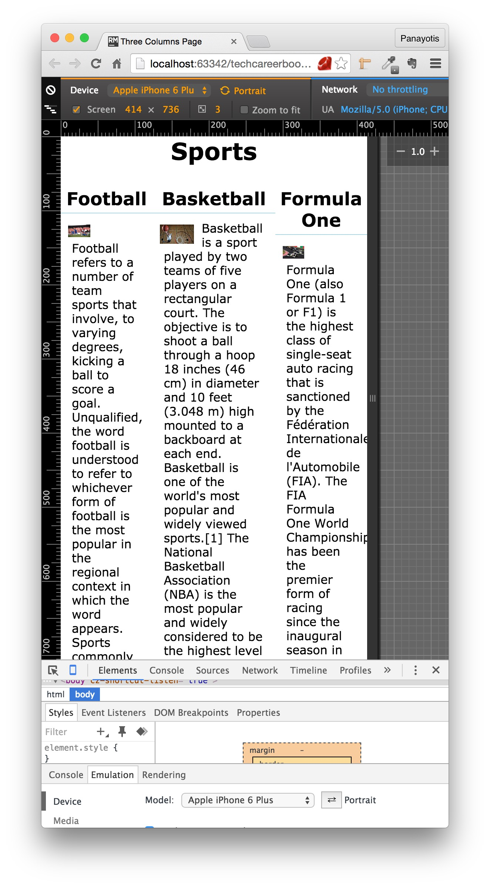

The page does not look good. This is because, on that device, the width is greater than 400px, and hence, the 3-columns layout is applied.

How can we fix that? You can guess that we probably have to change the breakpoint value. Instead of 400px, let's put that a little bit higher. To a value that would cover more mobile device
widths. One good breakpoint is the 600px. Change your CSS to use 600px instead of 400px:

``` css
* {
    box-sizing: border-box;
    padding: 0;
    margin: 0;
}

html {
    font-size: 62.5%;
    font-family: Verdana, Arial, sans-serif;
}

body {
    font-size: 1.6rem;
}

.column {
    float: left;
}

#left-column, #middle-column, #right-column {
    width: 100%;
}

@media (min-device-width: 600px) {
    #left-column,
    #right-column {
        width: 30%;
    }

    #middle-column {
        width: 40%;
    }
}

img {
    float: left;
    padding: 0.5rem 1rem;
    width: 40%;
}

p {
    margin-bottom: 2rem;
    padding: 0 1.5rem;
}

h1 {
    text-align: center;
    margin-bottom: 3rem;
}

h2 {
    text-align: center;
    margin-bottom: 1rem;
    padding-bottom: 0.5rem;
    border-bottom: 1px solid lightblue;
}
```
If you save the above and you load your page on iPhone 6 Plus, you will see that, now, the browser is using 1-column layout and the page looks good.

Now, try to load the page on "Google Nexus 10", which has 800px width. You will see this:

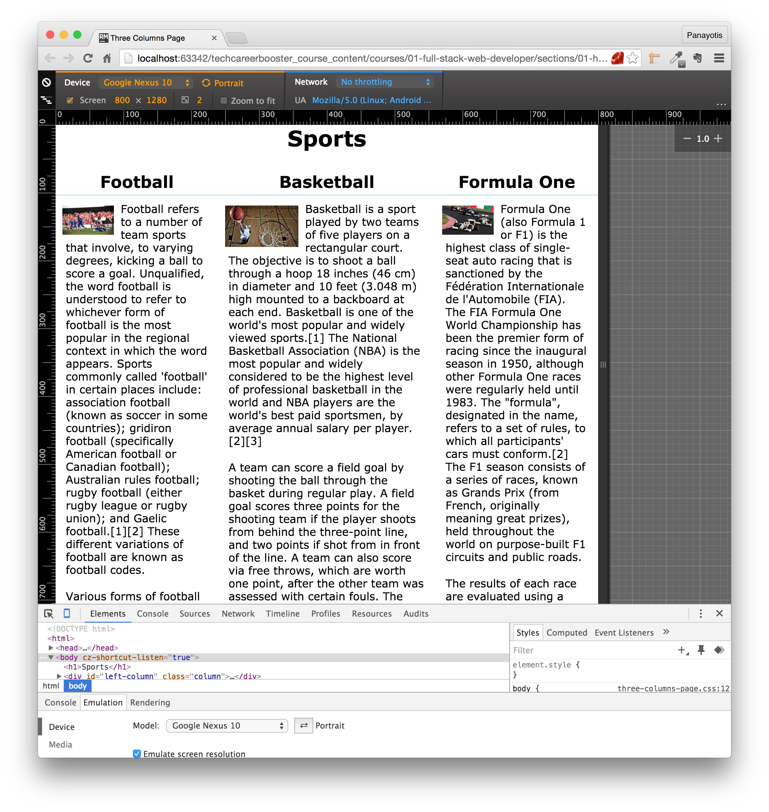

As you can see, the columns are looking better, but still, it seems that 3-columns layout is not very good for this width size. What if we decided to have 2-columns layout for such devices?
2 columns may be looking better than 3 columns. Let's do the following: We are going to have 1-column layout for devices with width up to 600px, 2-columns layout for devices with
width from 600px up to 1200px and 3-columns layout for devices with width 1200px and above.

In order to do that, you need to update your CSS code as follows:

``` css
* {
    box-sizing: border-box;
    padding: 0;
    margin: 0;
}

html {
    font-size: 62.5%;
    font-family: Verdana, Arial, sans-serif;
}

body {
    font-size: 1.6rem;
}

.column {
    float: left;
}

#left-column, #middle-column, #right-column {
    width: 100%;
}

@media (min-device-width: 600px) {
    #left-column, #middle-column, #right-column {
        width: 50%;
    }
}

@media (min-device-width: 1200px) {
    #left-column,
    #right-column {
        width: 30%;
    }

    #middle-column {
        width: 40%;
    }
}

img {
    float: left;
    padding: 0.5rem 1rem;
    width: 40%;
}

p {
    margin-bottom: 2rem;
    padding: 0 1.5rem;
}

h1 {
    text-align: center;
    margin-bottom: 3rem;
}

h2 {
    text-align: center;
    margin-bottom: 1rem;
    padding-bottom: 0.5rem;
    border-bottom: 1px solid lightblue;
}
```
Do you see the changes that have to do with the column widths? These are the following:

``` css
#left-column, #middle-column, #right-column {
    width: 100%;
}

@media (min-device-width: 600px) {
    #left-column, #middle-column, #right-column {
        width: 50%;
    }
}

@media (min-device-width: 1200px) {
    #left-column,
    #right-column {
        width: 30%;
    }

    #middle-column {
        width: 40%;
    }
}
```
As you can read above, and following the mobile first approach, for mobile devices less than 600px, we are using 1-column layout. For devices with width from 600px up to 1199px, we
are using a 2-columns layout and for devices with width 1200px and above, we are using 3-columns layout.

Save the above file and load your page on different devices:

1) When loading on iPhone 6:

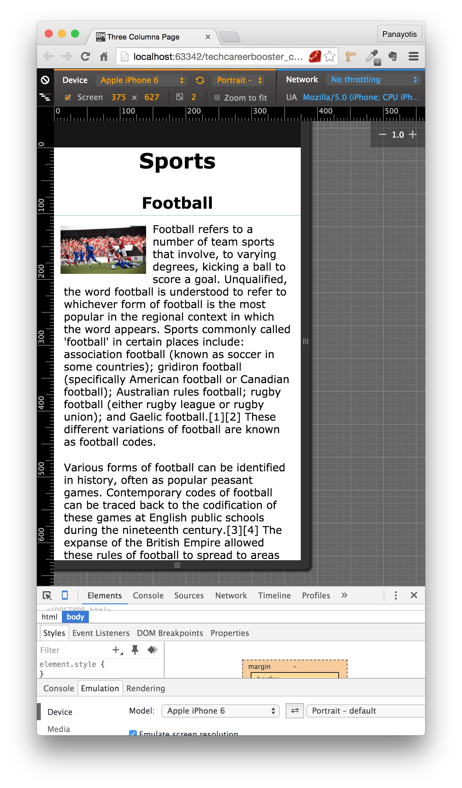

As you can see, the 1-column layout is applied on this device.

2) When loading on Google Nexus 10:


As you can see, the 2-columns layout is applied on this device.

3) When loading on desktop computer screen (switch off the developer tools):

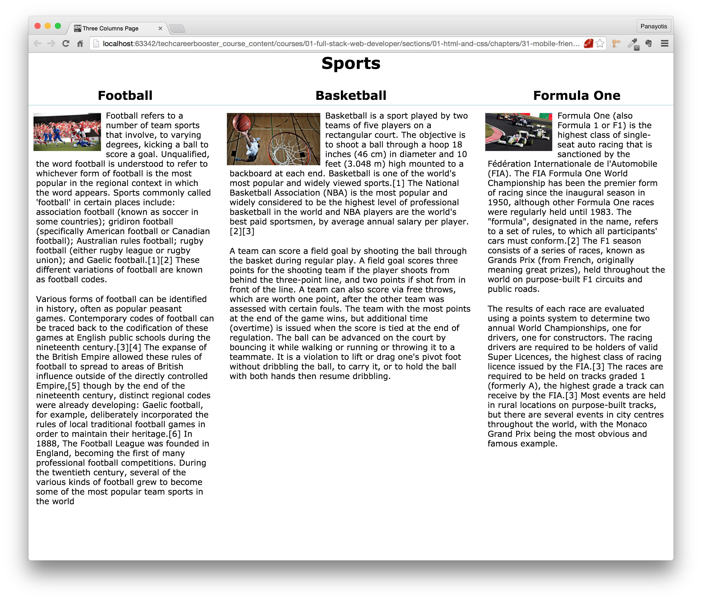

You can see here the 3-columns layout.

The above proves that we have correctly settled 2 breakpoints. The 600px and the 1200px breakpoints. These are used to switch layout. Our Web page is now responsive and
it is displayed nice on all width devices.

#### Device VS Viewport

However, there is a problem with the current implementation. If you have your developer tools switched off and you just try to shrink the browser width to widths less than 1200px,
then the layout remains 3-columns and does not switch to 2-columns:

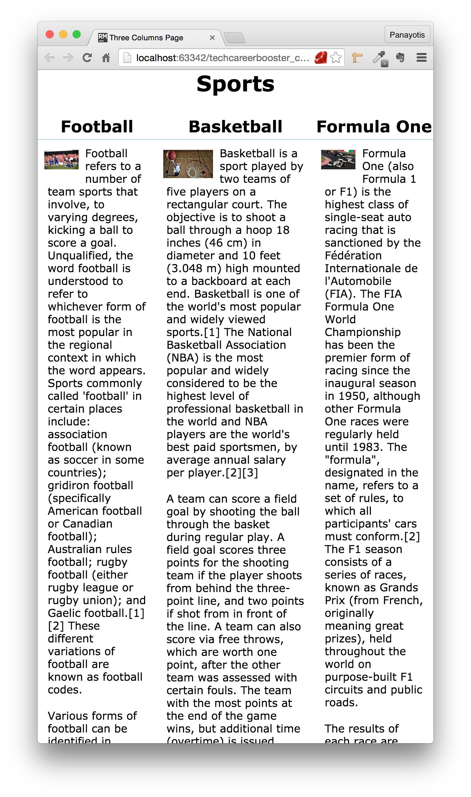

This is due to the fact that we have used media queries that use `device` related media features and not viewport related media features. Remember that `min-device-width` refers to the
minimum size of the device width. Instead of using the `device` related features, use the viewport related features. So, instead of `min-device-width` use `min-width`. Let's do that:

``` css
* {
    box-sizing: border-box;
    padding: 0;
    margin: 0;
}

html {
    font-size: 62.5%;
    font-family: Verdana, Arial, sans-serif;
}

body {
    font-size: 1.6rem;
}

.column {
    float: left;
}

#left-column, #middle-column, #right-column {
    width: 100%;
}

@media (min-width: 600px) {
    #left-column, #middle-column, #right-column {
        width: 50%;
    }
}

@media (min-width: 1200px) {
    #left-column,
    #right-column {
        width: 30%;
    }

    #middle-column {
        width: 40%;
    }
}

img {
    float: left;
    padding: 0.5rem 1rem;
    width: 40%;
}

p {
    margin-bottom: 2rem;
    padding: 0 1.5rem;
}

h1 {
    text-align: center;
    margin-bottom: 3rem;
}

h2 {
    text-align: center;
    margin-bottom: 1rem;
    padding-bottom: 0.5rem;
    border-bottom: 1px solid lightblue;
}
```
If you save the above file and reload the page on your browser, you will see that when you shrink the browser window, it will use 2-columns layout. And if you shrink it below the 600px
width, it will automatically turn to 1-column layout.

<div id="media-title-video-sports-page-responsive-shrinking-browser-window.mp4-The page changes layout while shrinking the browser window">The page changes layout while shrinking the browser window</div>
<a href="https://player.vimeo.com/video/194212340"></a>

Perfect. We have managed to make our page responsive, changing layout at 2 breakpoints, based on the browser window.

#### Fixing the third section

There is, still, one problem left to be corrected. Do you see that on the 2-columns layout?

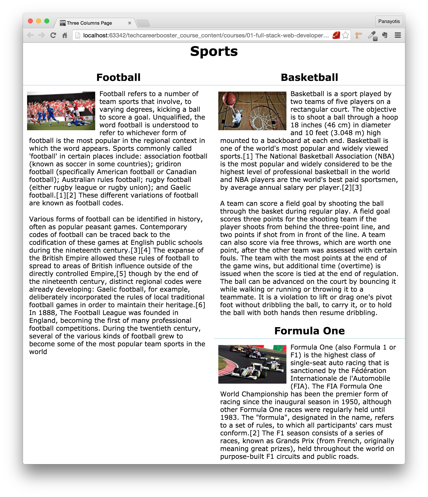

As you can see above, the 3rd section is displayed to the right. We have already learned how we can fix that. It is the `clear` CSS property that will come handy. We will set
`clear: left;` for the `#right-column` on the CSS rules section that deal with the 2-columns layout:

``` css
* {
    box-sizing: border-box;
    padding: 0;
    margin: 0;
}

html {
    font-size: 62.5%;
    font-family: Verdana, Arial, sans-serif;
}

body {
    font-size: 1.6rem;
}

.column {
    float: left;
}

#left-column, #middle-column, #right-column {
    width: 100%;
}

@media (min-width: 600px) {
    #left-column, #middle-column, #right-column {
        width: 50%;
    }
    #right-column {
        clear: left;
    }
}

@media (min-width: 1200px) {
    #left-column,
    #right-column {
        width: 30%;
    }

    #middle-column {
        width: 40%;
    }
}

img {
    float: left;
    padding: 0.5rem 1rem;
    width: 40%;
}

p {
    margin-bottom: 2rem;
    padding: 0 1.5rem;
}

h1 {
    text-align: center;
    margin-bottom: 3rem;
}

h2 {
    text-align: center;
    margin-bottom: 1rem;
    padding-bottom: 0.5rem;
    border-bottom: 1px solid lightblue;
}
```
If you save the above and reload the page on your browser, you will see this:

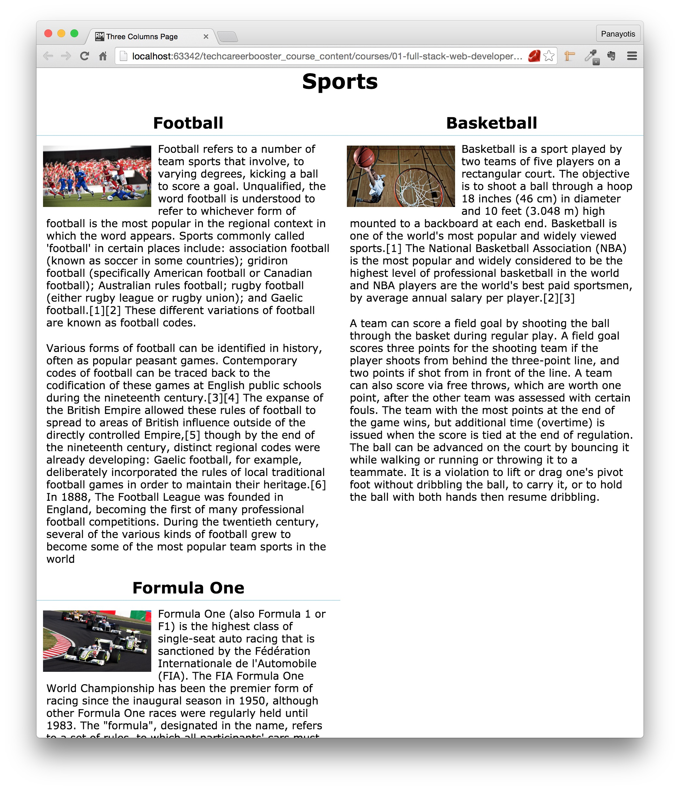

As you can see, the 3rd section now is displayed correctly. The `clear: left;` set on the 3rd section (`#right-column`) div instructed the browser to place the div in such a place that
no floating elements exist to the left of it. Hence, browser decides to draw the `#right-column` div on its own horizontal line.

### Loading CSS files with media query

We have seen in the previous example, that we can have our media query mixed-in inside the main CSS file. But this is not necessary. You can have your special CSS rules, that
are applied under specific media conditions, stored in different files, for better organization of your CSS code.

So, instead of having only this:

``` html
<link rel="stylesheet" href="stylesheets/main.css" type="text/css">
```

you can have:

``` html
<link rel="stylesheet" href="stylesheets/main.css" type="text/css">
<link rel="stylesheet" media="(min-width: 600px)" href="stylesheets/min-width-600.css" type="text/css">
<link rel="stylesheet" media="(min-width: 1200px)" href="stylesheets/min-width-1200.css" type="text/css">
```
In the above case, the file `min-width-600.css` would have normal CSS content without media queries. Same goes for `min-width-1200.css`. But, those files CSS rules
would be applied only if the corresponding media conditions specified would be true.

### Responsive Images

Another HTML element that you need to take care of is the one used for images. Usually you should not set specific size for the images, but, instead, you should allow the image to shrink to
the width of its container. Let's see the following example:

``` html
<!DOCTYPE html>
<html>
  <head>
    <meta charset="utf-8"/>
    <meta name="viewport" content="width=device-width, initial-scale=1.0"/>
    <title>Responsive Images</title>
    <link rel="stylesheet" href="stylesheets/main.css" type="text/css"/>
  </head>
  <body>
    
  </body>
</html>
```
This is a very simple HTML page. It contains only an image. The size of the image is 800x499. The CSS is very simple:

``` css
* {
    box-sizing: border-box;
    padding: 0;
    margin: 0;
}

html {
    font-size: 62.5%;
}

body {
    font-size: 1.6rem;
}
```

If you save the above files and load the page on your browser, you will see this:

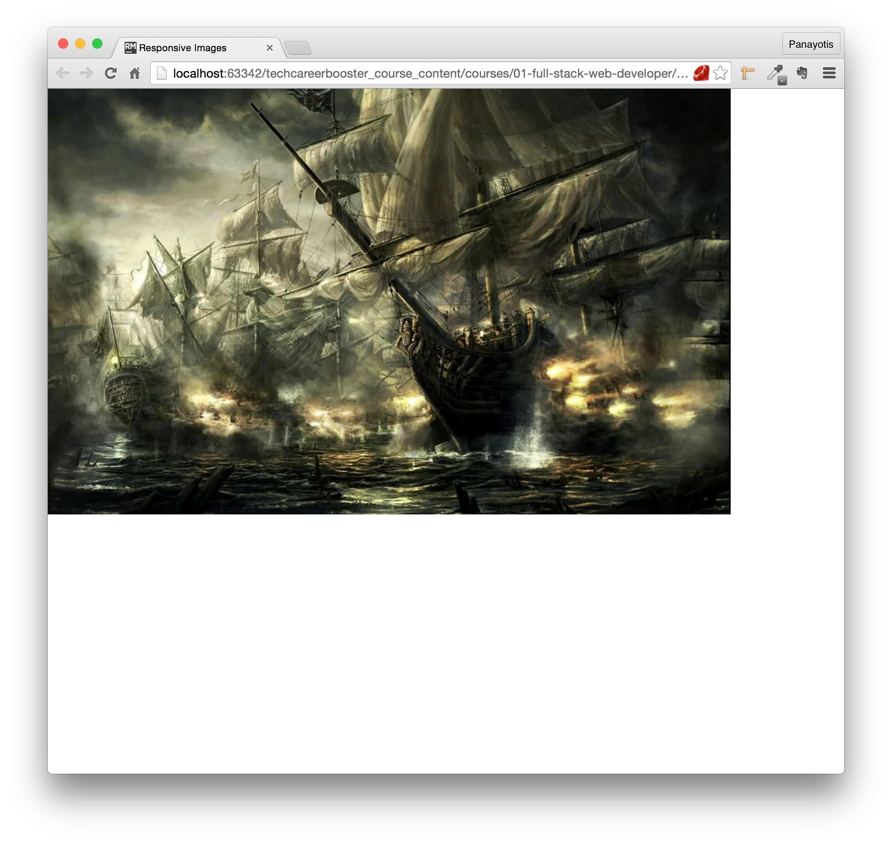

This page does not work well when the browser width shrinks. And, of course, it does not work on mobile devices. Try that. Shrink the width of the browser window. You will see that the
image is cropped.


As you can see above, the image is cropped. This Web page is not responsive. There is a simple trick that you can do. Set the width of the image to be 100% and do not specify the height.
The height will be `auto` by default. This will make sure that the image is resized according to the browser window width. This should be the CSS file:

``` css
* {
    box-sizing: border-box;
    padding: 0;
    margin: 0;
}

html {
    font-size: 62.5%;
}

body {
    font-size: 1.6rem;
}

img {
    width: 100%;
}
```

Save the above CSS file and reload the page on a narrow width browser window. You will see this:

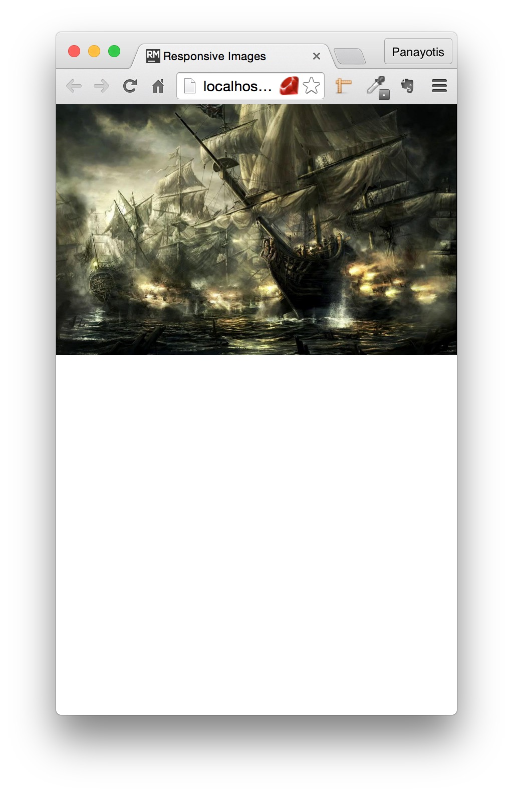

Do you see that the image is displayed completely. It is not cropped. Its width size is equal to the size of its container. This is what the 100% does. There is a small gotcha here that you
need to be aware of. Setting the width of the image to 100% of the size of its container, hence always being equal to the size of its container will make the image scale up when the container
has width which is greater than the width of the image. Try to resize the browser window so that its width is more than 800px. Set it to 1200px or even more. You can also maximize the browser
window. You will see the image scaled up. This might not be something that you would like to happen. How can you avoid that? How can you make the image shrink small but not scale up more than
its original size, or other specific size? You can set the property `max-width` to be equal to the size of the image or to other size that makes sense to you, according to your use case. Let's do that for
our example page:

``` css
* {
    box-sizing: border-box;
    padding: 0;
    margin: 0;
}

html {
    font-size: 62.5%;
}

body {
    font-size: 1.6rem;
}

img {
    width: 100%;
    max-width: 800px;
}
```

Save the above file and reload your page on a maximized browser window. You will see that the image is not scaled up to fill in the whole width of the browser window. It has width equal
to 800px.

### Responsive Videos

We have learned that the `video` tag can be used to display a video playback player. This can be responsive with the same techniques that we have described above about the images.

### Responsive Frameworks

Luckily, there are some very good frameworks out there, which are also free, and which can be used from our HTML pages in order to make them responsive. It is not that we only have
to reference their code and do nothing beyond that. It is that they have done a lot of preparation work for us and we only have to learn their CSS rules so that we can quickly apply them to our pages and make them
responsive.

One such framework is [Twitter Bootstrap](http://getbootstrap.com/), which is being taught in a later chapter. On that framework, if you want, for example, to make an image responsive, you only have to use
the class `img-responsive`. Besides helping us make our pages responsive, such frameworks offer numerous other facilities to make us style our pages quickly.
