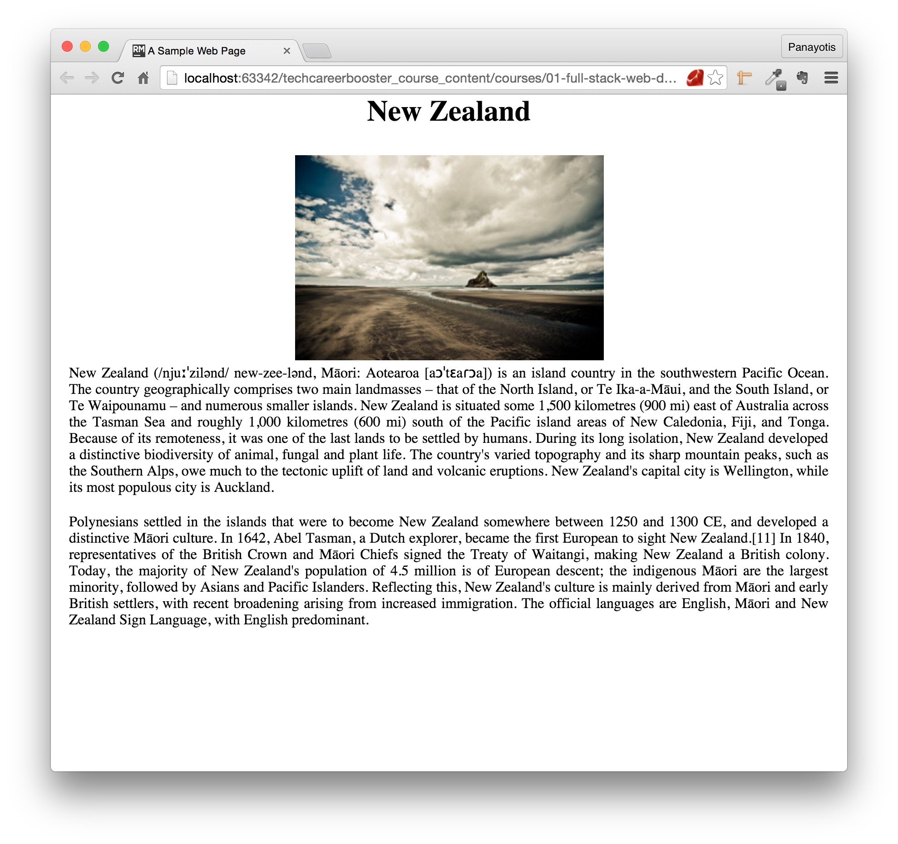
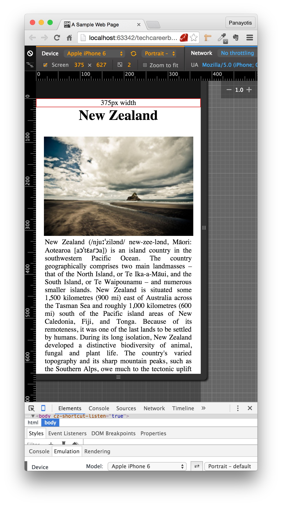
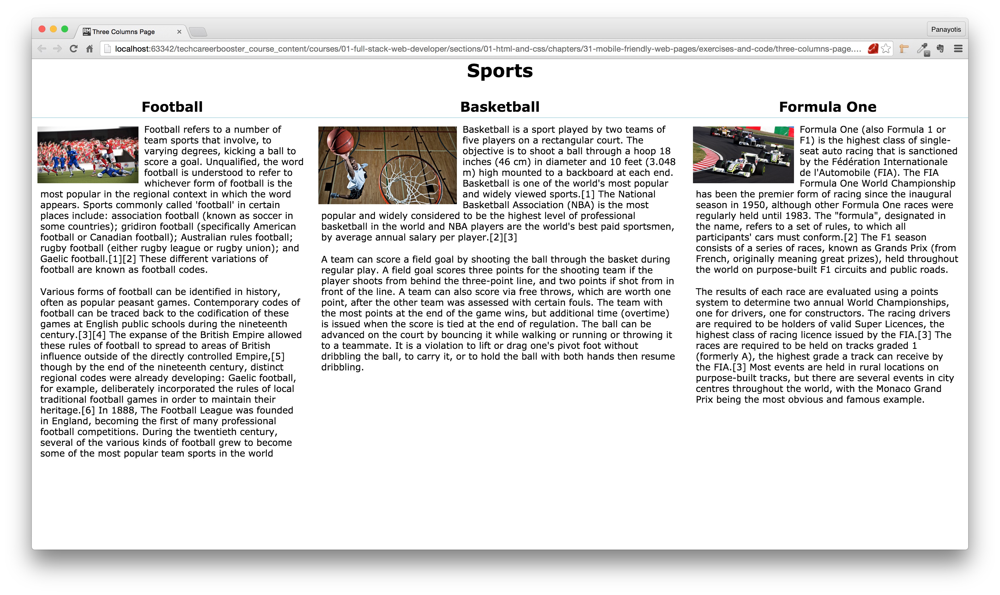
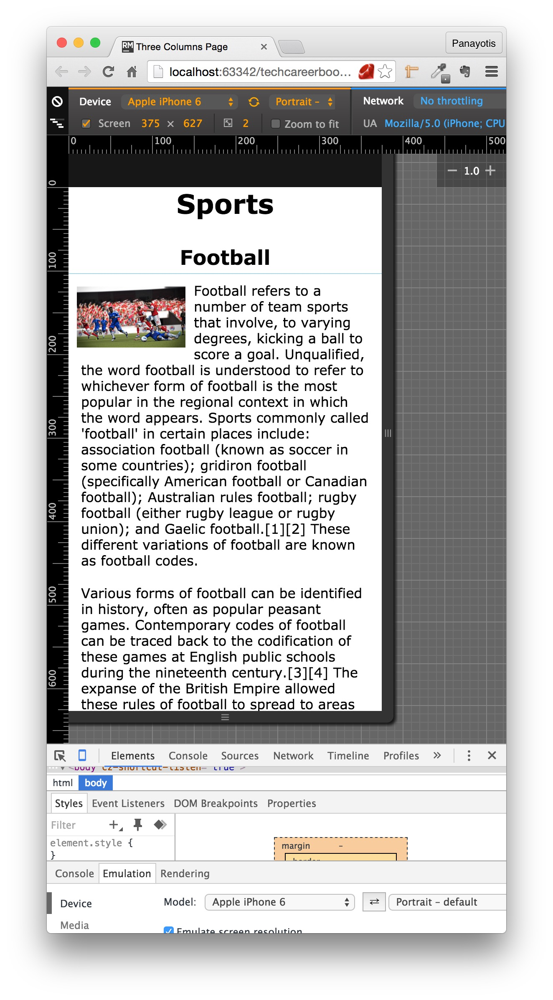
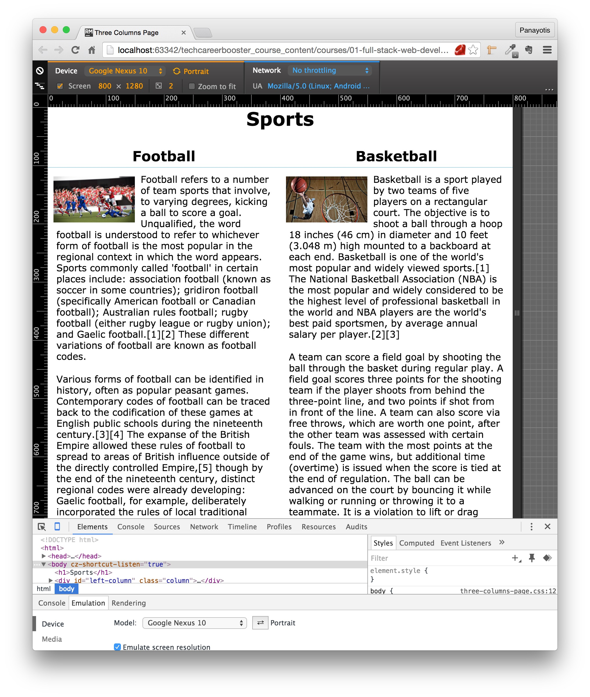

With the advent of tablets and mobile devices, Web page designers faced a serious problem. They had to make their
Web pages look good on small displays. They had to design their Web pages to be responsive. In this chapter you
will learn how to create responsive Web pages.

A page like this:

might look good on the desktop computer display. But how can we make it look good on the mobile device too, like this?

We are going to teach you how you will adapt the layout of your page. For example, a page like this:

will be converted to a page like this, when viewed on a mobile device. I.e. a 3-column layout will be converted to a 1-column layout:

Or it may be turned automatically to a 2-column layout on tablets:

You will learn how the following page that has 4-columns layout on a big screen:

is automatically turned to a 3-columns layout on medium-sized screens:

is automatically turned to a 2-columns layout on small-sized screens:

and is automatically turned to a 1-column layout on extra small screens:

