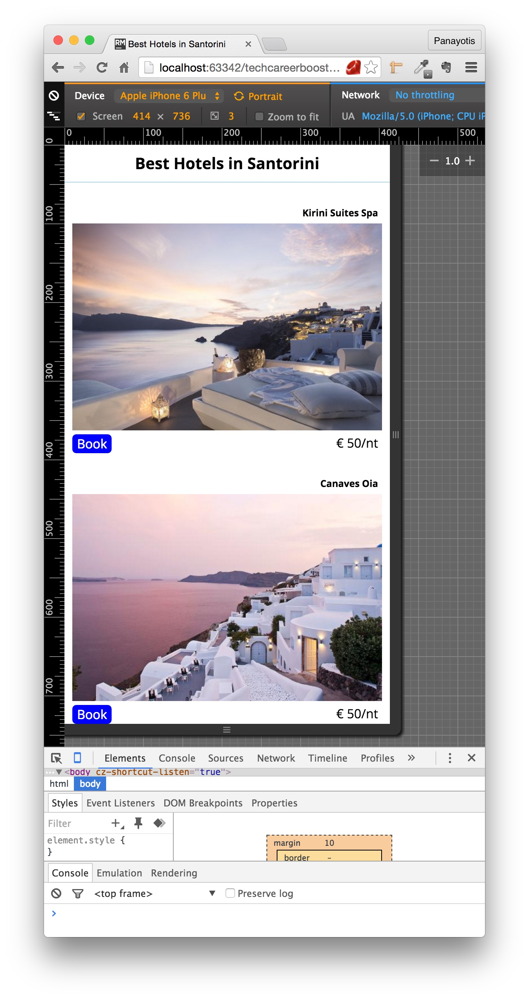
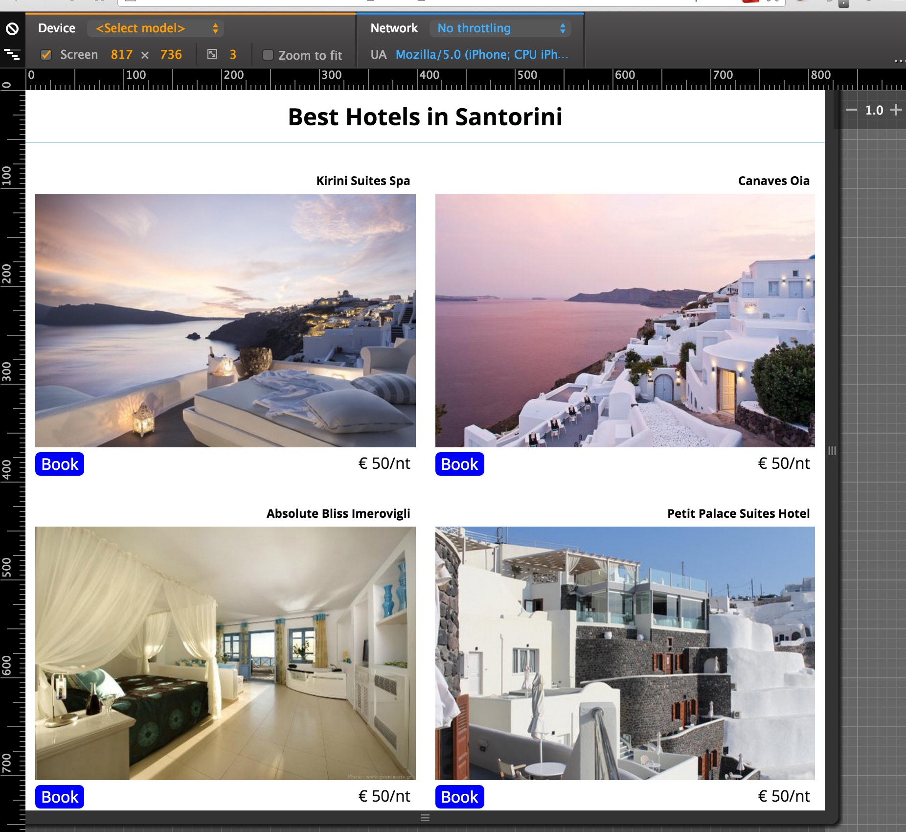
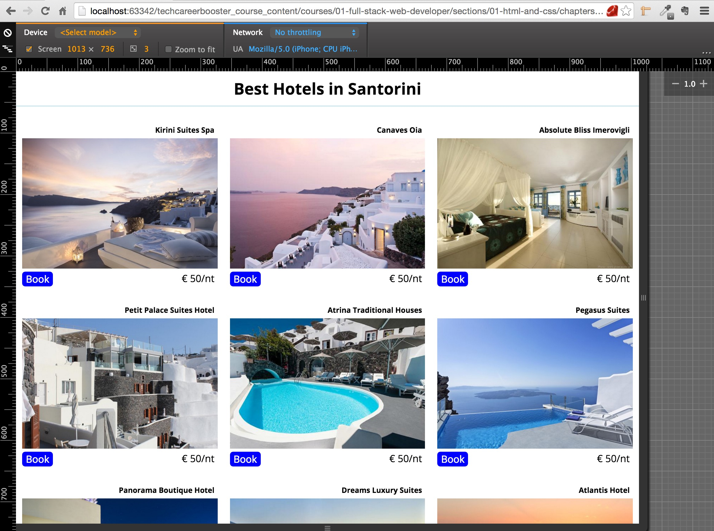
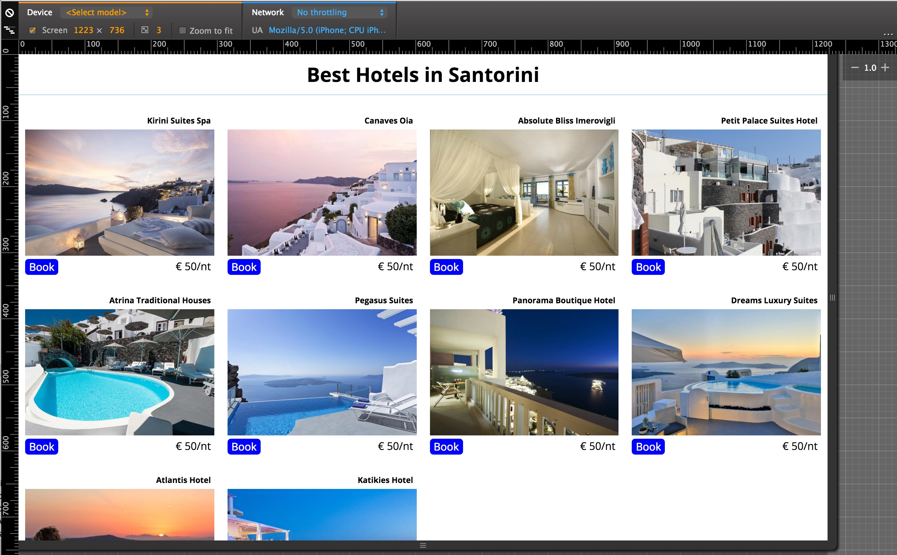

1. You need to implement a Web page that is responsive. The page should contain a series of images of Santorini hotels. Read further.
2. This is a screenshot of the Web page that we are asking you to build. The screenshot is from the Web page as it should look like on a mobile device:

As you can see, this is a 1-column layout. User can scroll to see the rest of the images:

How the user can scroll to see all the hotel images

                      
3. The Web page should be responsive with 3 breakpoints:
    1. 768px
    2. 992px
    3. 1200px
4. On 768px and above, up to 991px, the page should be with 2-columns layout:

5. On 992px and above, up to 1199px, the page should be with 3-columns layout:

6. On 1200px and above, the page should be with 4-columns layout:

7. Watch the following video to see how the layout changes as we increase the width of the device:

How the Web page changes layout as the device width increases

           
8. Here are some hints and requirements about this task:
    1. Use the font "Open Sans" from Google Fonts. Make sure you include all the available styles.
    2. There have to be 10 hotel images. So, 10 blocks of images with the button to book and the price.
    3. Design with mobile-first approach.
    4. Make sure that you start with CSS rules that reset the box-sizing to `border-box` and the `padding` and `margin` to 0 for all elements.
    5. Make sure that the images are responsive. But do not limit their maximum width.
    6. The "Book" button should actually be an anchor `a` styled as a button. Make sure that when the mouse goes over it, the background color and color change.
    7. The top header should have responsive font size too. So, give a different font-size according to the breakpoint. For larger screens increase it. For smaller decrease it.

