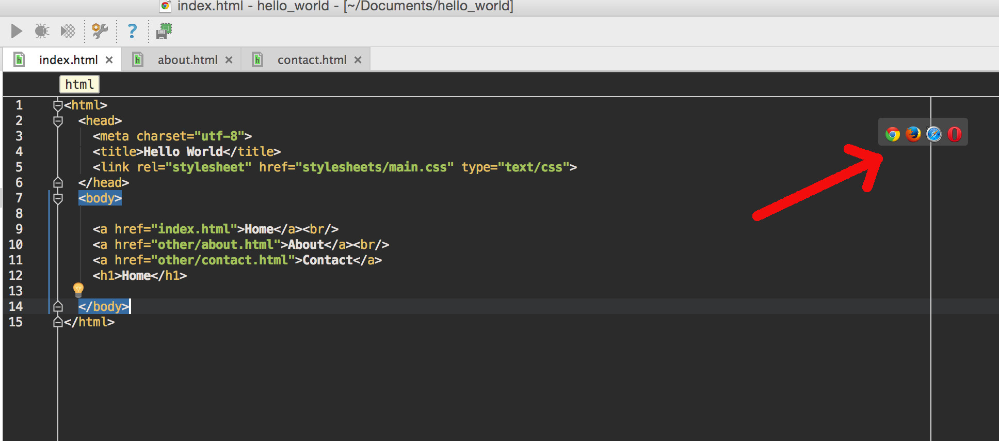

In this chapter we will see how you can create some specific project types using RubyMine.

## HTML project

### Create the Project

Follow the next steps to create your project:

1. Start RubyMine
2. Select Create New Project
3. With `Empty Project` selected on the left (which are the project templates), specify the location of your project. For example, you can change the `untitled` 
to have the name of your project. Don't care about the Ruby SDK for the time being, since this is not a Ruby project.
4. Click on Create button

Your project is ready. 

You can also watch this video here that demonstrates the above process:

How You Can Start a New Project on RubyMine

           
### Create Empty Files
           
Now that our project is created, we need to create the files and add the content. Let's add 3 pages to our project:
           
1. `index.html`
2. `other/contact.html`
3. `other/about.html`
           
As you can see the starting page is `index.html`. There are two more pages inside the folder `other`, namely `contact.html` and `about.html`.
           
In order to create a new, empty page, you can right click on the folder on which you want the page to live, and then, from the context pop-up
menu, select "New -> File". The you give the name of the file and an empty file with the name specified is created. Similarly, if you want
to create a directory inside another. 

Here is the process that demonstrates how the user can create the three empty files required by this example.

Adding three empty HTML files

           
### Adding HTML Content

Now it is easy to add content to these files, by editing/typing. While doing that, you will notice that RubyMine is trying to help you fill in the content quickly.
This is called autocompletion. 

Watch the following video to see how RubyMine helps user fill in the content of the HTML pages.

Fill in Content with help of IDE

           
### HTML with CSS project
           
RubyMine is very well helping you fill in CSS content too. Watch the following video to see how we are adding CSS files to the previous project. See, for example, how
RubyMine shows the visual representation of a color that one uses in CSS rules.
           

See how IDE helping as add CSS content

           
As you can also see from the previous video, when you mouse over the content of an HTML file, then you have the option to open this file as a Web page using one of the 
browser installed in your system:
           
           

### Closing Note

RubyMine has a huge list of features that can be used to improve your productivity and the quality of the code that you write. From now on, during the course,
you should be writing your code using RubyMine. The more you use it, the more you will learn about its power features.

