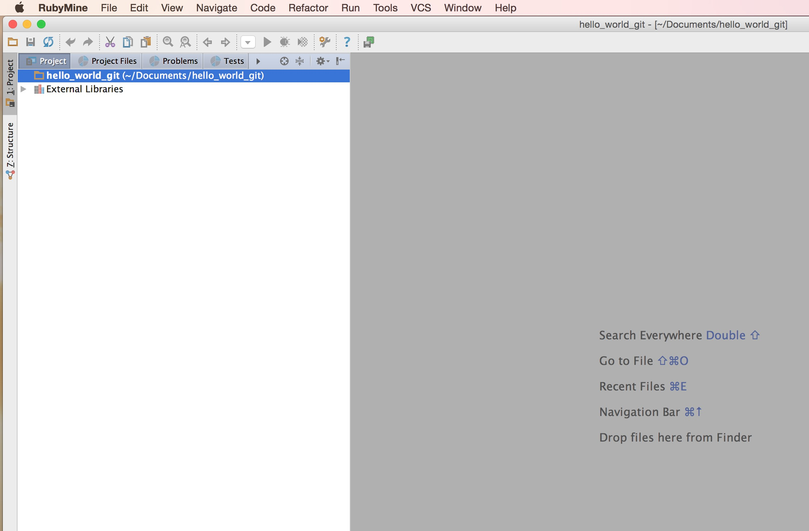
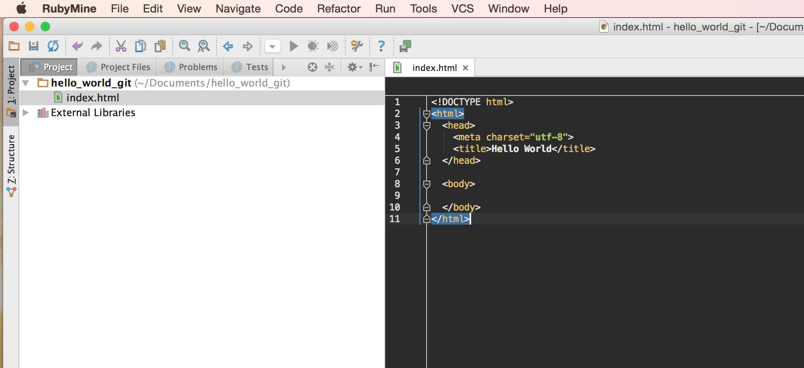
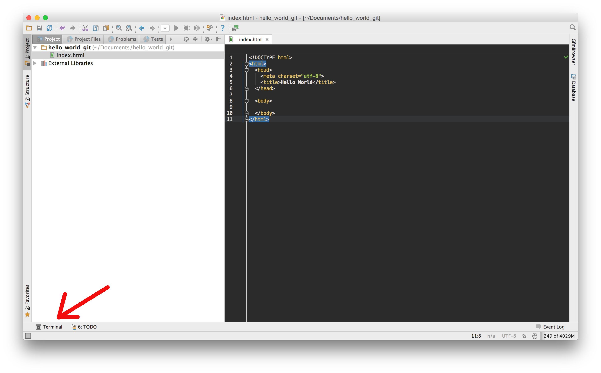
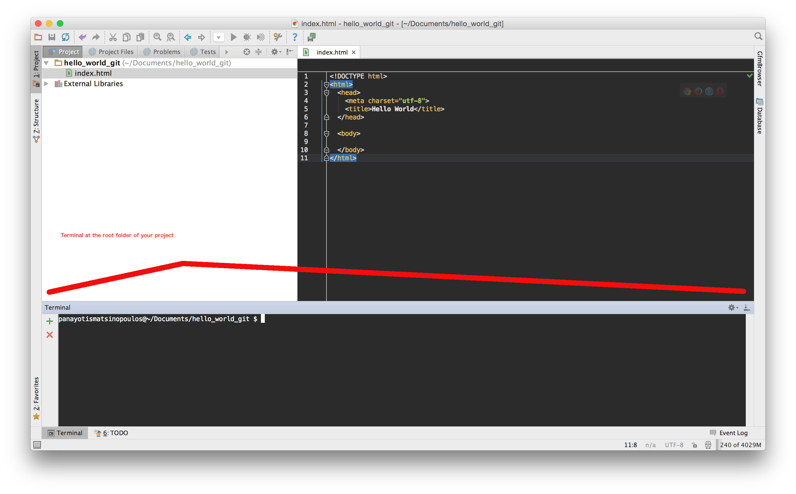
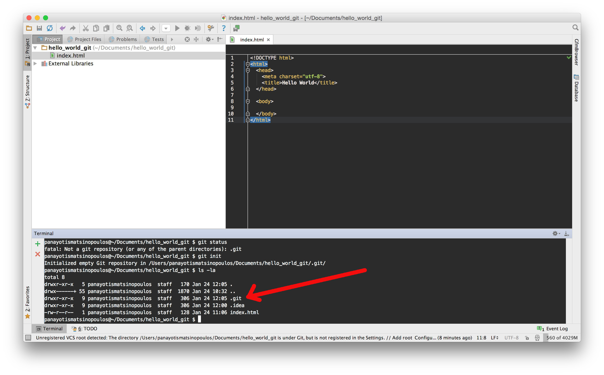
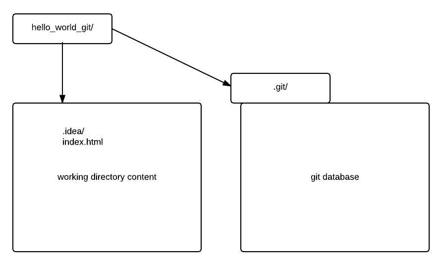

VCS or Version Control Systems are here to help you track the changes on the files of your project. So, generally, for each minor or major change
that you do and you want to keep a checkpoint for, you create a snapshot, an *image* of your file contents and you give it a 
logical *name*. This is a specific *version* of your work. Creating one version after the other, you essentially create a history of the changes
on the contents of the files of your project. Having the history is very important, because:

1. You can always inspect how a file was some versions back.
2. What changes have been introduced when.
3. Who did a particular change (go and ask him why?)
4. Revert back to a previous version.
5. Revert back an entire project to a previous state.
6. Compare one version to another and see what changes have been introduced.

and more.

This is an example of a visual representation of the VCS history of a project:


The above picture shows the tree (one change/version is following another one) of changes of the source code of a project. In this section, we will learn how to read this representation,
and much more.

## Local Version Control Systems

The need to keep track of the changes in a project has been initially tackled by simply copying the entire contents of the project folder to another folder and giving new folder
a new name with a timestamp. So, developers, when having a project root folder "my_awesome_game", they used to periodically create copies of this folder, naming the copies with a
timestamp prefix, e.g. "my_awesome_game_201601240921", then "my_awesome_game_201601251032" e.t.c. So, they had a primitive way to keep track of the changes and rollback to old
versions of their project if that was necessary. The folder copies were kept on the same computer like the working project folder. Or sometimes on other computers.

That method was more like a backup process. It lacked serious tools like easily finding out differences between versions. And it was really error prone.

Then productivity has been dramatically improved with tools that were specially designed to keep versions of project artifacts. Real version control systems. One very popular
example was `rcs`. That was used to keep different versions of a file on a separate, local, folder. 

That tool did perfect job, but it was not enough when many people used to work on the same project, and, in fact, when they used to work from different computers.

## Centralized Version Control Systems

Hence, collaboration between developers on the same project, when they used to work from their own development machines, was one of the next major issues that the VCS 
need to deal with. The centralized version control systems were designed to solve that problem. Such systems (e.g. CVS, Subversion) have a central server where all the
versions of the project files are securely stored. The developers periodically get the latest version of the whole project from the server, do their work and push
everything back to remote server.

That was a big improvement over the local version control systems, but it still had a big disadvantage. The history of the changes was kept only on the central server
repository. If that went down, if no proper backups were kept, then the whole project history was in risk to be completely lost. 

## Distributed Version Control Systems

The distributed VCS are here to solve the major problem with CVCS systems. So, they keep the whole history of changes on all developer computers. So, developers from
different working stations, they don't simply get the latest snapshot to work on. They replicate the whole project history on their development machine. This is done
by fully mirroring the whole version control repository. Hence, the local repositories are entire copies of the VCS database and can be used to restore the central 
server database at any time.

On top of that, you can set up more than one central/remote repository for the same project. So, DVCS give much more opportunities for different workflows than the ones
the CVCS give. 

## Git

One of the most popular DVCS today is `git`. It has been designed and developed by the creator of Linux, Linus Torvalds. It has been designed to be extremely fast
and capable of handling huge projects. 

### Installation

Usually git is already installed on OS X and Linux machines. Try the following command:

    git --version
    
If git is installed on your machine, you will get something like this:
    
    git version 2.5.0
    
If you do not see that, and you see something like this:
    
    bash: git: command not found
    
then you probably don't have Git installed. Visit the [Git download page](https://git-scm.com/downloads) and follow the instructions to install Git on your development
machine (OSX or Linux). Make sure that the above command (`git --version`) works and that you have any Git `2.X` version installed before continuing with the rest of this
section.
    
### Hello World
    
Let's try our first encounter with Git. We will create a small HTML project and we will introduce version control on that, using Git.
 
1) Open a terminal and cd to the folder where you are creating your course projects. Example:

``` bash
cd Documents
```
    
Your command prompt should look something like this:
    
``` bash    
panayotismatsinopoulos@~/Documents $
```
    
As you can see, in the previous example, the prompt includes the path to the present directory.

> *Note:* How can you make your command prompt include the present directory? You can always [google that](https://www.google.gr/search?q=mac%20osx%20bash%20prompt%20include%20current%20directory&rct=j),
> but, one way you can do that, if you have Mac OS X machine, is to add the following line to your `.bash_profile` file:
> 
> ``` 
> export PS1="\u@\w $ "
> ``` 
> * The `PS1` environment variable represents your command prompt.
> * The `\u` represents the name of the currently logged in user.
> * The `\w` represents the present working directory.
>
> If you have the above line inside your `.bash_profile` file, on your Mac OS X machine, then whenever you start a new terminal, you will get a prompt that would 
> include both the currently logged in user and the present working directory. So, if the currently logged in user is `foo` and the present working directory is `Documents`
> the prompt will be:
>
> ```
> foo@~/Documents $ 
> ```
>
> Note that the `~/Documents` is the full path to the present working directory. The `~` represents the home directory of the currently logged in user and it is used as
> a shorthand notation. 
    
2) Create the folder `hello_world_git`. This will be the project root folder. `cd` to this directory.

``` bash
panayotismatsinopoulos@~/Documents $ mkdir hello_world_git
panayotismatsinopoulos@~/Documents $ cd hello_world_git
panayotismatsinopoulos@~/Documents/hello_world_git $
```

3) Use RubyMine to create a new project on that folder.
        
Since we are using RubyMine to create our projects, start RubyMine and create a new project on the folder that we have just created. Here is a video that
shows how you can do that:
        
        
<div id="media-title-video-create-hello-world-git-project-in-ruby-mine.mp4-Create the Hello World Git Project on RubyMine">Create the Hello World Git Project on RubyMine</div>
<a href="https://player.vimeo.com/video/194254700"></a>

So, basically you will end up having something like this:



5) Create the `index.html` file with the following content:

``` html
<!DOCTYPE html>
<html>
  <head>
    <meta charset="utf-8">
    <title>Hello World</title>
  </head>

  <body>
  
  </body>
</html>
```

Hence, you will see this picture on your RubyMine environment:



The content is a bare bones HTML page with no body, at least to start with.

#### `git status` and `git init`

We now have a file that we want to keep control on its versions, and history of the changes. So, we are going to use Git. 

1) Open a terminal on the root folder of your project. You can do that from within RubyMine, by clicking the terminal button tab, at the bottom of your RubyMine project window:



When you do that, you will see the terminal at the bottom.




2) On the terminal type the following command:

```
git status
```

You will get the following result:

```
fatal: Not a git repository (or any of the parent directories): .git
```

`git status` command is a very common `git` command. It prints the status of your local Git repository. However, here, it gives error. This is because the project you are 
working on, has not been initialized as a Git repository. So, the first command that you need to run is the following:

```
git init
```
Run the above command. You will get something along the following:

```
Initialized empty Git repository in /Users/panayotismatsinopoulos/Documents/hello_world_git/.git/
```
Nice! That was the necessary command to initialize your project to work with Git. This command is necessary to be executed only once. The first time you attach Git to your
project. You will not need it any other time. Only every time that you start a new project and you want to integrate Git control with it.

`git init` creates your local source database inside the folder `.git` on the project root folder. This folder, the `.git`, initially, contains the folders and files
that are necessary to bootstrap the database, but does not contain any version of your source files. We have not added, yet, anything to the database. Later on, we will learn
how we put file snapshots inside this database. Only after that, the database will start keeping track of the versions of our files.

> *Note:* The folders and files that start with the `.` character are considered to be *hidden*. This means that they might not be visible with a simple file browsing or
> with the command `ls`. In order to be able to see these assets, you need to enable the display of hidden files. Or, if you like command prompt (and you have to!), you
> can use the `-a` switch on the `ls` command. The `-a` switch includes hidden files and folders in the output.

Run the following command on your terminal prompt in your RubyMine project:

```
ls -la
```

You will get a long version of all the files and folders in your project root folder. One of the folders that you will see is the `.git` folder:



> *Note:* If you want to detach Git from your project and throw away all the version control history, you can delete the folder `.git` from the root 
folder of your project. Then you can run `git init` again to recreate it, but the previous history would have been permanently deleted. So, be careful with this.

Now, if you run the command to get the Git status...

```
git status
```
you will see the following:

```
On branch master

Initial commit

Untracked files:
  (use "git add <file>..." to include in what will be committed)

        .idea/
        index.html

nothing added to commit but untracked files present (use "git add" to track)
```

There is a lot of information there above, that you may not understand. But the point here is that `git status`, this time, didn't fail with an error. It correctly 
displays the current status of your files in the context of the Git version control system:

* It tells you that you are currently on branch `master`. But we are going to talk about branches later on.
* It, also, tells you that there are *untracked* files, i.e. files that Git does not follow the history of.

In other words, you have initialized Git correctly and the database is good to accept files. But, yet, you have not added anything. You do not track the changes
of any file.

> *Note:* The `.idea/` is a hidden folder that is created by RubyMine in the project root folder of any RubyMine project. It holds all the
RubyMine project specific configuration. `git status`, when displaying a folder as untracked, it is actually referring to all files and folders inside this folder, without
displaying them one by one.

So, what do we have? We have the *working directory* (and its sub-directories, if any, with all their files included) and the Git database.



Currently, our Git database does not keep track of any of our files from our working directory. If we want our files to be version controlled and keep history of their
changes, we need to register those files inside the Git database that corresponds to our project, a.k.a. inside the `.git` folder. But, files do not register with the
Git database by just creating copies of them inside the `.git` directory with simple operating system copy commands. No. Don't do that. There are special commands
that you should use in order to register your working files with the Git database. We will learn about these commands a little bit later on.

Before we see those commands let's see how we can configure some important configuration variables of our Git database and Git environment in general.

#### `git config`

The command `git config` prints the current configuration variables that would be used by `git` to work with your Git database on your project.

Try this command on the terminal window of your project. You will get this:

```
$ git config
usage: git config [<options>]

Config file location
    --global              use global config file
    --system              use system config file
    --local               use repository config file
    -f, --file <file>     use given config file
    --blob <blob-id>      read config from given blob object

Action
    --get                 get value: name [value-regex]
    --get-all             get all values: key [value-regex]
    --get-regexp          get values for regexp: name-regex [value-regex]
    --get-urlmatch        get value specific for the URL: section[.var] URL
    --replace-all         replace all matching variables: name value [value_regex]
    --add                 add a new variable: name value
    --unset               remove a variable: name [value-regex]
    --unset-all           remove all matches: name [value-regex]
    --rename-section      rename section: old-name new-name
    --remove-section      remove a section: name
    -l, --list            list all
    -e, --edit            open an editor
    --get-color           find the color configured: slot [default]
    --get-colorbool       find the color setting: slot [stdout-is-tty]

Type
    --bool                value is "true" or "false"
    --int                 value is decimal number
    --bool-or-int         value is --bool or --int
    --path                value is a path (file or directory name)

Other
    -z, --null            terminate values with NUL byte
    --includes            respect include directives on lookup
$    
```

Basically, `git config` on its own, does nothing. It only prints the usage instructions for this command. In order for `git config` to do something useful, you need to pass some
options after `git config`.

For example, try this:

```
git config --list
```

You will get the list of all the configuration variables currently set, alongside their values. Something along the following lines.

```
user.email=Panayotis Matsinopoulos <panayotis@matsinopoulos.gr>
user.name=Panayotis Matsinopoulos
filter.lfs.clean=git-lfs clean %f
filter.lfs.smudge=git-lfs smudge %f
filter.lfs.required=true
core.excludesfile=/Users/panayotismatsinopoulos/.gitignore_global
difftool.sourcetree.cmd=opendiff "$LOCAL" "$REMOTE"
difftool.sourcetree.path=
mergetool.sourcetree.cmd=/Applications/SourceTree.app/Contents/Resources/opendiff-w.sh "$LOCAL" "$REMOTE" -ancestor "$BASE" -merge "$MERGED"
mergetool.sourcetree.trustexitcode=true
core.repositoryformatversion=0
core.filemode=true
core.bare=false
core.logallrefupdates=true
core.ignorecase=true
core.precomposeunicode=true
```

On the above output, you can see, for example, that the developer, user, has email `Panayotis Matsinopoulos <panayotis@matsinopoulos.gr>` and name `Panayotis Matsinopoulos`. This is
how Git will know, and record, the name of the person that does changes in the source code. This information needs to be set, and set correctly.

Where are these configuration variables being stored? And how can you update them?
 
Git uses 3 levels of storage for configuration variables.

1. System level. All configuration variables stored at system level, they affect all the users of Git on the particular computer and all their projects. Unless 
a user has used User level or Project level configuration to override any of the system level values. The system level configuration variables of Git are, usually, stored inside the file
`/etc/gitconfig` or inside the file `/Applications/SourceTree.app/Contents/Resources/git_local/etc/gitconfig`. But, you will rarely have to access the content of this
 file directly. The `git config` command has the option `--system`, which allows you to refer to the system level configuration and update its content. With the `git config --system --list`
 you will get all the configuration variables and their values defined at the system level.
2. User level. All configuration variables stored at user level, they affect all the projects of the particular user. Unless they are overridden by project specific
configuration, defined at project level. The user level configuration variables are usually stored inside one of the following files: `~/.gitconfig` or `~/.config/git/config`. Remember
that with `~` we refer to the home folder of the currently logged in user. Again, you will rarely have to access the content of this file directly. The `git config`
command has the option `--global`, which allows you to refer to the user level configuration and update its content. With the `git config --global --list` you will get all
the configuration variables and their values define at user level.
3. Project level. All configuration variables stored at project level, they affect only the particular project. The file that is used to store these configuration variables
is `<project_root_folder>/.git/config`. Again, you will not have to access the content of this file directly. Whenever you use the `git config --local` command 
then you are referring to the project specific configuration.

Note that `git config --list` will print the configuration variables and values used by the project we are working on, even if they have been defined at system or user level.

Having done this introduction to Git configuration, it is now time to set the email and name accordingly, so that all your changes, in any project that you work on, 
will have your name attached to them.

Give the following commands on your project terminal:

```
git config --global user.email <Your Email Goes Here...best to enclose it in single quotes>
git config --global user.name <Your name goes here...best to enclose it in single quotes>
```

Example:

```
git config --global user.email 'Foo Bar <foo@mailinator.com>'
git config --global user.name 'Foo Bar'
```

This will be done only once on this particular computer account that you are working on. You will not have to do it on every project. This is because you set these two
configuration values on the user level settings (using the `--global` option).

In order to confirm that you have done it right you have the following options:

1. You can run the command `git config --list`. Do you see the `user.email` and `user.name` variables having the correct value?
2. You can run the command `git config --get user.email` and then the command `git config --get user.name`. Do they return the correct values?

If `yes`, then you have done the job right. If `not`, then you need to go back and repeat the `git config --global...` commands until you succeed in this.

What have we done so far?

1. We have initialized Git to keep track of our project history with `git init`. That created the `.git` folder that will work as project Git database.
2. We have used the command `git status` to print the current status of our work with regards to Git history. We saw that our files are still not tracked by Git, they are not 
inside the Git database.
3. We have learned about how we can access the various Git configuration levels with the `git config` command.
4. We have set the `user.email` and `user.name` to correct values so that our Git database marks the changes with the correct user details.

In the next chapter we will start tracking the files of our project and learn the basics of Git.
