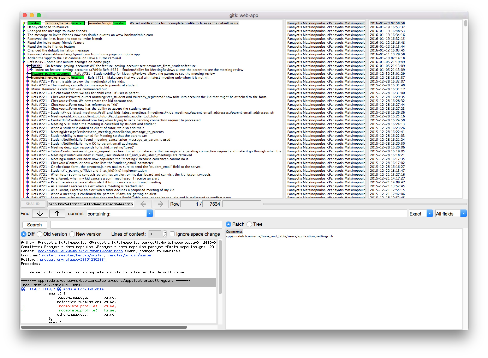

Keeping track of the changes on your project files is of major importance when you are doing Web development,
or any software development project. Originally, we used to keep copies of our project source code as snapshots.
Something like a backup that had a timestamp on it. Nowadays, we are using powerful Version Control Systems that
help us be productive and make sure that we do not lose any of our files. They also keep track of all the changes
on our source files and let us know, any time we ask, who has changed which file and what change he applied.

In this chapter we will have an introduction to Version Control Systems and in particular to `Git` which is one of the
most popular Distributed Version Control Systems today. `Git` will be our indispensable tool, the basics of which
you definitely need to master.
