In the previous chapter, we have learned the `git init` and the `git status` (at least partially) commands. Also, we have learned how to configure
Git environment with `git config` command.
 
Let's proceed with the commands that will help us keep track of the changes history of the files of our project.
 
## The 6 Buckets/States
 
Before we start working with Git version control on our files, we need to understand the six different states a file can be in.
 


Initially, the changes on a file are not tracked by Git, unless we ask Git to do that. When Git does not track the changes of a file, then the file is said to be *untracked*. 

Run the command

```
git status
```

on your project `hello_world_git` that we have started in the previous chapter. You will see that it prints two untracked entries:

```
Untracked files:
  (use "git add <file>..." to include in what will be committed)

        .idea/
        index.html
```

Below the `Untracked files:` indication, you can also see the Git command that you can use on these files. It is the `git add <file>` command.

The `git add <file>` command marks an untracked file as tracked and takes its current version and puts it inside the `Staging` (also called `Index`) Git bucket.

The `staging` bucket is the bucket in which we put the versions of our files that we want to later commit inside the Git database. So, it is a temporary place,
stage, in which we select the versions of our files before telling to Git to permanently commit these versions. The `git commit` command, that we will learn next,
will deal with all the file versions that exist inside the `staging` area and ignore file versions in other buckets. In other words, the content that will be
committed is the one that resides inside the `staging` area. That is very good, because we might have many files changed, with new versions, but only part of them
we would like to commit as permanent changes.

For example, let's add in the staging area the file `index.html`

```
git add index.html
```
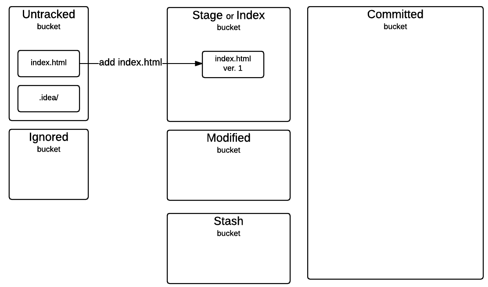

If you run the above command, and if everything goes ok, you will not see anything on your command prompt. This command takes the current image of your `index.html` file and stores
it inside the staging area. The file is actually removed from the untracked bucket.

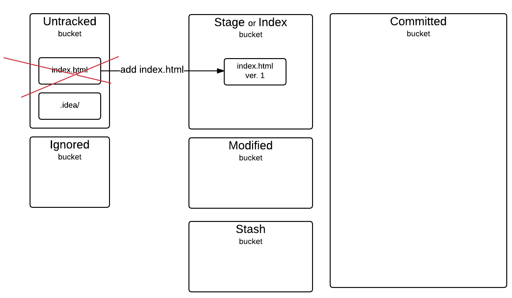

You can verify the current status of your source code with the command that we have already learned, the `git status` command. Type in the following:

```
git status
```

You will get an output like the following:

```
On branch master

Initial commit

Changes to be committed:
  (use "git rm --cached <file>..." to unstage)

        new file:   index.html

Untracked files:
  (use "git add <file>..." to include in what will be committed)

        .idea/
```

Do you see that the `index.html` file has been removed from the untracked bucket? It has been moved to the staging area. It is not mentioned clearly on the above output, but
you can see that it says: `(use "git rm --cached <file>..." to unstage)`. The `unstage` indicates that this file now exists in the staging area. You can also see that the
`.idea/` folder is still in the untracked bucket, because we have not added that to staging area.

As you can also read from the above `git status` output, the `index.html` file is flagged as `new file`. This is because this file has never been tracked in the past. It is
the first time this file is ready to be committed, hence track its changes by Git. 

Moreover, you can see that the `index.html` file is reported as `Changes to be committed:`. That's the purpose of the staging area. It holds the work that is ready to be `committed`.
We will soon do that with the `git commit` command, which is the most important `git` command. 
  
But before we do that, let's see what are our options now that the new file `index.html` has been put into the staging area.
  
1. It can either be moved back to untracked bucket, with the `git rm --cached` command, or
2. It can be moved to the committed bucket, with the `git commit` command.


Let's try the first one. Give the following command:

```
git rm --cached index.html
```
If you run the above, you will get:
```
rm 'index.html'
```
and if you then run
```
git status
```
you will get:
```
On branch master

Initial commit

Untracked files:
  (use "git add <file>..." to include in what will be committed)

        .idea/
        index.html
```

which clearly indicates that the `index.html` file has been moved from the staging area back into the untracked bucket area.

Now, let's move `index.html` back to the staging area:

```
git add index.html
```
and try the other option that we had when file was there. So, let's try this:

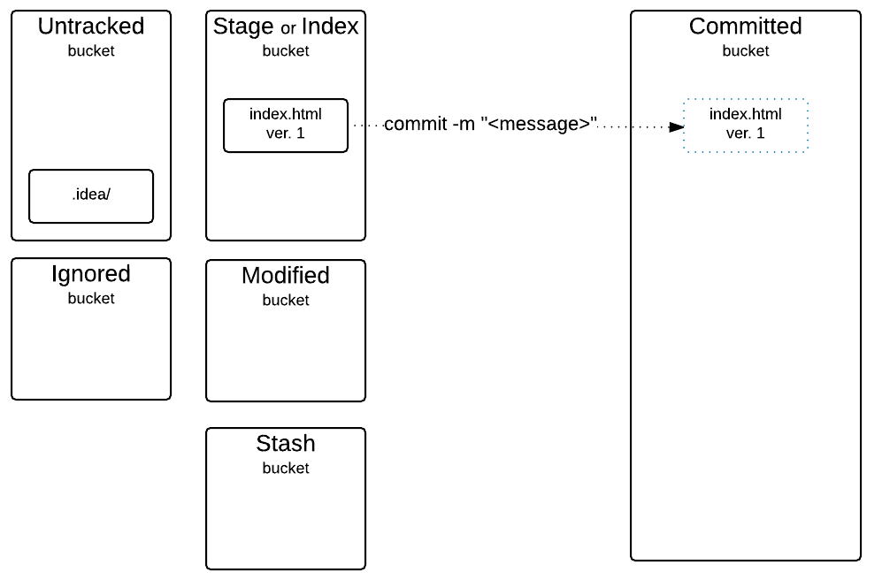

The `git commit` command does not take as argument the file name to commit, because it acts on the staging area as a whole. All the contents of the staging area are being committed
at once. In our example, now, we only have 1 file inside the staging area, but the command would have been the same, even for more than 1 file.

The `git commit` command is the most important command because it actually builds the history of the changes of a project:

1. records what was the actual code change
2. records who did the change
3. records when the change was done
4. records a message that describes, in brief, about the commit/changes

So, the `git commit` command requires that you give a short descriptive message that would explain to you and other readers of the project history what this commit contains. The
exact syntax of the command is `git commit -m <message>` and the message needs to be enclosed in double quotes `"`.

Let's do that:

```
git commit -m "First version of the index.html file"
```

If you run the above command, you will get something like this:

```
[master (root-commit) 53e0850] First version of the index.html file
 1 file changed, 11 insertions(+)
 create mode 100644 index.html 
```

You can see that the first line contains the commit message that you have given as argument to the `git commit` command. There are also some other details, the most important
of which are depicted in the next picture:

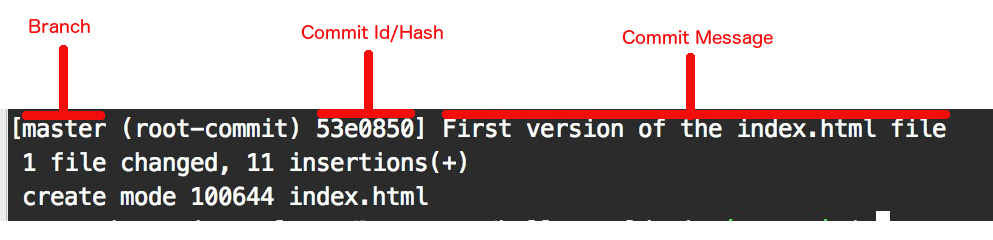

1. Branch. You need to know that when you do a commit, your changes are actually put inside a branch. The branch
is a logical bucket inside the committed bucket. The default branch is the branch with name `master`. Branches will allow you to work on different versions of the
same project, by switching from one branch to another. You can have the version of the project `feature-invoicing`, a.k.a. branch with name `feature-invoicing` that
you will be working on a new feature to invoice your customers. At the same time, you may have a version of your project with name `fix-discount-fee` that you will
be working a fix on the discounts part of your pricing. These will be two different logical buckets inside the `committed` bucket. We will learn more about branches
later on.
2. Commit id or hash. Every time you do a commit, Git generates a unique id for it. It is also called a hash. It is used to identify the particular snapshot of your
project contents. Actually, on the `git commit` output, you do not see the whole commit id, but only the first/left part of it. On my project, the commit id `53e0850`, that
has been printed on the last `git commit` output, corresponds to the full commit hash `53e08502ce070ba522edac95ecfb124d8a88f5e6`. I will teach you how to get this later on.
3. Commit message. This is very important. It explains, briefly, the contents of the changes of the particular commit.
 
Having done the `git commit` above, the picture of our project is now the following:

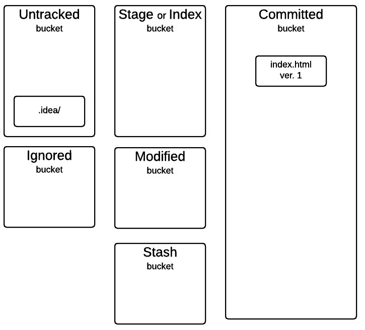
 
Does the `git status` show that picture? Try the following:
 
```
git status
```
You will get the following:

```
On branch master
Untracked files:
  (use "git add <file>..." to include in what will be committed)

        .idea/

nothing added to commit but untracked files present (use "git add" to track)
```

It tells you what is in the untracked bucket. But it does not tell you what is inside the master branch in the committed bucket. This is done by design, because what is inside
the committed bucket master branch might be a very long list of files, if your project had all of its files committed.

But, you can safely assume that whatever your `git status` output does not show in its output is inside the current branch of your committed bucket. Hence, since the `index.html`
file is not displayed in the `git status` output, then we can safely assume that it is inside the bucket of the branch `master` inside the `committed` bucket. There is an exception
to this rule. There might be files that we do not want to keep track of their changes. These files, or folders, we flag them as `ignored` and Git will never report about them
being in any of the 4 buckets (untracked, staging, committed, working). They will be inside the ignored bucket.

In order to tell Git to ignore a file or a folder you need to give its name inside a `.gitignore` file that should exist in the root folder of your project. Create a new file on
the root folder of your project and name it `.gitignore`. Make sure you start the filename with a `.`. Write the following content inside it, in order to ignore the folder `.idea/`.

```
.idea/
```
Save the file.

> *Note:* If RubyMine asks you whether you want this new file to be added to Git, check the checkbox `Remember, don't ask again` and then click `No`. We do not want 
the files to be added automatically to Git. We want to be adding them ourselves with the `git add` commands.
> 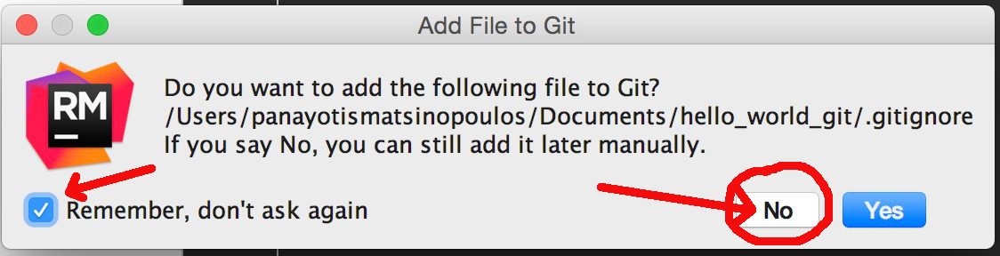

You can watch this video here to see how I have done that on my project:

<div id="media-title-video-adding-idea-folder-to-gitignore-file.mp4-How to add file to .gitignore">How to add file to .gitignore</div>
<a href="https://player.vimeo.com/video/194252685"></a>
           
Each line inside the `.gitignore` file contains a folder or file specification. These folders and files specified will be ignored and will never be reported.
           
> *Note:* Each line inside `.gitignore` file is a folder or file specification. You specify the exact name of the folder or file. However, if there is a big list
of files that you want to ignore, or if you do not know the exact file names in advance, you may use wildcards to specify groups of files. For example, if you 
add a line as `*.log` will make sure that Git ignores any file that has a file name that ends in `.log`.

> *Hint:* If you do not know about wildcards in filename specifications, you can [read this](http://www.linfo.org/wildcard.html) or any other resource that refers
to wildcards and filenames.

Having added the `.idea` folder inside the `.gitignore` file, we are asking Git to completely ignore this folder. Hence, if we now check the status of the project
with `git status` we will get this:

```
On branch master
Untracked files:
  (use "git add <file>..." to include in what will be committed)

        .gitignore

nothing added to commit but untracked files present (use "git add" to track)
```

And this is the visual picture of it:

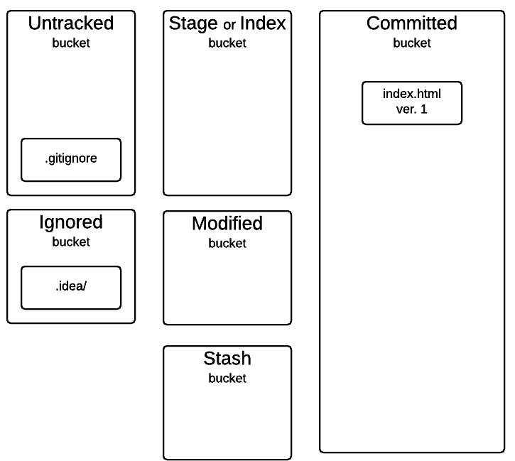

As you can see from the output of the `git status` command, the new file `.gitignore` is inside the untracked bucket. It is the new file that now records the files that should 
be ignored. We need to keep track of its history with Git. Hence, we have to commit this file. 

Now, you know how you can do that. Run the following commands:

```
git add .gitignore
git commit -m "Created the first version of the .gitignore file to ignore the .idea folder"
```

Perfect. This is the Git picture of your project now:

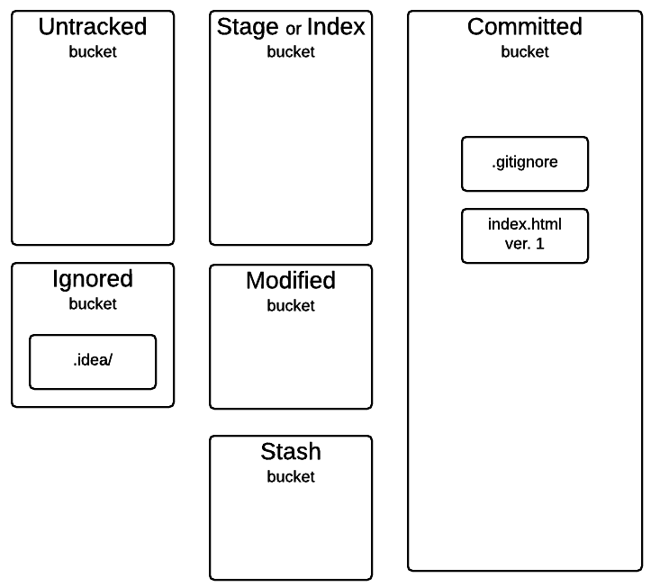

And what does `git status` report? Run this:

```
git status
```
You will get this:

```
On branch master
nothing to commit, working directory clean
```

Everything seems good. No untracked files, no files in staging for pending commit. So, our files and folders are either inside the committed bucket or are specified as ignored.

How many commits have we done so far? Do you remember? We have 2 commits. One commit for the `index.html` and one commit for the `.gitignore` file. Is there any command that can
show us all the commits that we have done so far? Yes, and it is called `git log`. Let's do that. Run the command

```
git log
```

You will get the following output:

```
commit 36202b9dc3e38a71111d8058bbcaef672da4575c
Author: Panayotis Matsinopoulos <Panayotis Matsinopoulos panayotis@matsinopoulos.gr>
Date:   Sat Jan 30 11:38:58 2016 +0200

    Created the first version of the .gitignore file to ignore the .idea folder

commit 53e08502ce070ba522edac95ecfb124d8a88f5e6
Author: Panayotis Matsinopoulos <Panayotis Matsinopoulos panayotis@matsinopoulos.gr>
Date:   Sat Jan 30 08:36:10 2016 +0200

    First version of the index.html file
```

> *Hint:* When `git log` output might be longer than the number of visible lines on your terminal, `git` will display the first lines and then
you will have to navigate with the <kbd>j</kbd> key in order to see the rest of the lines. Also, <kbd>k</kbd> key is used to go back to previous lines.
Finally, <kbd>q</kbd> is used to quit and return back to the terminal prompt (unless you <kbd>j</kbd> till the last line after which `git log` terminates
automatically)

It is a list of all the commits in reverse chronological order. The most recent commit on top. You can also see important information per commit:


You need to understand here that commits have a parent child relationship between them. The newest commit `36202b9dc3e38a71111d8058bbcaef672da4575c` is considered to 
be the child commit of the older `53e08502ce070ba522edac95ecfb124d8a88f5e6` commit.

Let's proceed, now, by changing the contents of the `index.html` file. Make sure that the new content has as follows:

``` html
<!DOCTYPE html>
<html>
  <head>
    <meta charset="utf-8">
    <title>Hello World</title>
  </head>

  <body>
    <h1>Git -  Version Control System</h1>
  </body>
</html>
```

As you can see above, we have added the line

```
    <h1>Git -  Version Control System</h1>
```

> *Note:* Make sure you save the file with the new content.

So, this is the new version of the `index.html` file, let's call it ver. 2. How does this change the `git status` of our project? Let's run the command

```
git status
```

The output is the following:

```
On branch master
Changes not staged for commit:
  (use "git add <file>..." to update what will be committed)
  (use "git checkout -- <file>..." to discard changes in working directory)

        modified:   index.html

no changes added to commit (use "git add" and/or "git commit -a")
```

As you can see above, the `index.html` file is now reported as `modified`.

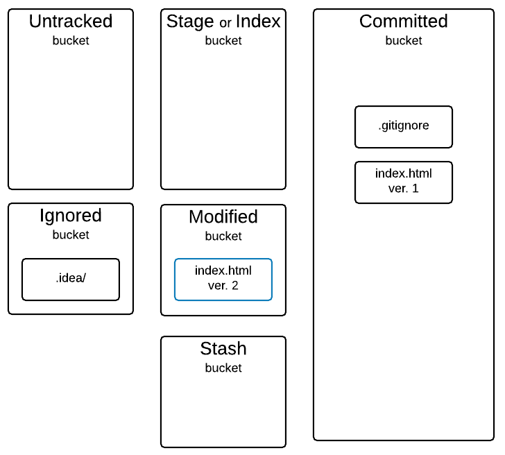

What are the Git actions that I can do on the modified files?

1. I can commit these file changes. Of course this has to be done via putting the file to the staging area first. (There is a way to bypass staging area and commit something
directly, but we will see that later on). In order for this to be done, I have to use the two commands:
    1. `git add index.html`
    2. `git commit -m "<commit message>"` OR
2. I can discard the changes and revert back to the previous version of the file. This is done with the command `git checkout -- <file>`.

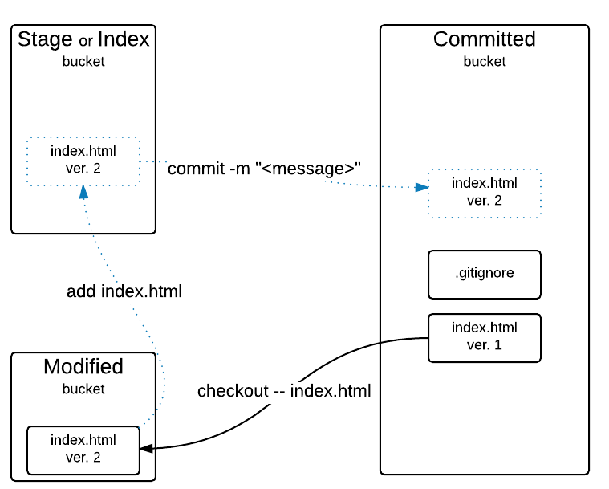

Let's discard the change. Run the following command:

```
git checkout -- index.html
```

This will restore the file to its previous committed version.

``` html
<!DOCTYPE html>
<html>
  <head>
    <meta charset="utf-8">
    <title>Hello World</title>
  </head>

  <body>

  </body>
</html>
```

If you now check the status, with

```
git status
```

You will see this:

```
On branch master
nothing to commit, working directory clean
```
which means that no changes to the committed version exist.

If we do

```
git log
```
we will still see only the two commits that we have done so far.

Let's bring the change on the `index.html` file again:

``` html
<!DOCTYPE html>
<html>
  <head>
    <meta charset="utf-8">
    <title>Hello World</title>
  </head>

  <body>
    <h1>Git -  Version Control System</h1>
  </body>
</html>
```

If we save the above file and do `git status` we will see that the `index.html` file is in `modified` bucket now.

As we said earlier, our other option is to commit the file. But, there are times that you want to see the differences between the 
current, modified, version of a file against the previous committed one. You can do that with the `git diff` command.

Run the following:

```
git diff index.html
```
You will get an output like this:

```
diff --git a/index.html b/index.html
index f247821..a763205 100644
--- a/index.html
+++ b/index.html
@@ -6,6 +6,6 @@
   </head>
 
   <body>
-
+    <h1>Git -  Version Control System</h1>
   </body>
 </html>
\ No newline at end of file
```

This may seem to be a little bit daunting at the beginning, but you will get familiar with this output the more you use this command. Here are the things that you need to
be aware of:

1. The command compares the current modified version of the `index.html` file against the previous committed version.
2. The current version is represented with the `b/index.html`. The previous version with the `a/index.html`.
3. As the output indicates, the new version `b/index.html` has an extra line (the `+` symbol). And the old version `a/index.html` is missing a line (the `-` symbol).
In other words, the two lines:
```
-
+    <h1>Git -  Version Control System</h1>
```
indicate that the new version has added one new line to the content of the old version.
  
Let's stay here for the time being. The `git diff` command is a quick and a little bit hard way to see the differences between these two versions of a file. Later on we 
will learn how we can use some GUI tools to see these differences in a little bit more friendly way.

Having inspected the change that we have done on a committed file, a change that now makes the file reside in the modified bucket, if we want to commit the file, the
first thing that we should do is to add the file to the staging area. Run the following command:

```
git add index.html
```

Now, we have the index.html version 2 inside the staging area. See the `git status` output. Run

```
git status
```

and you will get this:

```
On branch master
Changes to be committed:
  (use "git reset HEAD <file>..." to unstage)

        modified:   index.html
```

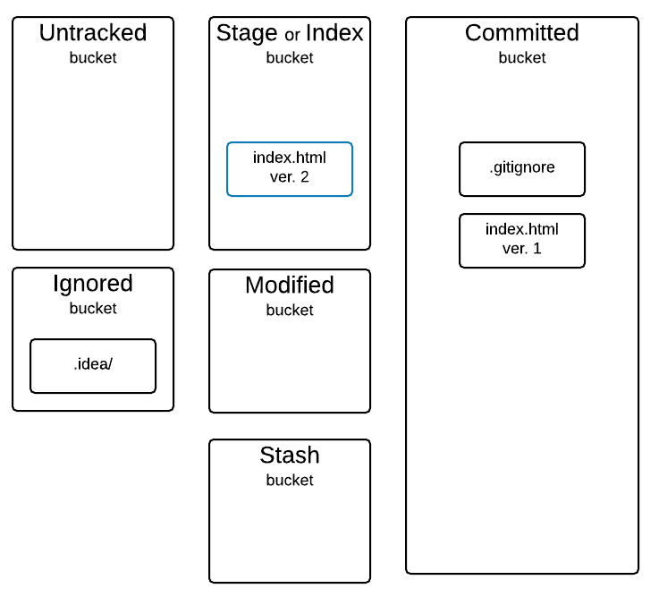

Now, the modified version of file `index.html` exists **inside** the staging area. Be careful, although it is still marked as *modified*, we draw that inside the
staging area, because it is ready to be committed and the `git add` command adds files to the staging area.

What actions can we do on this file now? 

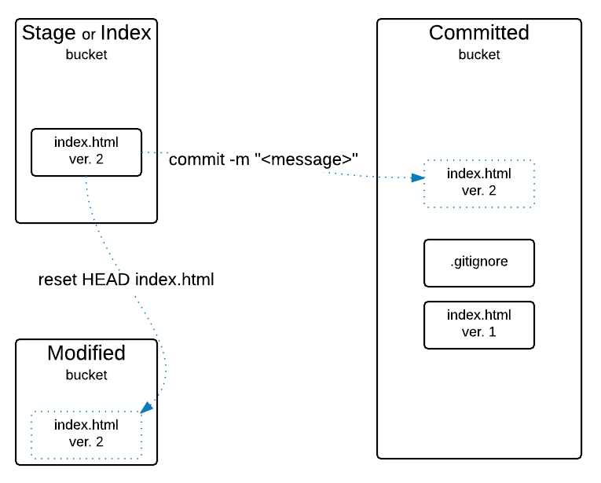

1. We can commit it, with `git commit`. This will move the file to the committed bucket and create a new entry in the history of the project.
2. We can remove the file from the staging area with `git reset HEAD` command. This command will transfer the file back to modified bucket **outside** the staging area.

> **Important**: When we added the first version of the `index.html` file to the staging area, back when the file was initially untracked, then that first version
was marked as `new file`, but still in the staging area, ready to be committed. Do you remember the git status output about that? It was:
```
    (use "git rm --cached <file>..." to unstage)
>  
>          new file:   index.html
```
Do you remember what was the command to remove the file from the staging area? To unstage it? It was `git rm --cached <file>`. Now that the file is, again, inside
the staging area, but is a `modified` (not `new file`) the command to remove that from the staging area, to unstage it, is different. It is `git reset HEAD <file>`,
instead of `git rm --cached <file>`.
> In other words, the `git rm --cached <file>` applied on a file that is in the staging area, works if the file is `new file`, whereas, the `git reset HEAD <file>`
works if the file is a `modified` file.

Before we take any of the actions above, let's try to see again, the difference between the staged modified file and the previously committed version, i.e. version 1.

Let's try the `git diff` command again:

```
git diff index.html
```

If you run the above command, you will see that there is no difference reported. This is because the default `git diff` command compares the committed version to the
version of the file that exists in the `modified` bucket but not inside the staging area. If you want the `git diff` command compare the committed version with the
one that exists inside the staging area, you have to run the command `git diff --cached <file>` command. Try that:

```
git diff --cached index.html
```

You will get the output that you previously got when you had the index.html version 2 outside the staging area, in the modified bucket:

```
diff --git a/index.html b/index.html
index f247821..a763205 100644
--- a/index.html
+++ b/index.html
@@ -6,6 +6,6 @@
   </head>
 
   <body>
-
+    <h1>Git -  Version Control System</h1>
   </body>
 </html>
\ No newline at end of file
```

Nice! With the above, we know what are the changes that are about to be committed for the file `index.html` that now resides inside the staging area.

Let's remove the file from the staging area and put it back to the modified bucket area:

```
git reset HEAD index.html
```

> *Hint:* If you do not remember what actions you can execute with Git, one good way you can refresh your memory, is to run the `git status` command and carefully read its output.

The above command will unstage the file and give the following output:

```
Unstaged changes after reset:
M       index.html
```

It clearly indicates now that the changes that are inside the `modified` bucket (called `Unstaged changes`) are the modifications (`M`) on the file `index.html`.

Run the `git status` again:

```
git status
```

You will see this:

```
On branch master
Changes not staged for commit:
  (use "git add <file>..." to update what will be committed)
  (use "git checkout -- <file>..." to discard changes in working directory)

        modified:   index.html

no changes added to commit (use "git add" and/or "git commit -a")
```

The `git status` output verifies the fact that the file `index.html` is `modified` and inside the `modified` bucket (the one called `Changes not staged`).

Let's put the file back to the staging area:

```
git add index.html
```

And then let's commit that to the committed area:

```
git commit -m "Added the h1 header"
```

This will create another new commit in the project commit/version control history. We now have three commits that we can also list with the `git log` command. Try that:

```
git log
```

You will get something like this:

```
commit 69cf4a43a2648075e051a4688db4191ad11baff0
Author: Panayotis Matsinopoulos <Panayotis Matsinopoulos panayotis@matsinopoulos.gr>
Date:   Sat Jan 30 13:32:38 2016 +0200

    Added the h1 header

commit 36202b9dc3e38a71111d8058bbcaef672da4575c
Author: Panayotis Matsinopoulos <Panayotis Matsinopoulos panayotis@matsinopoulos.gr>
Date:   Sat Jan 30 11:38:58 2016 +0200

    Created the first version of the .gitignore file to ignore the .idea folder

commit 53e08502ce070ba522edac95ecfb124d8a88f5e6
Author: Panayotis Matsinopoulos <Panayotis Matsinopoulos panayotis@matsinopoulos.gr>
Date:   Sat Jan 30 08:36:10 2016 +0200

    First version of the index.html file
```

Do you see the last commit at the top? 

And the visual picture of the current status of our project is this:

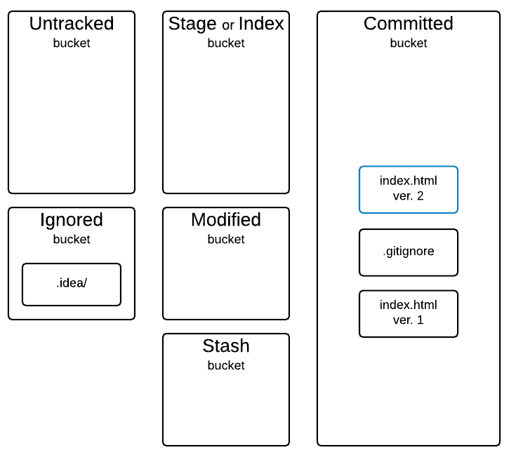

## Closing summary

Before we close this chapter, that had to do with the basic Git commands, let's give a brief on the Git commands that we have learned so far:

<table>
    <tr><th>Command</th><th>Used For</th></tr>
    
    <tr>
        <td style="white-space: nowrap;"><code>git init</code></td>
        <td>It is used to initialize the project folder as a git folder.</td>
    </tr>
    
    <tr>
        <td style="white-space: nowrap;"><code>git config</code></td>
        <td>It is used to configure the git environment.</td>
    </tr>

    <tr>
        <td style="white-space: nowrap;"><code>git status</code></td>
        <td>Gives the current status of the source files with regards to git and their buckets.</td>
    </tr>
    
    <tr>
        <td style="white-space: nowrap;"><code>git add &lt;file&gt;</code></td>
        <td>It is used to add a file to the staging area.</td>
    </tr>

    <tr>
        <td style="white-space: nowrap;"><code>git rm --cached &lt;file&gt;</code></td>
        <td>It removes a file from the staging area and puts it back to the untracked bucket. The file needs to be an untracked <code>new file</code>.</td>
    </tr>
    
    <tr>
        <td style="white-space: nowrap;"><code>git commit -m "&lt;commit message&gt;"</code></td>
        <td>It is used to record the staging area changes inside the git committed bucket database.</td>
    </tr>
    
    <tr>
        <td style="white-space: nowrap;"><code>git log</code></td>
        <td>It is used to print the history of the commits in reverse chronological order.</td>
    </tr>

    <tr>
        <td style="white-space: nowrap;"><code>git checkout -- &lt;file&gt;</code></td>
        <td>It is used to remove a tracked file from the modified bucket and restore back its version from the committed bucket.</td>
    </tr>
    
    <tr>
        <td style="white-space: nowrap;"><code>git diff &lt;file&gt;</code></td>
        <td>It is used to get the differences of a modified file residing inside the modified bucket against its version in the committed bucket.</td>
    </tr>

    <tr>
        <td style="white-space: nowrap;"><code>git diff --cached &lt;file&gt;</code></td>
        <td>It is used to get the differences of a modified file residing inside the staging area against its version in the committed bucket.</td>
    </tr>

    <tr>
        <td style="white-space: nowrap;"><code>git reset HEAD &lt;file&gt;</code></td>
        <td>It is used to remove a modified file from the staging area and put it back to the modified bucket. This file needs to be a tracked <code>modified</code> file.</td>
    </tr>

</table>


