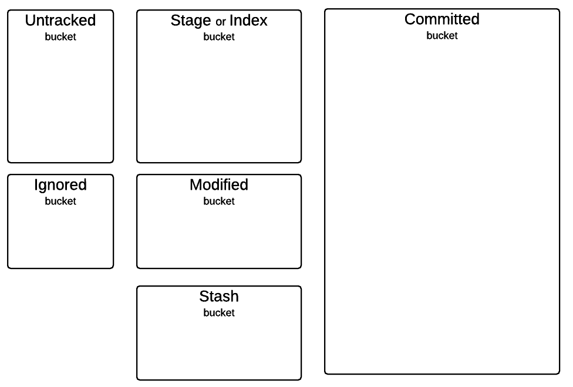
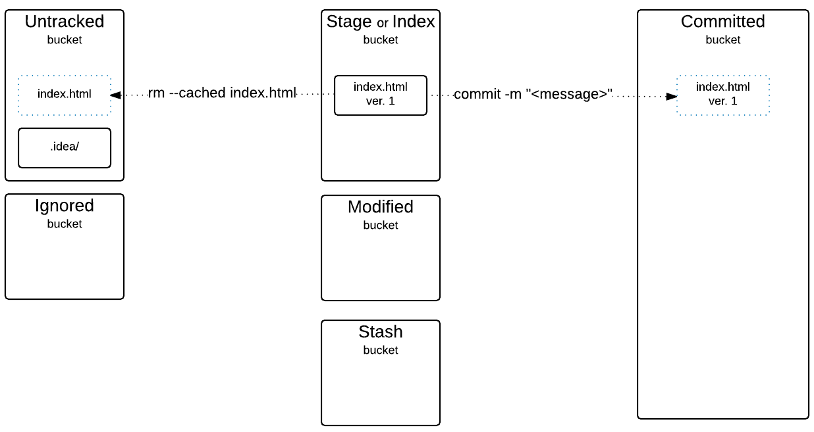
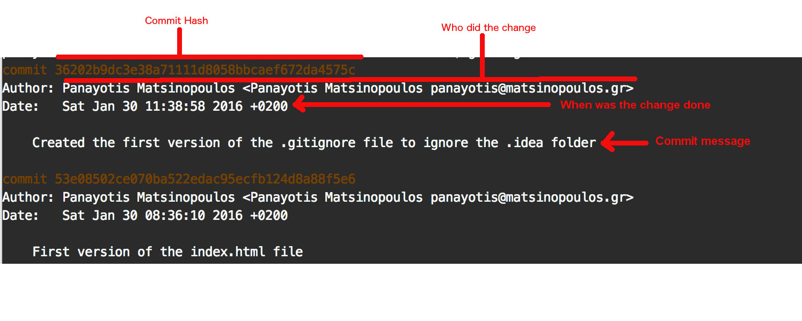

We continue in this chapter with the most basic Git commands. At the end of this chapter you will be able to keep track of the history of your projects. All the changes that you will be
carrying out on your project files will be recorded by Git and you will be able to see

1. Who has done the change
2. When the change was done
3. What the change was about

You will learn how your files are logically moved from one Git bucket to another, in between the 6 different Git logical buckets:

Also, for each state of a file, you will learn the commands that you can apply:

Moreover, you will be able to see the history log of the changes that have been applied to the files of your project:

