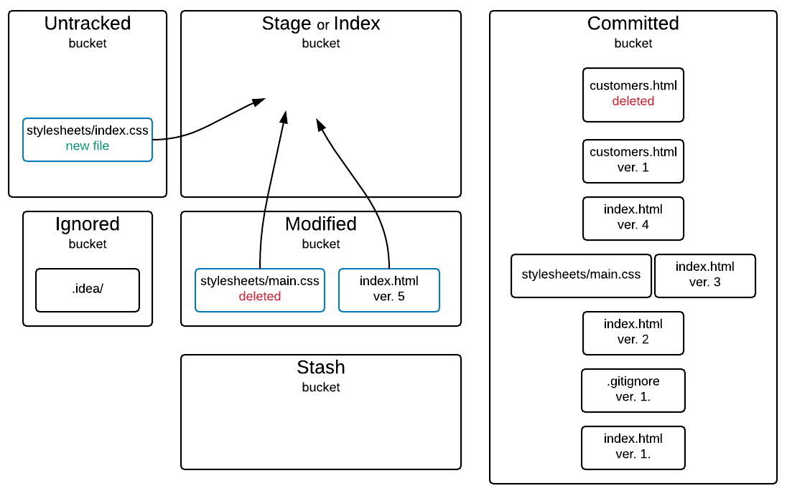
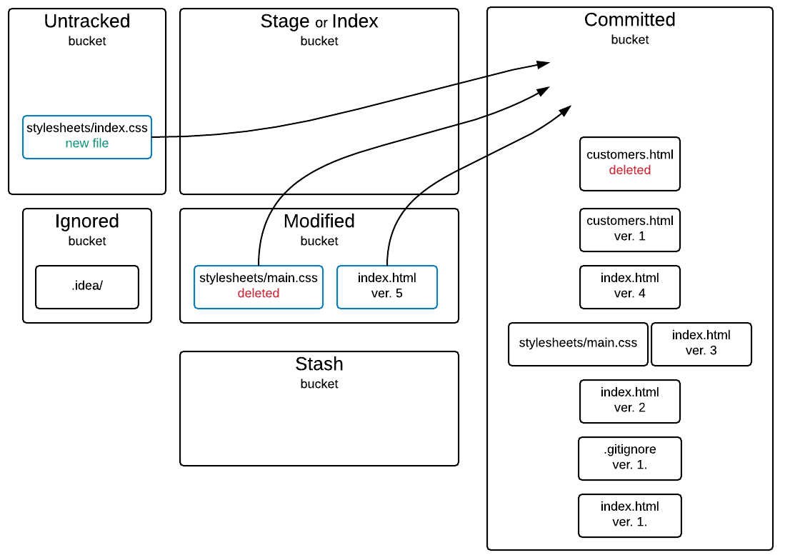

We have learned in the previous chapter some of the most basic git commands. This chapter is a quite difficult one.
It takes you to some more advanced git commands.

You will learn to pick on a commit and find out which changes are attached to it.

```
commit 36202b9dc3e38a71111d8058bbcaef672da4575c
Author: Panayotis Matsinopoulos <Panayotis Matsinopoulos panayotis@matsinopoulos.gr>
Date:   Sat Jan 30 11:38:58 2016 +0200

    Created the first version of the .gitignore file to ignore the .idea folder

diff --git a/.gitignore b/.gitignore
new file mode 100644
index 0000000..62c8935
--- /dev/null
+++ b/.gitignore
@@ -0,0 +1 @@
+.idea/
\ No newline at end of file
```

You will learn how to put many changes at once inside the staging area:



You will be able to by-pass the staging area and commit your changes directly to the commit bucket:



You will learn how git considers the deletion of a tracked file as another modification. And you can always recover a deleted tracked file.


You will be happy to know that git can take you back to any previous version of your project, because it keeps track of every change and the snapshots of all your files everytime
you commit a change.


You can always save your work in progress inside the stash.


which works like a stack and can be used to save many instances of your work.


You will learn many other useful tricks that will make your life much more productive with git.
